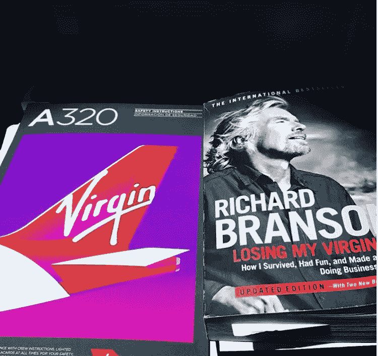

# 想像理查德·布兰森一样经营你的企业吗？遵循以下步骤

> 原文：<https://medium.com/swlh/want-to-run-your-business-like-richard-branson-follow-these-steps-d8c3e49d02af>

给所有企业家的 14 句激励性名言

[Tom Alaimo Instagram](https://www.instagram.com/talaimo7/?hl=en)

理查德·布兰森是当代最成功的企业家之一。他的主要企业“维珍集团”拥有 400 多家公司。你可以在这里看到维珍的投资时间表。

我更感兴趣的不是他的净资产或目前的运营，而是他是如何走到今天的。导致他的帝国的原则。

自然就拿起[破处](https://www.amazon.com/Losing-My-Virginity-Survived-Business/dp/0307720748)和[简直爱不释手。](https://www.instagram.com/p/BekvgWTAN4p/)

我看了，所以你不用看了。

以下是一些关键原则和名言，可以激励你变得更像布兰森:

# 家庭支持

**1)。"在我的一生中，我不记得有哪一刻没有感受到家人的爱。"**

理查德从小就得到家人对他所有事业的支持。当他还没到喝酒的年龄时，他的阿姨甚至将她的房子重新抵押，以帮助支付维珍唱片公司的部分资金。

这不仅仅是支持。而是他的家人真的相信他。

# 开心

**2)。“一项业务必须涉及:它必须有趣，而且必须锻炼你的创造本能。”**

**3)。“人们会问‘为什么你现在不找点乐子呢？’但是他们忽略了一点…乐趣是我做生意的核心，也是我从一开始就做的所有事情的关键。比任何其他因素更重要的是，乐趣是维珍成功的秘诀。”**

对理查德来说，做生意不是为了赚钱。他让创业变得富有创意和乐趣。他真的没有比这更喜欢的了。

# 大胆一点

**4)。“算了，我们开始吧”**

**5)。“我知道，只有勇敢，你才能成功。如果你是一个冒险家，那么艺术就是保护不利因素。”**

**6)。"活在当下，未来会自己照顾自己."**

理查德以大胆著称，经常在他觉得自己“准备好”之前就提出想法。这就是他能够如此创新并继续在竞争中领先一步的原因。
[做出大胆的决定。](http://tomalaimo.com/make-bold-decisions-and-change-your-life/)

# 雄心勃勃

**7)。如果我再大五六岁，在一份还不存在的杂志上，由两个 15 岁的男生编辑，试图向大公司推销广告的荒谬行为，会阻止我拿起电话。但是我太年轻了，不能考虑失败。"**

**⑧。"幻想未来是我最喜欢的消遣之一。"**

**9)。“我一直认为，应对现金危机的唯一方法不是收缩，而是扩张。不管事情有多紧迫，你还是需要把大局放在头脑的最前面。”**

**10)。“我对生活的兴趣来自于给自己设定巨大的、显然无法实现的挑战，并努力战胜它们。”**

胸怀大志。生活是丰富多彩的。

# 选择合适的人

**11)。“我通常会在见到某人后的 60 秒内决定是否信任他。”**

**12)。“我一直试图与维珍一起做的一件事是让人们重塑自我。”**

他花了很多时间组建合适的团队来围绕他，以实现他最疯狂的梦想。

# 创建列表

**13)。“我总是通过列清单来生活:打电话的人的清单，想法的清单，要成立的公司的清单，能让事情发生的人的清单。”**

**14)。"把所有事情都写下来的原则确保了我必须认真倾听人们的意见。"**

理查德总是随身携带一个笔记本，记下一天中发生的想法和事情。晚上，他回顾并实践他最好的想法。

我也开始这样做了，这是一个游戏规则的改变，为了捕捉我每天从别人那里看到的所有伟大的金块。

# 想要加快你的个人发展吗？
[在这里注册我的简讯](http://eepurl.com/c-46aj)

**关于作者**

[汤姆·阿莱莫](https://www.linkedin.com/in/tom-alaimo-573a1878/) *是一位充满激情的 B2B 销售专家。他目前是 TR Talk 播客* *的主持人，帮助千禧一代快速跟踪他们的个人发展。Tom 也是 TechTarget 的客户经理，住在旧金山。*

[网站](http://tomalaimo.com/) | [播客](https://soundcloud.com/ryan-warner-799706255) | [邮箱](mailto:thomasalaimo7@gmail.com) | [推特](https://twitter.com/TomAlaimo_TTGT)|[LinkedIn](https://www.linkedin.com/in/tom-alaimo-573a1878/)|*|*|[脸书](https://www.facebook.com/thomas.alaimo.12) | [Instagram](http://instagram.com/talaimo7) | [媒体](/@TomAlaimo_TTGT) |

## 这个故事发表在 [The Startup](https://medium.com/swlh) 上，这是 Medium 最大的创业刊物，拥有 303，461+人关注。

## 在这里订阅接收[我们的头条新闻](http://growthsupply.com/the-startup-newsletter/)。

