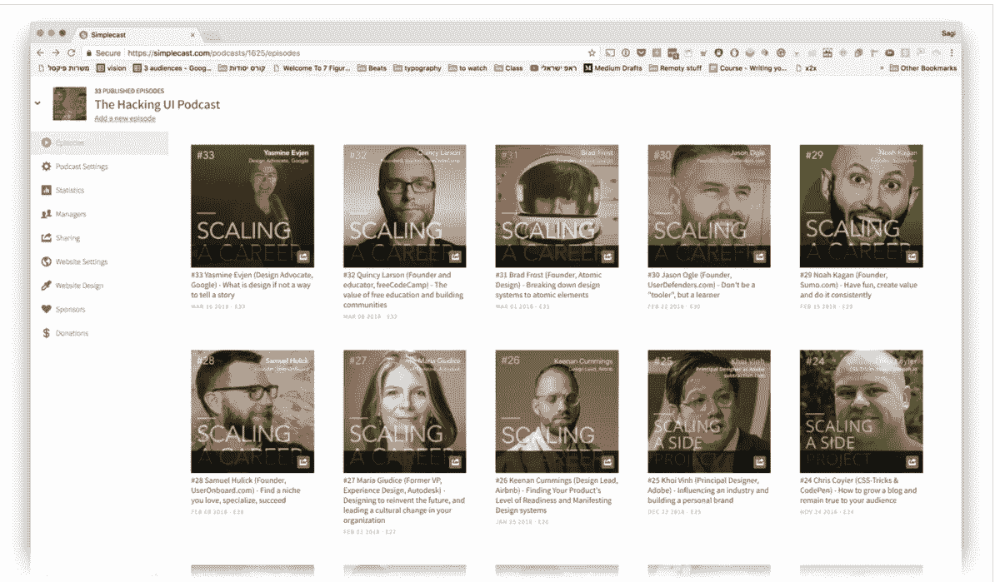
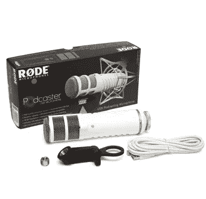

# 想开始自己的播客吗？这里是你需要的所有工具和软件

> 原文：<https://medium.com/swlh/want-to-start-your-own-podcast-heres-all-the-gear-software-you-ll-ever-need-to-begin-9c186dcb6727>

嘿，大家好，
这篇文章是根据我在脸书的一个现场会议上发表的，我是在我的[正念&无情](https://www.facebook.com/groups/mindfulandruthless/)脸书小组中发表的:

尽情享受吧！

# 基本规则
_ _ _ _ _ _ _ _ _ _ _ _ _

**第一条规则:**净——没有额外的时间！！！利用你所有的时间。我遛狗的时间成为了 iTunes 上以色列科技界最受欢迎的播客之一。利用你所有的时间。

**第二条规则:**清除所有障碍！请不要把下面的档位看做必须。开始吧！

想要这些吗？
[**点击这里**](https://www.amazon.com/ideas/amzn1.account.AHIZDF65XSQEQILWA6WQBACPN4HQ/1CLPI04YF4W0V) 查看我所有的播客和视频设备，并链接购买

# 演播室设备

__________

## [-骑行播客(二手:150 美元，新:229.00 美元)](https://amzn.to/2SjZb5l)

*   我花 150 美元买了一个二手的，我已经用了 3 年了，它仍然很棒。
*   你可以从 iPhone 耳机开始。他们很棒！

## [-可调节麦克风支架(13.99 美元)](https://amzn.to/2EJYwrb)

*   亚马逊上也有很多种类，而且都超级便宜。
*   这个可以连接到我的桌子上，但是也许你会想要一个更便携的东西，比如这个。

## [- Pop 滤镜(6.99 美元)](https://amzn.to/2ELfBRM)

[我为会议准备的移动播客可以在这里找到。](https://www.amazon.com/ideas/amzn1.account.AHIZDF65XSQEQILWA6WQBACPN4HQ/1CLPI04YF4W0V)

[我的视频装备可以在这里找到](https://www.amazon.com/ideas/amzn1.account.AHIZDF65XSQEQILWA6WQBACPN4HQ/1CLPI04YF4W0V)。

# 软件

__________

## [- Simplecast(每月 12 美元)](https://simplecast.com)

*   与 iTunes 连接，超级容易使用

## [- Skype 通话记录器(免费或一次性支付 40 美元)](http://www.ecamm.com/mac/callrecorder/)

*   如果你打算进行海外面试

## [-无畏(免费)](https://www.audacityteam.org/)

*   免费的开源应用程序，在 Youtube 上有成千上万的视频教程

## [-iOS 版语音记录器](https://itunes.apple.com/us/app/voice-recorder-audio-editor/id685310398?mt=8)(免费——4.99 美元)

*   有升级版本

## [-tape call 将电话录音为播客(19.99 美元)](https://www.tapeacall.com/)

# 奖金
_ _ _ _ _ _ _ _ _ _ _ _ _

*   **外包除了录音之外的一切:**你可以使用 [Fiverr](https://www.fiverr.com/) 或 [Upwork](https://www.upwork.com/) 来寻找专门的播客编辑，他们将负责所有的编辑工作并上传到 Simplecast 以及你的网站
*   **为你的嘉宾做准备:**这是[我们发给播客](https://docs.google.com/document/d/1NoYpAQ7oYUVMGbz8x2Q7ttPZi600SAHaznzTUrV0iU8/edit?usp=sharing)嘉宾的表格。
    您可以随意复制并进行适当的编辑:)
    只需点击“文件”→“制作副本”，然后根据需要进行更改，使其成为您自己的文件。

## 我的播客

用心而无情的播客

在 [iTunes](https://itunes.apple.com/us/podcast/the-mindful-ruthless-podcast-with-sagi-shrieber/id1410477373?mt=2) 、 [Youtube](http://www.youtube.com/subscription_center?add_user=sagishrieber) 、Spotify 和任何播客应用上。

 [## 播客- Sagi Shrieber

### 播客

-萨基·施里贝尔·Podcastsagishrieber.com](https://sagishrieber.com/podcast) 

**黑客 UI 播客:**

 [## 黑客界面播客|黑客界面

### 黑客 UI 播客由 Sagi Shrieber 和 David Tintner 主持，他们既是设计师和开发人员，也是…

hackingui.com](http://hackingui.com/podcast/) 

**PixelCast(希伯来语):**

 [## 播客| פיקסל פרפקט מגזין

### פיקסלקאסט פרק 26: הטיפ הכי גדול לסטודנטים לעיצוב בפרק זה שגיא נוגע בנושא חשוב לסטודנטים לעיצוב והוא להתחיל לעבוד בתחום…

www.pixelperfect.co.il](https://www.pixelperfect.co.il/podcast) 

Get free tips & resources + a weekly show featuring mega successful digital creators — all in one free FB group!

除了我的[脸书团](https://www.facebook.com/groups/mindfulandruthless/)，你还可以在 [Instagram](https://www.instagram.com/sagishrieber/) 、&、Youtube 上找到我🙌

## 这篇文章发表在 [The Startup](https://medium.com/swlh) 上，这是 Medium 最大的创业刊物，有 315，628+人关注。

## 在这里订阅接收[我们的头条新闻](http://growthsupply.com/the-startup-newsletter/)。

