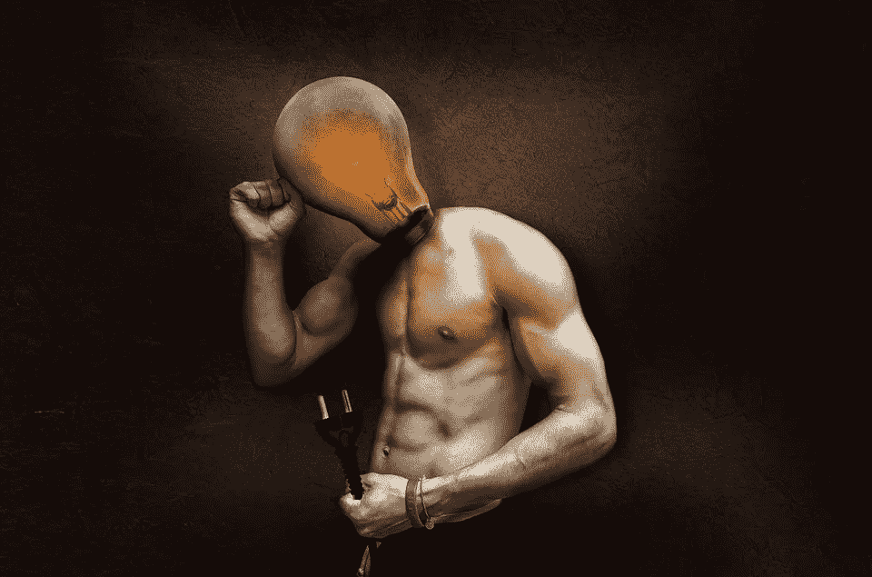

# 想要释放你的内在天赋吗？这里有 7 种开始的方法。

> 原文：<https://medium.com/swlh/want-to-unlock-your-inner-genius-here-are-7-ways-to-start-6b02d0a140e6>

> "知识是有正确的答案，智慧是问正确的问题."

获得巨大成功的关键是在生活中不断发展和进步。如果我们没有一个蓝图可以遵循，可以作为改善我们未来的指南，你会感到卡住，迷失，不知道下一步该去哪里。

***下面是几种释放你内在天赋的方法:***

# 变得好奇

> "我没有特殊的才能，我只是强烈地好奇。"-阿尔伯特·爱因斯坦

你必须对人类经历的方方面面产生好奇心。我们通过学习新技能和体验新生活来拓展思维。我们可以用一颗好奇的心在我们的生活中培养更多的快乐，因为它让你想了解更多的事情，并给你动力去承担改变生活的风险。

研究表明，通过对我们正在学习的东西更加好奇，我们的大脑会让我们感到有所收获，从而更容易记住信息。它可以帮助保护我们的大脑免受老年痴呆症的影响，因为好奇心可以刺激大脑，这与增强我们的心理健康有关。

提高智力的最佳策略是培养对生活的强烈好奇心。对你所做的任何事情保持好奇会让你更加享受其中。好奇心帮助我们克服挑战，因为我们总是试图找出答案。

# **优化你的健康**

健康是我们成功的关键支柱。不优先考虑我们的健康可能是有害的，并对生活产生负面影响。缺乏体育活动会让我们整体情绪低落，导致我们更加焦虑，精力不足，最终我们会对日常活动失去动力。

只需三十分钟的锻炼就能提高注意力，并促进脑细胞的生长，这是提高智力和保留新信息的关键。

> 研究证明，锻炼的好处[提高你的注意力，改善睡眠质量，降低患病风险，增强整体自信。](https://medlineplus.gov/benefitsofexercise.html)

我们成功的决定性因素最终将归结于我们对自身健康的关注程度。忽视你的健康会在未来造成可怕的后果，而这可以通过我们今天做出的决定来避免。

# **阅读更多**

> 沃伦·巴菲特是世界上最富有的人之一，他将 80%的时间用于阅读。

阅读背后有一种力量，这种习惯必须定期养成。世界上最聪明和最富有的人比普通人读得更多。持续阅读将显著提高你的用词水平和表达能力。读书是下载地球上最聪明、最富有的人的意识的一种方式。

阅读的好处包括增加你的词汇量，减少压力，提高注意力&你吸收新的想法，提高你的整体智力。[随着年龄的增长，阅读还可以减缓我们记忆力的衰退。](https://www.realsimple.com/health/preventative-health/benefits-of-reading-real-books)

我建议阅读更多的教育和自助内容，因为这是战胜学习曲线并在生活中取得成功的秘方。在这篇文章中，我发现了最好的工具和策略，这些工具和策略让我更好地了解了自己，以及我想给这个世界留下什么样的影响。

# **开始写日记**

历史上最成功的人无论去哪里都会写日记。这是提高你的生产力和自我意识的好方法。这个策略帮助你组织思想，管理你的目标，降低焦虑感，并通过连接语言和书面文字来提高智商。

看到你自己的想法被写下来是很了不起的，因为你可以看到你脑子里在想什么。这是提高你的自我意识和弄清楚你的人生使命的基本要素。当我们写下我们的目标时，我们更有可能坚持到底，因为这会产生紧迫感。

习惯性写作可以帮助你创造新的想法，并为你可能面临的任何挑战找到解决方案。通过把你从你的头脑中解放出来并自我反省，你会带着自信克服这一障碍。当你经历愤怒、沮丧或悲伤等负面情绪时，问问自己:

我该如何从中成长？花几分钟记下这个问题，然后观察这些感觉的消失。随着时间的推移，这种训练创造了自我控制。

# **例行冥想**

冥想是增加智力的一种非凡方式。我们被允许从当前的现实中退一步，分析我们的优势和劣势。冥想是非常有益的，它减少压力，提高注意力，减缓衰老过程，增强自我意识。

生活会变得极端混乱&调解可以帮助我们驱散那层精神迷雾。当我们的大脑持续承受压力、焦虑和刺激时，它会变得疲惫不堪，阻碍我们充分发挥潜能。这可能导致我们对未来感到迷茫或不确定。

人们冥想最常见的原因是减轻压力。压力会加剧焦虑、抑郁，并削弱免疫系统。降低压力水平，更好地理解我们的想法和感受是至关重要的，这可以让我们更好地控制自己的情绪。

# **播客&有声读物**

如果很难腾出时间坐下来阅读，那么你必须利用你已经有的时间。通过听教育播客和下载有声读物来增长你的知识，让你学到一些有价值的东西。

当你在上班的路上，当你锻炼的时候，当你打扫房间的时候，听音乐。通过下意识地向你的头脑灌输知识和有价值的内容，你开始形成成功的心态。即使你没有完全投入，你的潜意识仍然在分析信息，保留重要的东西。

我喜欢使用 YouTube，因为它充满了教育和个人发展的内容。YouTube 上对我的生活产生积极影响的几个频道包括[被启发](https://www.youtube.com/channel/UCaKZDEMDdQc8t6GzFj1_TDw)、[激励](https://www.youtube.com/channel/UC3gWv-0A3qEeFBJESlsJa0g)、[其他直播](https://www.youtube.com/channel/UCGZitzIvgXbJaEjDDI8xJlA)和[穆里根兄弟](https://www.youtube.com/user/mulliganbrother)。这个策略已经改变了我的游戏规则，如果你没有机会阅读，这是一个很好的学习方法。

# **和更聪明的人在一起**

你应该把 30%的时间花在比你聪明的人身上。当我们花时间和那些没有设定任何目标的人在一起时，随着时间的推移，你会养成同样的习惯。和你相处时间最长的人会影响你的生活结果。

选择花时间和那些有挑战性目标和未来计划的人在一起。当我们看到我们的同龄人设定目标并提高自己时，这迫使我们这样做。通过聪明的对话，我们变得更聪明&这就是我们的大脑如何创造新问题。

书籍是伟大的导师，但拥有真正的导师可以打开通往成功的大门。当我们周围都是更聪明的人时，我们就有机会以更小的风险走同样的路。找到在某个特定领域已经成功的人，并从他们的习惯中学习。不要害怕登顶。你学得越多，挣得越多。

## 这个故事发表在 [The Startup](https://medium.com/swlh) 上，这是 Medium 最大的企业家出版物，拥有 298，432+人。

## 订阅接收[我们的头条](http://growthsupply.com/the-startup-newsletter/)。

