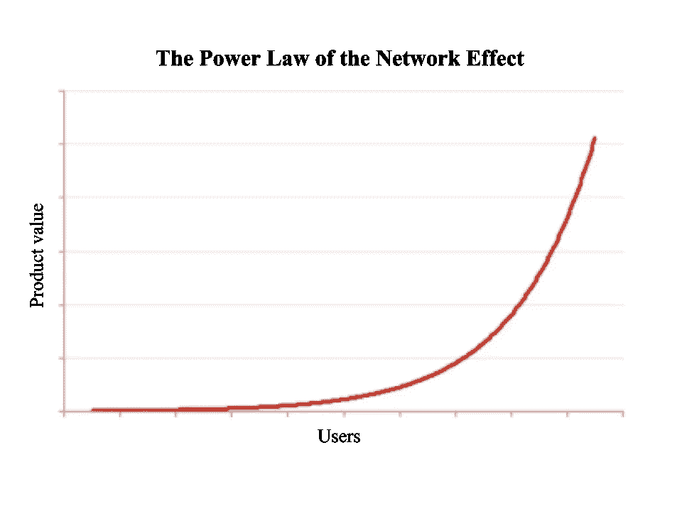

# 想让你的创业像病毒一样传播吗？学习如何“巧妙”应对竞争。

> 原文：<https://medium.com/swlh/want-your-startup-to-go-viral-learn-how-to-finesse-the-competition-ae813d64236c>

## 过去和现在的社交媒体巨头的创业秘诀

Photo by [William Iven](https://unsplash.com/@firmbee?utm_source=medium&utm_medium=referral) on [Unsplash](https://unsplash.com?utm_source=medium&utm_medium=referral)

我是一名年轻且没有经验的高中生，所以如果我只擅长一件事，那就是利用这个系统为我谋利。如今，我们许多 Z 世代人把这叫做**巧妙处理**。

巧妙的艺术直接取自马基雅维利的书(显然是象征性的，因为[马基雅维利从未真正说过这个](http://factmyth.com/factoids/machiavelli-said-the-ends-justify-the-means/)):

> "为达目的不择手段。"
> 
> ~尼可罗·马基亚维利，意大利外交官(1469-1527)

对我和我的伙伴们来说，这迫使我们在有益和不道德之间游走。

> **但这并不意味着你的产品必须如此。**

在创业的世界里，创新和营销一个优秀的产品是生存的关键。对许多人来说，游戏的目标是持续足够长的时间，以至于科技巨头以丰厚的薪水收购他们，或者直到他们首次公开募股。但是说起来容易做起来难。

幸运的是，如果有一件事高中生比狡猾更擅长，那就是社交媒体。为了确保**你**不会在今天的创业世界中被生吞活剥，这样你就可以活到明天被收购，让我们看看当今的社交媒体巨头是如何在昨天的巨头面前挣扎并淘金的:

# 关于产品创新:

## **放弃对产品的满意。**

每一次点击、轻敲或滑动，给用户一种成就感——尤其是当它不是应得的时候。如果你进一步采纳这个建议，你就处在利用你的产品开发人性的风口浪尖上。这篇文章充满了关于社交媒体的注释，但这是最重要的:

> 社交媒体利用了人类被重视和欣赏的欲望，它不需要在现实生活中建立关系。

这很悲哀，但是社交媒体是一个伟大的产品。做你需要做的来制造一个伟大的产品，但是为了每个人，请试着创造一个不掠夺人性的产品。

Photo by [Erik Lucatero](https://unsplash.com/@erik_lucatero?utm_source=medium&utm_medium=referral) on [Unsplash](https://unsplash.com?utm_source=medium&utm_medium=referral)

## **整理:让你的产品快速而实用。**

不惜花费这一个。众所周知，SNAP 首席执行官兼联合创始人埃文·斯皮格尔在功能方面很难相处:

> “…虽然员工会因为自己的功能在埃文的手机上加载速度不够快或者他不喜欢某些东西的外观而被拒绝，这令人沮丧，但大多数人相信他是在为 Snapchat 用户的最佳利益着想”([加拉格尔](https://www.amazon.com/How-Turn-Down-Billion-Dollars/dp/1250108616/ref=sr_1_1?ie=UTF8&qid=1530235042&sr=8-1&keywords=gallagher+snapchat) 142)。

> 最后一点是守护者:**永远留意你的*客户*，他们会留下来。**

## **让你的产品成为一个平台。**

为什么脸书从一个庞大的社交网络转向游戏开发者中心？Snapchat 为什么要推出 Discover 及其大量定制内容？**因为最有效的创新是用*新*的方式让*新*的东西:**

例子不胜枚举:

> YouTube 创新了视频内容。
> 
> 网飞发明了电视。
> 
> Twitter 创新了“珍闻创意”。
> 
> Twitch.tv 创新了直播内容。
> 
> 媒体正在革新新闻业。

信不信由你，所有这些变化都是向社交平台转变的结果——分享、消费和传播信息和内容的平台。拥抱潮流，并且*绝对*难道**不会**像 Myspace 一样:

> “我们试图创造世界上的每一个功能，并说，‘好吧，我们可以做到，为什么要让第三方来做？’我们应该选择五到十个我们完全专注的关键特性，让其他人在其他方面进行创新。"
> 
> ~克里斯·德沃夫，Myspace 前首席执行官、联合创始人

现在你有了一个你知道用户喜欢的气密产品，更大的公司会像土狼一样跟着你。追逐开始的时间到了。

# **关于经营战略:**

## 创造一个专门的粉丝群体。

让人们使用一个产品很难。让人们爱上你几乎是不可能的。想想生活中有多少事情是真正**被爱的，**却不是理所当然的。网飞怎么样？

Ah yes, everybody loves Netflix. Photo by [Thought Catalog](https://unsplash.com/@thoughtcatalog?utm_source=medium&utm_medium=referral) on [Unsplash](https://unsplash.com?utm_source=medium&utm_medium=referral)

是的，每个人都喜欢网飞。使用它的人绝对喜欢它！听说过吗，“我的爱好包括食物、泡杯茶，还有**网飞和**”Z 世代确实有。

相反，人人都爱网络，我们却视之为理所当然。没有人欣赏互联网服务提供商或移动运营商。是的，他们敲我们竹杠，但是他们仍然给我们上网的机会。

## 网络效应和 FOMO 是你最好的朋友。

根据 investopedia.com 的说法，“**网络效应**是一种现象，在这种现象中，越来越多的人或参与者提高了商品或服务的价值。”如果你感到困惑，请看这张图表:

As the number of users increases, the value of the product exponentially increases. This means that a large factor of the product’s value comes from the users and their characteristics.

**FOMO** ，或**“害怕错过”，**在社交媒体用户中尤其强烈。FOMO 的字典定义如下:“一个令人兴奋或有趣的事件可能正在别处发生的焦虑，通常是由在社交媒体网站上看到的帖子引起的。”

本质上，你想用一种消极的力量，而不是积极的力量来推动你的产品的消费。也就是说，你希望你的产品是“一个人不能没有的东西”，而不是“拥有它会很好”的产品。

你可以在大卫·柯克帕特里克的书[“脸书效应”](https://www.amazon.com/Facebook-Effect-Inside-Company-Connecting/dp/1439102120/ref=sr_1_1?ie=UTF8&qid=1530299691&sr=8-1&keywords=the+facebook+effect)中看到脸书是如何使用这两种策略离开跑道的:

> “……他们采取了他们所谓的‘包围战略’如果另一个社交网络开始在某所学校扎根，facebook 不仅会在那里开放，还会在附近尽可能多的其他校园开放。这个想法是附近学校的学生将创造一个跨网络的压力，导致原学校的学生更喜欢 Facebook”(Kirkpatrick 101)。

## **不要发展得太快。**

早在 21 世纪初，社交媒体领域由 Friendster 主导。但是，由于糟糕的技术和扩展实践，它崩溃了。服务器会因为数据库问题甚至是优化不佳的代码而大大降低速度。用户经常对网站崩溃和糟糕的性能感到沮丧。

成功是伟大的，但创业永远是创业。资源不是无限的，人力是有限的。所以，要警惕你的技术能力。如果有必要，就像脸书一样，从小的领域开始成长。

# 收场白

智胜马克·扎克伯格和杰夫·贝索斯这样的人很困难，但并非不可能。让我们回到反复出现的社交媒体的大卫和歌利亚: **Snapchat 对脸书。**

> 在与 Snapchat 联合创始人埃文·斯皮格尔和鲍比·墨菲的私人会面中，“扎克伯格问了一些关于 Snapchat 的试探性问题，以及他们对**产品**和**公司**的愿景。然后，他大声想知道 Snapchat 作为一家脸书所有的公司会是什么样子，埃文和鲍比仍然掌舵，能够像 Instagram 一样，利用社交巨头的资源和资金更快地增长。事实上，扎克伯格有一个令人印象深刻的故事要讲:收购后，Instagram 的日活跃用户在短短六个月内增长了近 1200%。或许脸书会对以 6000 万美元收购 Snapchat 感兴趣，这让 Spiegel 和 Murphy 在 20 岁出头就立即成为百万富翁。
> 
> 埃文解释说他们对出售公司不感兴趣。作为回应，扎克伯格向他们展示了他的团队一直在研究的新东西。脸书的新应用 Poke 将在几天后发布。那是什么？消失的照片和视频的消息应用程序。
> 
> 信息很清楚:加入我们，否则我们将粉碎你”(加拉格尔 81，82)。

信息是明确的，但粉碎并不完全如此。脸书的尝试失败了，扎克伯格后来出价 30 亿美元收购 Snap。Spiegel 再次拒绝，同时为他的公司在 2017 年 3 月 2 日的 IPO 铺平道路。

嘿！感谢阅读。我不会要求太多，只要你给我一个[跟](/@slu.true)！这真的会促使我写更多的*的东西！*

## 这篇文章发表在[《创业](https://medium.com/swlh)》上，这是 Medium 最大的创业刊物，有 340，876+人关注。

## 在这里订阅接收[我们的头条新闻](http://growthsupply.com/the-startup-newsletter/)。

