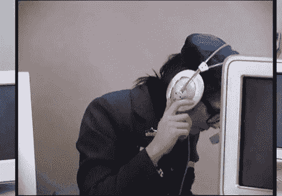

# 战争与和平:如何让它在商业和技术团队之间发挥作用？

> 原文：<https://medium.com/swlh/war-and-peace-how-to-make-it-work-between-business-and-tech-teams-d27730336d76>

我工作过的所有企业的共同点是什么？

业务和技术团队之间不断的摩擦、挫折，甚至愤怒。

事实上，在一个创业公司中有两个“创业公司”是很常见的:商业方面和技术方面。就业务方面而言，我指的是销售、运营、营销、客户支持人员，他们负责获得客户并管理日常运营。就技术方面而言，我指的是所有负责构建技术方面并确保产品正常工作和不断发展的开发、产品和工程师。

我第一次启动火箭时就感受到了这种挫败感。当我加入的时候，它还是一个相当小的团队，所以我非常了解商业和技术方面的每个人。作为一名拓展经理，我在所有我们即将推出的新城市旅行，在当地建立当地团队，确保品牌知名度和客户获取活动(线下营销、合作伙伴关系)。在这样的职位上，我是第一个注意到一些产品缺陷并要求新的产品功能的人，因为我与潜在的或已获得的客户保持着沟通，他们告诉我什么工作得好/不好/可以改进或增加。

然后我很幸运地与我熟悉的 CTO 和技术团队进行了相当直接的交流。我只需给他们发一条 Skype 消息，让他们知道我的任何反馈。他们很高兴收到我的来信，并能通过我感受到该产品在世界不同城市的使用情况。

我认为这是一个理想的情况，但回过头来看，这远远不是理想的——因为我经常以一种无组织的方式用我的请求/想法打扰技术团队，并且没有办法跟踪我所请求的任何事情的实施情况。

这是一种在团队成员有限、业务处于早期阶段的环境下运作的方式，但我后来了解到，人们无法像这样扩大风险。

几个月后，我加入了我的第三次也是最后一次火箭互联网创业，担任全球运营总监，负责确保日常运营顺利并不断优化。

我是在一个不容易的环境中加入的——我们刚刚从一个技术后端迁移到另一个，这带来了许多“错误”和问题，因为这在这些情况下经常发生。对于该产品如何工作以及如何集成到我们正在使用的各种操作工具(Stripe 等)上，人们有很多困惑，这给业务团队带来了许多问题，他们不得不使用一个崩溃的系统来处理愤怒的客户和公关人员。

这也引发了我所管理的运营和客户支持团队的大量手动工作，因为一些自动化没有正确设置，需要我们不断进行问答，以确保前端不受影响。我们在 google sheets 上运行许多关键流程，客户支持团队超负荷工作，客户抱怨他们被收取太多费用或被我们的网站误导。

我的团队的挫败感显而易见，难以抑制。从第一天起，我就组织了与他们所有人的 1:1 会谈，他们一致指责技术团队没有做好工作。

这是我在运营部门的第一个角色，但我立刻明白了运营和技术是如何联系在一起的，我决定去和技术团队谈谈，听听他们对这种情况的看法。

他们坐在另一个办公室里，我去那里和他们呆了一天。

他们的观点基本上与我从业务团队那里听到的相反——他们抱怨他们无法正常修复平台并确保其长期成功，因为他们经常被业务团队的无用请求所困扰。

这种非常紧张的局面让我学到了如何处理业务和技术团队之间关系的基本知识，我在其他创业公司也用过这种方法:

**1)业务和技术团队必须相互理解:**我说的“理解”，是指他们必须知道每个团队正在做哪种工作，以及如何做:

*   业务团队必须明白，技术团队有特定的工作方法，不能因为最琐碎的请求而不断被打扰——他们在几周的“冲刺”中工作，专注于他们想要完成的几件事情，并有一个清晰的路线图和优先计划，这些计划大多由高层管理人员(如果不是首席执行官本人)验证
*   至于技术团队，他们必须通过与客户和合作伙伴的持续接触来了解业务团队，有一定的紧迫感，需要有足够的答案来满足客户
*   这是两个非常不同的世界和工作方式，但在我看来，最好的办法是让一名技术人员花一天时间与客户支持团队等在一起，确保他们都深入了解对方在做什么。这可能/应该是任何团队成员“入职”的一部分——每个人都应该花一天时间与客户支持团队在一起，因为这是任何创业公司中的一个关键团队，但这是另一篇文章的另一个主题；)

**2)在这两个团队之间建立有效的沟通渠道至关重要:**技术团队和业务团队都需要从彼此那里获得信息来指导各自的工作。

*   技术团队需要知道运营业务最重要的是什么，最重要的客户想要什么，哪些功能可以让初创公司筹集更多资金。为此，他们需要业务团队以有组织的方式给他们一些反馈和信息。我已经使用吉拉票证和 ProductBoard 向技术团队传达了我的业务需求，这两个工具都是很好的工具，让您有机会提出票证，对它们进行排名，留下评论，并查看它们的实施进度。因此，如果有错误发生，我可以在吉拉上看到它的修复状态，并可以实时通知客户
*   这就引出了我的第二点——业务团队需要知道技术团队在做什么，以及他们优先考虑什么。为此，技术路线图当然是一个必不可少的工具。它应该与创业公司的不同团队合作建立，以反映总体目标和实现目标的不同步骤。在斯图尔特，技术路线图可能是所有文档中阅读量最大的；)
*   除了提出技术请求的技术路线图和标签工具之外，还需要组织日常沟通，例如当运营团队面临 bug 时可能会发生这种情况。单个团队成员通过空闲时间/电话与单个技术成员交谈并不是最佳方式。相反，建立一些松散的业务-技术渠道，每个人都可以提出请求，由不同的技术团队成员来回答，这样一来，那些可以直接回答的人就可以得到答案，任何人都可以阅读和使用这些答案。
*   有了这些沟通渠道，你甚至不需要让业务和技术团队坐在同一个办公室里。我实际上更经常看到相反的情况——更不用说一些极端的情况，技术团队在亚洲的丛林型环境中工作，而业务团队却坐在欧洲的办公室里:)但这可能会妨碍技术团队的效率，因为业务团队更加嘈杂(销售、客户支持通常是随叫随到)，而他们需要专注于修复一些错误， 此外，业务团队总是有直接来到开发人员的办公桌前询问一些事情的诱惑(我会是第一个陷入这种情况的人； ))
*   如果在两个不同的办公室工作，两个团队经常见面并进行面对面的交流仍然非常重要。这就是你如何在团队成员之间建立稳固的关系——即使我是 Slack 的最大粉丝(实际上我是去年整个 Stuart 团队中发送 Slack 消息最多的人！这并不意味着我不是一个有生产力的人，不要误会；))

归根结底，最高管理层有责任确保建立一个团结、强大的团队，让每个人都携手合作。像吉拉、ProductBoard 和 Slack 这样的工具会有所帮助，但这也很大程度上取决于 CEO 和 CTO 的魅力和愿景，以及他们如何将其传达给团队的其他成员。我很幸运能和 Stuart 的一位伟大的首席技术官一起工作(为[拉克伦·莱科克](https://medium.com/u/730f48cf946e?source=post_page-----d27730336d76--------------------------------)干杯)，他在技术和产品团队内部以及与其他团队一起建立了许多透明度措施，以确保每个人都保持一致。拥有一个强大的技术和管理专家的首席技术官是创业成功的关键，因为没有一个有效的产品，就没有任何东西可以销售和使用。

## 这篇文章发表在[《创业](https://medium.com/swlh)》上，这是 Medium 最大的创业刊物，有 296，127+人关注。

## 在这里订阅接收[我们的头条新闻](http://growthsupply.com/the-startup-newsletter/)。

