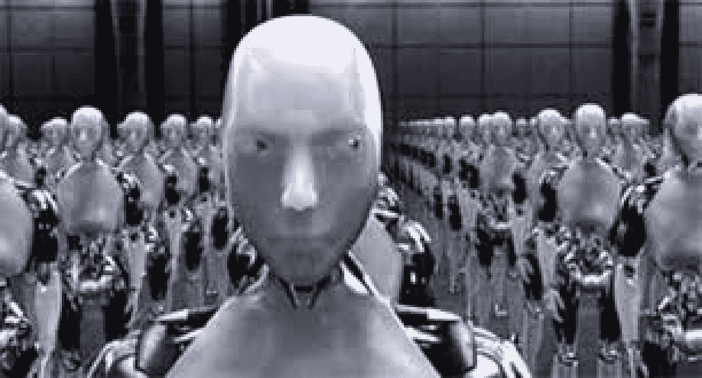

# 小心…机器来了！

> 原文：<https://medium.com/swlh/watch-out-they-are-coming-79e060a0b09a>

纵观历史，人类面临着许多挑战，它总是有两种选择:消失或适应。到目前为止，适应选项是被选中的选项。当人类用他们的智慧去克服挑战的时候。但是，有一种新形式的挑战，没有人知道如何应对，讽刺的是，这是人类的创造:机器学习。

许多科学家预测，你做什么样的工作并不重要；它将被替换。从出租车司机到医生，所有的一切都将被更快、更准确、更安全的机器取代，这将比我们想象的更快。

在接下来的 15 年里，仅在美国，机器就将接管 38%的工作。据 [Forrester](https://www.forrester.com/Forrester+Predicts+Automation+Will+Displace+247+Million+Jobs+And+Add+149+Million+Jobs+By+2027/-/E-PRE9745) 称，未来十年将有 2500 万个工作岗位消失。

这不是我们第一次面临如此大规模的失业。在第一次和第二次工业革命期间，机器人接管了重复性工作和体力劳动，许多人失去了工作。例如，从 1870 年到 1970 年，美国农民的比例下降了 90%，从 1950 年到 2010 年，美国工人在工厂的比例下降了 75 %，这都是因为[工业革命浪潮](http://www.businessinsider.com/growth-of-us-services-economy-2014-9)。

但至少当时的变化没有那么快，因为我们有 100 多年的时间通过创造新的工作和机会来适应和调整就业市场。现在，我们只有 10 到 15 年的时间来适应机器学习海啸，坏消息是，那些机器将取代人类的智力天赋，换句话说，它们基本上将取代我们。

好吧，看起来机器学习革命是不可避免的，我们需要拥抱它，并把它变成我们的优势。为此，我们需要明确区分人类和人工智能愿意做什么和不愿意做什么。我们在演绎推理、情绪智力和社会智力方面更胜一筹，因为我们在不同的情况下在不同的层面上使用这些技能来寻找解决方案和做出决定。机器准确，速度更快；他们可以处理大量的数据并提出建议；他们既不分心也不累。通过在他们和我们之间建立这些技能，我们可以创造一个合作的环境，在这个环境中，人类和机器可以实现互补共存。

共存可以非常成功，但有一个条件，那就是我们的政治领导人的意愿和决心，不要把市场扔在贪婪的资本家手中。政客们应该防止自相残杀和野蛮的就业市场；他们需要调整教育系统和社会规则以适应技术进步的破坏，通过为那些已经在市场工作的人提供更好的教育和陪伴来提高人类参与经济的水平。机器应该在人类的控制和监督之下，而不是让人类成为机器的奴隶。

由[**【noterecorder.com】**](http://noterecorder.com)

## 这篇文章发表在 [The Startup](https://medium.com/swlh) 上，这是 Medium 最大的创业刊物，有 281，454+人关注。

## 订阅接收[我们的头条新闻](http://growthsupply.com/the-startup-newsletter/)。

