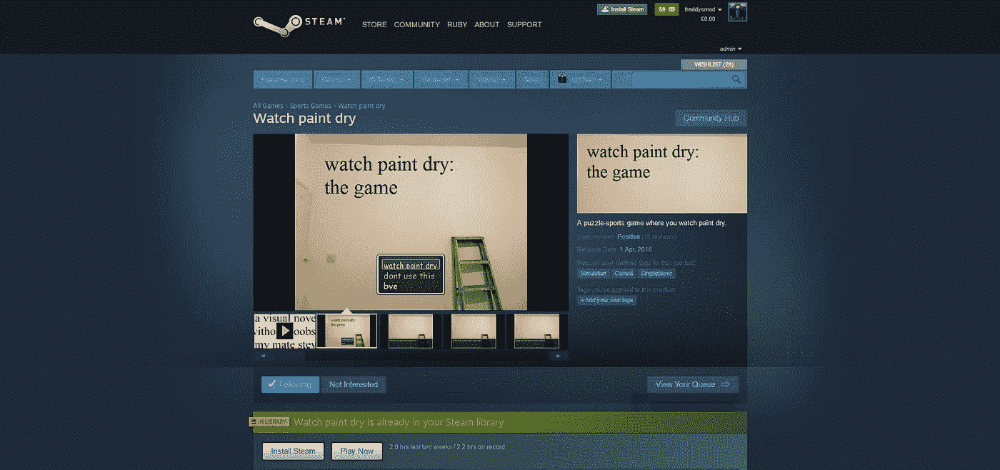
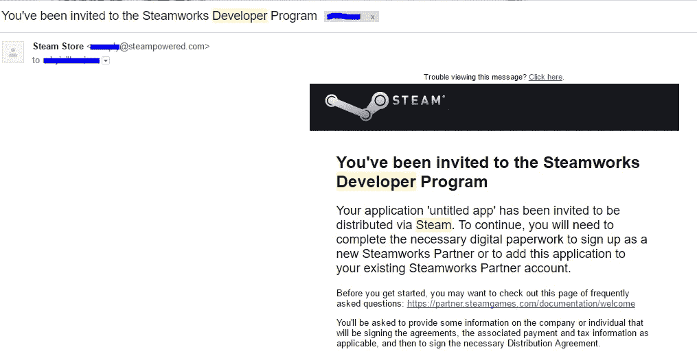
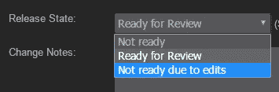
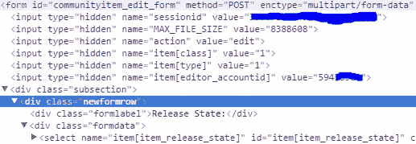
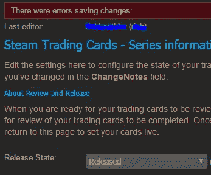
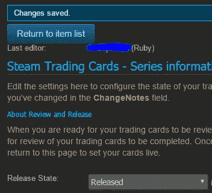
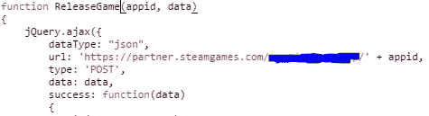
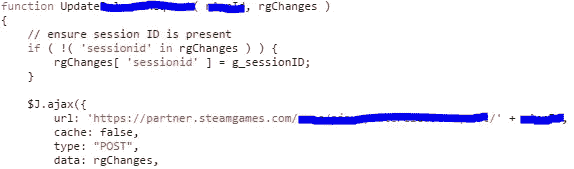
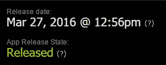
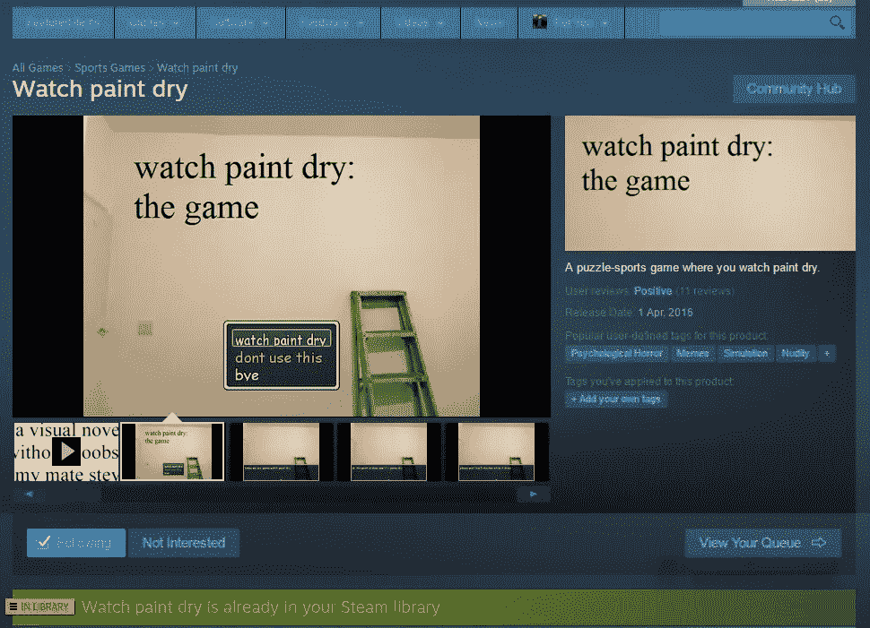

# 观看油漆干:我如何得到一个游戏的蒸汽商店没有任何人从阀门看它。

> 原文：<https://medium.com/swlh/watch-paint-dry-how-i-got-a-game-on-the-steam-store-without-anyone-from-valve-ever-looking-at-it-2e476858c753>

> 被抓是你计划的一部分吗？当然啦！

如果你周日晚上在 Steam 主页上，你可能会注意到一个有点有趣的新标题:“看油漆干”。这在 Steam 上引发了很多争议(老实说，我在论坛上还觉得有点好玩:p ),因为人们声称 Valve/Steam 已经失去了对绿光资本游戏的所有质量控制。但是这个游戏从来没有被批准过。事实上，我甚至还没有支付 [$100 的“无时间浪费费”](http://store.steampowered.com/app/219820/)来将游戏发布到绿光资本。我个人认为绿光资本是一个很好的平台，可以让人们的独立游戏得到大量曝光，它已经并将继续让独立游戏开发者成为一个可行的职业选择。如果我冒犯了那些正努力让他们的游戏进入 steam 的独立游戏开发者，我想道歉。这只不过是一个恶作剧，只是为了测试我在过去几个月里一直试图向 Valve 报告的东西——在 Steam 上获得任何你想要的游戏的能力，而 Valve 甚至没有看过它。这是一个已经过时的指南，因为 Valve 已经修复了这些问题，但是如果你要回到过去，那么这是一个关于如何发布你的游戏的权威指南！只是另一个快速说明，这与电影审查抗议无关-我今天才发现，这背后没有太多的“意义”。

**获得 Steamworks 账户**

这将是一个更深入的技术指南，但对我来说，访问 Steamworks 也是我开始对此进行调查的原因。我不会评论我如何/为什么访问 Steamworks，但我会确认它没有利用任何网络形式，没有绿光资本，也没有通过与 Valve 的某人直接联系。尽管它不再工作，我不会给任何细节，这是如何做到的，所以请不要问！我有充分的理由不这么做。

无论哪种方式，我都可以访问 Steamworks (Valve 的内部发布平台 Steam 和 backbone for game achievements、DRM、多人游戏等)，这让我有了寻找漏洞的想法。我试图联系阀门，但没有得到回应。最终，临近 4 月，我决定使用“无标题应用程序”进行愚人节恶作剧，试图引起 Valve 对这些问题的注意。

我将删除我在 RPG Maker 中制作 45 秒长的油漆干燥模拟器的部分，因为我对此并不特别自豪，而且它也不相关。

**蒸汽交易卡获批**

没有一些令人惊奇的交易卡,“看油漆变干”会是什么样的游戏？在 photoshop 里呆了 10 分钟后，我开了一个基本的玩笑。然而，在我发布之前，Valve 需要审查卡片、表情符号和背景。啊，但是他们有吗？

乍一看该页面，我们可以看到发布状态有几个初始选项:

有意思，这种形式背后的来源呢？

Editor Note: Some elements from the page have been removed to save space in photos and not give out irrelevant information

有趣的是他们在追踪我的会话和编辑帐号。让我们试着把它换成可能在 Valve 工作的人(比如 1)，把 select 的值换成不存在的东西，看看我们是否得到不同的形式。

嗯…那很有趣。新的“最后编辑”是来自 Valve 的人。如果我们用选中的“Released”框的值再次保存表单呢？

这里发生了什么？总而言之，当我提交错误的请求时，它会返回一个完整的选项列表及其值。在这种情况下，我看到“已发布”的值为 5。刷新表单以取回我的“editor_accountid ”,并将“Ready for Review”的选择框的值从 3 更改为 5，并将其保存到服务器，这可能是来自交易卡已获批准的开发人员的真实请求。服务器没有检查 Valve 的人是否已经批准了，只是将状态设置为 released。好了，让游戏上线吧。

**阀门的审批流程**

给你一点启示，在 Valve 把任何东西放到 steam 上之前，他们有一个 3 步释放过程。首先，你将你的商店页面提交给一个审查队列，然后是你的游戏的最终或接近最终的版本，然后你可以选择发布它。

**重头戏:发布游戏**

Steamworks 网站主要是 AJAX。为源代码提供支持的 Javascript 函数的所有代码都不会被混淆，也不会被任何人阅读(至少在 Steamworks 中是这样)。有一些有趣的代码，但由于这个游戏是一个概念验证，我坚持做相关的事情，并找到了一个有趣的 javascript 函数，名为“ReleaseGame(appid，data)”。这似乎是向 Steam 发出一个典型的 AJAX 请求(尽管其中没有任何身份验证),并且似乎如其所言，发布了该应用程序。

A quick overview of the ReleaseGame function

用参数 445730(我的 appid)和空白数据调用 ReleaseGame 给了我一个 403(禁止访问)错误。有意思。我查看了文件中的其他一些函数，注意到几乎所有的函数都向 JSON 请求添加了一个名为“sessionid”的值，会话 id 是我们之前发布自己的交易卡集时看到的。

The comment helped too!

所以，调用 ReleaseGame(445730，{ 'sessionid': 'my_session_id ')？

去蒸汽商店…

塔-达！我承认它直接出现在新版本部分是我的疏忽。我最初希望它“在 4 月 1 日到来”，直到周五才出现(尽管我没想到它会持续那么久)。我也承认我很想试试看我能发布多长时间，但我认为这款应用不上市销售是最好的。

我已经和 Valve 取得了联系，他们现在已经修复了这个漏洞。

我从这样做中学到的一点是，当处理首先需要批准的用户生成的内容时，不要将“审阅就绪”和“已审阅”作为内容的两种状态。相反，可以采取一种方法，通过给每个内容一个“审查票”或类似的东西，并且不允许内容切换到发布状态，直到有了内容的审查票，项目的审查才有审计线索。或者只是不允许用户将项目设置为“已发布”。

¯\_(ツ)_/¯

感谢阅读伙计们！

**TL；博士——我负责看着油漆变干。被抓是我计划的一部分。只是个恶作剧，兄弟！**

You’re a big guy.