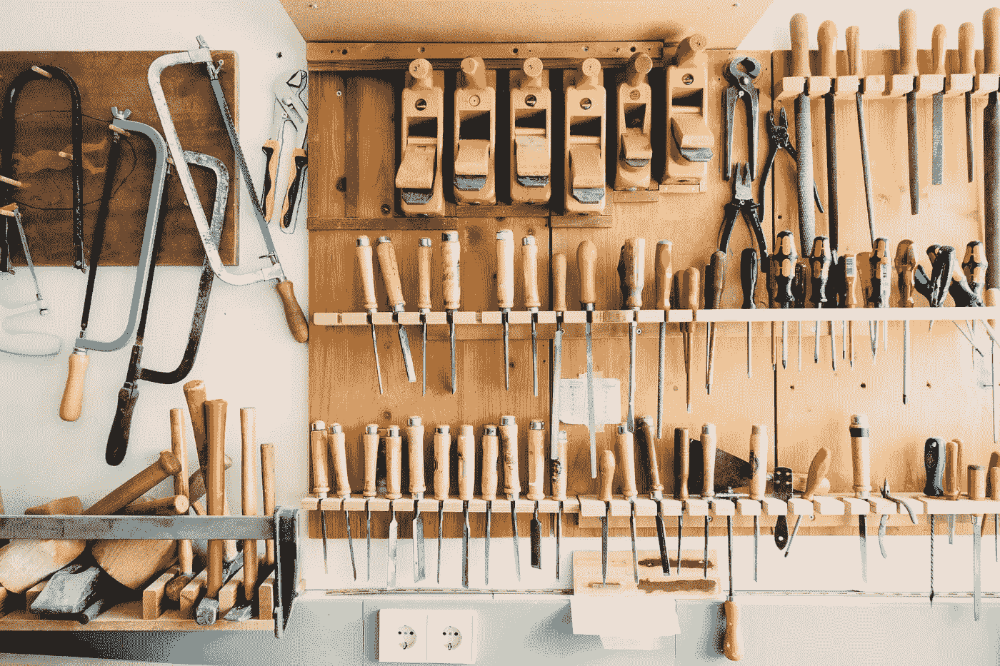
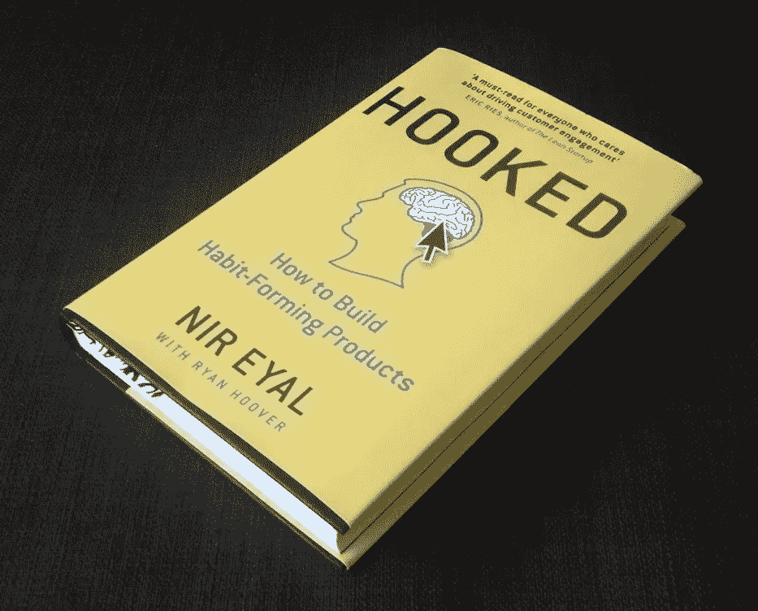

# 一个自由职业者的指南，以清理头脑和启动项目！

> 原文：<https://medium.com/swlh/ways-to-de-clutter-your-mind-and-jump-start-your-projects-4f6b383d7b2d>

## 有时候看起来最不相关的事情可以帮助你减轻压力，整理思绪，重新聚焦你的思维和项目！

作为一名自由职业者，自律是你需要具备的最重要的品质之一。尤其是当你刚开始的时候，你的工作经常是零星的，你可能会发现自己在项目之间有很多空闲时间。

如果你曾经为自己工作过，你肯定知道这一点，

> 当你一个人的时候，你可以什么都不做，什么都不会发生。

所以无论如何你都要不断地鞭策自己，有时你会意识到等待是不可避免的。

在这里，我将讨论一些我发现的最有效的方法，来度过这段或长或短的平静期！

## **更短的时间间隔..从长周末到节假日！**

对我来说，这些就像是我休息后马上要面对的小“障碍”。这些休息时间甚至可以小到周末。除非有客户会议或我正在进行的项目，否则周一是最糟糕的。你不能只是去上班，然后指望《T4 日报》会把你卷入其中。

***所以对于这些时期我专门用*** [***家庭清洁作为疗法***](https://www.verywell.com/cleaning-can-alleviate-stress-3145185)

putting everything in its place..

我把所有不用动脑筋的家务清洁工作留到了周一早上！这听起来有点激进，浪费宝贵的周一上午，这应该是为即将到来的重要一周奠定基础。

但是事情是这样的…

我们谈论的是需要照顾 T21 的不用动脑的工作，比如用吸尘器清扫地毯或者重新整理一个完全杂乱无章的壁橱。

虽然这些可能看起来不像是周一早上的优先事项，但做这些不需要太多思考的简单任务对理清你的思绪特别有好处。

在完成这些任务的几分钟后，你会自动开始感觉到你的头脑开始变得更加清晰。你的大脑会开始浏览“工作清单”上的不同项目，一个行动计划会毫不费力地出现。

仔细想想，打扫卫生只是一个权力调解的过程，在这个过程中，我同时做了两件事。一个小时后，我精神抖擞地去完成一些真正的工作！

***有时候，我只需要 20 分钟整理电子邮件收件箱，就能帮助我重新集中注意力***

在我更忙的日子里，我没有时间做这些，当我迫切地寻找重要的东西时，它确实会让我慢下来。所以我只是坐下来创建邮件过滤规则，标签等。或者甚至取消订阅已经过时的电子邮件营销通讯。

> 经过短暂的休息后，**的关键思想**是找到一些几乎不用动脑就能完成但同时需要注意的事情(在它崩溃之前),让你忙碌的日子过得更轻松。

## **更长的时间间隔..项目之间！**

作为一名自由职业者，在大项目之间，你可能会有这种低活动或无活动的时期。虽然理论上很容易理解，但这些是我刚开始时最难解决的。

虽然努力奋斗是好的，但你真正不想要的是不顾一切地让你接受你宁愿放弃的客户或项目！

我现在有一个公式来处理这个问题。我的方法有三个方面，以下是我保持乐观和积极的方法。

*   **与朋友和熟人接触基地**

当我积极参与一个项目时，我发现很难与那些不属于我日常工作生活的人保持联系。我还发现关注社交媒体上不断发生的炮轰会分散注意力。

因此，当我在项目之间时，我不会为了找到下一个项目而痛打自己、逼迫自己，而是利用这段时间与朋友、家人和熟人联系。

我同意，不是每个人都可以自由地赶上，但这没关系。我只是利用这段时间放慢脚步，四处看看。这可能意味着甚至时间去旅行！

*   **从人物、书籍和播客中寻找灵感**

我发现这个活动是最有意义的。

我天生被人吸引。所以我积极寻找机会去建立关系网，去结识不同国家的人。我发现 [Meetup](http://meetup.com) 对此特别有用。虽然在活动中除了偶然的交流之外没有特别的日程安排，但有时你会遇到一些来自你所在行业的了不起的人。上次我在一个聚会上，我联系到了 UX 领域的专家，也是一个了不起的人！

我也试着去找灵感作家的书。我甚至可能有几本书没有写完，所以我也试着把它们看完。最近，塞思·戈丁和马尔科姆·格拉德威尔撰写了《我去哪儿》一书。

I just can’t speak enough of the amount of great content books have!

如今，有如此多的免费信息随时可以获取，我倾向于将它们加入书签，以便以后阅读或收听(播客)。现在也是时候补上这些了。从 [TED](https://www.ted.com/) 演讲到像 [Hack the Entrepreneur](http://hacktheentrepreneur.com/) 这样的独立网站，互联网上有一座巨大的知识金矿，等待着人们去发掘！

*   **躲避生活中的摄魂怪**

如果你读过《哈利·波特》,你就会明白我的意思。

这是一件大事。我肯定你遇到过这样的人，他们通常对事物或生活有一种相当冷酷的态度。

还有一些人不断提醒你“生活的残酷现实”,或者过分谈论他们的成就，但这些似乎并没有解决生活中永无止境的问题。*这些摄魂怪是吸取他人快乐的专家。*

在一个好的日子里，当我的能量水平相当高时，我可能会迁就他们，甚至在我周围有一个大的积极盾牌；其他时候，当我与自我怀疑作斗争时，他们是我最不想待在身边的人。

> 当你的休息时间更长时，**的关键思想**是抓住所有重要的事情，寻找灵感，不惜一切代价避免消极！

我发现这些技巧能让我精力充沛，保持精力充沛。我希望这些也能帮助你。

还有什么对你有用的吗？如果你有任何你认为特别有用的想法或建议，我很乐意倾听。