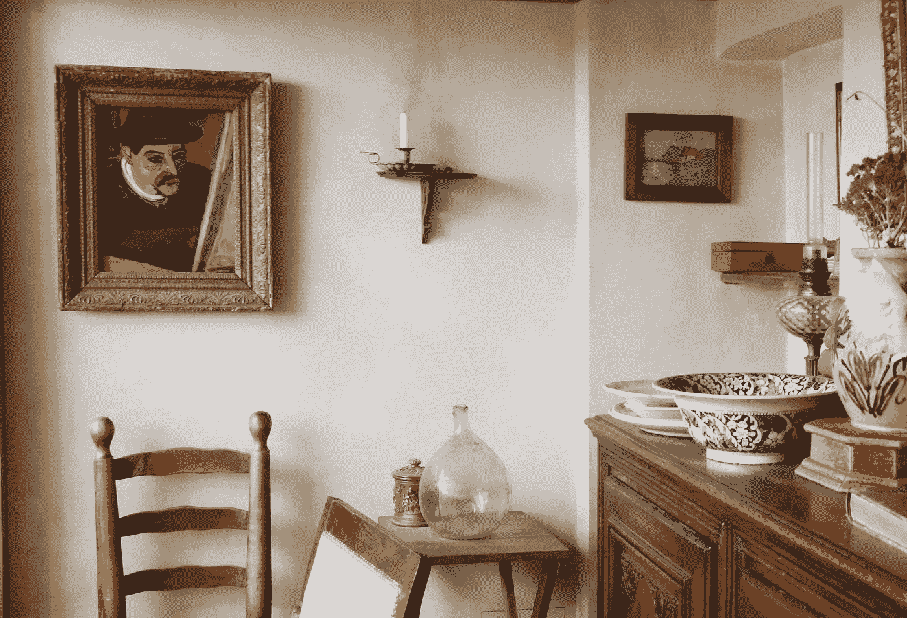

# 我们总是有比我们想象的更多的选择

> 原文：<https://medium.com/swlh/we-always-have-more-options-than-we-think-2cde7593243>

## 如果你把这之前的一切都看作是研究，会怎么样？

Musee de Montmartre, taken by me December 2018.

在我十八九岁的几个月里，我见过一位治疗师，他的主要策略是在每次治疗中拿出一个不同的深奥的棋盘游戏给我们玩，然后试图从这次经历中提取关于我的模糊见解。