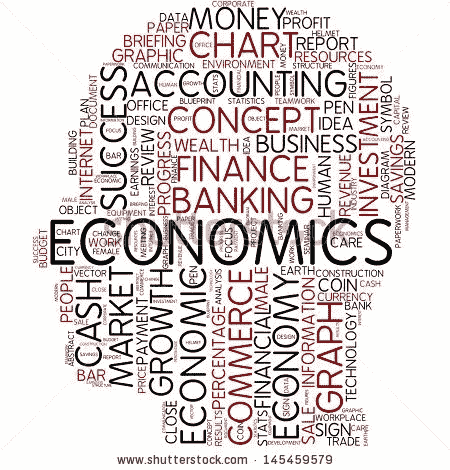

# 我们都是经济学家，原因如下

> 原文：<https://medium.com/swlh/we-are-all-economists-heres-why-db9b1f921f8b>

经济学是我们日常生活的组成部分，潜意识里支配着我们每天做出的决定，无论是作为消费者还是生产者。

简而言之——经济学就是 ***一切*** 。

# **宏观上**

宏观经济学:研究经济的总体健康状况，比如衡量一个国家的产出，也就是总产出…