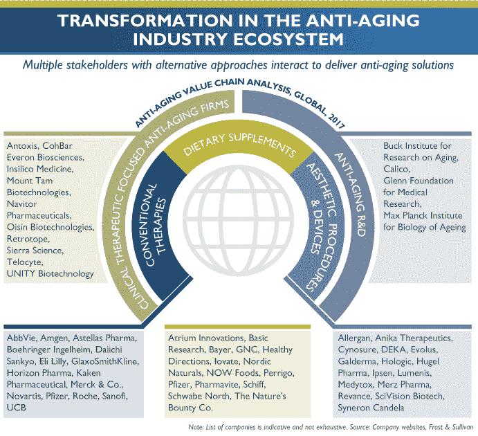

# 我们现在是一个产业:人工智能驱动的长寿生物技术产业的出现

> 原文：<https://medium.com/swlh/we-are-an-industry-now-the-emergence-of-ai-powered-longevity-biotechnology-industry-1508a0596d3c>

Neelotpal Goswami 指出:“人工智能在药物发现和生物标记开发方面的技术领先地位、卓越的学术成就、与制药和消费品公司的广泛合作、吸引顶级人才的新方法以及不断扩大的全球影响力，使 Insilico Medicine 能够在新生的长寿生物技术行业建立可靠和可持续的商业模式。”“为了表彰其开创性的研究以及为年龄管理引入新产品和解决方案的能力，Frost & Sullivan 很高兴向其颁发 2018 年技术创新奖。”

2004 年，我决定退出计算机硬件行业，专注于延长人类的生产寿命。多年来，我一直致力于交付切实的研究成果，并从任何角度将老龄化研究作为最重要的事业加以推广，无论是[量化利他主义](https://www.leafscience.org/a-i-versus-aging/)还是[宏观经济原因](https://www.ncbi.nlm.nih.gov/pmc/articles/PMC3863879/)。这一事业没有地理界限，使每一个人的生命更有价值。但在这个世界上，流行的途径在于经济激励，而且越大越好。

当我发布我们关于来自全球生物技术巨头无锡 AppTec、Pavilion Capital(新加坡淡马锡)、BOLD Capital Partners 和 Juvenescence、 的投资的 [**消息时，我没想到这个消息会传播开来。我们收到了来自普通媒体和制药行业媒体的广泛报道，包括**](/@longevity/the-new-era-for-ai-powered-drug-discovery-and-longevity-biotechnology-begins-for-insilico-following-c93e6efab423)**[端点](https://endpts.com/ai-team-at-insilico-gets-some-major-league-backing-from-china-as-alex-zhavoronkov-builds-global-network/)、[凶猛生物](https://www.fiercebiotech.com/cro/wuxi-apptec-to-test-ai-generated-compounds-from-insilico-medicine)、 [TechCrunch](https://techcrunch.com/2018/06/11/insilico-medicine-longevity/) 和[福布斯](https://www.forbes.com/forbes/welcome/?toURL=https://www.forbes.com/sites/robinseatonjefferson/2018/06/12/ai-and-biotech-companies-in-the-east-and-west-invest-in-combating-aging/&refURL=&referrer=#1ecc4731bd3d)。 [GenomeWeb](https://www.genomeweb.com/business-news/nebula-genomics-longenesis-partner-unlock-genomic-data-ai-blockchain#.WyY5nC9ePUo) 报道了我们与乔治·丘奇的星云基因组学的合作，我们在[金融时报](https://www.ft.com/content/30bb0752-6d5e-11e8-92d3-6c13e5c92914)上被提及。**

总的来说，对于长寿疗法行业来说，这是伟大的一周。[juvenesence 宣布结束其 5000 万美元的 A 轮投资，以投资许多以长寿为导向的资产和公司。此外，AgeX Therapeutics(迈克·韦斯特和奥布里·德·格里)筹集了 500 万美元，用于研究再生医学的最新进展。](https://www.ft.com/content/30bb0752-6d5e-11e8-92d3-6c13e5c92914)

上周，我和我的团队还出席了 CogX 和创始人论坛。CogXis 是人工智能领域最受尊敬的活动之一，汇集了 6000 多名企业家、金融家、科技企业集团和英国政府。数字和技术创业的顶级活动之一创始人论坛也没有让人失望。凭借世界级企业家、首席执行官和投资者的名册，长寿和人工智能成为主要亮点..

[正如我在我的第一篇媒体博客](/@longevity/the-new-era-for-ai-powered-drug-discovery-and-longevity-biotechnology-begins-for-insilico-following-c93e6efab423)中解释的那样，在 Insilico Medicine，我们努力利用人工智能的最新进展来理解衰老，利用衰老研究来加速人工智能的研究，并使研究更具可解释性。

就在几周前，Y-Combinator 进行了他们通常的夏季招生挑战，重点是连接人工智能和衰老研究的公司。他们现在处于秘密行动模式，这是他们通常的风格，我们不知道谁会是赢家。但是现在已经部署了大量资本，所以在大约一年的时间里，将会有太多的公司从世界上最专业的孵化和加速项目中走出来。

但本周，人工智能衰老研究首次受到了 Frost & Sullivan 的关注，他们首次获得了 2018 年北美人工智能衰老研究和 Insilico Medicine 药物开发奖。

[原新闻稿**Frost&Sullivan**](https://www.prnewswire.com/news-releases/insilico-medicine-earns-accolades-from-frost--sullivan-for-its-pioneering-rd-in-ai-for-aging-research-and-drug-discovery-300667607.html)

这是一个非常意外的奖项。几周前，我收到了 Frost and Sullivan 的一封电子邮件，称他们的分析师已经完成了对 Insilico Medicine 的审查。我每周会收到几千封邮件，但从来不会全部打开。特别是这封看起来像是一封促销邮件，但幸运的是，我打开了它，注意到了一篇关于 Insilico Medicine 的简短报道和一条消息，说我们已经获得了该奖项！该报告由新闻发布稿和研究论文等在线提供的信息和事实组成。但他们对我们发表的研究论文进行了如此深入的研究，这让我不寒而栗。我们通常会发布概念研究的证明，而不会透露研究在我们的核心引擎或药物研发管道中的位置，所以有人能把我们所有的拼图拼在一起有点可怕。我在下面添加了完整的报告。

另一个意外的事件是，在我们领奖的同一天，由 DCB 台湾总裁率领的台湾代表团来访。DCB 的员工工作非常努力，令人惊讶的是，他们同意在周末与我们会面，因为我必须在周一前往伦敦参加伦敦技术周。

当我向 DCB 团队展示该奖项时，发现他们已经在与 Frost & Sullivan 合作，他们是人工智能、区块链和其他行业的分析和教育合作伙伴。很高兴看到他们与我们的 Insilico 台湾团队一起开始关于人工智能衰老研究和药物发现的分析和教育系列。

去年，我们被领先的技术分析师 CB Insights 选为 2018 年 100 强人工智能公司之一 [**。获得这个奖项对我们团队来说是一个巨大的激励。CB 洞见也**](https://www.cbinsights.com/research-ai-100) **[**覆盖了我们在长寿空间**](https://www.cbinsights.com/research/anti-aging-startups-to-watch/) 。然而，Frost & Sullivan 奖是独一无二的，因为它架起了人工智能和衰老研究的桥梁，意味着这个领域现在有不止一个参与者。我们正在见证这两个迅速扩张和融合的领域的出现。**

Frost & Sullivan 可能是最著名的行业分析师，我在 90 年代末上学时使用过他们的报告，然后在 00 年代初为 PMC-Sierra 和 ATI Technologies 工作时也使用过他们的报告。他们的报告通常是业务计划的基础，影响着战略和财务预测、增长预测和市场规模估计

**最近他们发表了两份行业报告:**

[**抗衰老疗法和服务市场——趋势和增长机会，预测至 2022 年——随着市场走向“预防-管理-修复”连续体，关注将膳食补充剂和美容解决方案与临床疗法相结合的综合解决方案**](https://store.frost.com/industries/anti-aging-therapies-and-services-market-trends-and-growth-opportunities-forecast-to-2022.html)

[**临床疗法、膳食补充剂和美容解决方案推动抗衰老市场到 2022 年达到 856 亿美元**](https://go.frost.com/NA_PR_MFernandez_MDB7_AntiAging_Jun18)

这些报道是第一批报道仍处于萌芽状态但发展迅速的长寿生物技术产业诞生的报道。现代金融领域最聪明的人之一吉姆·梅隆(Jim Mellon)曾押注于一些最不可能的趋势和公司并取得了胜利，他在名为“[juvenence](https://www.juvenescence-book.com)”的书中全面涵盖了这一领域，这是每个现代投资者都应该阅读的一本书。最近，[布莱恩·伯格斯坦](/@bbergstein)在 [Neo 的](https://medium.com/neodotlife)[媒体文章](/neodotlife/juvenescence-jim-mellon-longevity-e9a415dd0569)中报道了吉姆·梅隆的工作和愿景。《连线》杂志的联合创始人詹妮弗·梅特卡夫开创的生活。

这感觉就像回到了互联网时代的炒作和机遇，当时许多承诺在短期内没有实现，但从长远来看却远远超出了预期。长寿生物技术产业肯定是一个所有人都赢的产业，即使在产业持续增长的过程中有短期的失败。该行业的目标是让每个人的生命更有价值，我们不应该以任何方式放慢速度。

长寿生物技术是一个快速增长的行业，彼得·迪亚曼蒂斯是世界上最有见识的未来学家、指数教育家和商人之一。6 月 17 日，他写了一篇关于人工智能和长寿的未来的文章，描述了这一趋势，并迅速传播开来。

[**以下是他的原帖。**](http://www.diamandis.com/blog/future-of-ai-and-longevity)

我强烈推荐看一下弗罗斯特的关于老龄化产业的报道。每一家大型制药公司和“大型科技”公司都应该将衰老研究和长寿生物技术作为公司战略的一部分。这不仅是一个利他主义的事业，也是每个人的一个重大机遇。Frost & Sullivan 用一个[简单的图形游戏](https://img.en25.com/EloquaImages/clients/FrostSullivan/%7Bec1515dc-88d4-402f-a801-553a48b4e5b4%7D_MDB7_Side.jpg)总结了这些机会。

Source: Frost & Sullivan. [Anti-aging Therapies and Services Market — Trends and Growth Opportunities, Forecast to 2022](https://go.frost.com/NA_PR_MFernandez_MDB7_AntiAging_Jun18)

由于人口老龄化，发达国家的政府已经面临着巨大的威胁，同时，制药公司和初创公司也有巨大的机会在追求这一利他事业的同时获得巨额利润。

Source: Frost & Sullivan. [Anti-aging Therapies and Services Market — Trends and Growth Opportunities, Forecast to 2022](https://go.frost.com/NA_PR_MFernandez_MDB7_AntiAging_Jun18)

在这份报告中，Frost & Sullivan 报道了作为长寿研究领域无可争议的领导者之一的[巴克老年研究所](https://www.buckinstitute.org/)。巴克研究所的首席执行官 Eric Verdin 博士是一位 H 指数超过 100 (100 篇论文被引用超过 100 次)的知名科学家，也是一位杰出的领导者，他为顶级研究筹集了数百万美元。他还致力于在巴克研究所建立一个人工智能衰老研究中心。长寿研究和人工智能正在迅速融合，我们期待在这一领域看到许多进展。

The Buck Institute for Research on Aging

我们与远离医疗保健的公司合作，将人工智能驱动的长寿生物技术产业推向新的水平。这些合作者之一， [Neuromation](https://www.neuromation.io/en/) ，正在为联合努力贡献他们巨大的[超级计算云和人工智能专业知识](https://neuromation.io/en/neuromation-longenesis-human-data-economy/)，我强烈推荐跟随他们的[媒体首席科学官](/neuromation-io-blog/there-is-no-competition-only-development-of-useful-tools-sergey-nikolenko-about-ai-in-medicine-de2a96298349)。

Frost & Sullivan award 报告还提到了我们与 BitFury Group 的重要合作伙伴关系 Longenesis，这是 BitFury 首席执行官瓦列里·瓦维洛夫在韩国举行的全球领袖论坛上首次提出的。

Valery Vavilov presenting Longenesis at the Global Leaders Forum in Korea

[**这里是视频的链接。**](https://www.youtube.com/watch?v=dMSVtTv-Sck&feature=youtu.be&t=17m57s)

Longenesis 还与乔治·丘奇的[星云基因组](https://www.nebulagenomics.io/)合作。很高兴在上周伦敦的 CogX 会议上与 Nebula 的首席执行官 Kamal Obbad 共同展示我们的演示。

Kamal Obbad, the CEO of Nebula Genomics presenting our partnership at Cognition X in London

**结论**

长寿生物技术正在走向成熟。在我看来，人工智能是推进衰老研究和建立制药行业可持续模式的最佳方式。制药行业在接受人工智能用于衰老研究和新兴商业模式方面可能有点慢。与此同时，虽然大型科技公司和大型消费品公司不愿意在基本的数字健康领域之外冒险进入监管更加严格的制药领域。然而，我们可以按照他们的方式与这两个世界合作。这个奖项——以及我们和我们的新兴产业获得的广泛认可——证明了人工智能驱动的长寿生物技术产业正变得更加可信和强大。我们准备改变商业模式，实现巨大的商业成果和不可估量的人类收益。

Bridging consumer & pharmaceutical insights

[www.insilico.com](http://www.insilico.com)

我们非常自豪能够在 Frost & Sullivan 的开创性报告中获得这一重要奖项和认可。[此处提供报告全文](https://drive.google.com/file/d/1TDjvQPguiTA4bz7L9sVI8JFDShcYB-AY/view)。

## 这篇文章发表在 [The Startup](https://medium.com/swlh) 上，这是 Medium 最大的创业刊物，拥有 338，320 多名读者。

## 在此订阅接收[我们的头条新闻](http://growthsupply.com/the-startup-newsletter/)。

