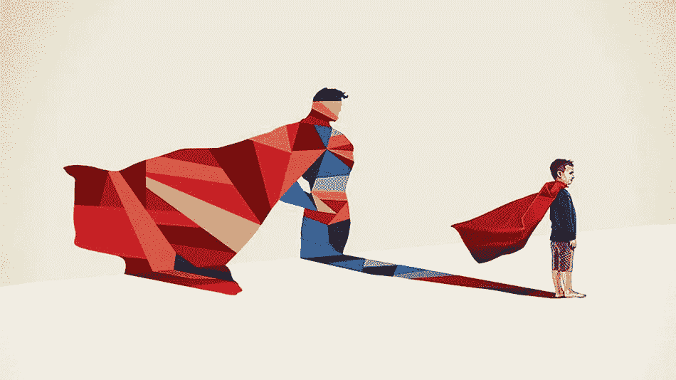

# 我们更多:安全和存在

> 原文：<https://medium.com/swlh/we-are-more-security-existence-922b199647f9>

# **我们更**

我们不仅仅是我们成就的总和；我们远不止如此。但是我们经常对生活和我们的身份有一个结果导向，而不是一个解决方案或更好的过程。我们是分隔的动物。我们根据是什么和不是什么来思考和组织我们的思想，它使世界变得非常容易导航，给我们安全感和控制感，给我们批判性思考和比较相似选择的能力。我们用 1 和 0 来思考，我们或多或少是二元生物，这是有道理的。

这也创造了一个结果导向。我们总是在寻找答案，不，一个答案…一些为什么要把这个和一种地方感和相关性拼凑在一起；在历史上，我们习惯性地将它与因果关系混淆，但这个讨论将在另一个时间进行。我想说的是，我们不是以解决方案为导向，而是以结果为导向。结局是非黑即白，这就是事实。是对是错。解决方案是可能性驱动的，除非被证明，否则采取更加中立的立场。让我们更进一步。

当我们采取行动，做决定时，我们担心结果。相对于利益相关者是什么或谁，我们如此重视它的对错，以及我们如何看待这些将影响我们对自己和他人的认同，以至于我们不禁要问，我们真的是为了解决问题的最佳利益而做出决定吗？我们真的在寻找解决方案吗？还是我们只是想证明自己是对的？

正确和非错误之间有着明显的区别，后者我们常常忘记承认，也没有意识到它所体现的重要性和潜力。

解决方案的立场是，我们收集证据，创造解决方案并继续前进，与结果无关，与验证无关，将我们自己或至少我们的个人身份与成功或失败无关。作为人，作为人类，我们不仅仅是我们成就的积累。意识到这应该是完全和平和令人难以置信的满足。

**我们不仅仅是我们成就的总和；我们远不止如此。**

# 我们的安全和生存偏见

在分子水平上，我们是质子、中子和电子的自我战场；不断运动，争取可用的稀疏能量，努力影响粒子的生存，确保连续性和存在。

用这样的术语来思考似乎是微不足道的，但是考虑分子活动的综合和推断的影响，我们个人特征、个性和情感依恋的发展。这种存在于粒子之间的偏见可能会通过我们的个性，比如说“战斗或逃跑”的机制以及我们对存在、生存和繁荣的渴望来模仿。

考虑到我们将有限的精力、注意力和脑力用于:我们对社会关系的关心程度和投入程度，在每一个生活时刻都非常相似。一个我们还不了解的世界。

当我们在科学之外寻找时，存在类似偏见的证据…在社会上，在我们寻找我们的部落、我们的人民、我们的位置和归属感的渴望中。或者在精神或形而上学的意义上，承认我们对一体性的理解和概念之外的因素的体现，不是宇宙事物的一部分，而是宇宙事物的一部分。

我们似乎被这种倾向和努力所包围，这些倾向和努力是为了找到我们的位置，将我们的思想和学到的概念分类，以理解我们周围的世界并找到安全感。和捍卫我们生存的稀缺资源。

不过话说回来，也许那只是因为我们现在在寻找；我们在每一个地方都能找到它，讲述我们自己和故事，并在这个科学、现实和好奇的奇迹的奇妙奉献中发挥我们的叙事。

不管怎样，想想就好。永远不要让你的想象力限制了你的好奇心。

## 这篇文章发表在[《创业](https://medium.com/swlh)》上，这是 Medium 最大的创业刊物，有 284，454+人关注。

## 订阅接收[我们的头条新闻](http://growthsupply.com/the-startup-newsletter/)。

