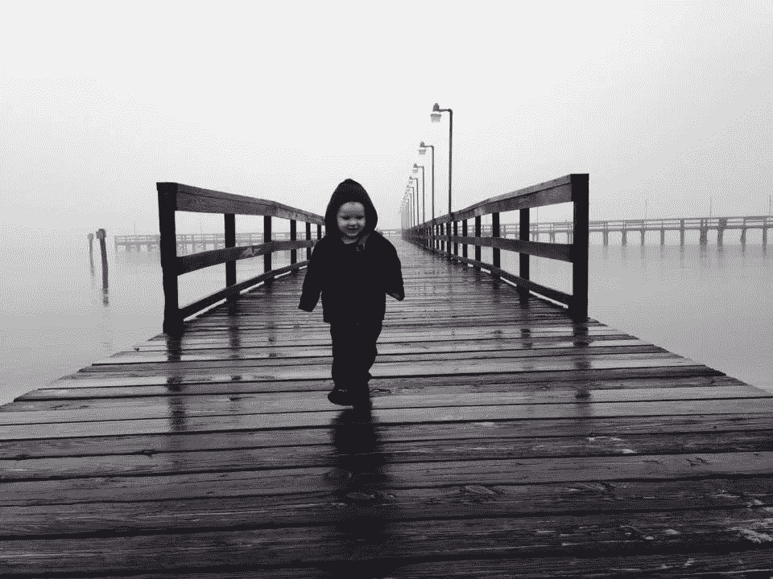

# 我们是自己创造的。你在做什么？

> 原文：<https://medium.com/swlh/we-are-what-we-make-so-what-are-you-making-c1dc9a22d632>

A future maker.

我们都是“创客”。

在工作中，在家里，在生活中，我们都在制造和生产。

这是我们的基因决定的。我们在工作和家庭中制造食物、商品和产品。我们还制作报告、演示文稿、效率或任何数量的东西。我们自己动手制作在 Pinterest 或 YouTube 视频上找到的东西。

我们也制造大东西。我们创造我们的生活，我们创造商业、思想、文化和遗产。

我们很大程度上是由我们制造的东西来定义的。这就是我们是谁，我们是如何为人所知的。在很大程度上，这是我们的身份。

最近，当我在完成一门关于传播研究方法的硕士学位课程的期末论文时，我深深地体会到了这一点。

在中断很长时间后，我回到了大学，重点是获得战略和危机沟通方面的新知识和技能。我的思考过程是，我的职业生涯还剩 20 年——或多或少——我想让它们有价值，为伟大的组织做有意义的工作。

我想挑战自我，舒展筋骨，拓宽职业人脉。但我的首要目标仍然是做好工作，提升我合作的组织。

这个特殊的班级对我来说一直很艰难，直到我的一个大儿子问我是否需要帮助，他是 2016 届大学毕业生，在一家全球性公司的管理培训生项目中工作。

多好的礼物。我马上答应了。

所以他和我坐在一起，我们一起研究我的课本。我们讨论了我正在努力解决的问题。我们讨论了我没有领会的概念。

他帮我完成了一个软件程序，用来分析一份调查，这是课程的一部分。他是我论文想法的传声筒。

很有启发性。很有趣。这是我会记住的事情。

他的帮助是一件小事，但它改变了我在那堂课上的一切。

当我和我的儿子一起工作时，我清楚地看到了 20 多年的“制作”可能是什么样子。在那一刻，在我的过去、现在和未来交汇的时刻，作为一名父亲、专业人士和学生，它提醒我，我的价值观在我所做的事情中是多么重要。

在生活和工作的日常磨砺中，很容易出现视力模糊，顾全大局的情况。

我们可以做出决策，朝着当时看似无关紧要的方向前进。但它们可能会对未来产生重大影响。

所以我分享一下我的想法。它不是宣言，也不是使命宣言。仅仅是观察和我学到的东西。我们开始吧:

—不要和解。

—不要有一点欺骗。

—不要只是过得去。

—永远不要让失败定义你。让韧性和勇气来定义你。

—性格、同情心、诚实、关心、承诺、乐观、激情……它们仍然很重要。

—在一个不稳定的世界里，要靠得住，要可靠。

—在无信仰者中保持信仰。

—永远在绝望中抱有希望。

—采取主动。

—要善良。和尊重。

—没有人在你之下。

—野心是好的。带着其他人一起向上。

—带着信念和谦逊，做好领导。

—服务就是领导。

—多听，少说。

—要灵活。

真实和真实性是必需的。

—寻找答案而不是借口。

—做有意义的工作。

—小心你的愿望。

——“真实”和诚实永远不会贬低或诽谤。

—伸展自己，走出你的舒适区。

我相信还有很多其他的事情可以添加到这个列表中。你知道它们是什么。

当我整理这份清单时，我意识到我渴望的事情有多少。我仍处于“制作”阶段。

现在问题是给你的。

你在做什么？

你的“创造”遗产是什么？

## 这篇文章发表在 [The Startup](https://medium.com/swlh) 上，这是 Medium 最大的创业刊物，有 275，057 人关注。

## 订阅接收[我们的头条](http://growthsupply.com/the-startup-newsletter/)。

