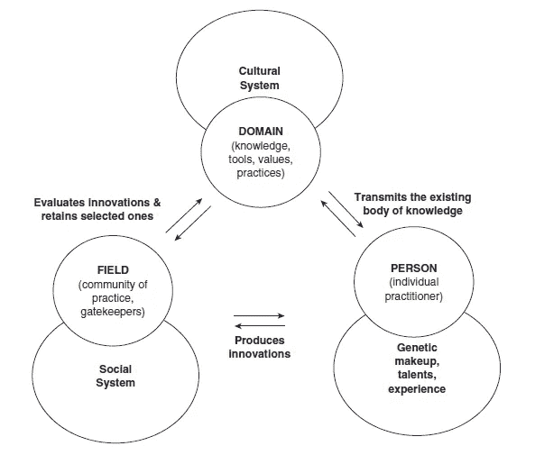
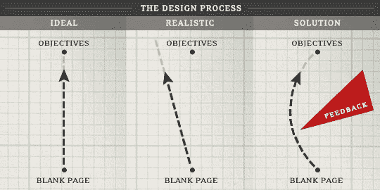
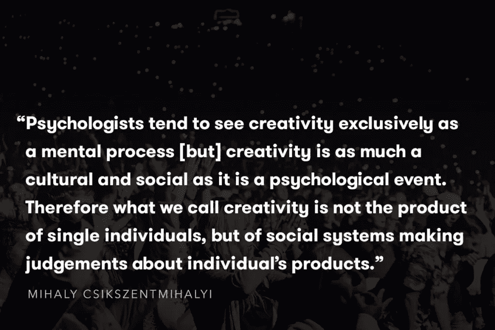

# 我们都可以成为卧室天才

> 原文：<https://medium.com/swlh/we-can-all-be-bedroom-geniuses-dfb6f0ecf14f>

## 但是是那些离开家的人改变了世界

Photo by William White on Unsplash — [https://unsplash.com/@wrwhite3](https://unsplash.com/@wrwhite3)

现在，一位梵高可能被广泛认为是有史以来最有影响力和最具创造力的艺术家之一，但他孤独而终，身无分文。为什么？因为 100 年前，他的油画被视为一个反社会的隐士的幻觉原创作品。

直到多年以后，当其他艺术家和评论家为艺术定义了一种新的审美标准时，他的作品才被认为是创造性的杰作。

我们可能会将“创造力”视为一种个人特质——我们自己做的事情——但真正的创造力取决于志同道合者的群体。说‘这是新的’的同行。这是令人兴奋的。这比我们现有的要好。

真正的创意是创新。这是破坏性的。它挑战并改变了我们对既定观念的思考方式。

但是要达到这一点，你需要反馈。你需要批评。

在任何项目的早期，你会感觉像是在保护一个襁褓中的婴儿——保护你的伟大想法不被这个世界戳穿、戳破和批判。

早期太多的反馈会引起质疑，[严重的自我怀疑](http://blog.crew.co/use-self-doubt-to-your-advantage/)，以及那种可怕的恐慌感，你认为会改变世界的伟大想法[可能并不那么伟大](http://blog.crew.co/feel-like-an-impostor-youre-not-alone/)。

那么什么时候才是分享的合适时机呢？

什么时候我们能把我们的作品带给大众，并发现我们是否真的有创造力，或者只是把我们的想法涂在画布上？

创意是你生意的命脉。 [*点击此处*](http://crew.us2.list-manage.com/subscribe?u=655606e77350bfa30e1ab5457&id=7f313472f5&utm_medium=referrer&utm_source=crew&utm_campaign=blog-cta&utm_content=the_Real_reason_to_share_your_work) *每周阅读我们的时事通讯，加入数以千计的创意商店。*

# 创造力需要社区

> “心理学家倾向于将创造力完全视为一种心理过程，但创造力既是一种心理事件，也是一种文化和社会现象。”

米哈里·契克森米哈(他可能因普及“心流”的概念而闻名)在概述他的创造力系统理论的文章中解释道。

> “因此，我们所说的创造力不是单个个人的产物，而是对个人产品做出判断的社会系统的产物。”

你最好的创意可能是在你独自洗澡的时候产生的，但创意本身需要一群志同道合的人，他们分享思维和行为方式，互相学习，模仿彼此的行为。

Csikszentmihalyi 的系统理论解释说，创造力是由个人和环境组成的，而环境本身有两个方面:一个他称之为**领域**的文化方面；还有一个社会方面叫做**领域**。

在他的理论中，“创造力”被定义为:

> 只有在个人、领域和领域相互作用的交叉点上才能观察到的过程

你可以这样想:你的想法，不管是什么，在某个领域可以是独特的、原创的**，但是如果没有这个领域**——你的同行和整个社区*——的认可，它就不是真正的*创意。

如果像史蒂夫·乔布斯一样，我们将创意过程视为点与点之间的连接，那么 Csikszentmihalyi 的创意理念就是当社区选择你的创意作为他们要连接的点之一。

想想早期朋克的强力和弦和喉音尖叫。当然，这可能看起来像是一种全新的演奏音乐的方式，但是它发生在音乐的领域内，并且被音乐听众群体所认可(嗯，至少他们中的大多数！).

或者，在光谱的另一端，你有一些像化学一样的东西，在采用周期表之前，化学家没有办法真正表明他们正在创新或提出创造性的想法。当然有原创的想法，但是没有领域知识可以用来堆积新的想法或者对其进行评判。

正如 Csikszentmihalyi 在他的理论中所言:“如果没有某种形式的社会评价，就不可能区分那些完全古怪的想法和那些真正有创造力的想法。”

# 你在哪里工作并不重要。但是和谁一起工作很重要。

那么，你在哪里可以找到验证你想法的团队呢？

音乐家布赖恩·伊诺称这个社区为“scenius”——一群有创造力的人组成了一个“人才生态”。你的场景可能是和你一起工作的人。或者像 Product Hunt 或 Medium 这样的社区。甚至是一群朋友或同龄人。

不管是什么，需要解决的一件事并不是你和谁分享你的想法。但是*当*的时候。

在当前分享你的工作和快速迭代的趋势下，我们太依赖领域，而对自己的知识依赖不够。我们冒着被污染的风险，在我们的想法完全形成之前就把它们公之于众。

事实上，大多数鼓励分享的“领域”——比如写作的媒介、视频的 YouTube、设计的 Dribbble 等等——都包括一些从你的同行那里获得大量反馈的方式，无论是通过竖起大拇指、心之类的方式。

是的，我们需要反馈和验证，但是过早地参与一个社区或团体可能会导致类似群体思维或自我审查的事情，在那里你的想法——通常在它们的婴儿阶段——被迫符合当前的信念。

我们需要知道在创造过程中的正确时间，让想法进入这个世界。当他们已经过了腐败的阶段，有了足够的外壳来面对外界的批评。

# 何时寻求反馈(以及如何接受反馈)

来自你的社区、同龄人，甚至是你亲近的人的认可和反馈是创作过程中不可或缺的一部分。

但找到合适的时机寻求这种认可可能是一种微妙的平衡。太早的话，你可能会错过那些只有你才能建立的联系。太晚了，你可能在路上走得太远而找不到正确的方向。

这里有一些不同的方法让你的社区参与进来，并用它们来验证和实现你自己的想法:

# 1.使用反馈作为协作工具

如果你和一群关系紧密的人一起工作，或者和你的“场景”有着良好的关系，那么更常见的是在早期获得反馈和对你想法的确认。尽管你的想法很脆弱，但这个团体都有一个相似的目标。

设计师兼插画师凯西·麦克丹尼尔在*中列出了一份清单*，他将[的设计评论作为反馈的一个例子，作为一种合作工具](http://alistapart.com/article/design-criticism-creative-process)——一个获得外部输入并纠正你前进方向的机会。

她引用了《T4:好主意从何而来》一书的作者史蒂文·约翰逊的话，他解释道，“通常，将直觉转化为真正突破的东西，是潜伏在别人头脑中的另一种直觉。”

当你寻求认可的社区与其目标一致时，尽早让你的想法得到认可是安全的。

# 2.设计反馈流程

反馈和认可是有区别的。事实上，你可以把这种来自社区的“验证”的想法更多地看作是认可而不是反馈。但是在几乎所有的情况下，你都会面临一些对你工作的批评和反馈。

如果你觉得有必要验证你的想法，或者遇到困难，想寻求外界的帮助，以正确的方式征求反馈是很重要的。

首先，理解你为什么要问。

是因为你被困住了需要帮助吗？你是否觉得有什么不对劲，想找个专家或同事帮忙？你是不是觉得已经完事了，只想要一个客观的看法？

然后，**在你的社区中寻找*合适的*人:**值得信赖的、有创造力的同事、导师或老师，他们对你最感兴趣。

如果你是一名作家，请一名编辑。双方的责任感将有助于提升“太好了！”的反馈变成你真正能用的东西。

最后，确切地知道你在追求什么。

正如创意教练[辛西娅·莫瑞斯](https://twitter.com/originalimpulse)解释的那样:

> “‘你觉得怎么样？’就像给某人一把上膛点燃的大炮，瞄准你的心脏。"

相反，在征求反馈之前，试着问自己以下三个问题:

1.  你想要的结果是什么？
2.  什么样的反馈最适合你？要不要微评？还是大图反馈就够了？
3.  你想要什么样的新闻？写的？口头上？

反馈会议越有条理，就越容易理解、消化和实施。

# 3.寻求认可

有大量的文章解释[如何寻求反馈](http://blog.crew.co/6-qualities-of-good-feedback/)，但当谈到接受批评时，只有一条黄金法则:准备好辩护(不要处于防御状态)。

在这篇文章的前面，我把你的创意称为一个需要保护的婴儿。这是一个常见的形象，因为这是我们大多数人的感受。尽管我们很乐意带着完全开放和客观的立场参加批评或反馈会议，但保持情感上的超然几乎是不可能的。

但是对一个想法太执着会让你看不到反馈，而反馈会把你带到一个真正创新的地方。

领导力顾问约翰·巴尔多尼在*哈佛商业评论*中写道[防御性如何让你受到额外的、不必要的批评](https://hbr.org/2010/04/defend-yourself-without-being):

> “通常情况下，防御性会引发负面行为，比如抨击或封闭。你被这一刻抓住了，礼貌话语的美好被抛到了九霄云外。充满激情是好的，但你要避免变得过于热情，也就是说，不愿意也无法倾听他人的意见。”

相反，巴尔多尼说，我们需要做好准备，耐心和慷慨。

**做好准备**通过彻底了解你在做什么以及为什么做，来应对出现的评论和问题。

**耐心**与你正在寻找认可的社区(识别好的作品和实际创造它需要同样多的时间——看看梵高吧！)

对那些批评你的人慷慨大方。如果你在你的场景中，或者在你想要改变的社区中，要知道他们内心深处都希望改变发生。

创造力是推动文化进化的引擎。

但是真正的创造力不仅仅取决于你有一个惊人的想法(并且实际上付诸行动！而是改变世界。单纯的创造是不够的。你需要说服。

我们都可以成为卧室天才，但真正改变世界的是那些走出家门的人。

# 有了一个想法，[并想把它带到创意社区？](https://crew.co/?utm_source=Medium&utm_medium=CTA&utm_campaign=MediumCTAs)

## 看看 Crew 吧，这是一个人才市场，在这里你可以见到最好的设计师和开发人员，并与他们一起工作。超过 1000 万人使用过[剧组](http://crew.co/?utm_source=Medium&utm_medium=CTA&utm_campaign=MediumCTAs)生产的产品。超过 300 万人阅读了[我们的博客](http://blog.crew.co/?utm_source=Medium&utm_medium=CTA&utm_campaign=MediumCTAs)。在这里加入他们。