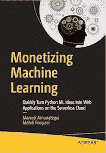

# 我们都可以成为互联网巨头——如何在网上免费创造和销售你的机器学习产品

> 原文：<https://medium.com/swlh/we-can-all-be-internet-moguls-how-to-create-and-sell-your-machine-learning-product-online-and-2c845b5d231b>

Source: Lucas Amunategui

> 一旦你尝到了甜头，一旦你明白了获得某样东西是多么容易，你就会被吸引住。

让我震惊的是，作为一名周末企业家，工具的成本已经降到了地球上。我们再也看不到民主化了，它终于民主化了。

# 机器学习网络应用

我说的是一种特殊类型的创业，机器学习驱动的网络应用类型。

这就是你使用机器学习脚本的地方，这是一个将数据转化为可操作智能的模型，通过将其部署到互联网上来增强它。反过来，任何人，无论远近，老少，都可以在不了解统计学、Python 或机器学习的情况下直观地调整其参数，并获得潜在的改变生活的动态结果，根据他们的需求定制。

这在过去我们很少看到，除非它是由隐藏在 REST API 服务后面的强大的编译程序驱动的，无论如何，它很可能不是免费的，或者它得到了广告的大量补贴。

现在情况不同了，事情已经变了。有了像 R 和 Python 这样伟大的开源编程语言，我们现在可以很容易地将脚本扩展到网络和整个地球。我们正在进入这样一个时代，机器学习、周末企业家可以快速、简单地想象、测试和分享原型，如果你够聪明的话，还可以免费。

这消除了企业家和网络用户的准入门槛。我们都赢了。

我们现在可以测试数百个想法，看看是否有可行的、无风险的。

# 我的新免费电子书

为了庆祝这一点，我为那些想自己尝试一下的人准备了一本免费的电子书。其中，我们将构建一个股票市场预测工具，将其扩展到一个 web 应用程序中，并最终将其部署到云上。所有这些都是免费的。我们甚至会尝试一些货币化方案，比如用 Stripe 或 PayPal 捐款进行信用卡支付。

如果你想收到它，请注册，我会把 PDF 的链接发给你，还有那些更直观的人(比如我)的免费视频:

> [https://create-your-own-web-apps.gr8.com/](https://create-your-own-web-apps.gr8.com/)

# 但是不要磨蹭

就紧迫性而言，机会之窗现在似乎敞开着，但不会永远如此。大型巨头仍在争夺尽可能多的世界大数据，一旦尘埃落定，他们将追逐小人物、周末企业家和我们。所以不要磨磨蹭蹭。

你准备好生产你的数码产品了吗？你确定吗？这是重要的一步，很少有人能从这一步走回来。一旦你尝到了甜头，一旦你明白了获得某样东西是多么容易，你就会被吸引住。你会问你周围的人，他们要么失败了，要么需要一大群员工来让事情运转起来。注册[电子书](https://create-your-own-web-apps.gr8.com/)并开始制作。

感谢阅读！

**曼努埃尔·阿穆纳特吉**

作者:[货币化机器学习](https://amzn.to/2CRUOKu)

[amunategui.github.io](http://amunategui.github.io/) 和 [ViralML](http://www.viralml.com/) 的馆长

## 这篇文章发表在 [The Startup](https://medium.com/swlh) 上，这是 Medium 最大的创业刊物，拥有+ 379，528 名读者。

## 在此订阅接收[我们的头条新闻](http://growthsupply.com/the-startup-newsletter/)。

