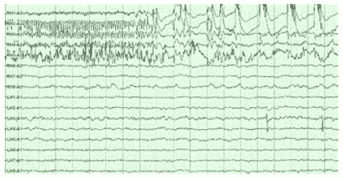

# 在数据和其他几个朋友的帮助下，我们可以战胜癫痫。

> 原文：<https://medium.com/swlh/we-can-beat-epielpsy-with-a-little-help-from-data-and-few-other-friends-2ad978e879d8>

跨越整个阅读，现在，我正在寻找脑电图数据，为癫痫预测和预防的最终目标。脑电图数据将帮助我们到达跨越阻止癫痫的圣杯所需的十站中的第一站。

让我解释一下为什么脑电图数据集对帮助 1/5 的人类至关重要:

在北美，1/5 的人(在其他地方也可能是相同的比例)患有某种形式的癫痫症。脑电图数据，以及皮肤电导、心率和人们的情绪已经被用来预测癫痫发作，准确度很高。

为什么我们需要更多数据:

我们开发了一些新的癫痫发作预测方法，并使用波士顿儿童医院的数据集对所有现有算法进行了比较评估。[https://www.physionet.org/pn6/chbmit/](https://www.physionet.org/pn6/chbmit/)由于该数据集仅限于儿童和少数几种癫痫，我们需要来自更大人群和更多种癫痫的数据。

我们当前的计划:

我们已经开发了一些使用脑电图数据预测癫痫的新方法。我们想用更多的数据集来检查我们的假阳性和假阴性率。

我们还对所有已发布的主要算法进行了比较评估，这些算法以前没有使用相同的数据集，或者没有公开代码。我们需要更多公开的癫痫患者脑电图数据集。我们也希望与任何有脑电图数据的人合作(并分享作者身份)。除了我们自己的代码，我们还可以访问一些独家的 ML 平台，我们可以在合作中提出来。因此，如果你有数据并与我们分享这一崇高的事业，我们将非常乐意与你交谈并进一步合作。

我们的未来计划:

我们计划将基于 EEG、皮肤电导、情绪、心率和可能的一些其他探针的癫痫预测与小探针结合，以破坏作为癫痫发作基础的神经元的同步，以及通过泵的受控释放。虽然我们下一步不会使用医院的脑电图数据，因为我们需要隐藏在人们头发下的微型探针，但这些脑电图数据将让我们了解癫痫的多样性以及如何在临床阶段防止过度拟合。我已经得到了一些风险投资，并将在明年的某个时候在北美、欧洲或澳大利亚的某个地方开始这项工作。现在，在印度的一两年时间里，我正在为这家公司以及其他十几家我创办或共同创办的公司建立技术能力。

这里是我们的几个关于在心理健康中使用人工智能的中型帖子。如果他们让你感兴趣，联系他们。

[https://medium . com/@ sukantkhurana/how-is-人工智能-改变癫痫患者的生活-42bb8748fc0f](/@sukantkhurana/how-is-artificial-intelligence-changing-life-of-epileptic-patients-42bb8748fc0f)

[https://medium . com/swlh/how-IOT-is-current-changing-mental-health-360974579 F5](/swlh/how-iot-is-currently-changing-mental-health-360974579f5)

谢谢你。

— — — — — — — — — — — — — — — — — — — — — — — — — — -

关于:

T4 博士苏肯特·库拉纳经营着一个学术研究实验室和几家科技公司。他也是著名的艺术家、作家和演说家。你可以在[www.brainnart.com](http://www.brainnart.com)或[www.dataisnotjustdata.com](http://www.dataisnotjustdata.com)了解更多关于 Sukant 的信息，如果你希望从事生物医学研究、神经科学、可持续发展、人工智能或数据科学项目以造福公众，你可以在 skgroup.iiserk@gmail.com 联系他，或者通过 LinkedIn[https://www.linkedin.com/in/sukant-khurana-755a2343/](https://www.linkedin.com/in/sukant-khurana-755a2343/)联系他。

这里有两个关于 Sukant 的小纪录片和一个关于他的公民科学努力的 TEDx 视频。

 [## Sukant khu Rana(@ Sukant _ khu Rana)|推特

### Sukant Khurana 的最新推文(@Sukant_Khurana)。创始人:https://t.co/WINhSDEuW0 和 3 家生物技术创业公司…

twitter.com](https://twitter.com/Sukant_Khurana) 

## 这个故事发表在 [The Startup](https://medium.com/swlh) 上，这是 Medium 最大的企业家出版物，拥有 311，185+人。

## 在此订阅接收[我们的头条新闻](http://growthsupply.com/the-startup-newsletter/)。

