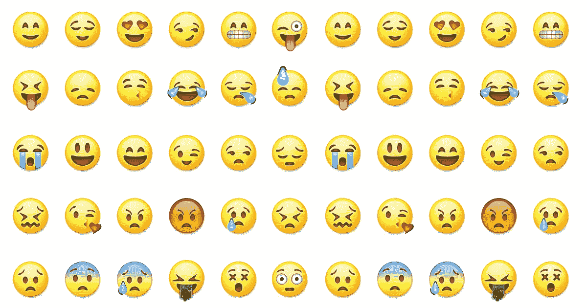

# 我们可以停止沉迷于(聊天机器人的)个性

> 原文：<https://medium.com/swlh/we-can-stop-obsessing-over-personality-of-chatbots-2bb8e570dacf>

一个 mid 这些刺耳的术语像**个性、身份、气场等等。**与聊天机器人联系在一起，我们忘记了聊天机器人的**脊椎——对话**。结果呢？我们太努力地试图把一种个性强加给我们的聊天机器人。

让我们不要忘记，你的聊天机器人的主要目的是自动化你的组织的一套流程，并使其可扩展。这只有通过开展有效的对话才能实现，记住聊天机器人的使用案例。当然，不可否认性格对于你的聊天机器人的重要性。但是，你的聊天机器人的个性应该是它与用户对话的结果。由于大多数企业都处于聊天机器人的试验阶段，聊天机器人的对话应该是我们的主要关注点。**毕竟，对话会引导他们找到解决方案。**个性可以成为我们围绕清晰、干净、无错误的谈话发展起来的一个附加特征。所以，让我们把注意力放回基础——设计一个有效的对话。

在开展有效的对话时，要记住以下四点。

# 1.第一印象很重要

你的聊天机器人的第一条信息为接下来的对话定下了基调。你的机器人明确地告诉用户它能做什么是很重要的。

Set the right expectations with the first message.

以一句不清楚的“嗨，有什么可以帮你的吗？”会带来很多模糊的问题，而你的机器人并没有被训练去回答。这会导致来自用户端的挫败感。相反，最好在对话开始时就明确说明你的机器人能帮上什么忙。这将有助于你的客户清楚地了解你的机器人会带来什么。

# 2.简单的对话

保持你的对话流程简单。一个好的聊天机器人对话是非常容易理解的。简单可以通过构造清晰易懂的句子来实现。选择简短明了的句子，而不是冗长含糊的句子。简明扼要地写下你想表达的内容。

Keep the conversation easy to understand.

在给定的时间内，引导用户通过一个主题进行对话也很重要。在试图帮助一件事之前，先提供帮助。因此，记住不要在谈话中显得停滞不前。一次只关注一件事，但要保持对话的流畅。

# 3.后备答案的重要性

用户总会提出一些你的机器人没有经过训练的问题。在这种情况下，回退响应将指导用户下一步可能是什么。不要让客户不知道下一步该做什么。

Don’t the leave the user directionless when your chatbot is encountered with an unknown question.

如果客户的问题没有被列出来，转移到现场代理、询问联系信息以回复用户或列出该领域的主要主题是一些不让客户感到沮丧的方法。为用户提供一些指导，而不是一遍又一遍地说“对不起，我不明白”。

# 4.互动媒体

当信息只包含文本时，它只有现在的一半有趣。什么变了？表情符号！不仅仅是表情符号，现在聊天平台支持所有类型的多媒体文件。

Use emojis but remember to not overdo it.

除了在对话中加入友好的元素之外，在必要的地方加入 gif、表情符号、图像、视频会让你的对话更具沉浸感和视觉吸引力。但是记住不要过度使用表情符号或 gif。坚持适度。你不希望你的聊天机器人看起来轻浮或愚蠢。

为聊天机器人开发有效对话的关键是能够以简单明了的方式为用户提供解决方案。这不一定看起来是一项艰巨的任务。写下工作流程中涉及的步骤是一种简单的开始方式。

> 在设计对话时，重要的是消除赋予聊天机器人个性的负担。

我们公司 WotNot 的理念是让用户在构建之前预览机器人变得极其简单，同时也简化了他们构建对话流的过程。你只需输入网址，选择一个适合你的模板，就能快速浏览你网站上的机器人。在我们的网站上试用 [www.wotnot.io](http://www.wotnot.io)

## 这篇文章发表在[的《创业](https://medium.com/swlh)，这是 Medium 最大的创业刊物，拥有+395，714 人关注。

## 在这里订阅接收[我们的头条新闻](http://growthsupply.com/the-startup-newsletter/)。

