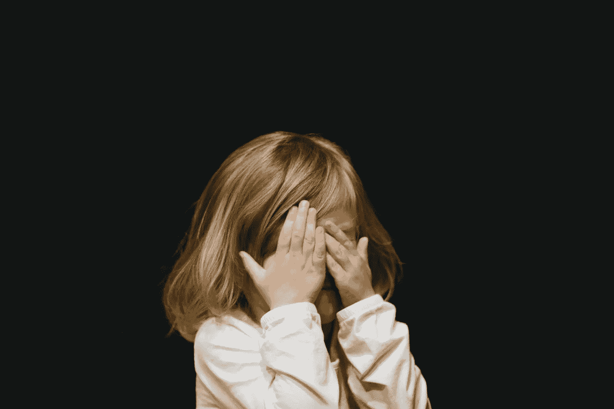

# “在这个家里，我们不谈钱。”

> 原文：<https://medium.com/swlh/we-dont-talk-about-money-in-this-house-be44e820b019>

Keeping our kids in the dark does no one any favors. Photo by [Caleb Woods](https://unsplash.com/@caleb_woods)

我小的时候，大概 8 岁，我父母的一些朋友来我家做客。我忘了我们在谈什么，但突然我看着我爸爸说，“如果你发生了什么事，我会在你的遗嘱里得到钱吗？”

我是个害怕的孩子。我晚上躺在床上睡不着，想着如果我没有父母了，我会怎么样。我可能也在想玩具，但是我跑题了…😉…