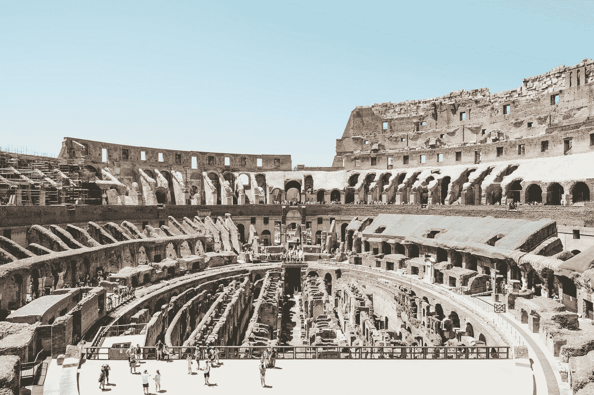

# 我们不知道我们去了哪里——我们真的被搞砸了

> 原文：<https://medium.com/swlh/we-dont-understand-where-we-ve-been-and-we-re-seriously-screwed-aa446a7f2b36>

“group of people on landmark” by [Henry Paul](https://unsplash.com/@henrypaulphotography?utm_source=medium&utm_medium=referral) on [Unsplash](https://unsplash.com?utm_source=medium&utm_medium=referral)

在今天这个动荡的时代，我对人们对历史的知识和理解的缺乏感到震惊(我不应该这样)——不管是哪个国家或哲学。忘了知道 1066 年是黑斯廷斯战役(还有谁记得意义？).忘掉 E.D .赫希在 80 年代末推动的文化素养——每个人都应该…