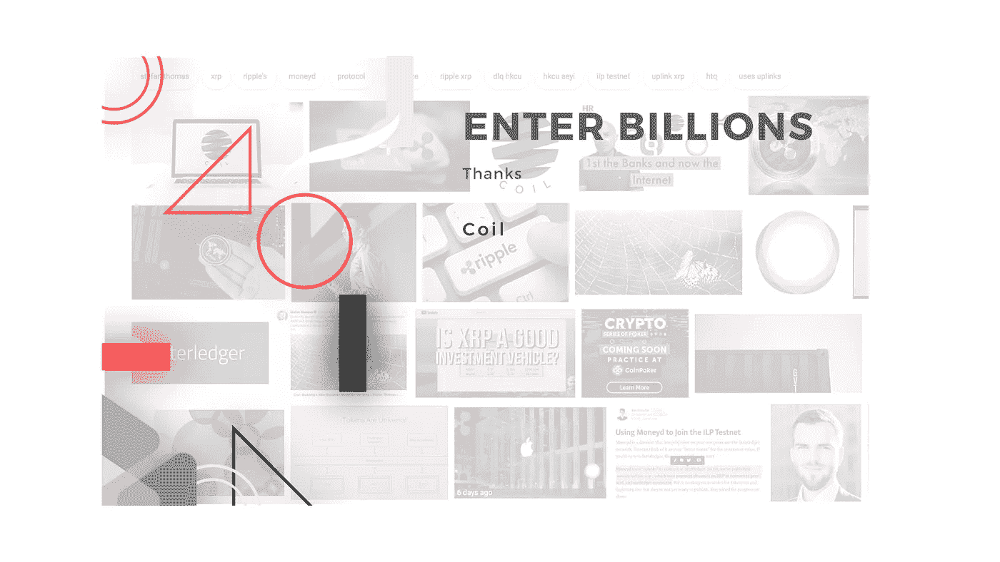

# 我们成立这家公司是因为线圈

> 原文：<https://medium.com/swlh/we-formed-this-company-because-of-coil-83a46176d97c>

> *了解更多关于* [*线圈*](https://medium.com/coil) *在这里，把你的想法从煨到一个线圈。(那是本文唯一的线圈双关，无极。)*

*我们正在改造我们的网站，并以非常缓慢的速度添加更多内容，因此请密切关注“输入十亿”生态系统的新发展。*

首先，让我说，输入十亿是不可知论者和公正的任何特定的区块链技术或密码领域内的用例。成功将举起所有真实的，非诈骗的船。也就是说，在发现 Coil 之前，我们无法想象这种商业模式。毫不夸张地说，没有它我们就不会在这里。

我个人很高兴做出这样的声明，并给予应有的信任。一个想法往往只是一个想法，或者一个概念只是一个概念，之后什么都不会发生。蛇吃了它的尾巴，然后死了。

每一家面向区块链的创业公司*的规模都可能*巨大。在这方面，输入数十亿美元并没有什么不同。我们不仅期待听到新的声音，我们还将很快看到跨区块链社区的交叉验证，并大声回响到其他部门/传统走廊，这些部门/传统走廊被认为对分散化、无摩擦价值交换、未来等过于不友好。

你现在会听到类似“这只是时间问题”和“不是**如果**而是**什么时候”的说法最终，这取决于一群人聚在一起，分享想法，并通过努力工作来创造一些东西。这取决于一个社区和当今代表一个社区的一切，即使这个想法已经通过社交媒体、重新划分选区、不公正地划分选区和旧的意识形态被抛弃而被完全重新想象或改造。**

每个起源故事都是独一无二的。

我们如何不可避免地将区块链以外的人带入太空将在未来被过度概括，但一系列的 FUD 战役和鲜血以及似乎永无止境的时间将是独一无二的，不可重复的，无价的。

没有人需要解释迷因以及迷因在互联网上是如何工作的。同样，最终，如果有足够多的 YouTube 教程(开玩笑)，没人会解释比特币到底是什么。20 年或 30 年后，我们如何引进人才的细节将不再重要。我们希望，我们共同建立的社区的残余仍然存在，不会被遗忘。

> 也许现在讨论尚未被书写的历史遗迹还为时过早。我们会看到的。

**欢迎来到进入数十亿的闸门。感谢线圈团队，感谢你们促成了这一流动。**

## 这篇文章发表在 [The Startup](https://medium.com/swlh) 上，这是 Medium 最大的创业刊物，有+368，954 人关注。

## 订阅接收[我们的头条新闻](http://growthsupply.com/the-startup-newsletter/)。

