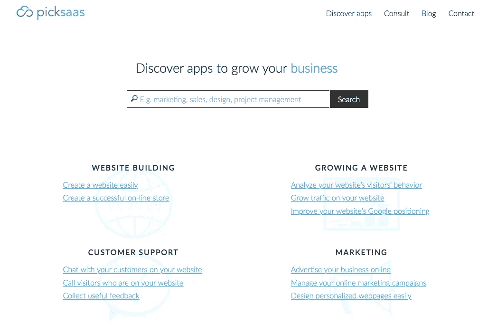

# 我们分析了 150 种 SaaS 产品。这是我们对它们可用性的看法。

> 原文：<https://medium.com/swlh/we-have-analyzed-150-saas-products-this-is-what-we-think-about-their-usability-8d4075b8d7fe>

开始我们的 picksaas 项目时，我们头脑中有一个非常简单的想法。帮助其他人发现最好的应用来发展他们的业务。这是一个相当雄心勃勃的计划。市场上有 2000 多种 SaaS 应用程序/软件，逐一查看将是一场巨大的斗争。

那么，如果我们想帮助别人发现最好的应用，我们应该如何做呢？

> *“有了云，个人和小企业可以打个响指，立即建立企业级服务。”罗伊·斯蒂芬，* [*皮尔斯矩阵*](https://www.crunchbase.com/organization/piercematrix) 的创始人兼首席执行官

# 你为…推荐哪个应用程序？

这是我们又一次听到的问题。人们在脸书集团、Quora、产品搜索，甚至在媒体评论中寻找解决问题的软件。

这也是我们前段时间遇到的问题，当时我们不知道在网站上安装一个[实时聊天](https://picksaas.com/live-chats?utm_source=blog&utm_campaign=We%20have%20analyzed%20150%20SaaS%20products)窗口是一个非常简单的过程。在开始我的另一个咨询项目时，我一直在问我更有经验的朋友们，他们可以推荐哪个应用来管理特定的流程。

因此，我们在 picksaas 中所做的就是寻找特定的问题以及可以解决这些问题的软件。从实时聊天开始，我们对多个实时聊天软件进行了评估。然后，我们跟进了电子商务平台，让你自己创建一个网上商店。向用户展示如何将它们与分析应用程序结合使用，我们还做了一个关于建立自己的电子商务商店的教程。更进一步，**我们已经经历了包括** [**【项目管理】**](https://picksaas.com/project-management?utm_source=blog&utm_campaign=We%20have%20analyzed%20150%20SaaS%20products)**[**CRM**](https://picksaas.com/crm?utm_source=blog&utm_campaign=We%20have%20analyzed%20150%20SaaS%20product)**[**邮件自动化**](https://picksaas.com/mailing-automation?utm_source=blog&utm_campaign=We%20have%20analyzed%20150%20SaaS%20products) **等共计 23 个软件类别，向平台添加了共计 150 个 SaaS 解决方案**。****

********

****注册了 150 多个云 app 解决方案后，我的邮箱简直就是噩梦。在所有的入职电子邮件、博客帖子通知和应用程序提醒中找到来自真人的消息是一个真正的挑战，所以我必须实现一个系统，将联系人分为我保持联系的真人和来自软件应用程序的通知。****

****我们不仅测试了我们在 picksaas.com 提出的每一个解决方案。我们不仅仍然在日常工作中使用它们中的许多(没有[特雷罗](https://picksaas.com/project-management/trello?utm_source=blog&utm_campaign=We%20have%20analyzed%20150%20SaaS%20products)、[斯莱克](https://picksaas.com/communication-tools/slack?utm_source=blog&utm_campaign=We%20have%20analyzed%20150%20SaaS%20products)、[啄木鸟](https://picksaas.com/cold-mailing/woodpecker?utm_source=blog&utm_campaign=We%20have%20analyzed%20150%20SaaS%20products)、[模板](https://picksaas.com/design-platforms/stencil?utm_source=blog&utm_campaign=We%20have%20analyzed%20150%20SaaS%20products)或[管道驱动](https://picksaas.com/crm/pipedrive?utm_source=blog&utm_campaign=We%20have%20analyzed%20150%20SaaS%20products)的一天会更加困难)，而且我们还**连接它们，创造出更复杂的引擎**。****

****例如，我们将 Google 电子表格、 [Woodpecker](https://picksaas.com/cold-mailing/woodpecker?utm_source=blog&utm_campaign=We%20have%20analyzed%20150%20SaaS%20products) 和 [Pipedrive](https://picksaas.com/crm/pipedrive?utm_source=blog&utm_campaign=We%20have%20analyzed%20150%20SaaS%20products) 连接起来，创建了一个复杂的一体化潜在客户创造解决方案，将联系人从 Google 电子表格上传到 Woodpecker 冷邮活动中，然后一旦潜在客户感兴趣，就在 Pipedrive 中自动创建交易。****

****通过这种方式，我们既了解了如何使用特定的应用程序解决企业的问题，也了解了如何将它们连接起来，从而创建更复杂的环境来管理公司内部的整个流程。****

> *****“打造一个大于其功能总和的产品”* [*希滕·沙阿*](http://hiten.com/) *，《疯狂的蛋》联合创始人 Kissmetrics*****

# ****用杰出的方式做一件简单的事情****

****在深入研究了 150 款最受欢迎的产品后，我们对这些应用的可用性有了一个非常有趣和广泛的看法。在 Quora 和 Product Hunt 上与应用程序用户的互动也让我们深入了解了客户对云应用程序的实际期望。****

****我们已经看到并测试了许多试图解决每个客户问题的解决方案。找到一个软件提供“一体化”引擎来支持客户、管理人力资源或营销自动化不是问题，市场上有多种复杂的解决方案，具有各种高级功能。然而，大多数情况下，这些应用程序并不能满足客户的期望，并且比简单的应用程序更难使用。****

****最有用、最友好、最容易接近的产品专注于解决**一个客户的问题，提供一个核心功能**。另一方面，他们**“外包”其他领域的功能**到其他云应用，提供与其他 SaaS 解决方案的多重集成。****

> ****可用性不仅是关于易用性，也是关于带来有意义的东西，与用户有共同的目标――[*马库斯·奥斯特伯格*](https://www.goodreads.com/author/show/8186106.Marcus_sterberg) *,《面向所有人的网络策略》一书的作者*****

****让我们来看看一些非常受欢迎的应用程序的例子，这些应用程序以其可用性而闻名。****

# ****“可用性方法”的领导者****

****LiveChat 是一个在线解决方案，你只需添加一小段代码就可以在你的网站上设置一个实时聊天窗口。但与其他实时聊天应用相反，它不提供任何与实时聊天无关的高级和广泛功能，如 CRM、营销自动化或构建聊天机器人。相反，**它专注于以最好的、用户友好的、设计良好的方式提供核心的实时聊天功能**。同时，它提供了大量的集成，让您可以扩展 LiveChat 与其他应用程序的功能，以更好的结构化方式完成这些事情。****

********

*****LiveChat — chat with your visitors*****

****因此，例如，**您可以轻松地将** [**LiveChat**](https://picksaas.com/live-chats/livechat?utm_source=blog&utm_campaign=We%20have%20analyzed%20150%20SaaS%20products) **与**[**Pipedrive**](https://picksaas.com/crm/pipedrive?utm_source=blog&utm_campaign=We%20have%20analyzed%20150%20SaaS%20products)**CRM 连接，并在 LiveChat 的应用程序中从 pipe drive 管理联系人**，而无需在两种解决方案之间切换。想造一个聊天机器人？只需将僵尸引擎解决方案连接成一个集成。效果？LiveChat 是比较流行的实时聊天解决方案之一，尤其是在中小型企业和电子商务企业中。****

****这种方法的其他例子有 [Trello](https://picksaas.com/project-management/trello?utm_source=blog&utm_campaign=We%20have%20analyzed%20150%20SaaS%20products) 和 [Slack](https://picksaas.com/communication-tools/slack?utm_source=blog&utm_campaign=We%20have%20analyzed%20150%20SaaS%20products) ，它们可能是当今最流行的云应用。它们本质上非常简单，提供核心项目管理和沟通框架，同时**专注于使您能够集成尽可能多的附加解决方案**。当有人在 Typeform 中填写您的表格时，或者当您在 Pipedrive CRM 中完成一笔交易时，您想创建一张 Trello 卡吗？就是这种精神！****

********

*****Trello — manage projects*****

****另一个非常有用的产品的例子是 [WIX](https://picksaas.com/website-builders/wix?utm_source=blog&utm_campaign=We%20have%20analyzed%20150%20SaaS%20products) ，一个致力于提供尽可能接近 PowerPoint 的网站建设体验的网站建设者。有了 WIX，你可以拖放特定的元素，并立即上传创建的设计，创建自己的网站，而不需要知道一段代码。****

********

*****WIX — create a website*****

****然而，输入的元素并不限于由 [WIX](https://picksaas.com/website-builders/wix?utm_source=blog&utm_campaign=We%20have%20analyzed%20150%20SaaS%20products) 团队创建的元素。**其应用程序市场对外部各方集成开放**，这意味着您可以极大地扩展其功能，例如通过输入联系表格，自动将电子邮件上传到您的 MailChimp 的订户列表，或将您网站上的文档上传与您的 Dropbox 帐户集成。****

****[Sumo](https://picksaas.com/lead-capturing/sumo?utm_source=blog&utm_campaign=We%20have%20analyzed%20150%20SaaS%20products) ,“可用性方法”的另一个领导者是一个专注于通过建立电子邮件列表、弹出窗口和分享按钮来**增加网站流量的解决方案。这与其他解决方案没有什么不同，如 [Privy](https://picksaas.com/lead-capturing/privy?utm_source=blog&utm_campaign=We%20have%20analyzed%20150%20SaaS%20products) 或 [AddThis](https://picksaas.com/lead-capturing/addthis?utm_source=blog&utm_campaign=We%20have%20analyzed%20150%20SaaS%20products) ，但 Sumo 提供的集成数量非常广泛，这可能是该应用受欢迎的主要原因之一。您不必担心将收集的电子邮件地址添加到您的 [GetResponse](https://picksaas.com/mailing-automation/getresponse?utm_source=blog&utm_campaign=We%20have%20analyzed%20150%20SaaS%20products) 邮件应用程序中，**由于内置的连接**，一切都会自动发生。******

****

***Sumo — grow traffic***

**[MailChimp](https://picksaas.com/mailing-automation/mailchimp?utm_source=blog&utm_campaign=We%20have%20analyzed%20150%20SaaS%20products) 可能是最受欢迎的邮件自动化软件，每天发送 10 亿封电子邮件，专注于建立和监控电子邮件列表，并使用预定义的模板设计精心制作的电子邮件活动。这些都是它非常出色的表现。与此同时，MailChimp 投入了巨大的努力来提供与其他应用程序的数百个集成。**给任何在**[**Shopify**](https://picksaas.com/e-commerce-platforms/shopify?utm_source=blog&utm_campaign=We%20have%20analyzed%20150%20SaaS%20products)**，**[**big commerce**](https://picksaas.com/e-commerce-platforms/bigcommerce?utm_source=blog&utm_campaign=We%20have%20analyzed%20150%20SaaS%20products)**或简单的 WordPress 网站中创建的网站添加一个电子邮件收集表单就是超级简单的**，这有助于该软件越来越受欢迎，最重要的是，它的可用性。**

****

***MailChimp — automate mailing***

# **可用性到底有这么重要吗？**

**在云应用程序开发者中有很多应用“可用性方法”的例子，我们甚至有机会采访其中一些人，了解一家公司如何通过使用其他云应用程序在两年内达到 1，000 名付费用户。**

**“可用性方法”并不是创造成功产品的唯一方法。毕竟，有许多产品专注于在封闭环境中交付复杂的解决方案(例如，Salesforce 在集成方面不是最受欢迎的产品，但在其系统中提供了大量功能，并被全球数千家主要企业使用)。**

**然而，**专注于提供独特的、用户友好的、开放式的产品，以简单有效的方式做有限的事情**只是将产品开发、销售、营销联系在一起并向客户提供独特价值主张的一条更便捷的途径。**

**这是我们在 picksaas 最喜欢的路径，也是我们喜欢在日常工作中使用 [MailChimp](https://picksaas.com/mailing-automation/mailchimp?utm_source=blog&utm_campaign=We%20have%20analyzed%20150%20SaaS%20products) 、 [Slack](https://picksaas.com/communication-tools/slack?utm_source=blog&utm_campaign=We%20have%20analyzed%20150%20SaaS%20products) 、 [Pipedrive](https://picksaas.com/crm/pipedrive?utm_source=blog&utm_campaign=We%20have%20analyzed%20150%20SaaS%20products) 、 [Trello](https://picksaas.com/project-management/trello?utm_source=blog&utm_campaign=We%20have%20analyzed%20150%20SaaS%20products) 、 [Sumo](https://picksaas.com/lead-capturing/sumo?utm_source=blog&utm_campaign=We%20have%20analyzed%20150%20SaaS%20products) 、 [Stencil](https://picksaas.com/design-platforms/stencil?utm_source=blog&utm_campaign=We%20have%20analyzed%20150%20SaaS%20products) 或[啄木鸟](https://picksaas.com/cold-mailing/woodpecker?utm_source=blog&utm_campaign=We%20have%20analyzed%20150%20SaaS%20products)等产品的原因，我们非常乐意向客户推荐这些产品。**

***在*[*【picksaas.com】*](https://picksaas.com/?utm_source=blog&utm_campaign=We%20have%20analyzed%20150%20SaaS%20products)*中，我们发现了帮助您发展电子商务、服务、网站、博客或其他业务的应用。我们找到并实施合适的销售、营销、分析甚至设计应用程序，以节省您的时间并增加销售额。***

***我们始终乐意帮助实施最佳应用来发展业务，您可以* [*与我们预约*](https://app.acuityscheduling.com/schedule.php?owner=14759847) *，我们将向您展示如何选择、配置、实施和使用最佳应用来满足您的特定业务需求。***

***要接收我们关于最佳应用程序的更新，以发展您的业务，您可以* [*订阅*](https://picksaas.us16.list-manage.com/subscribe/post?u=0a811ad254e7cd14718599e3a&id=bdf0cfd95) *我们的每周增长提示，或者关注我们的*[*Twitter*](https://twitter.com/picksaas)*。***

***原载于*[*picksaas.com*](https://picksaas.com/blog/saas-products-usability)*。***

****

## **这篇文章发表在 [The Startup](https://medium.com/swlh) 上，这是 Medium 最大的创业刊物，拥有 298，432+人关注。**

## **在这里订阅接收[我们的头条新闻](http://growthsupply.com/the-startup-newsletter/)。**

****