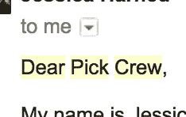
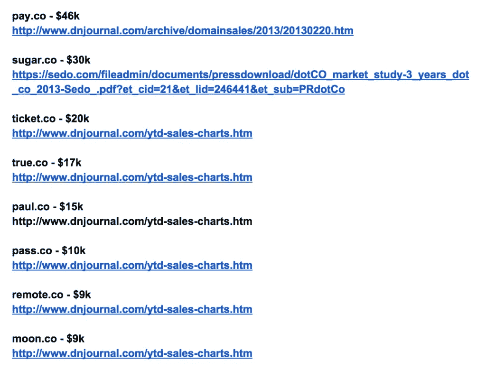
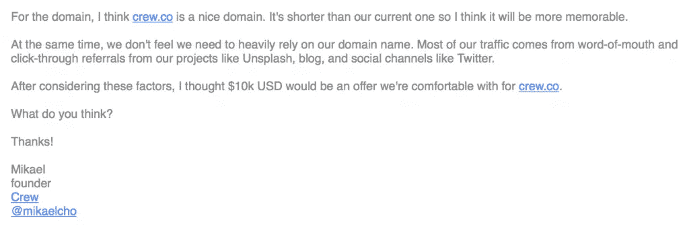
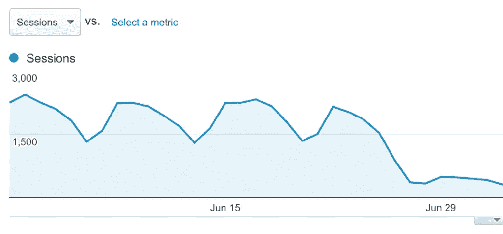
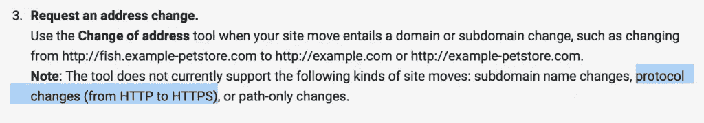
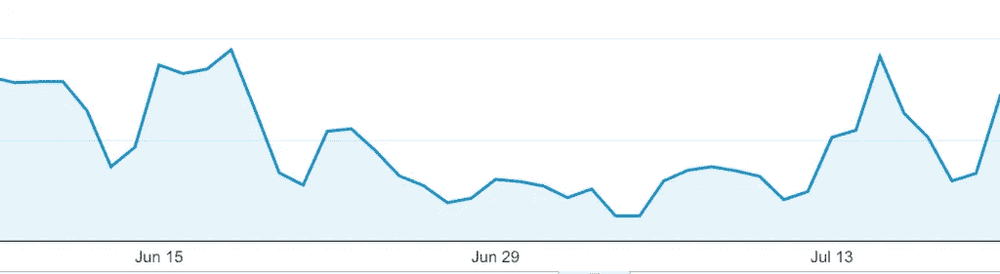

# 我们为一个域名支付了 1 万美元，而我们得到的只是更少的流量

> 原文：<https://medium.com/swlh/we-paid-10k-for-a-domain-and-all-we-got-was-less-traffic-536554ca50d8>

By [**Angus Woodman**](https://twitter.com/angusw)| Originally appeared on the CREW blog. [**Subscribe here**](http://eepurl.com/bHw9kT) to read our posts as soon as they’re published.

一年半前，[我们把公司](http://backstage.crew.co/story/)从 ooomf 改名为 Crew。

这不仅仅是为了找到一个人们可以*实际上*拼写的名字，而是为了找到一个与我们作为一个公司所做的事情相关的名字。

随着名称的改变，我们当然想要 crew.com 域名，但不幸的是，它属于一家[受欢迎的服装零售商](http://gap.com/)，所以我们不得不选择另一个域名。

最后，我们得出了以下结论:

> *"pickcrew.com"*

很好。很直接。它给我们带来了一个网络公司。虽然对我来说，它听起来太像“维修站工作人员”(可能是因为我看了很多赛车)，但它为我们服务得很好。

然后一位可爱的绅士联系我们，说他拥有一个更短的域名，他是一个粉丝，我们可以以合理的价格购买。那个新领域:

> *"crew.co"*

我们以前没有考虑过 a .co，但是你知道他们怎么说:当机会来敲门的时候，可能是时候更换你的火花塞了。

# 为什么我们想改变域名

除了拥有一个更干净、更简单的域名(实际上使用我们公司名称的域名)，我们对收到这样的电子邮件有点厌倦了:

我想，这是一封冷漠邮件中的一个简单错误。但我们也亲耳听到了。来自与我们公司关系密切的人。

> “Pick Crew 进展如何？”
> 
> “嗯……”

当我们把“ooomf”放在后视图中时，我们认为我们已经摆脱了所有的名称混淆。显然不是。

有了 Crew.co，就不会弄错公司名称。虽然我们不太依赖我们的域名来吸引流量，但有一些我们不必经常拼写出来的简短而甜蜜的东西是很好的。

# 我们如何确定它值 1 万美元

我们想给我们闪亮的新域名一个公平的价格，并从研究最近类似的销售开始。

基于这些数字，我们决定出价 1 万美元。我们事先同意这是一个公平的价格，任何还价都会被拒绝。

以下是我们发送的实际电子邮件:

它被接受了。甜蜜，一个新的领域。

现在让我们花点时间看看我的新邮箱:[angus@crew.co](mailto:angus@crew.co?subject=I%20like%20antelopes%20and%20getting%20caught%20in%20the%20rain)

啊哈，这太令人宽慰了。(你自己去试试吧，我甚至可能会回应！)

# 现在最难的部分是:迁移一个域的细节

如果你曾经迁移过一个有任何流量的域，你就会明白这有多棘手。

从 ooomf 到 Crew 的转变是一个大转变，因为我们改变了我们的名字和域名。为了实现这个目标，我们在一个周六的晚上聚集在办公室，在一块又一块的白板上写满了所有写有我们旧名字的东西，然后开始把它们一一划掉。工作量很大，但我们完成了，吃了蛋糕，然后回家了。

所以只交换域名…能有多难？

# 5 美元加起来——我们的第一个错误

我们使用谷歌应用程序来处理我们的电子邮件和云文档(就像你可能做的那样)。每人每月 5 美元。现在有了新的域名，我们必须为每个人创建新的 Google Apps 账户。但是当然，我们仍然需要旧的电子邮件、日历历史、登录和其他我们只有在删除旧邮件后才记得的东西。

所以现在我们有了 20 个人的额外电子邮件地址。对于我们不使用的电子邮件地址，5 x 20 美元/月= 1200 美元/年！

我们可以用旧账户的别名来创建新账户(这样可以节省我们 1200 美元),但是在上次尝试时发生了一些奇怪的事情之后，我们对此非常谨慎。

因此，现在我们需要翻转我们的帐户，使旧的电子邮件地址成为新的别名。迁移一切都需要时间，而我，作为试验品，丢失了我的旧日历历史。现在我永远不知道我在 2014 年 10 月 24 日会见了谁。该死的。

**教训:**提前多做一点研究，看看整个谷歌应用程序二级域名是如何运作的，它会对你的设置产生多大的影响。

# 301s:在你改变方向之前，仔细检查你自己

正如每个真正生活过的人会告诉你的:当你移动一个网站时，使用 301 重定向。(见鬼，我想我第一次 301 是在失贞之前)。

不过，如果你不像我一样，没有在十几岁的周五晚上阅读 html 状态代码，让我解释一下:当你在浏览器中键入一个地址时，浏览器可以从服务器获得一堆不同的状态。

200 的意思是，“嘿，兄弟，感谢光临，这是你要的那一页。”

301 的意思是，“呃，对不起，兄弟，那一页被打包永久转移了。”

302 的意思是，“呃，抱歉兄弟，今晚那个页面会在某个小妞家崩溃。”

(旁注:是的，web 服务器确实像你的大学室友一样说话。)

301 和 302 状态兄弟都知道转发地址，所以你仍然可以得到你想要的网页。然而，有一个*非常*重要的区别:

一个网站的谷歌搜索街信誉(又名链接果汁)将通过 301 结转，但它*不会*通过 302 跟进。

所以当把一个网站转移到一个新的地址，你必须使用 301 重定向。当我们把 pickcrew.com 送到 crew.co 时，我们做到了。

然而，你可能没有意识到(不幸的是，我们忽略了)的是，一个 302 可以潜入你正确的，干净的 301 重定向的中间，破坏你美味的谷歌街信誉。

在我们的具体案例中，当我们从 pickcrew.com 切换到 crew.co 时，我们也决定抓住机会从 http 切换到 https。这些差点毁了我们的生活。

当我们的有机搜索流量遭受重创时，我们首次注意到了这一点:

仔细看，我们检查了我们的重定向，发现了这个:

> ”(我们会在这里放一张发生的事情的截图，但我有点吓坏了，记不起拍一张了。这是一连串的两个重定向，一个 301，然后一个 302。)"

进一步查看谷歌关于地址变更请求的文档，我们发现:

我们不确定(现在也不确定)这两个问题中的哪一个导致了交通问题。

两个*似乎*都不适用于我们，因为 301 重定向是 http - > https，而不是 http - > http(通过 302 转到 https)。

我们没有浪费时间去寻找那些我们不确定自己是否了解的东西，而是匆忙切换回 *http://* ，确保这是一个纯粹的、原始的 301。

交通(慢慢)恢复了。

经验:在你转换域名之前，一定要仔细阅读谷歌关于转换域名的文档，并清楚地了解你所做的事情的潜在后果。

虽然我们在迁移过程中犯了一个鲁莽的错误，但这对我们公司不会有太大的长期损害。拥有一个清晰简单的域名的好处远远超过了一个月流量缓慢的负面影响。

如果有什么不同的话，这无疑是一个警示:让交通多样化！

一个网页的变化可以坦克一个单一的交通来源。这可能是一个坏的重定向，也可能是你的#1 推荐源突然关闭。

如果你希望你的生意持续下去，你应该准备好经受这些事情。一个强大的网络企业不应该依赖于他们无法控制的少数因素。

# 得到了[一个想法](https://crew.co/?utm_source=Medium&utm_medium=CTA&utm_campaign=MediumCTAs)？

## 与最好的设计师和开发人员一起工作。超过 1000 万人使用了剧组生产的[产品。超过 300 万人阅读了我们的博客。在这里加入他们](http://crew.co/?utm_source=Medium&utm_medium=CTA&utm_campaign=MediumCTAs)。

