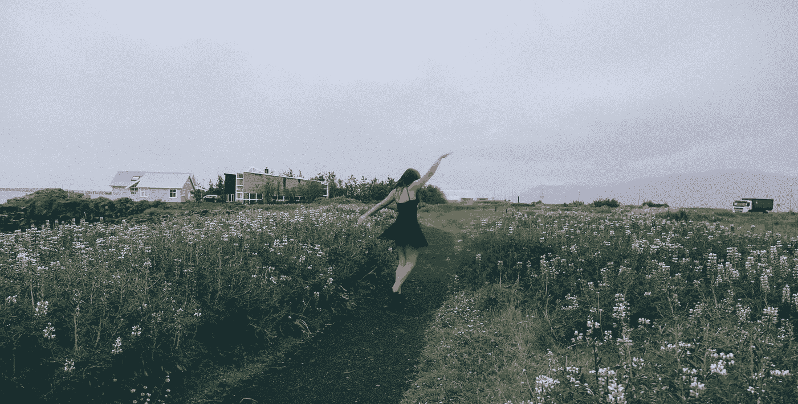

# 我们都应该像他妈的一样怪异

> 原文：<https://medium.com/swlh/we-should-all-be-weird-as-fuck-c751cf31d765>

When your friends want to do a photoshoot of you in a dress in the freezing rain in Iceland, roll with it. Credit: Christi Reid.

## 因为在人生的某个阶段，人类变得很奇怪，这是胡说。

“你真奇怪，”他们笑着对我说。他们是谁并不重要——他们是一大堆朋友、熟人、老师、店员、成为朋友的陌生人——在我生命中曾经和我说过话的人中有 80%的人。“你知道你喜欢它，”我会微笑着回答。

但是为什么呢？在过去的一年里，我花了很多时间在精神和身体上旅行，试图找到自己。我如何以一种让人们开心的方式与他们相处？我如何以一种让我快乐的方式与人交往？是什么导致了我生活中的摩擦？什么导致加速？我搬到了纽约(然后又回来了)，我游历了欧洲(15 个城市，10 个国家)，最近我把自己扔进了沙漠，烧掉了一个人(对不起兄弟)。我仍然没有一个清晰的图片，但我开始收集拼图块，我想我应该把它们扔到互联网上，这样你们就可以帮助我把它们放在一起。

# 因为你笑而变得奇怪

在所有的事情上——大多数人会理解为没有。让你的脸上洋溢着幸福，因为你对周围的一切都充满了期待。这些其他的人类是惊人的。这个星球很美。以前发生了这么多，以后还会发生这么多，对此感到兴奋真是太棒了。尤其是那只在人行道上滑稽地走在你前面的可爱的狗。或者当你的朋友什么都没想的时候，他的额头开始皱起来。或者他们奇怪的步伐，你可以在一英里外指出。拥抱它。让它充满你，从你体内爆发出来，无需辩解。如果其他人不明白，或者看起来很困惑，试着和他们分享一点，这样他们就会发现他们错过了什么。

# 奇怪是因为你在乎

## 关于我们应该不再关心的事情-比如生日。

熬夜到午夜，第一个给其他城市的朋友打电话。如果他们在附近，就出现在门口。因为你知道吗？这一天发生在 x 年前，这一事实对于他们现在是你生活的一部分这一事实非常关键，这太神奇了！搞炒作。很酷。“我们是成年人，我们不会把精力放在这些事情上”警察可能找不到你。如果他们来了，告诉他们我们要把他们赶下台。

## 关于你无能为力的事情。

你的朋友正在经历的重大会议/面试/生活事件/等待/疾病，你无法做任何事情去改变。坐在他们旁边。给他们发心形表情符号。当它发生的时候，为他们得到出汗的手掌。如果进展顺利，为他们庆祝一下。如果没有，让你的心为他们而碎吧。你的心和别人的生活纠缠在一起也没什么。如果我们都做得更多，绳子会变得更结实。疼痛会更分散。快乐会传播得更远。我们会在一起。

# 奇怪是因为你不在乎

关于错过音乐会的事。或者放弃你所有的东西。或者睡觉。请错过很多睡眠。熬夜，学习某人的故事。找出他们 8 岁时喜欢什么，现在喜欢什么，为什么会改变。找出他们在公路旅行时经常在车里唱的歌。找出他们害怕说的话。找出他们想说但没人愿意听的话。找到每一个角落和缝隙，利用它让自己变得如此充实，这样你就可以从中重新获得能量，而不是睡觉。

# 因为你寻求帮助而变得奇怪

今年夏天旅行时，我读了[我在写关于其他国家的人的感受的诗，如果你喜欢的话，他们就住在这里。](https://medium.com/u/585294ff071#weirdasfuck。</em> </a>
<p id=)

# [在这里跟随更多的思考。](/@reneepadgham)

*发表于* **创业、旅游癖和生活黑客**

-