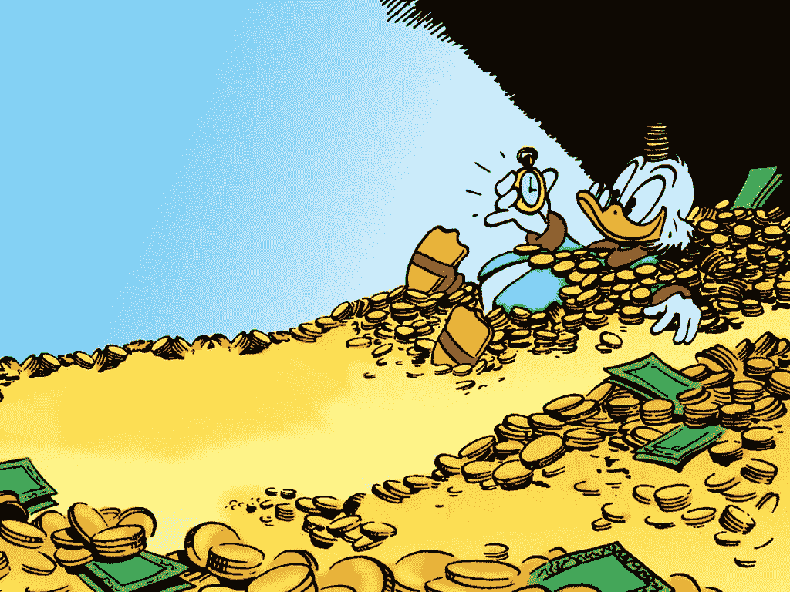

# 财富是关于你的资产，而不是你有多少现金

> 原文：<https://medium.com/swlh/wealth-is-about-your-assets-not-about-how-much-cash-you-have-24118892b61c>

Photo by [wenkui xiao](https://unsplash.com/photos/7BXRnUE4MGI?utm_source=unsplash&utm_medium=referral&utm_content=creditCopyText) on [Unsplash](https://unsplash.com/?utm_source=unsplash&utm_medium=referral&utm_content=creditCopyText)

> 心态稍变，人生大不同。

是的，现金很重要。尤其是从现金流的角度来看。你需要有更多的现金流入，而不是流出。这是毫无疑问的，也不需要争论。

但是现金流从何而来？

从资产。

一个作者可能写了 30 本书，每本书平均每月给他 500 美元。这些书中的每一本都是一笔财富。

**一个在线课程制作人可能制作了 5 门在线课程，每门课程平均每月为她带来 1500 美元的收入。这些在线课程都是一种资产。**

**一个咖啡店老板可能拥有 5 家不同的咖啡店，每家平均每月盈利 2000 美元。每一家咖啡店都是一笔财富。**

显然，一个人可以拥有多种类型的资产。

一个人可能写了几本书。创建了一些在线课程。并购买了几处房产。

所有这些人的共同点是:

他们收购了多项资产，每项资产每个月都会为他们产生现金流。他们不依赖于单一的资产，但他们的收入来源已经多元化。

# 你现在有多少钱(几乎)无关紧要。

Photo Credit: [WallpapersIn4k.net](https://wallpapersin4k.net/wallpaper/155006)

谁更富有？

一个人的银行账户上有 100，000 美元，月收入为 2，000 美元，但每个月要支付 10，000 美元的固定成本。

或者，一个人的银行账户上有 2000 美元，他的可靠资产每月带来 15000 美元，而他的固定成本每月约为 5000 美元？

第一个人会在一年多一点的时间里破产。

**第二个人可以永远这样活下去。**

所以，让我们思考一下这个问题。资产是你(以这样或那样的方式)获得的东西，它能定期带来现金流(有时可靠，有时不可靠)。

现在有钱的主要优势是什么？

好吧，如果你现在有钱，那么你可以用这笔钱来收购资产，这些资产将不断为你创造财富。

然而，如果你没有钱，那么你可以通过技能获得资产。只是稍微困难一点。这里，方法是投资你自己的时间，自己创造那些资产。

**您可以创建:**

*   一本电子书
*   在线课程
*   有声读物
*   软件应用程序
*   网站模板

创造什么样产品的选择是无限的。唯一重要的是，你正在创造一项资产(有或没有投资你自己的钱)，它正在为你创造经常性收入。

# 每个人都在谈论的“财务自由”是什么？

Photo by [Aditya Saxena](https://unsplash.com/photos/_mIXHvl_wzA?utm_source=unsplash&utm_medium=referral&utm_content=creditCopyText) on [Unsplash](https://unsplash.com/search/photos/freedom?utm_source=unsplash&utm_medium=referral&utm_content=creditCopyText)

财务自由本质上意味着你拥有的资产能为你产生足够多的现金流，足以支付你的开销。即使你不工作，你也能赚足够的钱来生活。

这是一个现实的目标吗？

嗯……是的。这当然是可以实现的。但是这真的很难做到，可能会花很多时间。

显然，这取决于许多因素。

如果你现在坐拥大量现金，那么你只需收购合适的资产，就大功告成了。如果你一点钱都没有，那么你将不得不拼命工作，甚至去创造你的第一笔资产。

我的第一个(也是目前唯一的)资产是我的[书](https://www.amazon.com/Struggling-Forward-Embrace-Struggle-Achieve-ebook/dp/B07DK6QSLN)。

我花了大约 8 个月的时间来创作。

上个月，我的书为我创造了惊人的 35 美元。假设这个数字将保持稳定，我将只需要创造 100 本书，直到我实现财务自由。

这相当于 80 年的工作量。

这是假设每本书都将永远畅销(这显然不会发生)。

# 我明白这些概念。那我的问题是什么？

嗯，问题是我很烂。我不擅长创造人们真正想买的产品。我不擅长销售。我不擅长创造能给我带来固定收入的资产。

这很正常。

学习需要时间。

仅仅因为你在理论上理解了资产的力量，并不意味着你实际上知道如何建立它们并使它们盈利。这并不意味着你会成为行刑的赢家。

另外，这需要时间。

**正如我之前跟你说过的，基本上有两种获取资产的方式:**

1.  你只需购买它们(要么用你自己的钱，要么用别人的钱)
2.  你从零开始建造它们

建造它们需要时间。如果你知道自己在做什么，那么花的时间就会少一些。如果你不知道自己在做什么，那么就需要更多的时间。这就是现实情况。

我积累的资产越多，我的现金流就越多。

我建立的资产越多，我就越有希望让它们盈利。

**另注:**

购买资产的人就是我们通常所说的投资者。

积累资产的人就是我们通常所说的企业家。

# 一些最后的话:

富有意味着你的资产为你产生了如此多的现金流，以至于你可以(根据你自己的期望)生活，而不必为此积极工作。

这意味着你可以休假，但却不必降低你的生活水平。

这也意味着，如果你生病了，不能工作，你不依赖政府的钱。

**同样，这现实可行吗？**

是的。

**容易实现吗？**

绝对没有。

大多数尝试过的人会成功吗？

不不不。

**值得努力吗？**

是的。

**这是不是意味着你应该马上辞职？**

大概不会。

人们必须认识到的是，试图建立一个有利可图的企业的学习曲线是巨大的。无论你进入哪个行业，你都不会轻易盈利。

让一家企业达到不再需要你的参与，并且该企业自动为你产生相对稳定的现金流的程度，那就更难了。

在开始创业之旅后，达到这一点可能需要很多年(如果不是一生的话)。

所以退一步，仔细想清楚。

**如果你觉得这篇文章有用，请👏并与你的朋友分享。记住，你最多可以鼓掌 50 次——这对我真的很重要。**

**您也可以通过** [**点击这里**](https://mailchi.mp/b0d1e1fba452/struggle-first-thrive-later) **订阅我的免费简讯。**

## 这个故事发表在 [The Startup](https://medium.com/swlh) 上，这是 Medium 最大的企业家出版物，拥有 348，974+人。

## 在这里订阅接收[我们的头条新闻](http://growthsupply.com/the-startup-newsletter/)。

