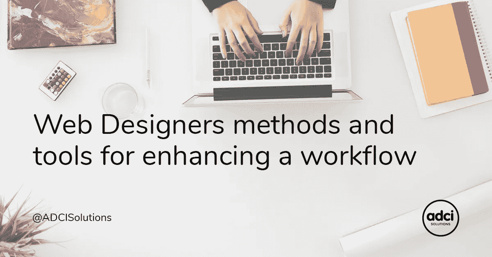
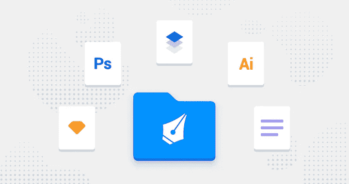
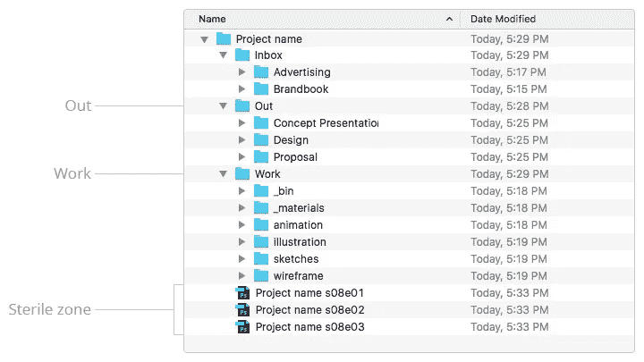
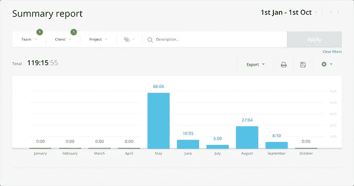
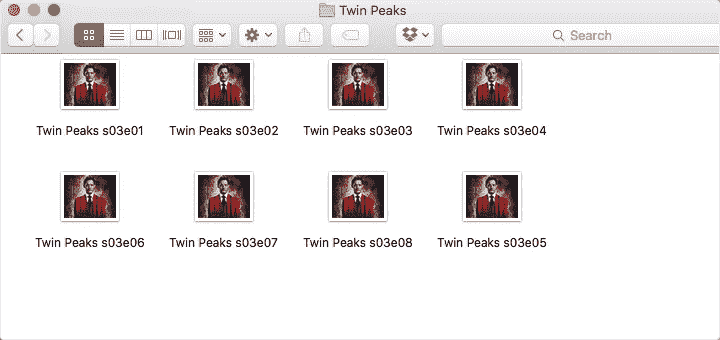
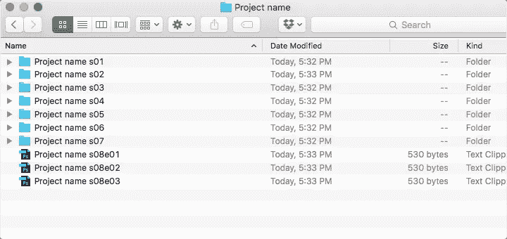
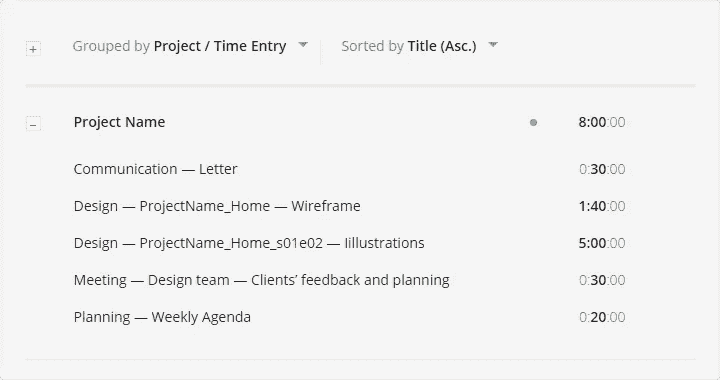

# 网站设计者增强工作流程的方法和工具

> 原文：<https://medium.com/swlh/web-designers-methods-and-tools-for-enhancing-a-workflow-d49f2f5521af>

[By ADCI Solutions](https://goo.gl/ixJqMV)

如果您:

*   与经理、开发人员和其他设计师一起在团队中工作；
*   保留一堆文件；
*   在工作中使用任何时间跟踪器；
*   对任务进行评估；
*   分析工作流程；
*   爱秩序；

这篇文章是给你的。我会告诉你我的文件组织系统和工作时间跟踪系统。

如果你爱乱，而且工作上还挺在行，那就不用这篇文章了！你一切都做得很好，我想读一读关于你工作经历的文章:-)。

**文件的组织**

关于组织和计划最酷的事情是你可以*自己创造一个工作系统。最重要的是创造一个规则，并永远遵守它。*

**为什么秩序很重要**

当你在做一个项目时，你和你的*文件应该准备好一切。*快速将文件发送给项目经理或客户；准备开发项目的所有文件；另一个设计者可能需要在另一个设计者的计算机上找到该文件。这个人不应该在这上面花太多时间。解决方法是始终将你的工作文件放在正确的地方。

**如何了解自己的系统工作正常**

从内存中，指定所需文件的路径。如果*一年后*你重复文件的路径，那么这个结构就构建正确了。

有两种类型的文件夹:私人文件夹和普通文件夹。“常规”文件夹包含供经理使用的文件。私人文件夹是设计师的工作空间。

在*收件箱*中，您可以存储在项目开始时或过程中从客户处收到的文件。

*Out* 是放置最新版本布局的地方。该文件夹中的文件应全部设置为发送到客户端。

*工作*是设计师的空间。草图、指南、规格、布局等。—设计人员使用的项目的所有公共文件都位于此空间中。在这里你可以做任何你想做的事情，当然，如果你是设计师的话(っ◕‿◕)っ)

如果你有自己理解的文件夹命名习惯，就不要放弃。例如，如果您有一个存放草图的文件夹，并且您习惯于给它起一个名字，比如“test”或“try”，那么您可以随意这样命名您的文件。换句话说，它可以是具有非典型名称的流行和典型文件夹。

需要特别注意的文件夹可以用颜色标记。例如，它可以是用红色标记的文件夹编辑。

无菌区是你不断用更新文件填充的文件夹。旧版本应添加到 *Bin* 文件夹中。当然，你可以保留几个版本的文件，只要给它们明确的名称:v1，v2，v3…

规则:文件夹*中的文件* 不应交付给客户端。

当项目完成后，你把它们归档。一年—一次存档。如果一个客户有多个项目，请创建一个族文件夹，并将所有项目保存在此处。

**典型错误**

1.  文件名看起来像这样: *project_final_01a_v05.ai* :这是一个不好的文件名示例，因为在表示该文件最新版本的 part final 之后，是关键字 *(_01a_v05)* 所在的位置。它们向我们显示该文件处于工作状态。
2.  文件包含非免费或不在公共域中的字体:如果您在文件中使用商业字体，请始终为开发者提供字体许可证。如果你有购买的问题，使用免费图书馆。在有用的链接中找到可以买到字体的服务
3.  软件的不同版本:如果您使用 Adobe 的程序，您应该确保所有的项目文件都是用相同的版本创建的。否则，您可能会为您的同事带来一些技术问题，包括与项目实体的进一步合作。
4.  图形是在一个很少使用的程序中创建的——在您的工作流程中使用现代图形编辑器和应用程序。您将确保您的图形可以导出为前端工作所需的图形格式。还有，如果设计部门的每个成员都使用相同的软件，你就永远不会遇到文件同步的麻烦。

**初学者规则**

*只有一个人*负责项目文件夹中的订单。这个人*控制整个工作组*并维持秩序。有必要为新设计师准备包含工作规则和工作原则的文件。该文件必须在项目开始时发布。如有必要，文档中的信息由首席设计师更新。

**组织时间**

在我们的设计团队中，我们总是跟踪时间并控制我们的工作流程。对你工作时间的分析将帮助你提升你的经验。你看到了自己的错误，这有助于你解决问题。当然，好的统计数据会激励你和你的同事。

我们使用 *Toggl* 来跟踪时间。该应用程序界面简单，适用于所有操作系统。

**好处:**

*   免费；
*   桌面 app
*   仪表板按时间段排列；
*   任务描述；
*   创建项目；
*   用几个项目创建客户；
*   供个人和团队使用。

下面是一段时间内的*汇总*报表:1 月 1 日—10 月 1 日在 Toggl 界面的样子。

该应用程序可以帮助您通过两次点击创建一个简单的报告。你会得到一个 PDF 文件，里面有你所有任务的详细描述，以及特定时间段的总时间。

当你需要对一个任务做一个*估算的时候，利用你以前的经验！你只需要在一个类似的已完成的项目中找到这个任务。真的很有帮助。当然，你应该注意任务的特殊方面，因为它们总是互不相同。*

**处理文件名的方法之一**

哦，看看这个夹着双峰新一季的文件夹就知道了！所有的剧集都有编号，封面也很漂亮。

我的艺术总监向我展示了一个我至今无法拒绝的文件管理原则。

**它是如何工作的**

当您给项目文件命名时，请使用剧集而不是版本。

示例:*项目名称 _ 文件名 _s01e01*

季节是项目的各个阶段。例如，你可以致力于产品的一个想法和概念。当你从客户那里得到关于你的设计的反馈时，你通常会完成其中的一个阶段并开始更新。之后，你可以用新的想法开始新的赛季。

剧集是设计的版本。此外，你创建更多的插曲:e02，e03…

最重要的是你应该*保存你所有的想法*，甚至是那些你在最终版本中不会用到的想法。这样你就不会错过任何东西，将来你也可以实施好的想法。

当项目结束时，你可以分析你的工作，看看你的项目经历了多少个季节。有时我们会做一到两季的快速项目，但有时我们会做一个 6 到 8 季的大项目。

当然，这只是一种组织方法，并不能显示你的工作技能，但我喜欢它，它有助于促进我的工作流程:-)

**工作文件&时间合计**

当你不仅在你自己的文件夹中，而且在你的时间跟踪器中保持秩序时，你可以合并你所有的工作空间。

**为什么有必要**

有时候你开始运行一个时间追踪器，给一个任务起一个这样的名字:设计。一整天你都可以做不同的迭代:搜索想法、处理插图、和团队开会、写一封信等等。但是你不能正确地分析你的工作时间。

**你需要什么**

您需要为您的工作迭代创建模板，并且总是在时间跟踪器中为任务给出正确的名称。

我有一个特殊的文档，我所有类型的迭代都在那里。

## 迭代类型:

*   调查
*   设计
*   设计评论
*   沟通
*   会议
*   规划
*   教育

迭代的描述应该非常详细，这样你才能真正理解你的意思。

**示例:**

1.  规划—每周/每日日程
2.  会议—设计团队—客户的反馈和规划
3.  设计-项目名称 _ 主页-线框
4.  设计— ProjectName_Home_s01e02 —插图
5.  通信—信件

在 Toggl 中，您的每日报告将如下所示:

如果你一直这样做，你将会拥有一项令人敬畏的技能。你可以分析你的工作:当你需要同事的帮助时，你做得更快。你可以*改善你的工作流程。*

希望我的经验和具体方法对你有用。在这篇文章中，您还发现了一些关于工作空间组织的有趣内容。

**有用链接**

**我们团队相关资料的文章**

1.  [产品开发流程](https://goo.gl/gZf6vH)
2.  [如何和前端设计套近乎](https://goo.gl/ou5QGn)
3.  [内部开发厨房](https://goo.gl/oQxsSX)
4.  [为什么是远程团队？](https://goo.gl/x5n5ZW)

**字体**

1.  [Myfonts.com](http://www.myfonts.com/)
2.  [fonts.google.com](https://fonts.google.com/)
3.  [fontsquirrel.com](https://www.fontsquirrel.com/)

*原发布于*[*ADCI 解决方案网站*](https://goo.gl/iv2sCB) *。*

**作者是 ADCI 解决方案公司的首席设计师塔蒂亚娜·舒尔吉娜**

塔蒂亚娜的春天是绘画、戏剧、文学、电影、摄影和音乐。她不断的自我教育给她带来了一种杰出的能力，那就是创建出色的 UI，并为 web 用户提供出色的用户体验。

**在社交网络上关注我们:** [Twitter](https://twitter.com/ADCISolutions) | [脸书](https://www.facebook.com/adcisolutions/) | [LinkedIn](https://www.linkedin.com/company/adci-solutions/)

 [## 十大响应 Drupal 电子商务主题

### 在过去的几年里，电子商务改变了人们在网上买卖的方式。互联网提供了一个快速和…

medium.com](/drupal-stories-an-insiders-view/top-10-responsive-drupal-e-commerce-themes-6a08938b13da) 

## 这篇文章发表在 [The Startup](https://medium.com/swlh) 上，这是 Medium 最大的创业刊物，有 331，853+人关注。

## 订阅接收[我们的头条](http://growthsupply.com/the-startup-newsletter/)。

