# 网络峰会 2018 >会外活动的完整列表

> 原文：<https://medium.com/swlh/web-summit-2018-the-complete-list-of-side-events-9a15e37fc463>

## 还有两天:这是会外活动的完整清单。

## 请鼓掌并分享，以帮助更多人在 [# 聚会*   11 月 3 日—11 月 5 日>全天*   埃里克森
    葡萄牙*   价格:€348–398 英镑*   主持人:网络峰会](https://medium.com/u/a1fdc10b6ff6# </strong>冲浪<strong class=)*   [**此处加入事件**](https://websummit.com/ss18tkts)

从 11 月 3 日至 5 日，我们将接管葡萄牙西海岸的海滩，为您的 2018 年网络峰会体验开启一个完美的开端。

加入我们为期两天的户外活动、聚会、亲密的网络活动，并特别关注我们如何帮助扭转海洋中塑料问题的趋势，所有这些都与创业公司、投资者和演讲者一起推动国际技术的变化。

**城市地图** [此处](https://citymapper.com/directions?endaddress=Ericeira%2C+2655+Ericeira%2C+Portugal&endcoord=38.966493%2C-9.417617&endname=Ericeira%2C+Portugal&set_region=pt-lisbon&startcoord=38.768623%2C-9.095414&startname=Web+Summit%3A+Altice+Arena)

# 美丽商业之家

*   **#** 会议 **#** 联网
*   11 月 3 日—11 月 8 日>全天
*   美术馆
    r . de so Bento 31
    1200–815 里斯本
    &
    科学院
    r . Academia das ciências 19
    1200–032 里斯本
*   价格:售罄
*   主持人:商业浪漫协会
*   [**此处加入事件**](https://www.eventbrite.com/e/house-of-beautiful-business-lisbon-november-3-8-2018-tickets-40050944453?aff=ebdssbdestsearch)

美丽商业之家是一个在机器时代使商业人性化的社区。这是一个独特的空间，在有趣和亲密的环境中为技术和人类创造积极的愿景。该会议每年在网络峰会之前和期间在里斯本举行。

了解更多关于房子的信息，并在 houseofbeautifulbusiness.com 申请邀请函

# 启动欧洲深度技术研讨会

*   **#** 欧盟委员会 **#** AI **#** 区块链 **#** 联网
*   11 月 5 日下午 6 点多— 8 点半
*   里斯本新大学校区
    坎波利德校区
    1099–085 里斯本
*   价格:免费
*   主持人:创业欧洲
*   [**此处加入事件**](https://www.eventbrite.co.uk/e/startup-europe-deep-tech-workshop-web-summit-tickets-49952630663?aff=ebdssbdestsearch)

欧盟委员会正在发起对人工智能和区块链组织的呼吁——我们希望初创公司利用可用的大量预算。

Startup Europe Deep Tech Workshop 将重点介绍目前公开的主要呼吁、初创企业如何参与、展示积极寻求将初创企业纳入其提案的组织，并使委员会更接近敏捷创新者。

创业公司有资格参加这些电话会议，如果:
-活跃在人工智能或区块链(检查电话细节)
-合法存在+2 年

**城市地图** [此处](https://citymapper.com/trip/signature?signature=eJx9U1tv2yAU%2FiuI14WOi8E4b1nVh0nTVCXZqqmaLGJoxGZDBribFOW%2FD%2BxmTaZpkmUbOP5u5%2FgIOxXgEhDMmnoBoB6DSta7vEUrwvOOcTovjlBpHUyM%2BR3equEwRqANKG%2B%2Bt9osMkLTICw5%2BGDjzqsFuPchjXvVwwzSeR%2F09C2TNzVjUixQc0MEJlSUc6cGU07XxiYfrAJagU%2FOPpsQrVaZ6KN%2FVoXwDD493QXJKaN8C6112vzKSDgve7MvlI9HqG1MynWFglN5bbMiVXHZncWJWjSTOIyZLNoGrydtP1X%2Fvazja6kUrJTihvOqKMhM5qCyopxUYUaU1fLrnxDhrHqT%2FKGdjWxNGKxT%2FT3B7eauJZd8KSgXbSpbwY%2FJtHZK8PEFZbvZcsFgQc%2FmQvon%2Fq2ykZJ2MyPHctD50ZViOut9TYZwga%2BjIRW7ziY3Tr40Dov%2FZ8NqPsfIpZDwVGQGs59x4SGhfpJ6Nmfdvg3mx2hiyjZLCaZPjNddhQzunlAltEK7usNIY0MM17xiksIL78e%2FZiz3hp6bk1t8OWQPZgc24zDYtASrPtnOgFUwTk0zlOxcRDGRiGCE%2BZbSJcb5eoNJvr9drdfvP9%2B1774UzGlC59%2Fl9Btv%2FvEq)

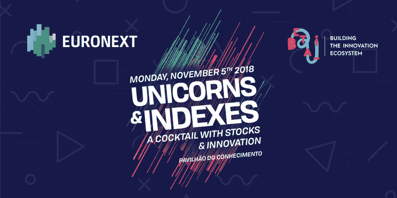

# 独角兽和指数:泛欧交易所和 Beta-i 的鸡尾酒会

*   **#** 联网
*   11 月 5 日晚 8 点至 11 点
*   里斯本 1990 年至 223 年
*   价格:免费
*   主持人:泛欧交易所和 Beta-i
*   [**在这里加入事件**](https://www.eventbrite.co.uk/e/unicorns-indexes-a-cocktail-with-euronext-and-beta-i-tickets-51040491484?aff=ebdssbdestsearch)

Unicors & Indexes 是由泛欧交易所和 Beta-i 主办的“欢迎来到 2018 年网络峰会”鸡尾酒会，于 11 月 5 日在 pavilho do Conhecimento 举行，20:00 开始。在那里见。

**城市地图** [这里](https://citymapper.com/trip/signature?signature=eJxlkM1OwzAQhF9l5StJcZz%2F3KpeQEIFqYgegIMbL61FYoPtlEPUd8dOqIpAsqy1ZufTjEciBsOd1Io0kCd1BASV8PNIuBAGrfUzeeDmc0AQ3MKavwyUYhnutxxtBHfS7jQn3tlqbcRkSKtFWbCyjOJ6Qes8T4ugK97jjDvK7jBxUg1Cw0qrA7ayR%2BU0xLCSk8ZVKzk8ySMnJ%2B%2FucB%2FYzyMR0jovBlZRVF7636G9pKh%2FQmRZyNBrMWX44t17eNvLZlWk57wZOb160eB%2BppIPF3ehp5o8jhs3%2FdGfxlXBzogsyX5X3uIONkPfS9fAsnOyRVgaVHMzJ%2BclRpMqTqg%2Fj4w1rGpSekWThtLr9f32dnMTgEc0ds7ETt8xfnwB)

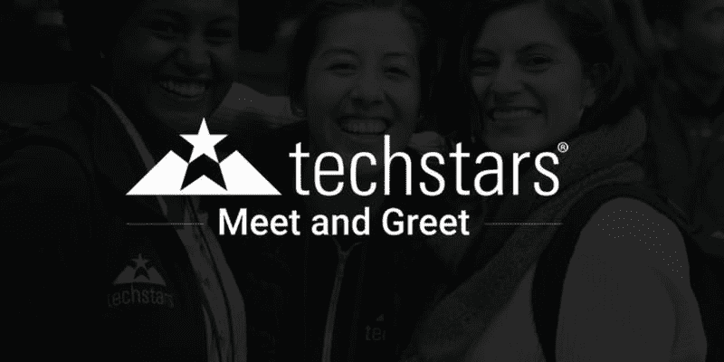

# 科技之星迎接里斯本

*   **#** 师友 **#** 筹款 **#** 人脉
*   11 月 5 日下午 1 点至 3 点
*   启动葡京
    鲁阿达普拉塔 80
    1100–415 葡京
*   价格:免费
*   主持人:科技之星
*   [**此处加入事件**](https://www.eventbrite.com/e/techstars-meet-and-greet-lisbon-web-summit-at-startup-lisboa-tickets-50340054458?aff=ebdssbdestsearch)

在网络峰会期间，来里斯本与 Techstars 董事总经理和项目工作人员会面，了解我们在世界各地的 45+导师制加速器项目的更多信息。在本次活动中，您将获得:

-分享你正在做的事情
-获得关于你想法的反馈
-联系你当地的企业家社区
-看看 Techstars 是否适合帮助你加速创业！

您还可以注册办公时间，与 Techstars 计划工作人员进行一对一的会谈，旨在帮助我们相互了解。在这 30 分钟的会议中，我们将讨论如何帮助你和你的创业。

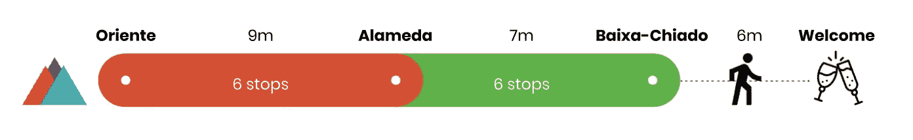

**城市地图** [这里](https://citymapper.com/trip/signature?signature=eJydVF1v0zAU%2FSuRX2laJ3acpG8FTQIJ2ETQ%2BjBNkRM7nSGxi%2BNApWr%2FHTsfUpZSJniz78e5957j6zMoqQZbL4AojlYeYJ2mRijpTCkk1sIls5czoIxp3rb2DL6sPUa9OxtJV14CV95H0RaKAhtdKqVZH4SSdQzTNEYrP10HiESh80vacOfNDNWmO06Zz9b1TedCMn6ybgsJan5wOA9nwERrqCxdHoLwZZOIOAMvp4okiVw9mCYEJq6gkLnNHqMB3KTQWRvF%2BjZ%2B0fq7u7czABKSASKKsPMZlfOTMC6g71ZmA15%2BqwWXhuc3CCNE3Aznka1F4K62UzM6L2w0la0FtSatOgsietYewCdutDqqWtiRVX%2B557rh9RMFj65Rx9vVVvpRjDrmpeqkC4snwwR%2FV1NTKd3kQ%2F40wn3Osr3LXvjHzp1%2FDx77CWdqLLRYSIHiMCKD%2BBgm5FKMYENeEWMJcZ3it1Sc6LsnQZn6f5ptzl84nqn4TxzPOMz%2BQPGs81GGC55RGCxePcYvqLZ7RuJpz3D%2Faiutmivvdl7xJkJRdClN%2BOqeBJAkY8kUutfvmNP8MAIcjV%2F3RSfqhTzkmv%2FoeGssUS4EF6yKK0b8soKRjxmCfkIraE8FCtIChiErwEyO8%2BJzcZuKxk3FAZ7%2FLnteeFnXNMJsvV1tRMm9neZy%2BGeMGIJCGCR%2BAP0w%2FBrEW5xscfQGBlsIN59v9x%2By9w7wJ9ftMFH4%2FBu%2Fe4sl)

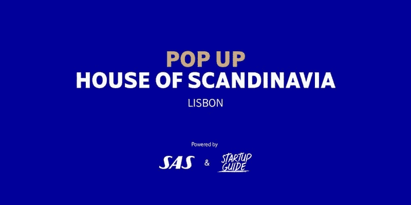

# 斯堪的纳维亚的弹出式房屋

*   **#** 联网
*   11 月 5 日上午 9 点至晚上 11 点
*   创业指南商店
    135 鲁阿多格里洛
    1950–144 葡京
*   价格:免费
*   主持人:创业指南世界
*   [**在这里加入事件**](https://www.eventbrite.com/e/pop-up-house-of-scandinavia-tickets-51543608320?aff=ebdssbdestsearch)

该活动将作为北欧创业社区在网络峰会上的正式聚会点，为企业家提供会面、交流和参与思想领袖项目的机会。

如果您是来参加将于 11 月 4 日至 8 日在里斯本举行的欧洲最大的科技盛会 Web Summit 的，请来品尝我们的 smrgsbord，与斯堪的纳维亚最聪明的科技头脑交流。

我们将在接下来的几周内宣布全天计划；把日期留到现在吧！

**城市地图** [这里](https://citymapper.com/trip/signature?signature=eJx9Uk1v2zAM%2FSuGrqs7fcWSfUuLYhuwrQcPyKEYDEViA22OnEnyNsDIf59kp4Wbw24i%2BUS%2B98gJaeVRUxBeY3ZTIDN6Fe3gUooKWaUMOJOCCSljPISQ3uizDfsESUU9DN7MOSZvBaaYsJuyviVCYiIzwKkj5HIblY%2FjqfgwWgNFGwcP6JzqP3xnnYG%2FCYNT2MMhd3uakLEhKqfzZ4brK2YyY0G%2FzK0kF3ksrqXkeepxMPPUP6r%2FmeOwglZsgW42PDOYLgIvohKzU7fttXKJsPqifNfuOrLuGb1ywcac8sMYobOzAU%2FoXnlvw90YBJXoe56aNV%2B1fkhJrYZHb8Glvw8dnfnlkh5Gl%2BGMzbRWBkhK3hogaP3GgGR8tfguavZ%2FAzCtNwuUcYrOmaeHw9IWnWLZv%2B42q7Pu0Hn4NUKISWeGSFoRxQmUtXmmJX%2BmpNwroUtNK4MVx8xQg1bip6sbSQugLxvghK9vZAf7oh2PRxubYttHq6HYenBqPpRoF1A6MVkSXFL6jdBmIxrM32HSYPz%2B6%2BPuU%2FsxN%2FwNPlwu5fwP8JfPYQ%3D%3D)

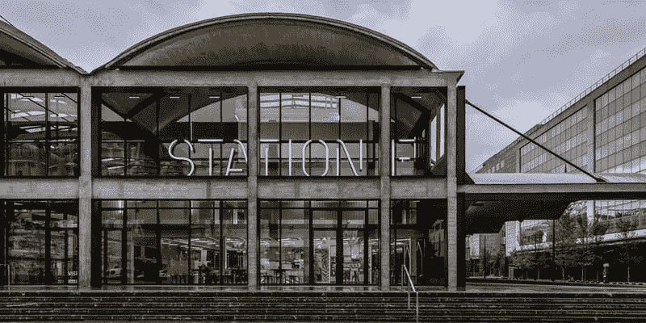

# 里斯本的 F 站创业公司

*   **#** 法国 **#** 联网
*   11 月 5 日晚 8 点至 10 点
*   天空酒吧
    Tivoli Avenida Liberdade 185
    1269–050 里斯本
*   价格:免费
*   主持人:f 站创业
*   [**此处加入事件**](https://www.eventbrite.fr/e/billets-meet-french-startups-at-web-summit-52040814477)

以由基于站 F 的创业公司组织的屋顶鸡尾酒开始你的网络峰会体验。会见创始人，探索法国科技领域的新动态！

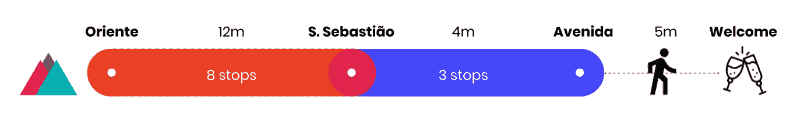

**城市地图** [这里](https://citymapper.com/trip/signature?signature=eJydVFtvmzAU%2FivIrwuNDcaBvGVSpE3q1klEzUNVIYOdzCvYmTFZt6z%2FvTYXCdJmkSbxwLmf8x1%2F5wQKqsHSQwiFi5kHWKOpEUpaVQCDxGq4ZFY4AcqY5nVt%2F8FGHFUpvFtR54p6f73VkUvBqGe%2FW5FzzSjjMw%2FF0az3ATZPoZRmbXgY3ywCGFuzn9wgvEAkcQ6SVtyZ06ff3kfb1IvV%2FdCZkIw%2Fuw6tWPK9y%2FBwAkzUhsrCBWCEp42HEXF9F0Mt0lWCSUyQKyRkZoN7ZwDnCXTaSrG2%2FC9aPjm5HsWTsEsQRdiZjMr4szDO3s4n0y5ddqcFl4Zn6xCHIXETnHr8zhxTqlKe09oIqsbFjaaytpmtSqvGZhItZA%2FgCzdaHSzqdmrVCvdcV7z8TsGja9ZQfbmfdhyjDlmhGunckkExpP9WUrNTusq6%2BGGO%2B4ylWxd9Zh%2B3b502GQKP7bCjtcDpUgic7CTEMW7XH%2BEgfLsUNCdXljJNcBnp%2Fm3%2BJ8irP035L4DP9zhBGV9BeYLiykK9ztA7YPcTdB5vcQ5Qcvb8IZ5AbamGOqaRpCXaTqvqwgMeaq0jHL%2FDleAqVwIIe1pHxBLAQaf5vg8%2FGL9syw3QC7nPNP%2FZ8NpYkJxLUiwWhMHE30Uk8jHLC5%2FCuPDDJMG7Ahc5jCMw2sfp7K5YrgYDWe1hGN%2BVLc%2B9tKkqYZbeqjSi4N5Kc0nbQ2NE5xRAFPsI%2BgHeILQMF0sEP0C0hHD%2B9W77Of3kEh65rvsT%2BfIKxy%2BT0g%3D%3D)

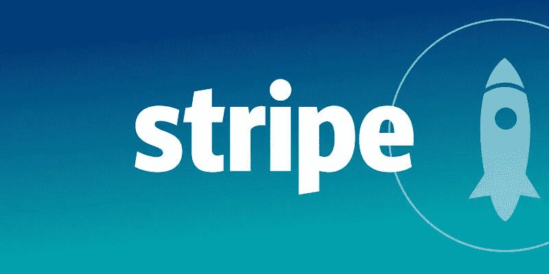

# 扩展雄心:欧洲创业的成功

*   **#** 风险投资 **#** 科技趋势 **#** 网络
*   11 月 5 日下午 6:30-8:30
*   第二个家
    里斯本 7 月 24 日大道 1200–479 号里贝拉市场
*   价格:免费
*   主持人:Stripe，Techstars & Tech.eu
*   [**此处加入事件**](https://stripe.events/scalingeuropeanstartups?em=537&guest-access-hash=MzE2Mzk0N3wxOTczMTAzNzN8MTU0MDM3NDgzODtkMzgzZjQ5MjJiZWVlMzhkZGFjYjNmMDdiMGZlN2IyNjU4Yjk1MWIwOWRiMjliM2I0MzI4MzI3NTcwZWE0NTc0)

参加由 Stripe、Techstars 和 Tech.eu 主办的活动和欢乐时光。您将了解欧洲创业生态系统的最新趋势以及更多信息:

-创始人视角和欧洲早期创业者面临的挑战

-欧洲风险资本的状况和新出现的融资趋势

-人工智能、机器学习和区块链等新兴早期技术趋势

-欧洲创业生态系统的关键资产

-欧洲创业生态系统的未来

**城市地图** [这里](https://citymapper.com/trip/signature?signature=eJydVN9vmzAQ%2FleQXxcSGxsweYu2Stu0rdOomoeqQg52Um9gZ8Z0laL877OBSJA2i7QXxN199%2Bs73x1AyQxYBgghQmcB4K1hVmrlVBFMMqcRijvhABjnRjSN%2Bwer53kQkYCL4HNbPelZQBzwi2w2mgHnUWpteAfEdJ7CJE2zWZjNEYlTgj1AsVp481dhSsZ1wFnwQ26ENAwcnfmnKaTi4sVBoBMrsfPBHg6Ay8YyVXpfgsi0WhwnvtjylDahsU8KM5ogn1OqwjkPYAAXGfTaWvOukj%2Bs%2BuXlZuSf4D5AHBNvsroQL9J6e9eqyvtwxa2RQllR3GCCceI7OAyknQFXleubs3Fea5hqXFCnMrp1QWRH3IOjxhq915V0DetOuBemFtUTA4%2B%2BTsvM5VK6TqzeF6VulYelJ8Up%2FPeK2a02ddH7n1q4L3i%2B9t5n9qFyb1%2BDx67D0SzgdBIJnAwCp1HSjR8TmL2eBFokVyYxDXCZ3vdMNh90rt0z%2FX%2BKnc8%2F%2BB1NcMIvvcLviL%2F8DXpHlTvI3WuGMT7jGONoQjJM%2Btfqdyz2GbZG1xfe6zjbTYzfWo%2Fo6nrAmNIhIYrB0XNmxG5w39uw6lKeSJdqVxjxuxWNdRR5CKUl22DOwy0hKCRlyULGEhxyihCnkPEo4mA0iMPZVXHrGZ32092C8VVZi02Qt3Ut7TJYVVaWIlgZofrbYmUPiiCiIYJhRO4QWpJ4CeE7iNx38e12%2FSn%2F6AM%2BC9MMp%2FD4FylUisQ%3D)

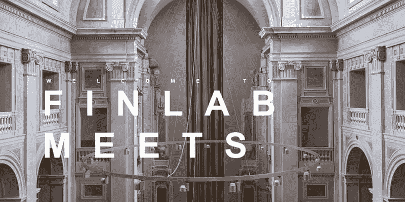

# FinLab 会议

*   **#** 金融科技 **#** 联网
*   11 月 5 日上午 10:30-下午 1:30
*   里斯本大街 1100–150 号
*   价格:免费
*   主持人:葡萄牙金融科技公司
*   [**此处加入事件**](https://www.eventbrite.pt/e/bilhetes-finlab-meets-51706945867?aff=ebdssbdestsearch)

金融科技社区在网络峰会期间聚会。
我们想邀请您参加 fin lab Meets——这是一场会外活动，主要参与者在这里会面，讨论金融科技领域。

葡萄牙 FinLab 是创新者(初创公司或现有机构)与葡萄牙监管机构之间的快速沟通渠道。监管与创新相遇是我们的座右铭，因此在网络峰会期间，我们决定在生态系统中扮演不同角色的金融科技演讲者之间举行有趣但不太可能的会议，这些演讲者来自初创公司、投资者、现任者、学术界、咨询公司和律师事务所、科技记者和监管机构。

**城市地图** [此处](https://citymapper.com/trip/signature?signature=eJydVFtv0zAU%2FiuRX1lWXxLH6VuBSSAxhlS0PkxT5MZua0js4jhQqdp%2Fx05TSNN1E7zZ5%2FKdc75z2YOSWzCNEEyz9CoCorXcKaODKEe5l0gt%2FGcPuBBWNo1%2Fg0%2BqWXoTryyNsaKTEXadQUZzehXn14gwxvJgoHktg%2Fq2bWQbCRO9V3ojlTXgyWu%2F2UJpIXfeAvpvJdcB62EPhGoc12VwJRCe5kVoEMjyGJWyNMSEOaOQhZhKF967twZwksMgrY3oMvnFq%2B%2Fh3wwAKKYHiDRNgs6ZQu6U%2B1vr%2FIBX3FkltZPFDUkIoaGGfU%2FQyHBW%2BcIFHwZ2luvGg3qRNa0HUR1zD%2BBWOmu2plK%2BZNN97qWtZbXh4DEk6ri9nEpXijPbojStDmbZUXCE%2F1JxtzK2Lg7%2BxxLuCzFfBO%2BRvs886Bfgsatw0I1RL0atIBlO%2BwFI%2FDCcNwNN6CvNGENcpvgtVzv%2BbqO4MP9Ps%2Fd5geNBF%2F%2BJ4wGH82coHmTet%2BGMZ5wmp0zjjJ5QDVnGSL9rOe6mdmVNfWFuhxFvUpKm563Br%2B4JgpRlh5A5DNMfmLNy3QNsXVz9OQyBeqXXhZU%2FWtk4T1S3i0vBRSKWMSs5jRN%2FdGK2wqsYI0Iyf4FoiQgYtGM%2FOjBhU0m%2FqQlKhgdmIZfRvK1r5abRrHKqlNHMSs27O%2BPUwQhDxGIEY5x8RWiKyZTQNxBNIZx8vlt8nH8IgD%2BlbXrKn34DjGCHIg%3D%3D)

# 数字游牧弹出窗口

*   **#** 联网
*   11 月 5 日—11 月 7 日> 11 月 5 日中午 12 点至 11 月 7 日下午 6 点
*   位置待定
*   价格:免费
*   主持人:Nomadx
*   [**在这里加入事件**](https://www.meetup.com/pt-BR/HELLYESPORTUGAL/events/254590783/)

数字游牧者葡萄牙将于 9 月 5 日(周一)至 9 月 7 日(周三)举办由 NOMADX 赞助的数字游牧者弹出窗口 HQ @ Web 峰会。

这是一个具有全球氛围的酷空间，供数字游牧者闲逛、建立关系网、完成一些工作，以及远离与你的部落的网络峰会的疯狂。这是一个混合、交往和认识其他数字游牧者并了解更多生活方式的好地方。

# 创业创始人派对

*   **#** 聚会
*   11 月 5 日晚上 10 点以上—上午 12 点
*   屋顶酒吧 Mundial
    莫尼斯 praa Martim，2-里斯本 1100–341 Mundial 酒店
*   价格:免费
*   主持人:创业公司创始人
*   [**此处加入事件**](https://www.facebook.com/events/244088689602359/)

让我们在俯瞰里斯本的屋顶酒吧用美酒和社交点燃网络峰会吧！去喝一杯吧(我们请客！)并在会议第一天的非正式聚会上与波兰和国际初创公司的创始人会面。

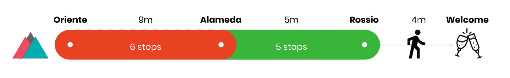

城市地图 [**此处**](https://citymapper.com/trip/signature?signature=eJydVFFvmzAQ%2FivIrwuNjcGYvOWhUiet69RUzUNVIQeb1B3YmTFbpSj%2FfTYQiZBmkfbG3X333d13nPegYAYsAgQxprMA8NYwK7XyLgpT5xGKO2MPGOdGNI37Bnfaiiq4bxWXrJoF32Sz0Qw4bKG14R0E05sUxSSlszC7QTiNSOYBitXChx%2B1Lp%2F0LjhhAgeHeDe5VFx8OBR0ZiW2nu9lD7hsLFOFT8cQnraKiXeI4liZ0MTXhRklkPq6UuUue0ADOM%2Bg99aad938YdVPbzcjAhKRniJJYh%2BzOhcf0npAN69a9Xz5g5FCWZHf4hhj4mfYD5pNgMvKDc%2FZuLA1TDWO1LmMbh2J7NR7AffCGr3TlXQj6854FqYW1RsDr75Ry8zlVrpRrN7lhW6Vh6VHx5H%2BR8VsqU2d9%2FnHEZ5zvlr77El86NzH1%2BC1m3C0jckuJqtwq09I%2FxPEkJLzZaA5ubKMKcVliR9100j9%2Fwq7nH%2FIO1rgibzkirwj%2BVafqNs33UfPxEUkOZU3wqf6uiMj2XBkcZZ4%2FtLo%2BsLPOtS6TTBNzlcRXb0LFEOc9NVoDFNw8HIZsR0IdjasunpHvaXa5kb8akVjnTrd7ZVFwSmOQlhCGMYpzUIaYRwmmwinPCoSXsZgtIP95FHxl4mHy4xRPH5U1mITrNq6lnYRLCsrCxEsjVCse1es7EERRDREMMTwCeEFJosIfYFwAeH8%2B8P66%2BrOE%2F4WphnUPvwFuq%2BIGw%3D%3D)

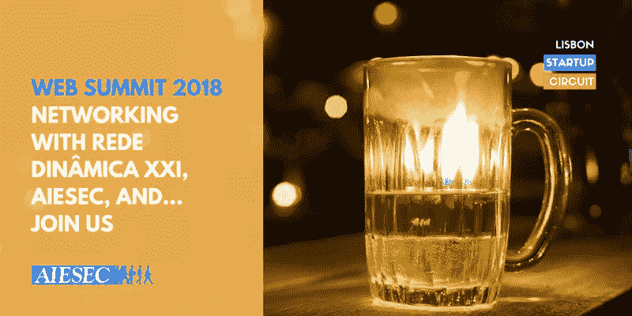

# 2018 年网络峰会-与 AIESEC 建立联系

*   **#** Aiesec **#** 联网
*   11 月 5 日—11 月 9 日晚上 9 点多
*   里斯本市街 1200–480 号
*   价格:免费
*   主持人:Rede Dinâ mica XXI
*   [**在这里加入事件**](https://www.eventbrite.pt/e/web-summit-2018-networking-with-rede-dinamica-xxi-aiesec-and-join-us-tickets-48237840680?aff=ebdssbdestsearch)

这是致力于放松与其他创业公司和投资者接触的时刻，同时享受里斯本美食的“帝国”和其他伟大的香料。每天晚上我们都会一起享受美好的时光！

我们将在每晚 9 点左右在梅尔卡多·达·里贝拉见面……除非我们有活动——请联系 mafalda_ferreira96@hotmail.com 玛法达——获取我们活动的最新列表！

如果你是一个爱好者…来了，我们会等你！

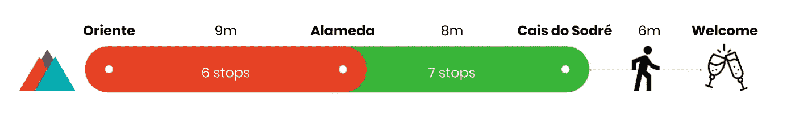

**城市地图** [这里](https://citymapper.com/directions?endaddress=Av.+24+de+Julho%2C+49%2C+Lisboa&endcoord=38.706779%2C-9.145743&endname=Mercado+da+Ribeira&startcoord=38.768623%2C-9.095414&startname=Web+Summit%3A+Altice+Arena)

# 你喜欢吃早餐吗

*   **#** 女人 **#** 早餐 **#** 网络
*   11 月 5 日上午 10 点至下午 12 点
*   瓦斯科·达·伽马中心
    40 号唐若昂大道 II
    1990–094 里斯本
*   价格:免费
*   主持人:做你喜欢的工作
*   [**此处加入事件**](https://www.eventbrite.de/e/do-work-you-love-breakfast-lisbon-during-websummit-tickets-52082983606?aff=ebdssbdestsearch)

你喜欢吃什么工作早餐？
社交活动，旨在结识志同道合的人，交流想法、经验和业务联系，以及寻找工作/联合创始人/客户。

CityMapper [**此处**](https://citymapper.com/trip/signature?signature=eJxlUM1PwyAU%2F1deuLpWKP1gvS0z0Rqjhxl3UA%2BskIXYggE6D03%2Fd6F1cdGEwyPv9%2FlGJAbLvTIa1UAoWwGSWoR5RFwIK50LM9qcUrhJ4d68DRhLaqBpVvDggaS4SHEWZuUOhqPAbo2xYiZRllZlVTK6StYpXpc5rSJA817G9VZqbw1sTS9tq3gHL9y1BgSHW95zNAVoJ49R6XVEQjnPdRuJhJGw%2Bp%2B6vfQ8W%2BbRsTdidvzi3Uf8u18oK3%2FSFUWOpvewtPK4yKJPn3Sxlp45nls%2Fn%2BVPQVZmZ4mc5JcF9%2FIAu6Hvla9h03nVSthYqZdqXi2gDBOWEJJg8pzRmuLwrjCuMb5%2BfNo3u7soeJLWLZmy6RsK6HTY)

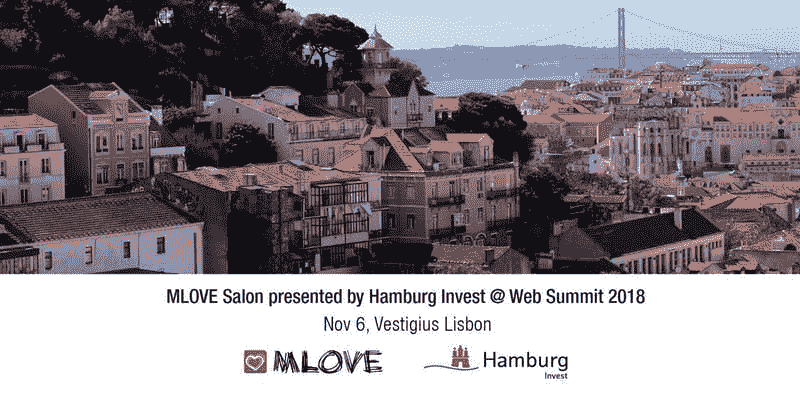

# MLOVE 沙龙

*   **#** 联网
*   11 月 6 日晚 7 点至 12 点
*   葡京 1200 号
*   价格:免费
*   主持人:我爱
*   [**在这里加入事件**](https://www.eventbrite.de/e/mlove-salon-presented-by-hamburg-invest-web-summit-tickets-50078248389?aff=ebdssbdestsearch)

呼吁所有的企业家、创新者和新朋友，在指数技术的影响下，热情创造一个美好的未来。

与汉堡投资公司(Hamburg Invest)的初创公司 MLOVE 一起参加一个壮观的网络之夜，它是柏林的合作伙伴，也是汉堡及其初创公司关于移动性、新技术的专题讲座，并在里斯本粉红街旁边非常迷人的位置残留处结识创新生态系统的新朋友。

**城市地图** [这里](https://citymapper.com/trip/signature?signature=eJydVF1v2jAU%2FSuRX0fa69gODm9oq7RJ21qJCh66KjKxYd6SmDnOVgnx32snMAUoQ9qbfT%2FOPfdc%2B25RISyaRBhjmowiJFsrnDa1NyWYgreoWvrLFgkprWoaf0Y4AYj4KHovdBNJE82MtN9aAJWNos73WTdLI0bRg7GuXYsSeZzCGCu7dMJvxsBwko3i7AZTysZZCKhFpYJ7rhqn17pt3i7QYdcD7J3P%2FWFzXUv14vMD51KtQ6WnLZK6caIuAjABOG6QpF1%2FxYFTyllgBBlPgQdGus599j4awW0GwVoZ2fH8I8qf4d4MANIk7SEYo8HnTK5etAsBPe9Zj5ffW61qp%2FI7QglJQw%2FbvdIngdPSyyLFsLCzom48qDdZ03oQ3en6hL4oZ83GlNq3bLrLXNlKld8Feg5EnbCXqXStOLPJC9PWIWx8MBzgH0rhVsZWeZ9%2FaGGey9kiZJ%2F498yDf4Geuw4H0ziZxckoyDhhnZKYUODp%2BTDwbXplGKcQlyUOr%2ByDCW9M%2Fb%2FMPucfGg%2BmeKQxv6LxQMPZGxIPmPuQx3OVfe%2FHOmP%2FxodCAwP%2B9x%2Bm41BjZU114dUO690xkuLzwSRXfwkwzvuKDNMM7YJsVq33%2BRsXl13Ng%2B66XudW%2FWr9VvAqhRCRJXxVMBmv%2BBLHNBUszlKxjBkUaswLklGgaDCL7cnuCd%2BU7L8pxXS4exZqGc3aqtJuEk1LpwsVTa2qRbdknO6DEsA8hiwm8JgkE5JMgL0DPAG4%2FXq%2F%2BDT7GAB%2FK9vs1%2BjuFUT%2BnH0%3D)

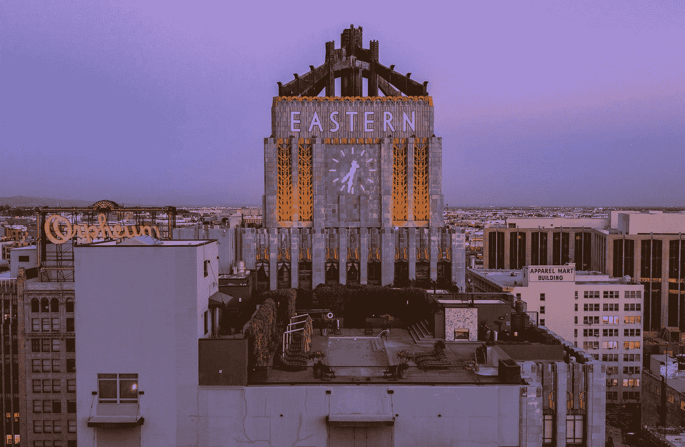

# 东西之夜

*   **#** 东欧 **#** 联网
*   11 月 6 日晚 7 点至 10 点
*   位置待定
*   价格:免费
*   主持人:未命名的冒险
*   [**此处加入事件**](https://www.eventbrite.com/e/east-west-night-tickets-51100429761?aff=ebdssbdestsearch)

什么是东欧风险投资社区？是什么支撑着东欧聪明的大脑？“东欧制造的技术”这个品牌到底是什么意思？

答案尽在《东西之夜》。

投资者、风险投资生态系统参与者(加速器、孵化器等)将对该活动特别感兴趣。)以及每一个对新兴 VC 市场情有独钟的人。

# 网络峰会贵宾晚宴

*   **#** 晚餐 **#** 区块链
*   11 月 6 日晚 7 点 30 分至 9 点
*   里斯本大街 1200–450 号
*   价格:74.71 英镑
*   主持人:Novum Insights x BlockTelegraph 新闻
*   [**在此加入事件**](https://www.eventbrite.com/e/web-summit-vip-dinner-novum-insights-x-blocktelegraph-news-tickets-51587888764?aff=ebdssbdestsearch)

在网络峰会期间与来自区块链研究公司 Novum Insights 和区块链和加密货币媒体渠道 BlockTelegraph 的顶级演讲者共进晚餐。

**城市地图** [这里](https://citymapper.com/trip/signature?signature=eJytVN9v0zAQ%2FlesvNJs5zhxnb5VYxJIwCZ1Wh%2FGFLmxWwxJXBwHJqr%2B79j5IWUppRKiL6nPd9%2FdfZ%2FvDkHOTbBA2P3YDAWiMdwqXTlThOncWWQl3OEQcCGMrGv3P7jR5Z4bq0pZWY2iGbrhqkZCo5UW5nMDIFO0NCX%2FJUu0nCEcAYRxAuiDqjeaz9C9NrbZ8SJw8LnWRrSohF3NISFAZ2F6heOYQOodKl7K%2F5r06EC%2FmkxVQr44YHDHQu58CU%2BHQKja8ir3GQnAa0II9QaZD8VSlvhSIWUUmC9VVZmL7r0DuE7BW0st2gZ%2B8uKbP9cjABrRDiJJYn9ndSZflPUObd3VqsPL7oxyfcvslsSEUN%2FDoVdm4rgsHF%2BCjxNbw6vagTqT0Y0DUS3hT8FHaY3e60K5lnV7eJSmlMUXHjz7Qq3j%2B2wpbStW77NcN5V3mw%2BGAf6%2B4HarTZl18UMLj5lYrX305L6v3N%2Bvg%2Be2w5EaEy0mUpB5lHTvhsTA6KkY%2BJpeEGMKcZ5i%2F%2FDeav%2Fs5L%2FT7GL%2BwvFIxVccswscjzhc%2FYHiUeXO5eGUZUzxZAm4cRwTDQmOhwGNWp63RpdnHu043W1CKD7VJbo4JJAw1iV0qdPg6FkzctfH721YtDkH2lW1y4z83sjaOpK8C0uEmDNKwg3fkjDmQoYp20QhAGzdNxVs2xPdSXGY7CQ%2FpaSf0hjH4520lhu0aspS2QVaFlbl0q0gWfF2x%2FhV1bYImIUYQpw%2BRNEiJgucvAG8ALj%2BdLd%2Bv3rnAX9IU%2FeEH38D4ZCsHw%3D%3D)

# 网络峰会女士工艺之夜——手提袋刺绣工作坊

*   **#** 刺绣 **#** 工艺包
*   11 月 6 日至 7 日，晚上 7 点至 9 点 30 分
*   游牧商品
    27–29 鲁阿多斯马斯特斯
    1200–263 里斯本
*   价格:31.89 英镑
*   主持人:祖库里俱乐部
*   [**此处加入事件**](https://www.eventbrite.com/e/web-summit-ladies-craft-night-tote-bag-embroidery-workshop-tickets-51503431149?aff=ebdssbdestsearch)

制作工艺品，喝葡萄酒，吃当地糕点，这听起来是不是在网络峰会上忙碌一天后放松的完美方式？我们也这么认为！

Zukuri Club 是一个位于里斯本的创意社区，由一名作家和一名插画师创建。尽管生活在数字时代，我们仍然相信用自己的双手制作东西。我们相信任何人都可以成为艺术家，并学会以创造性的方式表达自己

11 月 6 日晚上 7 点，在里斯本一个名为 nomad goods 的新场所，来加入我们吧。

在这个工作坊中，你将学习基本的刺绣针法，并用它们在手提袋上制作美丽的沙丁鱼。

**城市地图** [这里](https://citymapper.com/trip/signature?signature=eJydVF1vmzAU%2FSuI14XGH9jgvGVbtU1a26lMzUNVIYOd1BvgzJgtUtT%2FPpuQidBm1faG78e5957Dvfuw5CZcBBCmBM6CUHSGW6UbZ0IxS51FNsI99iEXwsi2dd%2FhbceD97oNrnhrjW5nAUoixGbBZ9UWLtUllVob0cfi9CIBDAMyi9gFJAgliQ9oeC29%2B1rXXAQftHbRT87%2BzeSqEXLnfMA9K7nxKPf7UKjW8qb0SRiA004x9QZZHuvRtK8GWEpB6qupJnfZQ3QI5gx4a61F38MvXn3373YEQBE9QBASe5%2FVudwp6wMOU2YHvPzGKNlYmV%2FiGGPqZ9gPlE0Cl5UbWfBxYWt40zpQZzK6cyCq5%2Bw%2BvJKO162ulBtZ9487aWpZPfLwwTdquTnfSj%2BK1du81F3jw5Kj4Qj%2FpeJ2rU2dH%2FKPI9zlIlv57Il%2F6Nz7V%2BFDP%2BFIjYkWEylwgkjPJMQxSOlzMeCcviLGFOI8xW%2B52vF3j4oL%2Ff80u5y%2FcDxS8Z84HnGYvUDxqPNBhmc8szQ5ZTol5IRqv2XsuGWU%2BCpro%2Bsz%2F%2B244iXB5AVp0Kt7AgEhqC8ZI5A4aTxzRm4GgK2Nqj8nwVOvmk1u5I9OttYR5UMoLlJcIBbxgrIo5hhErJAkItjNu%2BaokDwJR3LsJ6fFbyoeNjWG8fi0rGQRZF1dK7sIlpVVpQyWRja8vzNWHYIQgGkEQQTZV4gWhC4gfgPgAoD59c3qU%2FbRA%2F6Uph1O4tNvG9OMHA%3D%3D)

# 瑞士网络晚宴:2018 年里斯本网络峰会

*   #瑞士 **#** 晚宴 **#** 网络
*   11 月 6 日晚 7 点— 10 点
*   里斯本，塔沃拉塔 1250–096
*   价格:免费
*   主持人:Code Venture &瑞士葡萄牙工商会
*   [**此处加入事件**](https://www.eventbrite.com/e/swiss-networking-dinner-web-summit-2018-lisbon-tickets-51653551162?aff=ebdssbdestsearch)

这是瑞士企业家、初创公司和投资者来里斯本参加 2018 年网络峰会的官方聚会。

我们很高兴邀请您参加由瑞士-葡萄牙商会和 Code Venture 主办的与瑞士创业公司、全球风险投资家和开发团队交流的晚会。

下午 7:00 将开门迎客，晚会将首先由瑞士驻葡萄牙大使安德烈·雷格里先生阁下致开幕词。之后，在由我们的瑞士国际化合作伙伴瑞士环球企业赞助的鸡尾酒会上，我们将有充足的时间交流，品尝当地美食、啤酒和葡萄酒。

该活动为网络峰会期间出席的瑞士社区提供了一个平台，以相互了解，并支持瑞士企业家和初创公司与感兴趣的投资者、战略合作伙伴和其他瑞士当地公司建立联系。

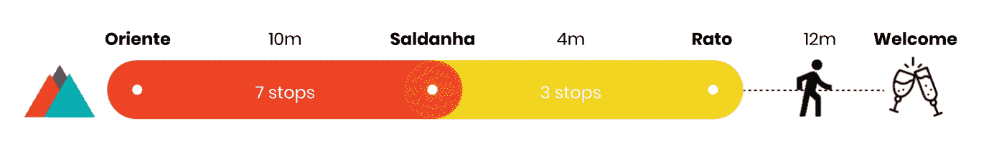

CityMapper [**此处**](https://citymapper.com/trip/signature?signature=eJydVE2P2jAQ%2FSuRryVgx3FIuKFqpVZqu6sFLYfVKjKxYd0mNnUcuhLiv3ccyCpAKVVv8Xy8efMmMztUcIsmASEJGQ8CJBrLnTIaTBFNErBILeCxQ1wIK%2BsavtHjMJipcsuDj9xueflqAsLwICARwyHOkuCLqpeGD4IHY12z5iUCmMIYK9psmg7HEWaUDMJsCGXxmPkAzSvp3XO%2BNSV3kP5PZXSvzB5gvttcaSHfAApiUSnXvujzDglVO64LXyMm8WmrlLWdFh29JGWeHM7ShHhuSueQfAxGeJRhb62MaBn%2F4uUP%2F657%2BQk9ADAWe5czuXxTzvsPrGcHuPzeKqmdzO9oTGniO9gdFT8LnPFScP3K%2B4Wd5boGVDBZ0wCKahV%2BRl%2Bls2ZjSgUdm%2FbxJG0lS0h%2F8UQdt9e5tK04s8kL02gflnaGDv4B5rMytsoP%2BV0PT7mYLXz2mb%2Bj7gMWOUEvbZe9eeDTaST4ZBiURWn7q8SMpZfTIKPkxjROAa5L%2FMid%2BU95pxW3svyruv0Bnsgb35D3Xb4p6PsHeT1t8M0vdR3Ts%2F88yaITaWEN4%2BMWEuqhV9ZUV%2F7Utswdi2N2OYPo5kZEGM6Lr8RYkqG918nK9TF948KyrdVJrfQ6t%2FJnI2sHqvgQORZLLJYy5GwswliKVcgzKkJJyFKyeJUWvEA98XdnBwc2MupWEta%2Ff3AWchnMmqpSbhJMS6cKGUyt1Lw9J04dgoB%2FGhIcRmwe4QmjE4I%2FYDLBePTtfvF59skDbqWtj6dz%2FxsDapk0)

# EO 葡萄牙晚餐

*   **#** 晚餐 **#** 网络
*   11 月 6 日晚上 8:30 以上
*   瓦尔夫德酒店的 Sítio 餐厅。里斯本 1250–142 号
*   价格:45 英镑
*   主持人:葡萄牙道德操守办公室
*   [**此处加入事件**](https://www.eventbrite.co.uk/e/eo-portugal-dinner-websummit-week-45-to-be-paid-at-the-venue-tickets-51748082909?aff=ebdssbdestsearch)

我们很高兴邀请您参加网络峰会周的另一场精彩的 EO 葡萄牙晚宴，您将能够与其他 EO 成员分享经验并建立联系。

在 Sítio 餐厅与我们见面，与我们共度美好时光，享受美妙的音乐和美味的食物。

城市地图 [**此处**](https://citymapper.com/trip/signature?signature=eJydlFFvmzAQx78K4nUhsY0xkDceIm3Stlaiah6qChnsZN7AzozJqkX97rMJSJA2i9Q3zr77393vOJ%2F8imp%2F7UEQk3Dh%2BazT1Agl7RGCUWxPuGTWOPmUMc3b1n77EEXAgxgtvOy49Bj1voqSa0YZ9yDBC2u2paIL715p0%2B1p7VuZSinN%2BugwWcYwjTFZBOkSYhyRxDlI2vAPib%2Fa4J%2B6EJLxFysArFnzvUv1dPKZaA2VlVPGEM8bDCPi%2BqvGokgSuZJAmhDoKhKysMGDsw9WKXCnjWJ9nX9o%2FcvZ7STeIuwFogi7K6MK%2FiKMu%2B%2BrlvlZrrjTgkvDi02Iw5C4Dk4D5wvHnKqcl7Q1gqppcqOpbK2yPdKqs0qiZ%2Fvkf%2BNGq4Oqhe1a9cYj1w2vf1D%2F2RVrqL5eT9%2BOUYeiUp10bul4MMrf19TslG6Kc%2FzYx2PB8q2Lvriflm%2BdHgroP%2FfNTsYC5kMhYDaTECe4%2F08ijMK3Q4ErcmMoc4HrpLMjl4LRD0LO%2Fnb1%2FwBfznFGGd%2BgPKOYWdSbAr4De%2Bjg7PGWMwLJxX7Hc9R2J%2BGwkqRHvdOqufIDj7k2EU7e2RV0c1cQANE5WUTsAjh0mu%2BH8IMJ6j7diF7IfaH57463xkJyLoxFSVzRXYApDwPMUxKU4S4NII3jsIx3CQ6pP5nH6eIBsruKxmW1D8P0Adry0su7phFm7WW1ERX3Ms0l7R8aI85OCMAkgCBA5AGhNQZrhD4BuAZg9f1u%2ByX%2F7ASPXLcD6td%2Fpg2dqw%3D%3D)

# 扩展到独角兽地位

*   **#** 产品 **#** 成长 **#** 联网
*   11 月 6 日晚 6 点 30 分至 9 点 30 分
*   里斯本城外
    109 圣保罗鲁阿
    1200–066 里斯本
*   价格:免费
*   主持人:数字海洋
*   [**在这里加入事件**](https://www.eventbrite.com/e/web-summit-edition-digitalocean-vp-of-product-on-scaling-to-200mm-tickets-51364656069?aff=ebdssbdestsearch)

加入产品副总裁 Shiven Ramji 的行列，他将探索扩大早期创业公司规模的关键原则，以及帮助您的创业公司起步和运营的一些策略。在本专题讲座中，您将了解我们如何在没有销售团队的情况下，在 SaaS 建立了一家 2 亿美元的企业。

要点:
–构建和扩展内容引擎
–为产品构建者构建产品
–为你的产品定价和包装

CityMapper [**此处**](https://citymapper.com/trip/signature?signature=eJydVNtum0AQ%2FRXEa028Ny72m1tFaqW2jkoVPyQRWtixsy2w7rK0lqz8e3YBV4TEido3di5nZs5h5ugXXPtLD2NCk5nni1ZzI1VtTYRFobVALezj6HMhNDSN%2FfYxxt63lnsCvPS2RQio8q54W6qZ91k2uc22eYVSWnThNLmIUcIwngWLC8xizLALqHkFzr1uTSMNnFIfrOuHzmQt4GDdyD5L2Dmgm6MvZGN4Xbg8itDTfmnkDFCcSkZJ6AqiRRKhxBWUdWazh2gfzRfIWSslujb%2B8PKnezcjgIhEPUQYMuczKoODNC6g7zbt8bK1llAbyC4pozRyMxwH4iaBq9JOLfi4sNG8tgQ4k1atBZEdbTf%2BFzBa7VUp7ciqe1yDrqC85%2F6da9Rwfb6VbhSj9lmh2tqFxSfDCf6q5GardJX1%2BacRrjORblz2xD907vwb%2F66bcKTGRIuJFDQmYcckpgwl0XMx8Dx6Q4wpxHmK33N54B%2FuJRfq%2F2m2Oa9wPFLxnzgecZi%2BQPGo80GGZzyHi3jKNHlCtV00thgWDbHYVdlqVZ35b8cVL0MaviANeXNPMApD0pckKLbSOOY07AaAvQnKv1fBUS%2FrXabhVwuNsUS5EJ5z4AKRAHLYBiwHFOTAeIBpUkQstC6%2B9UdyHCfXxW0qHTaVYTa%2BLhvIvbStKmmW3qo0sgBvpaHm3Z0xsg8iCCcBRgGJvhOyZPGSsXcILxGaf11vPqUfHeBv0M1wGB8eAcZOj5Y%3D)

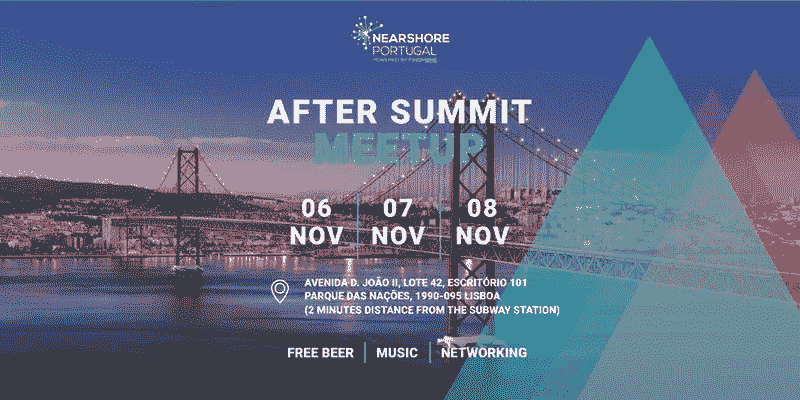

# 首脑会议后

*   **#** 联网
*   11 月 6 日下午 5 点 30 分至 8 点
*   近岸葡萄牙
    1990 年至 095 年里斯本第 101 区第 42 区第二大道
*   价格:免费
*   主持人:近岸葡萄牙
*   [**此处加入事件**](https://www.eventbrite.pt/e/bilhetes-after-summit-meetup-51770706577?aff=ebdssbdestsearch)

如果您正在参加 2018 年网络峰会，并且您正在寻找一个地方来喝啤酒，同时结识有趣的新朋友，并在一天的会议后放松一下，请加入我们在近岸葡萄牙总部的活动。

CityMapper [**此处**](https://citymapper.com/trip/signature?signature=eJxlUFtLwzAU%2FiuHvNrWk%2FS29q3gwMmcA4U9qA9Zk23BtpEkncjYf7dpVYa%2Bnct3O%2BdERG%2B4U7ojJdA8D4DITgz1iXAhjLR2qEl1jOAmgjv90iPKWMNiAXOhdmMraqXh%2FtMdtIWldhJohFnEIlpB5gFbDmtlNcxtbZTzk11sBgoLgBYFhliksFR2q3kAa21cv%2BcNGXLUWhsx2sezKM9mec6CsIiwyJMs9oCOt9KvV5Ibe9BG%2FtKDSbC7EDwPhEbuvd7ziQhlHe9qT2eIw%2Br%2FF%2BoL5%2BTbOE29b6vF6PvBmzff2wtoFk%2FQNE3I%2BXVYGrmfZMm7C5sx1chx3LjxzX%2FPzNiPREKTyzM3cguPfdsqV0LVOFVLqIzs%2BHiaUxOIIZ2FFMMYn2hcsqRk2RViiXi9etgsHm%2B94FEaO2Vi5y%2Bu8o9n)

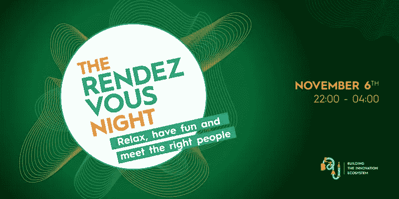

# 约会之夜

*   **#** 聚会
*   11 月 6 日晚上 10 点以上—凌晨 4 点
*   葡京商业广场 72 号 1100–148
*   价格:免费
*   主持人:Beta-i
*   [**在这里加入事件**](https://www.eventbrite.co.uk/e/the-rendezvous-night-tickets-51823752238?aff=ebdssbdestsearch)

他的是 2018 年网络峰会的 Beta-i 派对。

如果您正在寻找放松、娱乐和遇到合适的人，我们的大门将在 22:00 打开，在 04:00 关闭。

今年我们将在可爱的 Ministerium 举办派对，有多个房间可以放松、休息和跳舞。

CityMapper [这里**这里**](https://citymapper.com/trip/signature?signature=eJydVE2P2jAQ%2FStRriWL7TiOw42ilVqp20WiWg7bVWRiw7pNbOo4LRLiv9fOhxSgdNXeMp6Z92beZOYYFsyEswAChMEkCHljmJVauScEaOJehOLOOIaMcyPq2n2HS8O%2BNgCIlAVcBwtdtVZmCqmDFE0CCAGIIKbBJ1lvNJsES21ss2Nl6PAKrQ1vYWJ6lwKKEJ1E2R2Mk5R4v2KV8N4HqWRthZFNFSzKZuNQbtNOOio1ojo5rG8ml4qLg2%2FQmaXYeeLnY8gdNFOFJ8IQn%2FcdJ8S3XQwlEieDKxBklEBfoFS5S%2B6DQzDNgH%2BtNG%2FL%2FsXK796uR%2Fkk7gCSBHuX1bk4SOv9XdWrDi5%2FNFIoK%2FL7GMcx8R0ce%2FkvAuelE4mzMa81TNUO1D0Z3TgQ2Yr8HD4Ia%2FRel9I1rFvjSZhKlK8sfPF1WmZul9J2YvU%2BL3SjfFg6PAzwy5LZrTZV3uUPLTzlfLX22Rf%2BvnLvX4cvbYejWVz8gQScDSJOEel%2BFQyy60nAKXljEucAt%2BV9z%2BSBLV4l4%2Fr%2FJXY5f9F3NMF%2F0nek3%2BoP8o4q70dwpXFC6LnKCcrOZHYrifuNpMhzbI2ubvyxY777JE6S67GgNxcEApJ1hBnA4cmrZsSuT9%2FbqGwpB9ml2uVG%2FGhEbZ1IPmQLKcUFRZEgGxDhDY4j5vYnKkCB0zROOOouyzCK48UNcguKhg1112B8hNZiE6yaqpJ2FsxLKwsRzI1QrL0uVnZBCEAaQRDF8AtMZ4jOEHkHwAyA6efH9cfVBw%2F4U5i6P6un3%2BYNowY%3D)

# 非官方的同性恋网络之夜峰会

*   11 月 6 日晚 8 点 30 分
*   迟到的鸟儿里斯本
    Travessa andréValente 21
    1200–024 里斯本
*   价格:免费
*   主持人:迈克尔·佛罗伦萨
*   [**此处加入事件**](https://www.facebook.com/events/337129547062407/)

在位于 Bairro Alto 的里斯本市中心，我们邀请所有同性恋网络峰会的参与者加入我们在晚鸟里斯本的酒吧。
(网络峰会参与者免费入场)

在欧洲最大和最重要的技术市场，我们希望为 LGBT 与会者提供一个无与伦比的会议场所。

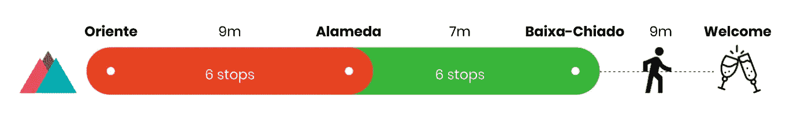

**城市地图** [这里](https://citymapper.com/trip/signature?signature=eJydVF1vmzAU%2FSvIrwutv4G8ZVOlTdrWSqmSh65CLnZSb2B3xnSVov732UAkSr%2B0veHr63POPQf7ACrhwDJBiCO4SIDsnPDamlDCOMehoowMiwMQUjrVtuEbXN6fJCsj3Y8OQlUkG1Er41WC0SJBGMIUE5581e2NFYvkwjpv96KuLQhglbVO9hgkP8kQYjRfpMUJohlnWWwwolE9hRP3gU28yUMJGXjMwNMFHvAYUH66UhupHgJSHKpW%2B8h5dQBSt16YKlIQOJuX8FhQ1VEdz1nUBoucwzxq06YMp8duAE8LGKuNlb3iP6L%2BFdftBIBjPkAwRuOet6V60D42DLrXA1557nQcrTwjYSYeZziMxs8aV3UwSIopsXfCtAE0lJztAojuHb4C35R39s7WOoxs%2B8VGuUbVtwJcR6FeuNel9KN4e1dWtjOxLTsWjvAXtfA765pyOH8cYVPK9Taenu2PyuP%2BFlz3E07SmGUxi4JkmPVOIkJhzp%2BHgU75O2HMIV63%2BKPQD%2BLTrRbS%2Fr%2FN4cwbHk9S%2FCePJx6uX7B4onyM4ZnPjKKnTjNWPLEaIVocryTpf%2Fuds80rv%2B2U8IwR9kIy%2BN1rgiBjeKDEMAvJROOc2o8Adz6te9Kj89rsS6d%2Bd6r1wafYUmFVFSQjKd%2FtWEopZukNpiglstrtCK0UphmYpHGYvUPxopLxolJEp%2B%2FQVt0k665ptF8mq9rrSiUrp4zonxmvhyYMUZ4ilEJyibIlwkvMP0C4hPD0%2B%2Fn2y%2FpzBLxXrh3f1ce%2Frz6hDw%3D%3D)

# 地下闭幕派对

*   **#** 聚会
*   11 月 7 日下午 6 点多
*   里斯本圣阿波罗尼亚鲁阿俱乐部 59 号 1100–468
*   价格:免费
*   主持人:Nomadx
*   [**此处加入事件**](https://www.meetup.com/pt-BR/HELLYESPORTUGAL/events/254628899/)

预计这将是在葡京顶级屋顶酒廊和俱乐部举办的网络峰会的最终闭幕派对。

加入其他网络峰会与会者、社区成员、主持人和当地数字社区，享受一个令人难以置信的 VIP 网络、社交和娱乐之夜！此外，跳舞到葡京-非洲传奇，全球艺术家，人道主义和游牧民族驻地 DJ 约翰尼 Cooltrain 和他的当地铜管乐队合奏一个晚上的神奇爵士，灵魂，嘻哈，桑巴，非洲舞厅雷鬼听起来更现代的舞蹈音乐语言。

**城市地图** [此处](https://citymapper.com/trip/signature?signature=eJx9UtFu2yAU%2FRXE6%2BIOMLbBb2nXaZOmtVIm9aGbLAzEZXMgA9xNi%2FrvAyeR3DzUT773nnt8zvU5QCk8bEFFebkCUE1eRONs6hCMWepoq1JxgEIpr0NI73D9z9gnMQigXADrcWusjjqswBcTeidgWpLOeTVjS3bVlCw9q4JfYcRwnedW7HSe3oxTr8FH7b17Nt8nhDT2xgGlwb3zcRrECF8S%2FKfvjFX6b1rBqRz1kLkfD1CZEIWVmatE%2FEI%2FQ1m%2BPKuoGW2yCMQZo1nEzqlZxB8x%2Fsp1WEDr8gitKpoVHE5ngLNFu4lu39076T64axP2rtss%2BaIXNpiYW95NUXdmPsUjvBHem3A9hYYw%2BCN%2FMQofL2hvU1MKd%2BeNtmn3tiOztjySbrIZjsksaWEeI0Jfu%2BdN9cp9ycvq9AsQfts9JfQEJTS5z0K9Ho60cB%2BLcRZ7tmfs0Hn9e9IhJqMZ0tOaYF72hegpL1LBi141rJB4u21qXEsuBFy4P1zEJV2fnM9PMV3m5UH3YDPtdia2KXjRSA3WXlsxpySaI4ggzAqMCkK%2FYdziuqXVO4RbhN5%2FvXv4vPmUCZ%2B1D6eYvPwHVIrbdQ%3D%3D)

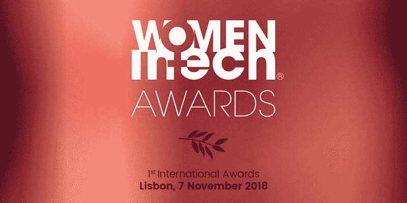

# 女性技术奖

*   **#** 联欢晚宴 **#** 奖项
*   11 月 7 日晚 7 点— 11 点半
*   萨那酒店
    T21 公园 1990–173
*   价格:
    €118.45–198.40
*   主持人:科技界的女性
*   [**在这里加入事件**](https://www.eventbrite.fr/e/women-in-tech-awards-during-web-summit-tickets-50485267795?aff=ebdssbdestsearch)

我们的女性技术奖颁奖典礼将奖励 15 个类别中的杰出人物。我们将关注来自世界各地的专家，他们是公司的领导者、企业家，以及他们领域中最杰出的人。

颁奖仪式将在美丽的 Myriad by Sana 酒店举行，俯瞰大海。这是一场非常著名的独家晚宴，将聚集来自世界各地的 200 名专业人士和媒体。著名的演讲者也将发言并颁发奖品。

**城市地图** [这里](https://citymapper.com/trip/signature?signature=eJxlj0trhDAUhf9KyLY6TWJ87qSbKbR2YWEWpYurCUOompLElkH87020D4bu7uV895x7FixmA07pCVeooEmEsJyEnxcMQhhprZ%2FxHSiLBFjUwGwj9KBspwF7ttfaiA1JikOe8zwto7g8kJIyHvQJRhnUx4tRIFB3QW3d1OionRwsXj0xyHO4f1mwUNbB1AeeEkK99v%2B1%2Fi8qzb6TeBaSRi22pE8Y3sJuf9GsyJIdTVOO11cvGnnebfG7i4fQZtpuHBi3db%2Fu5R3YjwWnV8VOskPtPI7KVagenOolqo2cYOvm1A4xQouYlHFCnhmrElZxdkNoRcht83S6b4%2FB8EMau%2F%2FE1i8XkW4i)

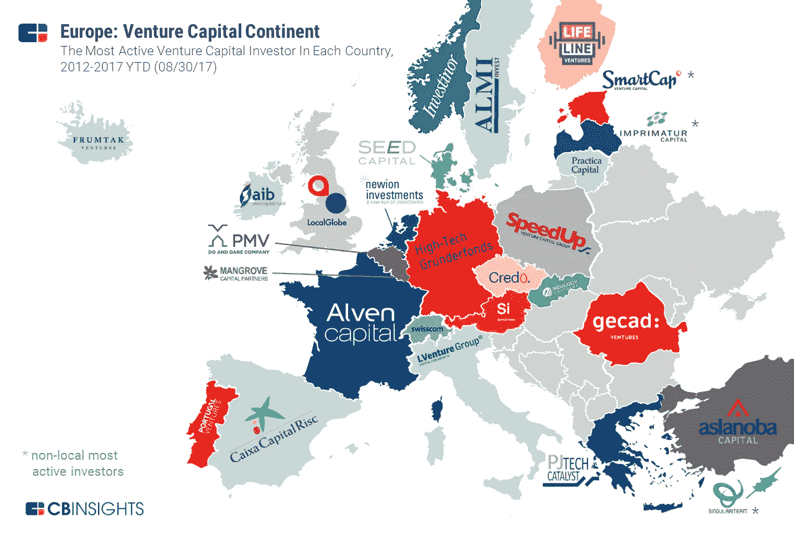

# 欧洲创业和扩大规模之夜

*   **#** 联网
*   11 月 7 日晚 7 点—凌晨 3 点
*   葡京商业广场 72 号牧师俱乐部
    1100–016
*   价格:免费
*   主持人:Teamleader & Startups.be
*   [**此处加入事件**](https://www.eventbrite.nl/e/european-startup-scale-up-night-tickets-50440861976?aff=ebdssbdestsearch)

获取关于如何发展您的创业公司的战术提示，与欧洲顶级企业见面并打招呼，并学习如何成功应对走向全球的潜在陷阱！

11 月 7 日星期三，我们将在里斯本市中心传奇的 Ministerium Club 开店，度过一个充满宝贵见解、强大网络、庆祝活动，当然还有(免费)啤酒的夜晚！

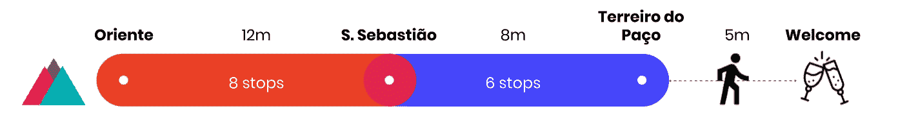

**城市地图** [这里](https://citymapper.com/trip/signature?signature=eJydVFtv0zAU%2FitRXmk2XxO7b2X0AYlBtU6d0JgiN3GLIbGL48BEtf%2BOnbbQpBtFvEQ51%2B%2Bc8%2FmcbVwIG48jCBABoyguWyucMtqrEKDca6QuvbCNRVla2TT%2BP55Z8akFQGYiKk10ZepO4rZQJsrQKIIQgATANHqnmqURo2hmrGvXoop9vsIYW3ZpMLvIAEOIjRJ%2BATHN0mDXopbBeq20apy0qq2jq6pd%2Biz%2FAgsJO4V98nm%2F2FzpUj763JkXK7kORdxv49LDCF0EUAJJfwaYpmEExaHclNFQLOAshaFYpXMfvHeOwSUHQVubsmvhh6i%2BBrk5ik%2FxLgGlJJicyeWjcsHeVa3nu3T5B6ukdjKfYoJxGjrwlcqN8B15GkLlCWQEP%2FxmaBA%2FF2Yul6JxSpjjmpwVuvGAXmVN6wFUR8Z9fC2dNRtTKT8M0wkLaWtZfRZxAPFt2pfL7Lp0ZpMXptXBjR8Uh%2FSzSriVsXW%2Biz%2B0t8jL%2BV2IHtiPy%2FdOtzmMH3Yz%2BMPW4L2moEcVJox0D4sShE%2B5gpfpGa76CZ4jgBP64vxvpbVSWfPGzETxvwxMfrbV36Y%2FJLlHQXaGgt6IJ56HaQ6fYaLfSHB8Pz3lAmd0sDmwvzl%2B0cl%2BzxkKMCtr6hfe%2FgBySilgpwyis9sGMoh2mATy%2BCkM0sr1PnzjkqpDPRCh9Dq38lsrG%2BdHFlwIKEuRcZmsOIQJQSRNOJY04eUKLFeoYIzA%2BIid7eC4%2BW1Hh3X3p%2BX4ut3JZTRv61q5cTSpnCpkNLFSi%2B5UObVzQgCyBPAEg1uExpiOAXgFoP9eTm5u3i6m%2BeuPIed3aZv9yX76BSJEwMU%3D)

# 虚拟现实/增强现实网络峰会高管晚宴

*   **#** VR **#** AR **#** 联网
*   11 月 7 日晚 8 点 30 分至 10 点
*   葡京 1200–309 号 8
    奥利韦拉奥卡玛餐厅管理
*   价格:€50-100 英镑
*   主持人:VR/AR 协会
*   [**此处加入事件**](https://www.eventbrite.pt/e/bilhetes-the-vrar-web-summit-executive-dinner-50885969304?aff=ebdssbdestsearch)

VR/AR 协会(VRARA)葡萄牙分会将于 11 月 7 日在葡萄牙里斯本举行的网络峰会期间举办高管晚宴活动。

参加 Web Summit 的 VR/AR 社区将聚集在一家 VIP 餐厅参加我们的高管晚宴活动。来加入行业思想家、C 级高管、投资者和初创公司，探索合作和网络的方式。

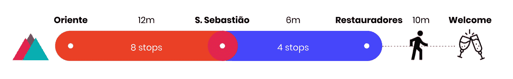

**城市地图** [这里](https://citymapper.com/trip/signature?signature=eJydVG1r2zAQ%2FivCXxe3erEcO9%2ByUdhgW0tT2g9dMRdbybTZVifLXVnIf9%2FJjsFOmxUGwUSn093zotMuyMEGC8KYiNMZCYrWgtOmxhCXLMKIqgtc7AIoCquaBv8H12ekAHJZ6ielLRAw5APYypBkRhinNBQ0JZ91szYwI1fGunYLZYClcmNs0VUQydmccSnlLEzPWMQiyXxCDZXy219U3cBWVSQk16pxgKBqp4gi78GSK6iN%2FdZSqnilczMj1y28imfWg6hHIPbY5IfNdF2oZ88al6Xaekj3u6DQ2KrOPYKooz4SQ8jYa5EP4OOkg07TJO6Q6zrDw4fkgJ6n1EcrU3R8fkP506%2Bb0flY9AWkjPyWM5l61s7v96hXfbns0mqF5LMLEQkRewa7gydHiSswK7WGxmkw4%2BYOxWuwMoasabGS7jy4R5WdNY%2Bm1MjadItbZStVfofgwYN1YE%2Fj6eg485jlpq19WjoEhvJXJbiNsVXWnx943GbF6s6fPtofw8ekm4wFDx3ZkS10akpMJ56IKIm6%2ByQjLl6aws7jN0yZFjit9HAnC4MT8Z9SL%2F%2B05b9kPnZzorV8Q%2BuJlksU%2FCJjr0g%2B4dHnvdRcsniqukyiiew4x2IY49R32VhTnbjM044XUiT8pVH8zelhkqaHliIN9l5Gq7aH448uLLumgw263mZW%2FWqxNwrmU3IGIOZ5HsJ8DWE0FzIELjl%2BWJTDfBPHuQhG3uyOni6cXj6ML7IeP113ak1WbVVptyDL0ulckaVVNXRPj9N9EqcsCRnF3w3nC84WVLyj%2BKXnXy%2FvPq0%2B%2BoJPyjaHh3j%2FF84et5Y%3D)

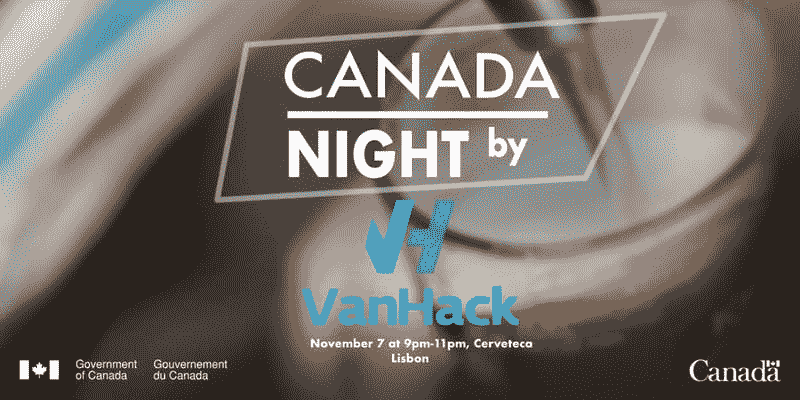

# 范哈克的加拿大之夜

*   **#** 联网
*   11 月 7 日晚 9 点至 11 点
*   葡京街 1200–192 号
*   价格:免费
*   东道主:加拿大驻葡萄牙大使馆
*   [**此处加入事件**](https://www.eventbrite.ca/e/canada-night-by-vanhack-tickets-51507979754?aff=ebdssbdestsearch)

当地的精酿啤酒吧 Cerveteca 将成为加拿大人的聚会点。

请务必注册参加本次活动，以获得 VanHack 提供的 1 瓶精酿啤酒的优惠券。
在加拿大日峰会期间，在登记处申领您的优惠券。

带上你的联系人，在 Cerveteca 喝一杯加拿大精酿啤酒！

**城市地图** [此处](https://citymapper.com/trip/signature?signature=eJydVE1v2zAM%2FSuGrotbSZa%2FcguGDhuwrcVSNIeuMBRLybTZUiYrXYEg%2F72UHRd2sizAAB8sku%2BRfBS1QyW3aBoQEuVsEiCxtdwpo8FEaZqDRWoBhx3iQljZNPCP7iz%2FvsVYpjwQvAk%2BVAY8kyChk%2BCzapaABlxpjBVteJRdpSTGcTIJ8ysSE4JTH6B5Lb37vbTP0smSd2CO9uD8aQulhXyBAAzHSq491eMOCdU4rkuPZOSo4ghSQMFlnzTJYp8S51lCfEalCwAfghG%2BzrG31ka0dfzh1S9%2Fbgb4JOoI4ph5lzOFfFHO%2B7tG5x1dcWuV1E4WNxGLosR3sDsIdxQ455Xg%2BgcfJnaW6wZYwWTNFlhUq9sj%2BiKdNRtTKejYtIcHaWtZAfzJF%2Bq4PV9L24ozm6I0W%2B3Dst7Q099V3K2MrYsO3%2FfwUIj5wqOP%2FH3pPmBREPTUdjmYBx5PI8GjYUQxzdoLwOI4O50GuU4uTGNMcF7ib9yZ%2F5R3VnMrq3%2BqOxzgSF52Qd43%2BWag71%2Fk9WWD7%2F5U14ySsbIpyUbSwnJl%2FW5RT72ypj5zU9s0NzFj7HQG9OJGUExol4nhCO29TlauD%2FCNC6u39fdSK70urPy9lY0DVdqdYznmjImQp0yGjCY05KsVC3NMy2VJ4yyPUjQQf3f0jMBG0n4lYf2Hz8hCLoP5tq6VmwazyqlSBjMrdfecONUFQf1ZSHBI8ntCpzSH7x0mU4yvv94uPs0%2FesJnaZvDC7h%2FBbKHhzY%3D)

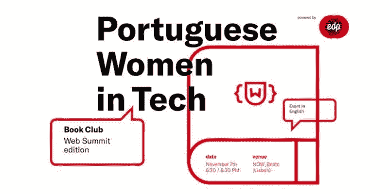

# 葡萄牙科技界的女性——读书俱乐部

*   **#** 女士专用 **#** 阅读 **#** 联网
*   11 月 7 日下午 6:30-8:30
*   67 鲁阿达马努腾桑 1900 年至 320 年里斯本
*   价格:免费
*   主持人:葡萄牙科技界的女性
*   [**在这里加入事件**](https://www.eventbrite.co.uk/e/portuguese-women-in-tech-book-club-web-summit-edition-powered-by-edp-tickets-51493847484?aff=ebdssbdestsearch)

由 EDP 支持的葡萄牙女性科技图书俱乐部(网络峰会版)将是一个非正式的图书俱乐部，邀请客人分享他们的前三本书，并谈论他们为什么选择这些书，是什么打动了他们，以及这些书如何影响了他们的生活或职业。

在同一活动中，PWIT x EDP 将发布 PWIT 手册 2018，该手册是在 EDP 的支持下开发的，每个人都可以阅读并获得灵感！你准备好了吗？:)

**城市地图** [这里](https://citymapper.com/trip/signature?signature=eJx9UtFu3CAQ%2FBXEa%2B0UMDb43pI0Uiu1TdWrdJXSyOIMOdH6IAXcVjrdv2ex71QnD3mxYBnPzM7uAfcq4BUSVSMKhPUYVLLeQYW2tIaKcRouB6y0DiZGOOOvo0JaoU%2FKjcm4HyMhRkzfyqPMQltCyooR9NHGrVcF%2BuJDGndqwMDXex%2F0RFPJC8Fa0bCibC8oEWAhA5zam%2Fz8%2BXbTXRmVfIFeESxmEbcQOQLJz9BZp80%2FICJwHcwuS94dsLYxKddnhYq0zztmMmNNfzbXSC6yN9JKybO1vdeTtb9q%2BJXvcQFtqhla1zw7OJyCw7O9dfKP3Xe1DWanIrTzTp2a6ZXv1psleQrKRZtyKXiAdHaK6w5fqxBsvBqjYBLfZ%2FmkQnqhcQNF4LwN1jj496Zjk9H81PvRZTiVk79FElzw50nwKZr%2FScCYTkOq5etBsDkHSgmX%2BJhdQsszKX5M5TA5Pfdm3a4L5vdoYoIuM4QJYVqtdfmg677kDSWlrM22bHrSEv3QNGbL8aL1w4t9gjmw8yA45ct92pgtWo%2F7vU0rdDkk2xt0GYxT074kO4MYobIEUdp%2Bo2xV1StO3hC6IuQtrOOH9ftM%2BMeEeFqY4xNzUO3S)

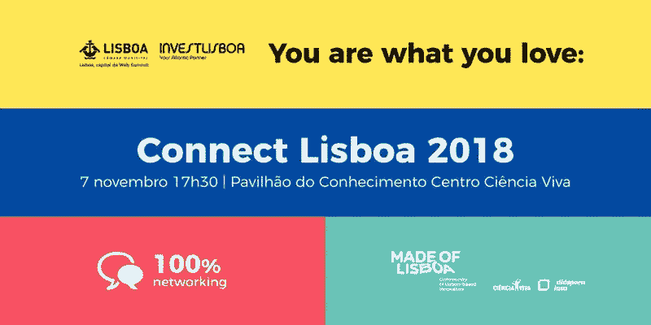

# 连接葡京 2018

*   **#** 葡萄牙 **#** 联网
*   11 月 7 日下午 5 点 30 分至 8 点 30 分
*   pavilho do Conhecimento-ciência Viva
    Largo joséMariano Gago，n 1
    里斯本公园 1990–073
*   价格:免费
*   主持人:葡京市政委员会和葡京投资局
*   [**此处加入事件**](https://www.eventbrite.pt/e/bilhetes-connect-lisboa-2018-51719188485?aff=ebdssbdestsearch)

为实现网络峰会，里斯本市政府和里斯本投资委员会在葡萄牙召开了一次会议，讨论了里斯本的主要行动和项目。

CityMapper [**此处**](https://citymapper.com/trip/signature?signature=eJxlkM1OwzAQhF9l5StJcZz%2F3KpeQEIFqYgegIMbL61FYoPtlEPUd8dOqIrgslprdj7NeCRiMNxJrUgDeVJHQFAJv4%2BEC2HQWr%2BTB24%2BBwTBLaz5y0AplmG%2B5WgjuJN2pznxzlZrIyZDWi3KgpVlFNcLWud5WgRd8R5n3FF2h4mTahAaVlodsJU9KqchhpWcNK5ayeFJHjk5eXeH%2B8B%2BHomQ1nkxsIqi8tL%2FDu0lRf0TIstChl6LKcMX797D214uqyI9583I6dWLBvczlXy4uAs91eRx3Ljpj%2F40rgp2RmRJ9rvyFnewGfpeugaWnZMtwtKgmps5OR8xmlRxQmOWP7KkoUnD0is%2FKb1e329vNzcBeERj50zs9A0xVXv%2F)

# 瑜伽思维入门

*   11 月 8 日晚 7 点
*   里斯本城外
    109 圣保罗鲁阿
    1200–066 里斯本
*   价格:免费
*   主持人:瑜伽思维
*   [**在这里加入事件**](https://www.facebook.com/events/557725724670500/)

11 月 8 日星期四，在 Outsite，加入我们关于瑜伽思考的一个试探性会议！

瑜伽思维融合了瑜伽、冥想和设计思维。我们将以人为中心的创新潜力与呼吸工作、可视化练习、体式和哈他瑜伽和昆达利尼瑜伽的冥想技巧相结合。

其结果是一种独特的体验，在这种体验中，身体的运动丰富和平衡了思维的分析和创造活动。

在 11 月 9 日至 11 日举行的 2018 年葡萄牙首届瑜伽思维企业家务虚会上，你可以加入 Ericeira 的瑜伽思维团队，享受 2.5 天的时间和空间，将瑜伽思维应用于你的个人挑战或主题。

Citymapper [这里**这里**](https://citymapper.com/trip/signature?signature=eJydVF1vmzAU%2FSuI14Xk%2BgND8pZNlTZpW6MxNQ9VhRzspN4AZ8ZskaL%2B99qEaJQ2q9Y3fH3vueeeg%2B8xLLgJFwFCmNJJEIrWcKt07UKY4LmLyFq4wzHkQhjZNO47%2FNbyQMggmwYr3pY6QOASEQaIgLHgs2o2mk%2BClTa23fEydCCF1kZ0tSSdJpBSiibRfIpogmHuE2peyTdAP7jSHyZXtZAHVw7uWMqdb3R7DIVqLK8Lj0sAng5HmA%2FI4kyJpbEnBPOUQeoJqTp31X12CLM5%2BGilRUfzDy9%2F%2BnMzAGCYnSDimPo7q3N5UNYndLzr7ISXXxslayvzK0IJYX6GY6%2FyKHFZOlUEHza2hteNA3Uho1sHojpZb8Mv0hq916VyI%2BvucCNNJct7Ht55opaby1S6Uaze54Vua5%2BWnANn%2BFXJ7VabKj%2FVn0e4yUW29tWj%2B565v1%2BHd92EAzdGXoysIAmOOyURoZCy52agGXvFjDHEZYnfc3XgH%2B4VF%2FrtMruaf2g8cPG%2FNB5omL0g8YB5b8MznRmQsdLsidSQxvD3IXZ%2F7dbo6sJ%2FO%2Bx4FZP4BWvwq%2B8EQRzjU0sMibPGK2fkrgfY26jsmp6lV%2FUuN%2FJXKxvrhPIpVPJtKgqI3BaREU1BRBu8KSJEmKTEgRYMhwM7jqPt418q6V8qRXS4fdZyE2RtVSm7CJalVYUMlkbWvNszVp2SMKA0QigC8h0lCwwLjN8BLABmX6%2FXn7KPHvC3NE2%2FRR8eAdnxmUM%3D)

# 网络峰会后会见法国初创公司

*   **#** 联网
*   11 月 8 日晚 8 点半至 11 点半
*   东方天空酒吧
    11403B 葡京大道 1990–221 号
*   价格:免费
*   主持人:巴黎 F 站
*   [**此处加入事件**](https://www.eventbrite.fr/e/billets-meet-french-startups-after-web-summit-52040814477?aff=ebdssbdestsearch)

让我们用饮料和好故事来庆祝网络峰会的结束。我们是来自世界上最大的创业园区巴黎 F 站的 4 家创业公司，我们邀请你参加这个非正式的活动。

来加入我们在里斯本的最佳地点之一，网络和分享我们的网络峰会的经验！

CityMapper [**此处**](https://citymapper.com/trip/signature?signature=eJxlkM1OwzAQhF9l5StJ8E%2FiJrml4kARokhF6gE4uLFVWU1s5DhFKOq7EydFFHpba9bfzOyAZO%2BE19agEhgvIkDKyHEekJDSqa4bZ1QdE7izLTzYtx5jxSysVkBIitkyAlIUOKaUwKPudlZE8Gyd7%2FeiQSOsttbJicHyZMF5xlgUFwkucpoG3YhWBXVz%2BIKlcLB2WhmvIqiOymgprmyj2cZc2JxGTqP2weV1QFJ3Xpg6UFOejdJ1wfoyzzkOISFOa%2BUU51M0h%2FDufldzfl7NshSd3kfRqf2MRR8%2BbqZU0x8vnJ8u%2BK98zukPIiV%2F2m%2FVDjZ922pfQtV4XSuonDJiqub1vEQxyWOCY0ZeyKIkaUn5DcYlxrdP6%2B1qcx%2BAR%2BW6ORM9fQN4OoKK)

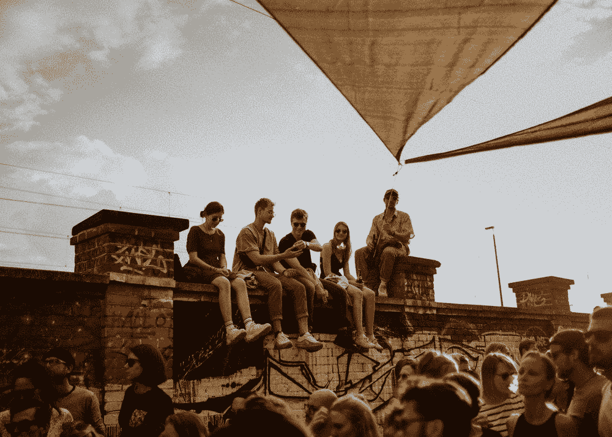

# 里斯本数字游牧者周会

*   **#** 联网
*   11 月 8 日晚 7:30-10:30
*   鲁阿雷吉罗多斯安茹斯 1150–190 号里斯本
*   价格:免费
*   主持人:里斯本数字游牧者
*   [**此处加入事件**](https://www.meetup.com/pt-BR/Lisbon-Digital-Nomads/events/gbjnqpyxpblb/)

本周加入我们每周一次的数字流浪者聚会，地点是镇上最酷的地方之一 Anjos70 协会

因为你们中的许多人将在镇上参加网络峰会，所以让我们聚在一起聊聊天，喝点饮料。里斯本的位置独立和企业家社区是巨大的，所以为什么不加入并联系志同道合的人呢？

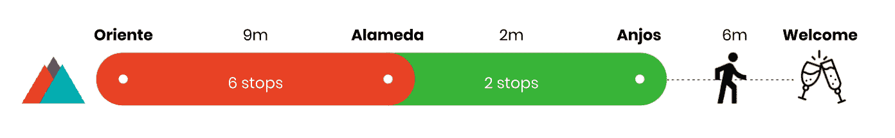

**城市地图** [此处](https://citymapper.com/trip/signature?signature=eJydVF1vmzAU%2FSuI14XG2GBM3vJQaZO2tVqm5qGtkINvMndgZ8ZslaL%2B99l8SISujTSJB3w%2Fju89516fwpKbcBXkmJBFEIrWcCu1cpY4T7GzgBLucAq5EAaaxv2H3%2BDQgjQPLUJAdLBWT7pZBJ9ls9N8EdxqY9sDr0KXXGptRJdD2FWG0wwvovwqJilj1PsVr%2BECopogvriUJ1NIJeDZpSF3rODg8e9PoZCN5ar0eASh814I9QYox0ooS30hKGcUMV%2BIVIXLHqJDtMyRt9ZadOX94dVPf24mABTTHiJNE%2B%2BzuoBnaX1AX%2FemxytujARlobgmCSHU93AaSJ0FrivHhuDTi63hqnGgzmR060Bkx%2BZ9%2BAWs0UddSdey7g53YGqofvDw0RdquXm7lK4Vq49FqVvlw7LRMMLfVtzutamLPn9s4a4Qm63PnvmHyr1%2FGz52HU7UmGkxk4K4saD9VCSon4pzMeIlvSDGHOIdiv1g%2FT%2FBLucddif6nbFLLrA7YW%2FzL3J9zb3zFbVukWaDnpIzdt3KxfmwczlOPfze6PqNUe2vusZZSvFrIfDFrcBZRkYhGHVCeLYMHAaAo42q7r6RbqkOhYFfLTTWkeND9mnJkhxwxEtBoiSjKOKYxBHdIWBMANtlA8G9BKfZE%2BP3kgx7mcTJ9I3Zwi7YtHUt7SpYV1aWEKwNKN69Klb2QRjFLIqR%2B75jvEriFU4%2BoHiF0PLrzfbT5qMH%2FA2m6TvCL38BuCCSgQ%3D%3D)

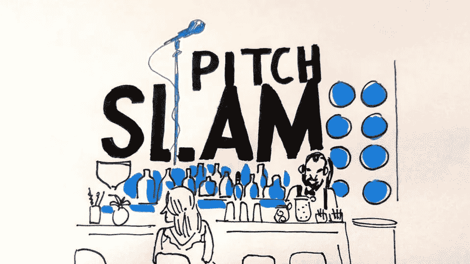

# 新创企业葡京投满贯

*   **#** 俯仰 **#** 联网
*   11 月 8 日晚上 10 点以上— 11 点半
*   葡京
    鲁阿商业 54
    葡京
*   价格:免费
*   主持人:新创葡京
*   [**在这里加入事件**](https://www.meetup.com/pt-BR/Pitch-Slam-by-Startup-Lisboa/events/mkdpspyxpbcb/)

每个月，初创公司 Lisboa 都会从诗歌 Slam 传统中汲取灵感，为创业界带来每月一次的活动，社区成员聚集在里斯本的一家酒吧，受邀上台讲述他们的商业想法，练习他们的推销和交流。

11 月，在网络峰会的最后一天晚上，我们将举办一场特别的推介活动。我们邀请参加会议的初创公司分享他们的经验，并邀请想讲述他们故事的人，以一整周的网络和想法的繁荣来结束会议。

**city mapper**这里

# 恶魔 Lx21

*   **#** 投球 **#** 联网
*   11 月 6 日晚 6 点至 9 点
*   进化酒店
    普拉亚杜克萨尔达尼亚 4
    1050–094 里斯本
*   价格:免费
*   主持人:IdeiaHub Palacio，Tagus Park Incubadora，可行性报告，英国葡萄牙商会(BPCC)，Camara de Comercio
*   [**此处加入事件**](https://www.eventbrite.com/e/demonightlx21-websummit-week-tickets-46876199976?aff=ebdssbdestsearch)

不是推销之夜->演示之夜！

这种特殊的形式旨在展示新的想法和企业家在里斯本，葡萄牙和国际游客。通过这个活动，每个创始人都希望学习和重复他们的想法，找到共同创始人和资金。

每个公司展示他们的想法，商业模式或原型，并期待观众的反馈。形式为 5 分钟演示，5 分钟与观众开放式问答。

**CityMapper** [Here](https://citymapper.com/trip/signature?signature=eJyFU11v2yAU%2FSuI18UtGHBM3iot0ip1TaR0yUNXWcTgjM2GDOOtUpT%2FPrDjLcnU7Y1777nn3C8OsBQOzgAneDoBUHZOeG1N8OCU4%2BBRRgbjAIWUTrVteMOlE587hNRUgPfd904BqcBK1FKYLwLQCcCIoQRxCh50u7ViApbW%2BW4nahj4Smud7GlIfjMlhNFJwm8wpRjzGDeiUTE6Xy8ePj3dLx7%2FsPxDdjKgzJnWMZB9dYU2Ur0GQhTMWu2i8vMBSt16YcqoRBC6bJxk0aHKscYsZ7FExPMM5bFEbYqQfUJDdMtR9DZW9oX%2FFPW3aLdnBFmaDRSM0RjztlCv2kfAUPdq4CsWTivjVTEnlJAs9nA4beAKODZ%2BruydMG1gDS5nu8Ci%2B0E%2Fw4%2FKO7u3tQ49295YK9eoOqS%2FxEq9cG%2FX0vfi7b4obWciLB8dI%2F2yFr6yrimG%2FLGHdSFXm5h9FR9Lj4BNgeFL3%2BXZRhj76xIvFhKOJuOnq0lxFiUqZ5s3Rvpbbs7oAL7cX%2Frf%2FRGKaDZeKWfwGIfm1O5EsPdJ3SuOg9dmVzgVLrT1YUYRoipJMy5QUgmRJTTdVglnVCS4UoKxkvGcSXi2icPVN4kXRE4XRDE9%2FycbtQWrrmm0n4G72utSgTunjOjv3%2BsBlCKchx%2BZEPSUpjOCZoi9Q3iG0O3jYnO%2F%2BhAJfyjXDh2lx1%2FMHDX2)

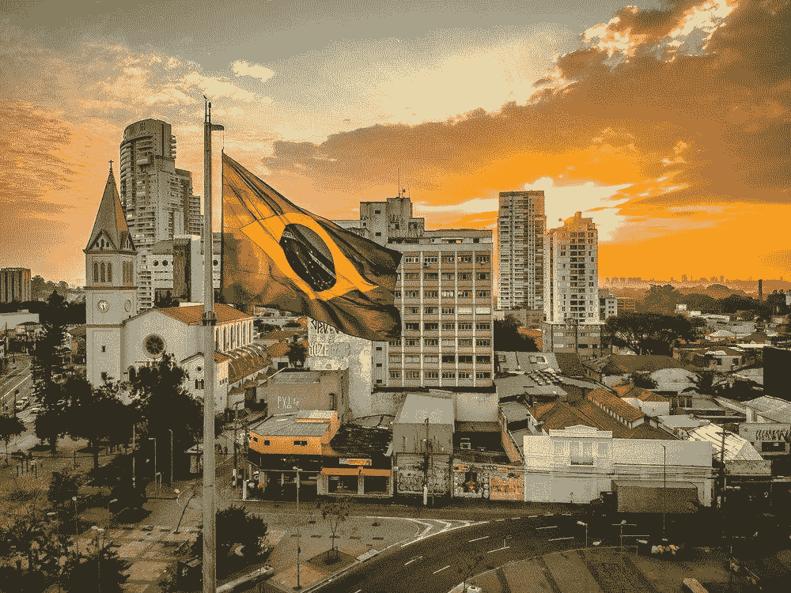

# BRConnect 里斯本

*   **#** 巴西 **#** 葡萄牙 **#** 网络
*   Nov 8 > 7 PM — 10 PM
*   IDEA Hub
    Avenida Fontes Pereira De Melo No 16
    里斯本
*   价格: 21.19€
*   表演者 : Shawee & Kyvo
*   [**Join Event Here**](https://www.eventbrite.com.br/e/brconnectlisbon-tickets-51819219681?aff=ebdssbdestsearch)

在全球最大的创业活动网络峰会(Web Summit)上,巴西连接里斯本(Brasil Connect Lisboa)将成为一项倡议,该倡议将汇集巴西人,为围绕创新的主要问题带来新的视角。
新的创新工具、大公司的组织文化和新的全球创新周期将是本次会议讨论的主题。

在这次经历中,我们将有一个关于巴西和葡萄牙如何在寻找创新业务方面定位自己的小组。我们将汇集两家出生于巴西并正在全球定位的初创公司,其解决方案在创新方面提供了新的思路。

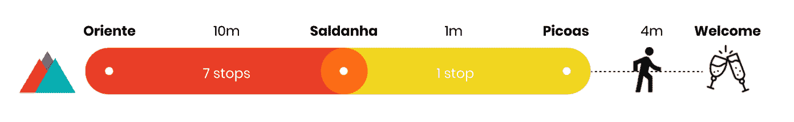

CityMapper [**此处**](https://citymapper.com/trip/signature?signature=eJylVMuO0zAU%2FZUoW5qOH7HjdNfFIJAYplLRdDEaRW7iFkNiF8cZRqr679h5oKS0VIJd7uvcc8%2FN9THMuQkXAQSMpbMgLBrDrdTKuxIGnUeowhnHkBeFEXXtvsPl6zx4r5UVdbASRkjDg0IED6LUAaQzh0VABCAIPsl6q%2FksWGljmz0vQweXa22KFgWzeYJYguJZlM5hnBDAfILilfivJicH8s1kUhXizQEBZ5Zi71s%2BH8NC1par3HeIYTwdGBPq580HcpQRTw2kjELPTKrMFffJIbhLgfdWumj5%2FuTld2%2FXo3qKOwBCYh%2ByOhNv0vp4y1qtO7js0UjhJs3ucYwx9RMce93PEte8LLj6yseNreGqdqjOZXTjUGSr73P4IKzRB11KN7FujSdhKlG68hdP1HJznUs7itWHLNeN8mlscAzwq5LbnTZV1tUPMzxlxXrjq8%2FiA3WfsMlg%2BNJOOdoHmG6DgskyMEGs%2B1EIYX9uA97RG9uYAlyXeCVzzet%2FFHhZcSPKv%2Bo7XuFEYHRD4N8CLp3CFwTuiLfRi%2FoifHbgCOKJxIj1AiWJh98ZXV35X%2FtW94TAC5eBbl4GStOuE01RePJiGbHvqw82Kttmg95S7TMjfjSitk4an7IjFEC%2BI1EOYxzFAGyjLeY0wjinKWU55iwNRxs4nr067jDRcJnuFRi%2FOhuxDdZNVUm7CJallbkIlkYo3r4qVnZJCEAWQRAh%2BgWhBSCLOHkH4AKAu8%2BPm4%2FrDx7wVZi6l%2Fn0C8w6nH0%3D)

# 音乐技术饮料

*   **#** 音乐 **#** 科技网络
*   11 月 8 日下午 6:30-9:30
*   Beta-i
    Av。里斯本 1000–092 号卡萨·里贝罗 28

*   价格:免费
*   主持人:音乐技术饮料
*   [**此处加入事件**](https://www.eventbrite.co.uk/e/music-tech-drinks-registration-51865930394?aff=ebdssbdestsearch)

从 11 月 5 日到 8 日，网络峰会将欢迎一些科技界最聪明的人来到里斯本。作为会议的核心主题之一，音乐在今年的网络峰会上占据了重要位置，汇集了 Jose Woldring(媒体保姆)、Daniel Haver(本地乐器)、Nick Sabine(常驻顾问)、Andy Mooney (Fender)、Heather Parry(现场国家)等行业重量级人物，以及伊莫金·希普、Christopher Leacock、陈伶俐 Price、Jonas Blue 等音乐家和制作人。

城市地图 [**此处**](https://citymapper.com/trip/signature?signature=eJyFU12P0zAQ%2FCuRX2l6%2Fopj962gk0ACDhF0fTidIjd2iyGxi%2BMeJ1X979hpgnJFJ16q7Hp2ZndnewKN9GCVCcTLRQbU0ctgnI0ZRAmKGW1VDE5AKuV138dvsH5aZu9kL9vsq9lq490iw3yRfTT91kkQaxrnvBqghC9Lgqlgi1wsEcVEiASwstPp%2Ba0OMjfgHFM%2FfG2s0s8xDWPY6n0ieDgBZfogbZPwBMKXPRKWErqZpBgvkhAUnEGehIytY%2FWIBvBGwJTtnBrkf8v2Z4r7GQHD7EJRFDS9BVfrZxMSYBjQVhe%2B%2Bs4bbYOubwklhKUZTuOyroCVbJW03%2BVcOXhp%2B8gaU94dI4sZ9vUAPung3cG1Js7shuBe%2B063sfwxdRqkf72XYZbgDnXjjjbB%2BJSY6L%2B0Muyc7%2BpL%2FTTDfa2qTaq%2Bep9aT4BNjcDjMOXMEcyKl47gaPXckWg%2BQqP5tGRJY%2Bdd98pO%2F%2BrdFhSxfw3E%2FzWQUEjHY6NIFOCctub1fiQ4hLwdFKfNG7uvvf511H2IS0oQpXa8kELlFOn0U5a52HKYs4JxwQSnjSZgZsXp6tzTCZHxhCii83Pf6G1WHbvOhFW2boNpdLb22srhDxDMBYQh4jmCOWbfMF7hcoXwG4hWEN58vtt8qN4nwift%2B3Hf5z9lQxmF)

# 法国之夜

*   **#** 法 **#** 联网
*   11 月 8 日—11 月 9 日晚上 7 点—凌晨 1 点
*   Raw Culture Arts & Lofts Bairro Alto
    103 Rua das Gáveas
    1200–206 里斯本
*   价格:Free
*   作者:FrenchUpers
*   [**Join Event Here**](https://www.eventbrite.fr/e/billets-thefrenchnight-by-frenchupers-websummit-2018-51883446786?aff=ebdssbdestsearch)

由 FrenchUpers(T6)主办的#TheFrenchNight 活动将于 2018 年 11 月 5 日至 8 日在里斯本举办第三届网络峰会。

对于这个特殊的法国之夜,在 Websummit 的边缘,来见见总部设在里斯本的法国生态系统,以及参加活动的法国科技中心,社区和大都市。
在节目中,会议和分享经验,所有这些都在一个友好的气氛中围绕着一杯酒。

参观 Raw Culture,位于里斯本市中心的 Bairro Alto。我们不能错过!

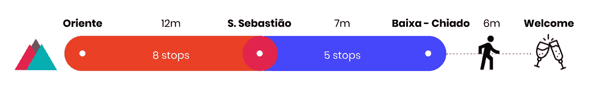

CityMapper [**Here**](https://citymapper.com/trip/signature?signature=eJydVN9P2zAQ%2FlciP%2BxlDfhX3KRvHULbJDYQRfDAUHSp3eItiZnjQEXF%2Fz47aaWkjCHtKfH57ru77%2FPdFi3BollEKKZ0EiHZWnDa1N5EOSXeomrpD1sEUlrVNP4fXR5FEpro848WY0Uelf8nmE0CCI4pFtGZbgoDk%2BjCWNeuoUQeZ2mMlV04S4%2BmhIpkEmdHhLNkmoX7GirVgcNTdNKWrrUqmlvXRB%2BiM7Py30%2BgrTXRvHRmEl22cFjDpE9bD9K%2BeNyfNte1VBuPjf2xVOtQxO0WSd04qJchKSd83DtLRGh9uS9XpF21OEsFCcXqOvfBO2eEjzMcrJWRXQtPUP4K52YQL1gPkCQ8XDmTq4124b6vetHD5edWq9qp%2FJRxxkToYLuT4MBxAWahCmicBjNM7izUjUf2Jmtaj6Q71m%2FRN%2BWseTCl9l2b7nCtbKXKe0B3oVgH9u16unaceciXpq2DW7Y37OEvSnArY6u8j9%2F3cZ3LxU2IPrgflu%2BdrnKC7rpmB7LgsSgCjzRhPOXdE0o4Za9FIcfiHVHGAG8z7R%2FeBk7uNcj%2FJXr%2B3Jb%2FIvlQyxHT4h2mR0zOPd2nOfkL4YMueq%2FXfAucHYzBdDwGfmrFbmp5N7Qra6o3HvIw32niB%2Bq1RPTduSE42a0JilP0Eii0ar0Lf3Bx2aXcS6DrdW7V71Y1zpMVXFK8opxREkM2lTFPiyQuWJHGmBdilQkBIAENdNkerCk%2Ft3Q%2FuH5JDPfUjSqiRVtV2s3CTtLLsK5UDd3Scbp3opikMfFLUVxROmNkRpOPmMwwPv5%2BfvN18SUAPirb7Dbuyx9%2BOazP)

# 瑜伽思考企业家撤退

*   **#** 瑜伽 **#** 撤退
*   Nov 9 — Nov 11 > Nov 9th 4 PM to Nov 11th 1 PM
*   108 House
    2655 Ericeira, 葡萄牙
*   价格: 180€ - 515€
*   作者:Yoga Thinking
*   [**Join Event Here**](https://www.eventbrite.com/e/yoga-thinking-entrepreneur-retreat-portugal-2018-tickets-51009601090?aff=ebdssbdestsearch)

我们正在启动我们的第一个瑜伽思想的企业家撤退在葡萄牙的一个独家组的 8 人!

Are you an attendee of the Web Summit?Send us your Web Summit ticket to hello@yoga-thinking.com to get the -10% Web Summit deal 的代码。

CityMapper [**此处**](https://citymapper.com/directions?endaddress=Ericeira%2C+2655+Ericeira%2C+Portugal&endcoord=38.966493%2C-9.417617&endname=Ericeira%2C+Portugal&set_region=pt-lisbon&startcoord=38.768623%2C-9.095414&startname=Web+Summit%3A+Altice+Arena)

**还有顺带一提，**

我是总部设在伦敦和里斯本的产品和软件公司 [**坛. io**](http://www.altar.io/) 的联合创始人。我们帮助初创公司和企业打造优秀的科技产品。

如果你有一个绝妙的想法想要付诸实践——让我们在 WS 期间在里斯本见面并进一步交谈；)

感谢阅读，
保罗

## 这篇文章发表在 [The Startup](https://medium.com/swlh) 上，这是 Medium 最大的创业刊物，有+384，399 人关注。

## 在这里订阅接收[我们的头条新闻](http://growthsupply.com/the-startup-newsletter/)。

