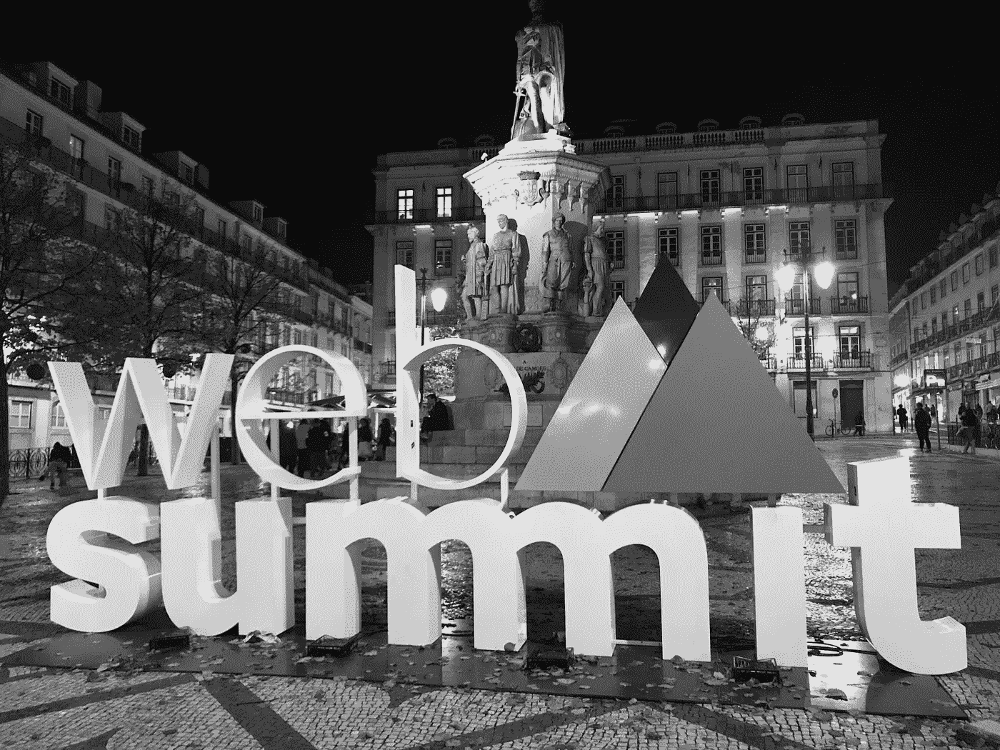
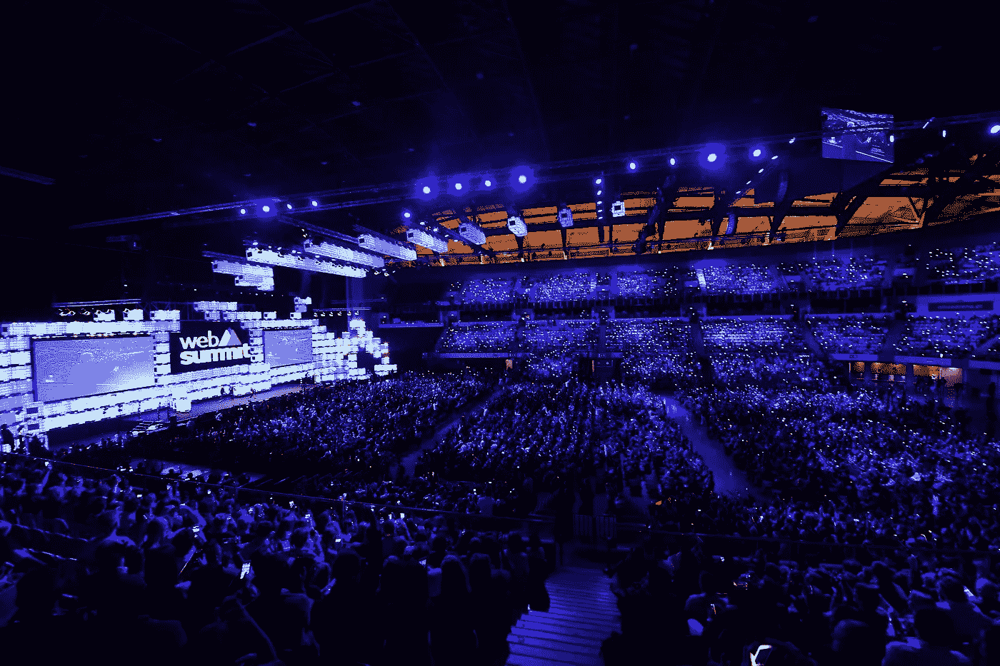
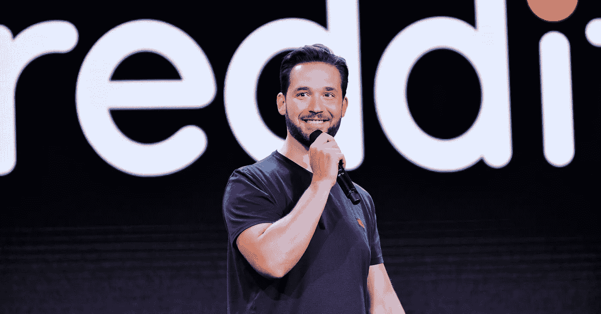

# 网络峰会，里斯本 2018: 5 个收获

> 原文：<https://medium.com/swlh/web-summit-lisbon-2018-5-takeaways-6d5c3a5a9c32>

安迪·斯努格斯，未来国王投资公司的管理合伙人。

今年在里斯本举行的网络峰会比以往任何时候都更大更好，有 69，000 人参加。随着更多的摊位、更多的舞台、更多的国际存在和更好的咖啡，这项活动越来越强大，现在已经成为全球创业公司的主要内容。

在 Altice Arena 的钢屋顶下代表未来的国王们呆了四天，听了演讲，并与商界人士会面，讨论我们的最低可行品牌计划，我从这次活动中有五点明确的收获:

## 1.网络使工作网络化。

虽然网络峰会是一个舞台和演讲的集合，其中大部分都保持在短短的 20 分钟内，但该活动的真正卖点是网络机会。他们的应用程序、公司摊位和国际吸引力使这里成为创意思维的沸腾之地。你肯定会在每个阶段听到一些有趣的见解，但如果你在寻找细节，安排会议来曝光你的业务并结识潜在的合作伙伴。然而，值得注意的是，除非你是投资者，否则安排与 alpha 和 beta 创业公司的会面可能会很困难。

## 2.AI 来了。

人工智能实际上接管了今年的网络峰会。人工智能——制造学习和推理的机器——似乎不仅仅是这个月的热门话题。从医疗技术到网络安全，它无处不在。投资者不再只是对这一领域虎视眈眈，他们用冰冷的现金支持它，拥有应用这一技术的新途径的初创公司可能会继续在全球涌现。

## 3.女人是认真的。

“你的员工越多样化，你的技术就越有可能更具相关性。”(SAP 在创业大学阶段)

据估计，今年 43%的与会者是女性，里斯本网络峰会比以往更加多样化。就个人而言，我自己投资了一位杰出的女性创始人，很高兴听到这些令人敬畏的创始人讲述女性对科技行业的明显积极影响。

## 4.共享成功的共享价值观。

*“房间里有一个不带感情色彩的第三方会有所帮助，因为这能让创始人保持专注。”(亚历克西斯·奥哈尼安在创业大学舞台上)*

我参加的最好的一次讲座是关于创始人合伙关系和共享价值观的重要性。创始人并不总是谈论创业公司存在的原因，这可能会把品牌的水搅浑。这让我想起了西蒙·西内克(Simon Sinek)的“从为什么开始”的论点，这也是我们作为一家品牌代理机构一直在谈论的事情，所以很高兴看到它在这样一个大平台上被谈论。如果你们互相交谈或者根本不交谈，你需要让第三方参与进来。品牌代理帮助开始关于公司是什么以及它为什么存在的对话，这样初创公司给市场的信息就清晰而有效。

## 5.粉碎它可以粉碎你。

“这种观点认为，除非你每天每时每刻都在受苦、劳累、工作，否则你就不够努力……这是目前科技领域最有害、最危险的事情之一。”(舞台中央的亚历克西斯·奥哈尼安)

亚历克西斯·奥哈尼安(Alexis Ohanian)在这次活动中发表了一篇更具洞察力的演讲，他非常公开地谈到了有毒的“追逐”文化对科技的影响。把工作看得比什么都重要只会让你痛苦。当然，这不是凭空而来的，奥哈尼安也不是告密者——科技领域的大男子主义文化是有据可查的，亚马逊自己的首席执行官杰夫·贝索斯告诉他的员工把客户放在午餐休息时间之上，不要再关注他们自己的需求。听到这一反驳令人耳目一新，希望观众中的许多创始人会重新评估他们公司文化的未来。

正是基于这一点，为了我自己的幸福，我将离开你，逃到酒吧看球赛。

*访问* [***未来之王风险投资***](https://www.futurekingsventures.co.uk)*’网站，了解我们如何利用品牌将雄心勃勃的初创公司的想法变成现实。*

## 这篇文章发表在 [The Startup](https://medium.com/swlh) 上，这是 Medium 最大的创业刊物，拥有+396，714 名读者。

## 在此订阅接收[我们的头条新闻](http://growthsupply.com/the-startup-newsletter/)。

