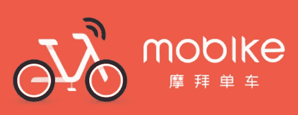
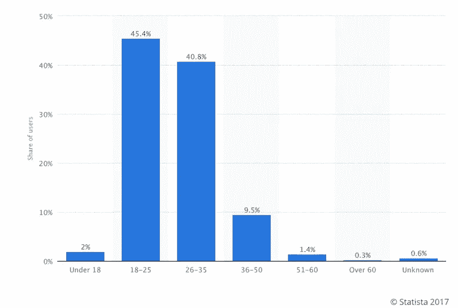
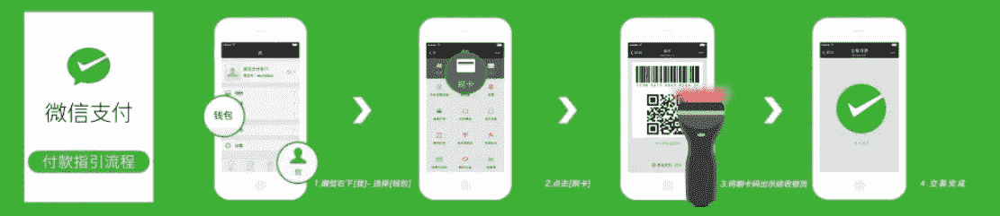
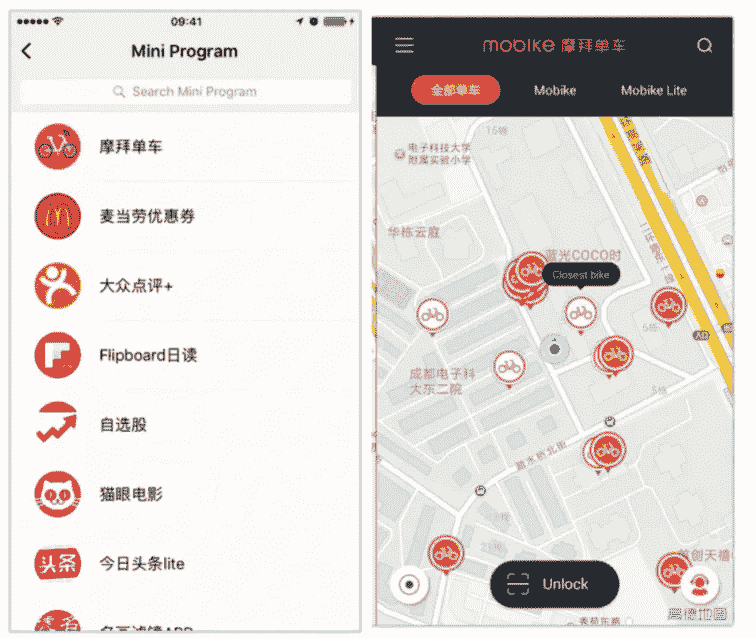
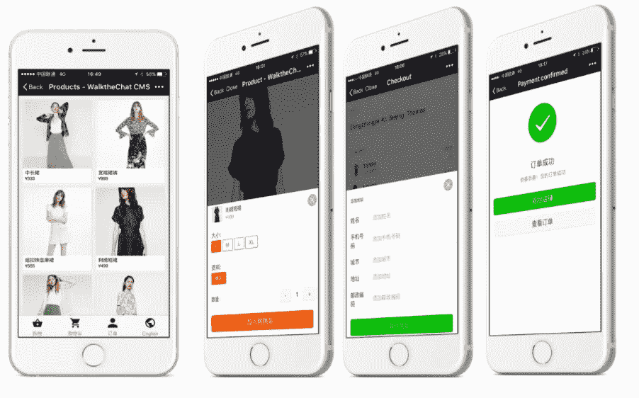
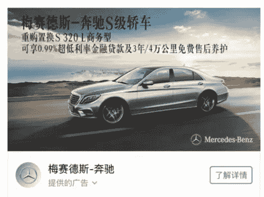
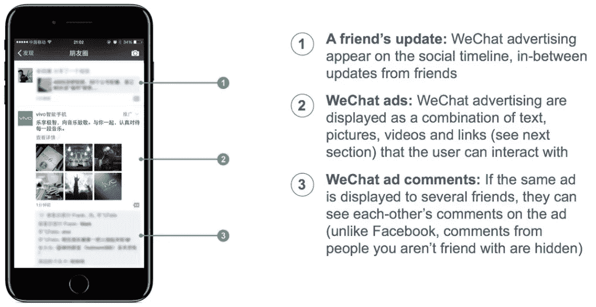
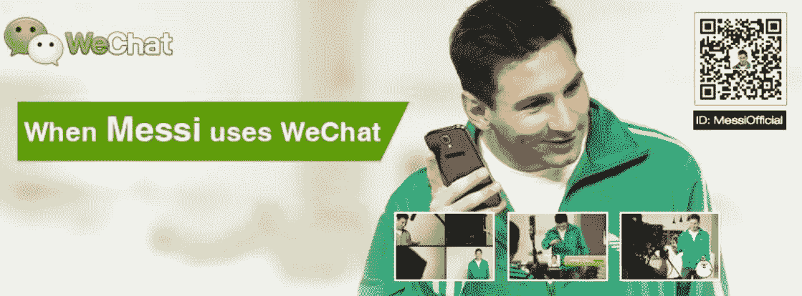

# 微信:中国最受欢迎的应用程序的演变和未来

> 原文：<https://medium.com/swlh/wechat-the-evolution-and-future-of-chinas-most-popular-app-11effa5639ed>

在中国，微信已经从一个语音信息平台发展成为一个真正无处不在的应用程序体验。该微信应用由母公司腾讯控股有限公司所有，每月活跃用户超过 9 亿。

这些用户也非常活跃；2016 年，平均每天花在该应用上的时间上升到 [66 分钟——脸书的日均时间是 50 分钟。](http://www.telegraph.co.uk/news/world/china-watch/technology/wechat-popularity-in-china/)

微信的增长也没有放缓的迹象。例如，通过广告、游戏和支付处理来利用这一庞大的用户群是一个巨大的、尚未开发的机会。

微信在中国被称为 Weixin，它的各种功能已经深深地融入了用户的日常生活。

因此，这就是现在所知的微信世界，它继续扩展到新的领域和日常生活的新方面。

在本文中，我们将尽力提供一些关于微信的过去、现在和未来的背景，主要关注以下问题:

*   微信从何而来？
*   微信 app 到底是什么？
*   谁通常使用该应用程序？
*   它能用来做什么？
*   微信的“迷你应用”有哪些？
*   为什么这么成功？它与西方同类产品相比如何？
*   营销人员需要了解微信的哪些内容？
*   品牌如何利用该平台进行广告宣传？
*   微信会在国际上扩张吗，还是它的巨大成功仅限于中国？

# 首先，一些背景:微信的历史

2011 年初，腾讯在其广州研究中心推出了即时通讯应用微信。

这个项目发展迅速，到 2012 年注册用户超过 1 亿。这种立竿见影的成功在一定程度上归功于拨打语音电话和留下语音信息的能力，因为在智能手机上输入汉字更难。

后来在国际市场更名为“微信”，这款应用很快开始包含更多功能。Moments 的加入是一个特别重要的里程碑，因为它带来了一个来自朋友和联系人的最新消息。从这里开始，腾讯增加了功能，并向外部开发者开放了应用。

# 因此，准确定义如今的微信应用比看起来要困难得多。

微信是社交领域的主要参与者，所以从这个意义上来说，它有点像脸书。这使它在中国与微博形成了直接竞争。它包含即时通讯，所以它像 WhatsApp。它有一个应用商店，所以它与苹果和谷歌有相似之处。

然而，这些比较并不能说明全部情况。

我们应该首先探索微信应用生态系统为近 10 亿活跃用户群提供的功能，然后才能总结它提供的体验。

# 微信 app 在国内可以用来做什么？

本质上，微信可以用来做任何你想在网上做的事情。虽然它并不拥有所有的产品，但它确实有助于中国大多数最受欢迎的应用程序之间的轻松集成。

在微信内部，有 Tinder、Seamless 和 Slack 等西方应用程序，以及数百种其他受欢迎的服务。

几个亮点是:

## 摩拜单车

这个自行车共享程序允许骑自行车的人使用他们的微信钱包支付骑行费用。它类似于世界各地城市的自行车共享计划，除了一点不同:它不需要停靠站。

自行车可以停在大城市的任何地方，这无可否认地造成了一些困难的取车点。摩拜单车不归腾讯所有，但其功能存在于微信应用中。

## 贡献你的一步

这个迷你应用程序允许用户每天每走 10，000 步就向慈善机构进行小额捐赠。每走一万步，用户可以捐 1 元，大致相当于 15 美分。

还有一个排行榜，向用户展示他们如何与他们的朋友进行比较。所有这些都鼓励人们坚持锻炼，并向慈善机构捐款。

# 谁用微信 app？

据 Statista 称，微信对 20-35 岁年龄段的人有着压倒性的吸引力:

这也许是意料之中的，尽管趋势特别明显。

真正让微信与众不同的是大量用户使用它的频率。

**60%的用户每天打开 app 超过 10 次，21%的用户每天打开微信超过 50 次。**

所有这些时间累积起来。17%的用户每天在微信上花费 4 小时或以上。这是一种令人上瘾的体验，提供了人们想要的一切，从游戏到巧妙的支付系统。

# 微信支付:微信的杀手级应用

微信支付，也被称为[微信钱包](https://www.clickz.com/how-chinas-wechat-wallet-is-going-global/93597/)，是用户的“数字钱包”，用于支付一切费用，无论是通过轻点手机还是通过相机拍照。

微信支付目前拥有超过 6 亿活跃用户，而其主要竞争对手阿里巴巴旗下的支付宝只有 4.5 亿。阿里巴巴在 2014 年之前一直是市场领导者，但微信应用集成的无缝特性使其占据了相当大的领先地位。

在微信支付内部，有很多选项。用户可以发送和接收礼物，支付租金，或向各种慈善事业捐款。

钱包里的钱也可以通过微信进行投资，因此这项技术的货币化可能性是无限的。

# 迷你程序:微信的“应用杀手”

迷你程序是微信试图解决移动设备上一个看似无法解决的悖论:人们在应用上花费大量时间，但他们总共只使用非常少的应用。

说服人们下载新应用也很困难；说服他们继续使用它们几乎是不可能的。超过 [25%的已安装应用程序](https://www.thinkwithgoogle.com/consumer-insights/mobile-app-marketing-insights/)从未被使用过。

# 微信迷你程序的真正魅力在于，用户不必下载一个应用程序就能使用它们。任何人都可以随时访问微信中的迷你应用。

这消除了用户对应用程序占用设备存储空间的担忧，无疑也是品牌的福音。预计未来消费者将在微信中使用更多种类的迷你应用。

这有点像谷歌的加速移动页面倡议，或 Android 即时应用程序。但与 AMP 不同，这不是开源的；迷你应用仅限于微信。

结合微信与中国一些最大零售商的合作关系(如亚马逊的同类公司 JD.com)，我们可以开始理解为什么这么多用户如此热衷于此。

# 微信包含搜索引擎吗？

从历史上看，百度一直是中国搜索营销的主导力量，以至于被称为“中国的谷歌”。

然而，这种情况可能会改变。从其在中国应用市场已经很高的地位来看，微信[最近宣布](https://qz.com/986448/a-new-search-engine-from-wechat-could-change-chinas-internet/)它将推出一个搜索引擎。这个名字相当缺乏想象力，叫做“搜索”，它将直接与百度竞争，同时也提供一些全新的东西。

微信的母公司腾讯也拥有搜狗(百度的次要竞争对手)，这至少会为这家新公司提供一些工程专业知识。

微信拥有如此多的个人数据，应用程序中一个受欢迎的发布平台，以及非常活跃的用户群，因此它有独特的优势来做谷歌和脸书迄今尚未能做到的事情。将社交与搜索结合起来，无疑会让微信在中国应用市场占据不可逾越的领先地位。

# 品牌如何在微信上做广告？

在微信上[有多种营销品牌的选择，要么是有机营销，要么是付费促销。](https://www.clickz.com/how-brands-use-wechat-for-impact-and-engagement/24149/)

尽管这些选项中有许多是非常标准的，并且适用于大多数社交媒体平台或搜索引擎，但仍有细微的差异。

例如，微信商店在一定程度上解决了脸书营销面临的持续挑战。整个购买过程包含在微信中，因此用户不需要从平台访问外部网站。

这对于转换率来说是非常好的，也是我们可以期待的其他社交网络在不久的将来的发展方向。

还有新的，创新形式的横幅广告。下面的例子摘自梅赛德斯-奔驰最近的一次广告活动，它允许用户定制广告，还能适应用户所在地的天气。

然而，广告仍是微信的新生领域。付费推广从 2015 年才开始，广告仅占腾讯收入的 15-20%。

相比之下，广告占脸书收入的 70%以上。

然而，预计到 2018 年，这一数字将增加两倍多，年广告收入将达到 110 亿美元。

# 微信能扩展到中国以外吗？

有人会说它已经有了，在中国以外有超过 1 亿的注册账户。然而，当我们讨论微信时，我们处理的数字是如此之大，以至于微信要被视为国际成功还有一段路要走。

这些国际账户大多由移居海外的中国人持有，但微信已开始在南美和非洲获得一些地盘。

就前者而言，以莱昂内尔·梅西为主角的广告活动肯定不会损害他们的知名度。

非洲也是扩张的重点地区。这既适用于微信，也适用于中国政府，这两股力量是相互关联的。

随着越来越多的中国工人前往非洲从事政府资助的项目，他们往往会带着对微信的热爱。仅在南非，现在就有超过 500 万微信用户。

此外，据[报道](http://shanghaiist.com/2017/05/18/foreigners-love-wechat.php)，在中国的外国人比本地人更加沉迷于这款应用。因此，这可能有助于扩大微信在西方市场的影响力。

现实是，微信不太可能在美国站稳脚跟。它的成功依赖于它对日常生活诸多方面的所有权，而这种所有权在现阶段几乎不可能与谷歌或脸书相抗衡。

这可能还有另一层含义。

一项广泛的[研究](http://www.bbc.com/future/story/20170118-how-east-and-west-think-in-profoundly-different-ways)凸显了中国和美国消费者对各自环境的不同认知。美国人会关注图像中的人物，而中国人通常会更多地关注背景和周围的事物。

这种文化差异可能是微信在中国成功的一个小因素，而它在西方缺乏一个对等的东西。中国消费者对包罗万象的整体视角的偏好，与微信生态系统的影响力非常契合。

# 概括起来

微信的成功建立在将自己的方式融入用户的日常生活，并整合他们所有最受欢迎的品牌和服务。这一切都由一个可靠、无缝的支付系统联系在一起。

我们倾向于首先想到广告，但微信迄今为止在没有利用平台广告潜力的情况下取得了巨大成功。通过首先建立一个参与(在某些情况下，上瘾)的用户群，它现在处于一个至高无上的地位，为他们提供有用的广告。

随着搜索引擎的出现和大量数据的处理，微信将继续快速增长。这可能不会转化为国际成功；但坦率地说，腾讯目前并不完全需要它。一个数字品牌在中国的机会本身就足够了。

*最初发表于*[*【www.clickz.com】*](https://www.clickz.com/an-introduction-to-wechat-the-evolution-and-future-of-chinas-most-popular-app/111401/)*。*

## 这个故事发表在《创业公司》杂志上，有 263，100 多人聚集在一起阅读 Medium 关于创业的主要故事。

## 在这里订阅接收[我们的头条新闻](http://growthsupply.com/the-startup-newsletter/)。

