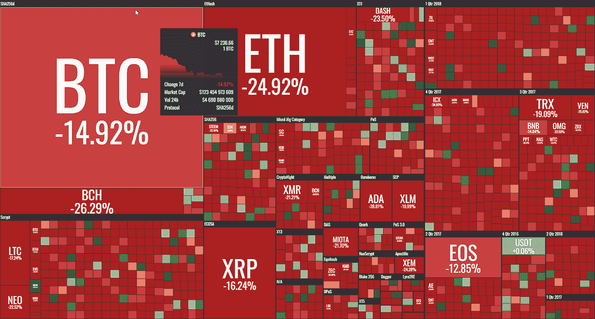

# “每周什么改变了加密”由 Alte。首都——2018 年 5 月 21 日至 28 日

> 原文：<https://medium.com/swlh/weekly-what-changed-in-crypto-by-alte-capital-21-28-may-2018-f3e2eae1f2a6>

## 最重要的东西，我们已经看到了前一周在密码世界与个人想法

# **全周主要车手**

就价格而言，这是 crypto 糟糕的一周，我们看到了一些有趣的趋势。一些人将价格下跌与 EOS 在长期持续的 ICO 期间倾销其收到的 ETH 联系起来。这看起来非常奇怪，确实可能是 EOS 的某种市场操纵。他们已经被指控从事洗钱交易。

Weekly 21–28th May 2018 crypto performance (by coin360.io)

**另一个需要注意的是，51 %攻击在市值较小的硬币上变得更加流行。**看起来黑客更容易发起这样的攻击，因为他们正在从以前的攻击中获取知识和经验。这对于具有 POW 算法的硬币来说可能是危险的，POW 算法没有太多的矿工，并且散列功率或网络与硬币大小写相比没有那么大。在接下来的几周里，我们将会看到更多这样的袭击。

**最后，MaidSafeCoin (MAID)项目发布了一个好消息。**团队宣布发布一种新的共识机制(称为 PARSEC)的白皮书和规范，这种机制使没有中央权威的网络(分散网络)能够就一种状态达成一致。这看起来非常有趣，因为与目前 BFT 共识的**集中式**(例如 EOS 和 NEO)解决方案相比，这应该允许使完全**分散**的区块链具有大吞吐量(每秒事务数)。它仍处于发展的早期阶段，但这是一个很好的起点。

# 重要加密事件 2018 年 5 月 21 日至 28 日

北美证券管理协会(NASAA)于 5 月 21 日周一宣布，美国和加拿大的州和省级证券监管机构协调了一系列执法行动，以打击欺诈性 ico、加密货币相关投资产品及其背后的人。自 5 月初以来，该行动导致了近 70 项查询和调查以及 35 项与 ico 或加密货币有关的待决或已完成的执法行动。[全单在此](http://www.nasaa.org/45121/state-and-provincial-securities-regulators-conduct-coordinated-international-crypto-crackdown-2/)。

**边缘(XVG)被 51%攻击命中。**看来这次攻击是由于 Verge 的安全问题造成的。开发人员没有对之前的漏洞进行适当的修补。在之前的黑客攻击中(早在 2018 年 4 月)，使用了非常相似的方法，攻击者成功“打印”了 35，000，000 XVG(约 150 万美元)。

美国司法部对涉嫌比特币价格操纵展开了首次刑事调查。据报道，该调查正在调查交易商通过欺骗或向市场充斥虚假订单来操纵比特币和其他密码的价格。在受监管的市场中是非法的，但在密码世界中几乎不可能被追踪。

**英国央行再次公布关于央行发行数字货币的工作文件。**本文包括金融稳定问题的各种情况以及中央银行加密货币可能带来的风险。与此同时，其它银行也宣布，它们正在研究推出国家加密硬币。

**德国商业银行(Commerzbank)和蒂森克虏伯(ThyssenKrupp)已经开始使用 Corda** (允许构建私有区块链的开源项目)来结算区块链的外汇交易。这表明区块链技术的采用正在缓慢推进。

南非中央银行声明加密代币不是一种货币，它们不符合南非对货币的要求。与此同时，南非储备银行的金融科技部门正在研究监管和政策。

**阿什顿·库彻在电视直播节目中捐赠了 400 万美元。库彻和盖伊·奥塞里——他的商业伙伴，也是麦当娜、U2 和艾米·舒默等人的经理——代表 Ripple 向艾伦捐款，并转让了 XRP。你可以在这里看这个:**

**感谢您阅读至此。**

> “加密中的变化”将于每周一发布！

**关注我的**[**Twitter**](https://twitter.com/Alte_Capital)**如果你将来对这些更深入、更翔实的文章感兴趣的话！**

## 这篇文章发表在[的《创业》(The Startup](https://medium.com/swlh) )上，这是 Medium 最大的创业刊物，有 328，729+人关注。

## 在这里订阅接收[我们的头条新闻](http://growthsupply.com/the-startup-newsletter/)。

