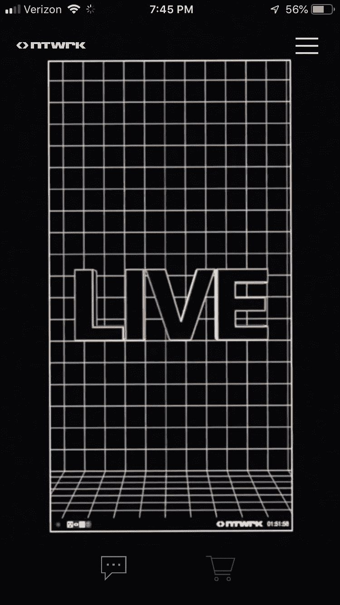
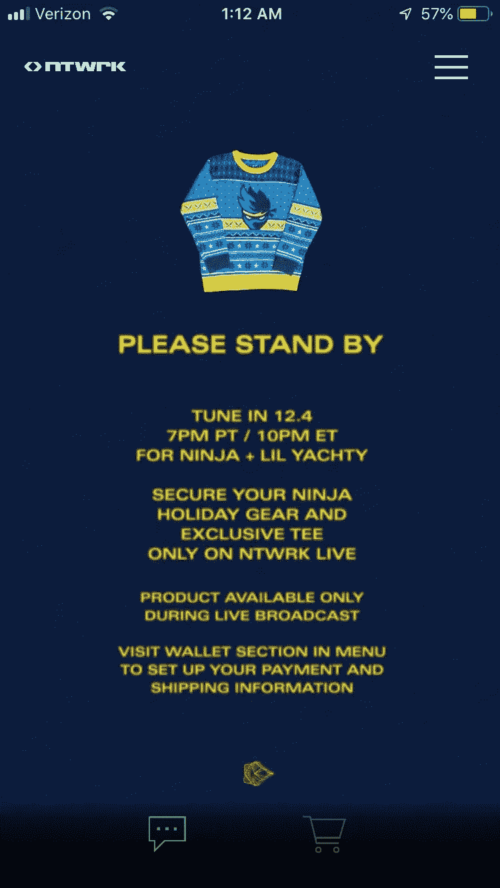
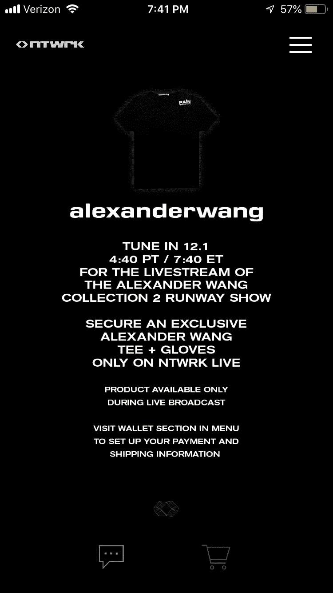
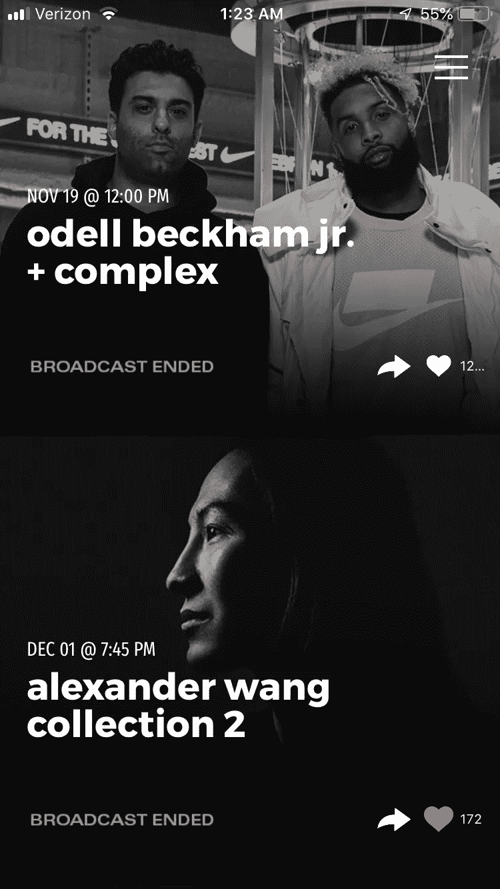
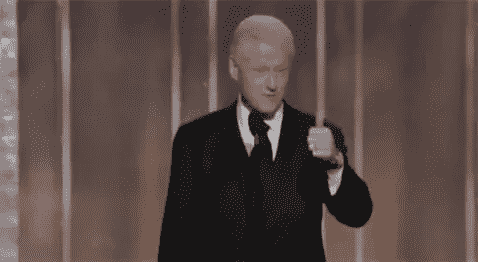

# 欢迎来到零售维修时代

> 原文：<https://medium.com/swlh/welcome-to-the-age-of-retailtainment-eafd1fe10686>

## 最新的购物影响应用“NTWRK”是一场更大运动的一部分，这场运动正在引领世界进入一个更有趣的电子商务销售策略时代，即所谓的零售销售。

在影响者营销的时代，消费和内容之间的界限正在不断模糊。

这是某种奥威尔式的反乌托邦，还是从购买的进化和娱乐的逆进化中诞生的丑陋的继子女？

*不管怎样:我来这里是因为 NTWRX 应用程序太美了。*

那么什么是“NTWRX”或“NTWRX”呢？

这是一个基于体验的购物应用程序，在与地球上一些最热门的影响者和名人的直播会议上销售独家产品。

**例子一:**

12 月 4 日的 lil Yachty + Ninja 秀，在此期间您可以购买独家赠品:

**例子二:**这个节目发生在 12 月 1 日，亚历山大·王(顺便说一句，不要以为我们没发现你把时间调慢了 5 分钟@NTWRX。注意第一张和第二张图中的时间变化):

郑重声明:这支球队值得他们赢得的每一份荣誉，因为他们正在做历史上很少有人能够完成的事情

# 同时娱乐和恳求。

## 这是一种罕见的销售技巧，历史上只有非常非常少的人做到过，主要是比尔·克林顿和性工作者。

但是 NTWRK 比布巴或你当地的妓女更胜一筹。

这更好，因为人们正在报名被征求。

*想一想……*

社会现在已经到了我们想要 ***故意*** 下载一个 app，看专注于让我们消费的直播的地步。

# 这相当于购买家庭购物网络的月度流媒体订阅。

这就像坐时光机回到 90 年代中期，我们可以看到家庭购物网(HSN)赞助布列塔尼·斯皮尔斯的演唱会，来销售她的香水系列。

HSN 的某个高管可能正在尖叫着 FML 抓住这个巨大的/错过的机会。

毕竟，HSN 是如此接近以 NTWRK 即将达到的方式实现保留率。

最终，HSN 将被远远甩在身后，但由于人口统计学上的差异，这不会像你最初想象的那么快。

郑重声明，如果这不明显的话，我很生气我有多喜欢 NTWRK。

这个概念是如此的**辉煌**和**在一个设计完美的应用程序上完美的执行**。掌声送给制作这个的 UI peeps。

**因为圣女 F$ >王者$冲击美国。**

(你还没准备好在这个应用上想买多少东西)。

但是我在道德上对喜欢它感到矛盾。

作为一名营销人员和经常思考设计和策略的人，我喜欢它。它做了很多正确的事情:

**除了 NTWRK 令人惊叹的设计，它还触及了一些其他高收益的销售策略:**

1.  奇怪使用的时隙计时。晚上 7 点不如 7 点 40 分有纪念意义。
2.  “卖完了”,这也是为什么我的女朋友想购买所有卖完的东西的部分原因。
3.  排他性:你只能在*现场直播*期间获得这些物品

# 所以，恩，干得好。早期种子投资者，你说得对。有影响力的人，早点进来。

但是准备好你的口袋书，美国，因为他们来找你了

**BountyBase 是安德鲁·麦伦创建的博客**

## 这篇文章发表在 [The Startup](https://medium.com/swlh) 上，这是 Medium 最大的创业刊物，拥有+395，714 名读者。

## 在这里订阅接收[我们的头条新闻](http://growthsupply.com/the-startup-newsletter/)。

