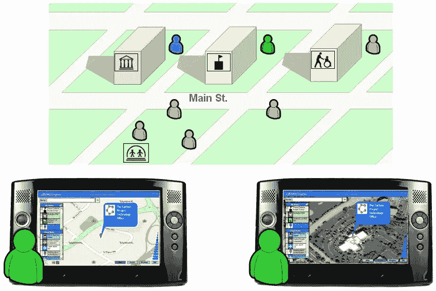
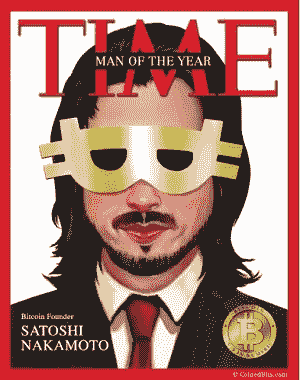

# 欢迎来到区块链

> 原文：<https://medium.com/swlh/welcome-to-the-blockchain-e2f0c760ec55>

## 对革命的快速而个人的了解

2005 年 8 月，卡特里娜飓风摧毁了新奥尔良市，造成了巨大的情感和经济损失。当我开始研究基于区块链的技术和 2017 年新增的一系列毁灭性飓风时，我想起了我在 2006 年卡特里娜飓风后参与的一个项目。当第一反应者寻找应对这类事件的新思路时。

该项目旨在开发一种基于位置的通信设备(运行在第一代平板电脑上)，不需要互联网基础设施。它使用了一个不起眼的微软点对点(p2p)工具包，使其能够仅使用内部 Wi-Fi 与其他设备共享信息。想象一下:一个自主和自我修复的通信设备网络，在今天和 2005 年可能是一个无价的救援工具。这些设备不依赖任何通信天线、手机或互联网基础设施。所需要的只是一个或多个其他设备的物理邻近性——对于面临灾难性情况的救援人员来说，这是一个宝贵且有弹性的通信平台和情况警报工具。

The P2P Situation Alertness project (2006)

我对我们开发的原型非常自豪。这很有效，也很神奇，但不幸的是，这个产品并没有成功。也许它有点超前了。但是，我一直希望再次与去中心化 p2p 技术相遇。因此，当与 Alex Mashinsky 在区块链的 Celsius Network T3 项目上合作的机会出现时，当我了解到区块链的核心是建立在类似的无服务器 p2p 技术上时，我一头扎了进去。只是后来才了解并爱上这个天才和这项技术的更大意义。

我一直相信，无服务器 p2p，一个没有单一监管机构的网络，有可能扰乱各种市场和行业，但当时没有人想到，它的第一次大规模成功将是挑战金钱！

**区块链 101**

对于那些不熟悉区块链的人来说，不要担心，尽管它最近很辉煌，但只有少数技术人员真正理解它。为了理解区块链的概念及其在金融系统中的应用，必须理解以下概念:每一笔非现金货币交易，例如使用信用卡的购买，都由银行记录在交易的“分类账”上。利用这些记录，银行调整我们财务账户中的资金总额。想象一下，一个大日记本，所有的交易都写在上面——谁向谁支付了什么。

Satoshi Nakamoto

因此，保存交易“记录”的概念是金融机构业务的一个关键组成部分。利用这一核心概念，在 2008 年的某个时候，神秘的中本聪提出了一个数字公共账本的建议。这种分类帐技术被称为区块链。

中本聪将数字分类账概念化，将数据存储在“块”中，然后将其固定到前一个块，或使用加密技术“链接”。这种链接防止任何人返回并更改记录。然后，使用分布式 p2p 网络在计算机之间共享这个数字账本。交易顺序及其有效性的“真相”是通过参与对等体(节点)之间的“共识”过程来实现的。

这个系统的天才之处在于，它解决了计算机科学在非集中式架构中无法解决的一个最大问题——双重支出。重复消费意味着这个系统容易受到人们不止一次消费他们的钱的攻击。假设你有一张 100 美元的钞票，你告诉一个商人以 100 美元购买他的商品，然后在系统记录第一笔交易发生之前，立即对另一个商人做同样的事情。因此，你花了 200 美元，却有 100 美元。区块链利用对分类账块的共识来防止这种情况。纵观区块链的历史，事实证明该系统是有效的，不能被篡改或欺骗(恶意攻击的目标是与区块链本身无关的漏洞)。

一些节点是试图找到密钥以便锁定进入分类帐的新分类帐块的计算机。这些节点也被称为“矿工”，他们成功找到一个公认的锁块的工作将获得硬币奖励。这被称为功的证明，描述了用于找到行进键的能量。使用和规划了一些新技术来挑战工作证明挖掘，但这超出了本简报的范围。

## **加密货币**

比特币是由一个区块链处理的原始加密货币的名称。它是使用 Nakamoto 的提案实现的，是当前领先的数字货币，市值约为 2300 亿美元(截至 2017 年 1 月 14 日)。2013 年，前比特币开发者 Vitalik Buterin 提出了一种基于软件而非简单货币交易的账本。提议的区块链发展成为开源以太坊项目，其中一个称为智能合同的脚本功能被嵌入到块中。

以太坊区块链是一个完全不同的生态系统，有自己的货币叫做以太。以太坊开启了一个全新的创新世界，不再局限于简单的金融交易。虽然新的竞争性可编程区块链正在出现，如 EOS、NEM 等，但以太坊是迄今为止最受欢迎和最大的经济体，仅次于比特币。

对于开发者来说，区块链编程最令人好奇的是，特别是像以太坊这样的图灵状态驱动系统，你必须(大部分)抛弃集中式软件即服务方法，考虑分布式简单程序——智能合约。分散设计需要一些重新调整。例如:需要关注匿名而不仅仅是隐私；将控制权和牵引力留给用户授权和所有权；调整商业模式，像免费增值这样的旧模式，关键是吸引人们并留住他们，直到他们被说服付费，现在已经过时了，区块链的货币已经成为产品的一部分。新的设计是关于生态系统的。考虑你的生态系统的效用和价值。为区块链设计解决方案时，伟大的李小龙曾说过“清空你的杯子”。

区块链时代仍处于起步阶段。老实说，区块链的效用仍然局限于安全的数字资产交易和使用私人令牌经济(ICOs)的筹款创新。但是这些都是非常强大的钩子，可以说比 90 年代中期互联网发展的支柱——电子邮件更强大。那些声称电子邮件是比电话或传真更有效的沟通方式的人，根本没有回忆起它在早期是多么糟糕。

自从第一个互联网浏览器(NCSA Mosaic)出现以来，区块链是思想和创新的沃土。我不能夸大区块链可能带来的根本性变化，不仅是在银行、信贷、保险以及任何与金融活动相关的领域——这些都是容易的诱饵。区块链可以很容易地影响我们的日常生活，例如，想象一下你从商店免费买到的电器，只有在使用时才支付微支付。或者在停车位上竞价的汽车。这只是我们现在可以想象的东西，但我们真的想象过 1994 年的优步或脸书吗？伟大的事情来了，加入这个对所有人开放的旅程。

## 这个故事发表在 [The Startup](https://medium.com/swlh) 上，这是 Medium 最大的企业家出版物，拥有 285，454+人。

## 订阅接收[我们的头条新闻](http://growthsupply.com/the-startup-newsletter/)。

