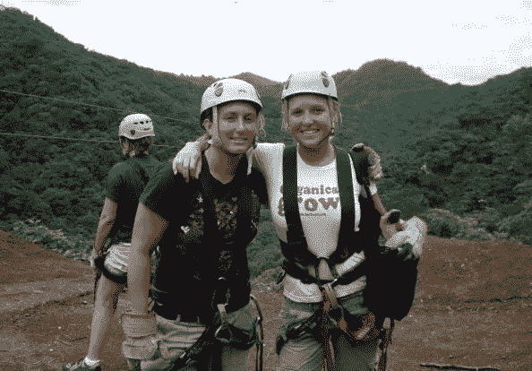
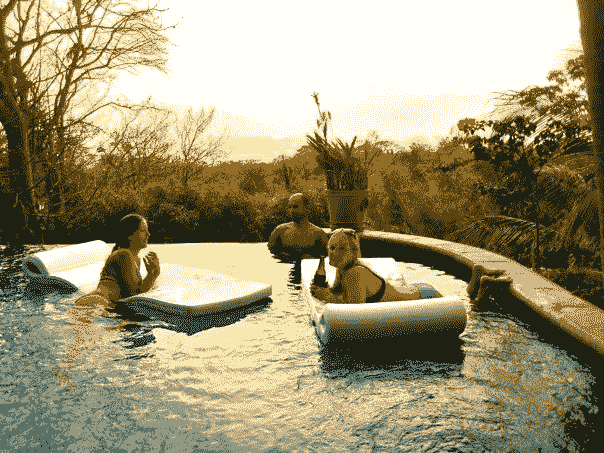
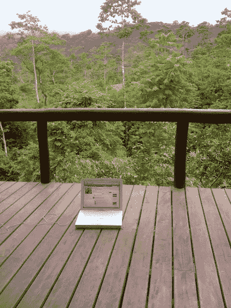
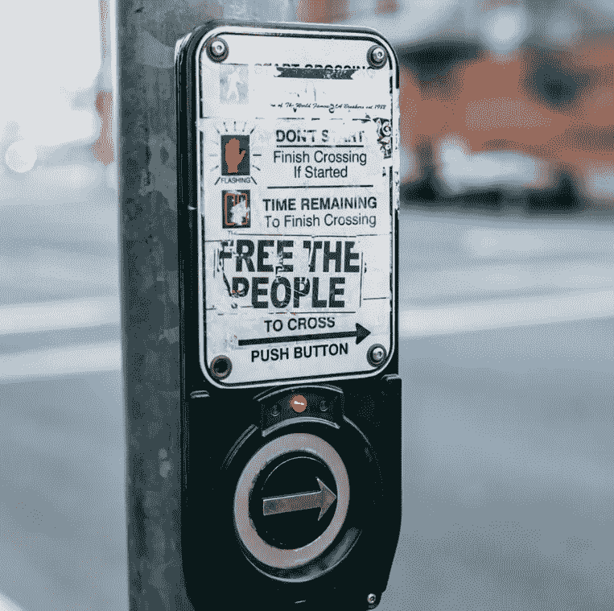

# 欢迎来到新常态:永远摆脱朝九晚五的生活

> 原文：<https://medium.com/swlh/welcome-to-the-new-normal-escaping-the-9-to-5-for-good-564e5808724c>

我是如何从研究生院走向数字游牧生活并且一去不返的。

Photo by [rawpixel](https://unsplash.com/photos/zPkqNnvMu2w?utm_source=unsplash&utm_medium=referral&utm_content=creditCopyText) on [Unsplash](https://unsplash.com/?utm_source=unsplash&utm_medium=referral&utm_content=creditCopyText)

# 想象一下:

*   向会议和公司着装说再见。
*   每天自然醒来。
*   不用排队就能去健身班。
*   消除您的日常通勤。(*高峰时间？那是什么？*)
*   无论何时，你都可以选择午休或者休假。
*   不用对老板负责。或者对任何人。
*   宣布你的周末开始和结束的时间。
*   能够随心所欲地环游世界。

这是越来越多的人面临的现实，他们放弃了有毒的朝九晚五的工作，转而追求笔记本电脑生活方式的主权和自由。这是 2018 年及以后工人们触手可及的现实。

听着——很有可能你已经意识到你不需要坐在办公室里完成工作。还有另一种方法——一种将激烈的竞争永远抛在脑后的方法。

L 作为一个数字流浪者，生活有点像生活在世界末日，但这是一种好的方式。当大多数人被困在他们的小隔间里时，你可以享受不拥挤的街道和你最喜欢的餐馆里的开放的桌子。如果你带着笔记本电脑，那张桌子也可以兼作一张很好的书桌。

感觉你在欺骗系统——因为你确实是。

没人告诉你这是可能的。

没有教科书，没有政治家，没有教授，没有职业顾问…没有人。

没有人说你可以按照自己的方式生活，做任何你想做的事情来赚取薪水——尤其是不用踏进办公室一步。然而，这就是我在整个职业生涯中所做的。

Costa Rica 2006

# 这一切是如何开始的

我的生活一开始就很普通:美国中上阶层，有一个关系紧密的大家庭。就是那种每周日做完礼拜一起出去吃早餐的。

在成长过程中，我是一个典型的优等生:竞技运动员、啦啦队队长、学生会成员、返校节委员会成员、最优秀女生联谊会成员……应有尽有。我童年的简历读起来就像大学预科指南中的一页。我正朝着实现经典的美国梦前进。直到我不是。

就在我进入商学院第一学期的几个月里，我经历了严重的倦怠。它在亚特兰大机场 b 航站楼的地板上以癫痫大发作的形式出现。我为自己设想的白色栅栏在两分钟内倒塌了。当你在 21 岁时被诊断出患有癫痫，感觉你的自我意识就像你的驾照一样被取消了。

> “如果我在开始第一份真正的工作之前就已经有了严重的健康危机，”我想，“我的中年危机会是什么样的？”

我别无选择，只能改变路线。我决定搬到哥斯达黎加，在房地产行业工作，而不是在一家领先的市场研究公司任职。

我的教授、职业安置顾问和同学们都惊呆了:“你会毁了你的简历的，”他们警告说。在他们眼里，我是在丢掉一份昂贵的教育，一份有价值的工作头衔，和很多潜力。

> 当我可以在公司里往上爬的时候，为什么要在第三世界国家为区区几分钱而工作？

幸运的是，我忽略了它们，并发现了与位置无关的非凡世界。这正好是*四小时工作周*出现在书架上并暗示未来的两年前。

在中美洲生活和工作了几个月后，我意识到一些事情永远改变了我的看法。我的客户——我曾经渴望效仿的 60 多岁的千万富翁商人和退休人员——全都错了。

理论上，他们“成功了”毕竟，这些人有 6-7 位数的可支配收入来投资海滨房地产。但事实上，他们花了一生的积蓄来模拟我每月 1000 美元的生活。

一切都很落后。

***但这怎么可能呢？他们做的每一件事都是对的——工作了一辈子，存钱，发财，按时退休。但是在这里，我年轻了 40 岁，享受着他们收入的一点点乐趣。***

有些事情不是非常正确就是非常错误。

Happy Hour in Costa Rica, 2009

# 选择我的视角

我认为我是对的。毕竟，你的感知就是你的现实。我无意中进入了一种还不太可能的生活方式。在#lifehacks 出现之前，我无意中侵入了这个系统。在研究生院耗尽精力帮助我找到了某种金奖券。

我住在能看到海景的 2 层房子里，骑着 4x4 去上班，整天穿着人字拖。我日出时去练瑜伽，日落时去冲浪。反之亦然。

与此同时，我在美国的老同学每周工作 80 小时，升职或在拉斯维加斯度长周末的诱惑让他们继续工作。

当我在国外的第一年结束时，我评估了形势。

> 我为什么要为了一个小隔间和一个更好的职位放弃这一切？

# 所以，我留下了。

我努力克制向同伴压力、担忧的父母和社会期望屈服的冲动。我走上了当时很少有人理解的自己的路。从那以后我一直在国外。

它有起有落。我享受了哥斯达黎加的房地产繁荣，然后安然度过了尼加拉瓜的金融危机。我去过超过 55 个国家，交了成千上万的朋友。2011 年，我从房地产行业退休，创办了我的第一家在线企业[，一家为在线扑克玩家服务的搬迁公司](http://pokerrefugees.com/)。

生活挺好的。我仍然在这里，做我的事情，在阿姆斯特丹的一个时髦的咖啡店里写这篇文章。从我开始这段旅程到现在已经 13 年了。

我在这里告诉你们所有人——一个更好的方法是可能的。而且时机正好。成为职业环球旅行家的想法正在成为主流。

“Facebook in the Forest” — Photo by Kristin Wilson, Costa Rica, 2008

# 为什么是数字游牧民，为什么是现在？

你可能在想——*“谢谢，克里斯汀！你怎么这么久才开口？”*

嗯，后知后觉是 20/20。早在 2005 年，互联网还在发展。脸书只面向大学生，而第一代 iPhone 还需要两年时间。

我也花了一段时间来高度确定自己离开大学的决定是正确的。我没有资格说服任何人相信我所做的是对的，或者他们也应该这样做。但是我现在长大了，也更聪明了。

有了今天的技术和[远程工作能力](https://entrepreneurs.maqtoob.com/its-time-for-companies-to-embrace-remote-work-40d1a0caa01e)，对于人们来说，现在是抓住机会的最好时机。没有必要感到停滞不前或害怕你的未来。在生活中做你想做的事情的门槛从未如此之低。

Thoughtful waters — Photo by [Luke Dahlgren](https://unsplash.com/photos/ZT8W5eptT3U?utm_source=unsplash&utm_medium=referral&utm_content=creditCopyText) on [Unsplash](https://unsplash.com/?utm_source=unsplash&utm_medium=referral&utm_content=creditCopyText)

# 第一课

从柏林到巴厘岛，我在哥斯达黎加的第一年学到的教训不断浮现在我脑海中，那就是你不应该等待。

不要为了一个不确定的未来结果来为你目前的痛苦辩护。不要牺牲自己去安抚别人。

即使你被期望接管家族生意或者成为一名医生，记住你只有一次生命。你不必等到重大健康危机或其他警钟来提醒你。

你也不必屈服于他人的压力和预期。万一你的家人或朋友真的因为你外出追寻梦想而抛弃了你，那就顺其自然吧。

太多的人停留在他人期望的范围内。我父母过了整整 8 年才不再问我什么时候搬回家。他们几乎用了同样长的时间才不再问我哥哥什么时候会放弃摄影回到大学。

> 我前任的父母可能还在要求他放弃交易密码，完成他的工程学位。

我们三个都无视父母的意愿，我们非常开心。

我不是说你应该跟随我们的领导，但是想想如果你做了你想做的事情和为其他人而活会发生什么最坏的情况。

在他的书 [*意志力不起作用*](https://www.amazon.com/Willpower-Doesnt-Work-Discover-Success/dp/0316441325) 中，Medium extraordinaire [本杰明·p·哈代](https://medium.com/u/5153880ce2ee?source=post_page-----564e5808724c--------------------------------)说，

> “(你需要)做出的真正决定是切断任何与(你的)目标相抵触的关系。”
> 
> “从你的生活中移除重要的人，比如朋友，甚至家庭成员，会非常困难。这并不意味着你必须永远驱逐他们…你能做的最好的事情就是给他们做个好榜样。如果你的生活水平低于你认为应该达到的水平，你就不能成为一个好榜样。”

Photo by [Tyler Nix](https://unsplash.com/photos/ExOUvOcYb4A?utm_source=unsplash&utm_medium=referral&utm_content=creditCopyText) on [Unsplash](https://unsplash.com/?utm_source=unsplash&utm_medium=referral&utm_content=creditCopyText)

# 下一步做什么

听着，伙计们——证据就在布丁里。不受地点限制的自由生活方式是可行的。太棒了。我现在可以肯定地说。

所以，我在这里，传播这个消息:

> 你不需要做你讨厌的工作。

今天，无论你是为自己还是为别人工作，你几乎可以在任何地方完成任何任务。如果我能在 2005 年用 512kb 卫星互联网连接和诺基亚手机做到这一点，你现在就能做到。

敞开你的心扉，接受无国界生活的可能性和现实性。

## 有兴趣了解更多关于数字游牧生活方式的信息吗？在我的媒体简介、[上阅读更多](http://bit.ly/TravelwithKristin)[文章，订阅我的 YouTube 频道](/@kristinmwilson)，或者[加入我的脸书远程工作者团体](https://www.facebook.com/groups/digitalnomadsuccess/)！

## 这篇文章发表在 [The Startup](https://medium.com/swlh) 上，这是 Medium 最大的创业刊物，拥有+ 376，225 名读者。

## 订阅接收[我们的头条新闻](http://growthsupply.com/the-startup-newsletter/)。

