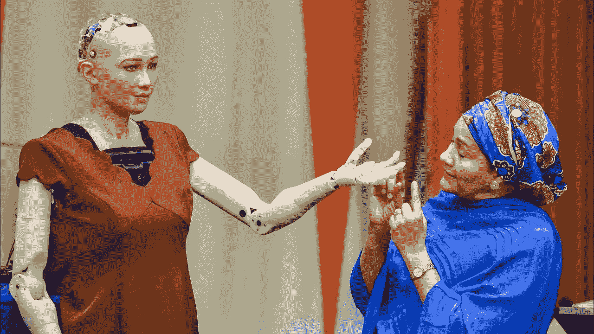
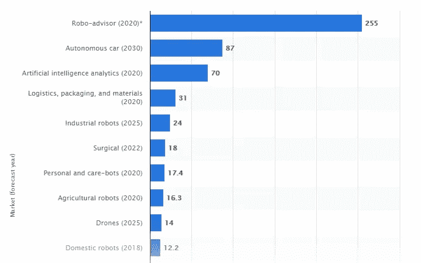
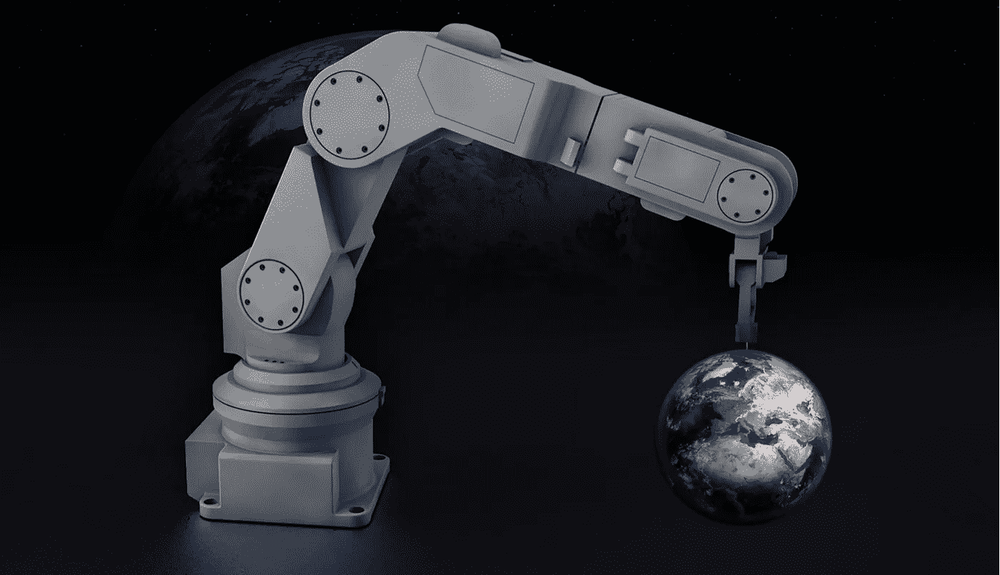

# 嗯，苏菲很聪明——但这对我们有什么用呢？

> 原文：<https://medium.com/swlh/well-sophie-is-clever-but-what-use-is-this-to-us-5849c98d8f98>

哇，她的确比我的一些熟人更风趣！*当我第一次在电视上看到她时，我也是这么想的。人工智能机器人索菲娅是汉森机器人公司的一个创造，第一眼看上去确实令人印象深刻。她开玩笑，她演讲，最近她甚至宣布她想要一个孩子！看起来很不错，但是…它有什么实际价值呢？*

# 傀儡还是配偶？

怀疑论者断言她不过是另一个[傀儡。这是一种夸大的感觉——也许，甚至是对这个世界的一点嘲讽，在这个世界上，你有时仍然可以听到中世纪的说法，大脑甚至对真正的女性来说都是可选的。尤其是考虑到索菲娅是这个国家的公民，而这个国家的妇女享有的权利比她少得多。](https://hackernoon.com/what-do-sophia-the-robot-and-miss-piggy-have-in-common-dd8651685b96)

相反，创作者表示，机器人索菲是机器人技术和人工智能的突破性结合，不亚于一个旨在服务和娱乐人们的真正的电子女孩。渴望与人类交朋友，乐于教育孩子和赡养老人。嗯……你还记得那个关于一个更聪明的创造者的故事吗？他只是想给一个小伙子一个好的女伴。…

但玩笑归玩笑，人类真的能从这样的伙伴和仆人中受益吗？神经科学家对此表示怀疑，至少在友谊和其他关系领域是这样——最近几十年也是如此。尽管今天的人工智能越来越多地模仿人脑，但机器仍然离像人一样思考和感觉太远了。他们以自己的方式学习和发展。这意味着无论它们有多聪明，它们总是与我们不同，永远不会掌握某些特定的人类特征。

# 钢铁守护者

尽管同情的能力如此有限，但至少对某些人来说，机器人不是更好的选择吗——比如，让我们记住我们这个时代最伟大的人物之一斯蒂芬·霍金的不幸一生？而不一定是人形。人工智能机器人可能看起来与流行的看法大相径庭。帮助人们移动机器人肢体的大脑植入物。

另一个有可能被机器人仆人解决的人类问题是全球老龄化人口的增加。为老年人服务的机器人助手可能仅仅需要 10 年的时间，原型已经在几个实验室中开发出来了。到目前为止，开发人员的主要目标是教会机器人完成日常任务。这将节省人力，让人类看护者有更多的时间专注于更多的个人工作。这种机器帮助人们挣扎轮椅和床，及时吃药，折叠毛巾，并作为宠物般的伴侣。

# 机器人和人工智能应用的其他领域

医疗保健和护理并不是人工智能机器人获得动力的唯一领域。下图显示了 [Statista](https://www.statista.com/statistics/621656/worldwide-artificial-intelligence-robotics-segment-estimates/) 机器人和人工智能全球市场规模估计，基于 2018 年至 2030 年的预测(以十亿美元计)。正如我们所见，人工智能正在逐步接管的领域包括机器人咨询(提供自动化财务规划和预测的服务)、运输和分析。

人工智能机器人最大的影响之一可能是在农业领域。这已经发生了。例如，[蓝河科技](http://www.bluerivertechnology.com/)已经教会机器人根据视觉数据判断植物是否有害，以及是否应该使用化学杀虫剂。鉴于目前这种决定是在逐块田地的基础上作出的，而不是一个工厂一个工厂地作出的，其优势是显而易见的。

重工业、微电子和应用等领域对工业人工智能机器人的需求也在不断增长。在这里，机器人有助于解决劳动力成本高、缺乏熟练劳动力以及快速工业化等问题。生物计量、法医、安全和监控、工业质量检测、地球科学和污染监测等领域都需要智能机器。

当然，无论机器人技术发展得有多快，需求有多大，都会有阻碍进步的障碍。制约机器人技术进一步发展的因素主要包括不愿采用新技术、缺乏标准化的风险防范法规以及机器人成本过高。市场中的主要挑战与对数据保护和网络安全的担忧有关。

# 人工智能机器人在短期内

如果谈论技术，机器学习(使机器人能够从不同来源自主学习)预计将在最近几十年占据人工智能机器人市场的最大领域。在不久的将来，机器学习预计将在语音和图像识别、语音搜索、情感分析和运动检测人工智能应用等领域得到最深入的发展。

这将导致软件市场的增长。AI 机器人需要几种类型的软件，包括语言、语音、视觉和传感器数据等程序接口。

到目前为止，开发[机器学习算法](https://stfalcon.com/en/blog/post/deep-learning-benefits-and-challenges)的专家数量有限。人工智能机器人市场目前由软银(日本)、汉森机器人(中国)、亚马逊(美国)、Alphabet(美国)和英伟达(美国)主导。尽管越来越多的小公司正在崛起，但这将有望在不久的将来使机器学习、机器人技术和人工智能应用更加适用于大量的企业。

人工智能机器人的进一步发展是不可避免的。我们可能会详细讨论它是好是坏，我们是应该给它一点掌声，还是应该听从埃隆·马斯克的建议，采取一切必要的预防措施——但实际上，就像在曼涅日一样，要么你驯服这匹马，要么它会踩死你。如果机器人变得越来越聪明，那么，可能是时候考虑如何利用它了。我们在 Stfalcon.com随时为您服务，支持新技术在您的业务中的应用。

# 【stfalcon.com】最初发表于**。**

**

## *这个故事发表在 [The Startup](https://medium.com/swlh) 上，这是 Medium 最大的创业刊物，拥有 313，216+人关注。*

## *在此订阅接收[我们的头条新闻](http://growthsupply.com/the-startup-newsletter/)。*

**