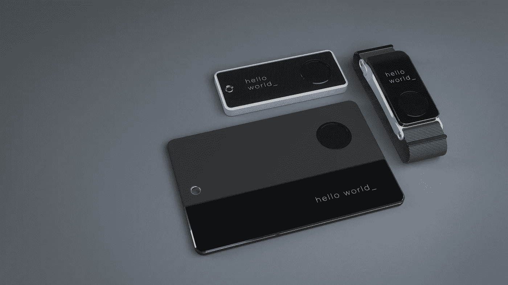

# 开发下一代可穿戴设备

> 原文：<https://medium.com/swlh/werab-developing-the-next-generation-of-wearable-devices-2a07a1d48dde>

在过去的几年里，智能手表、健身带和物联网设备变得越来越受欢迎，这使得不同细分市场的客户尤其容易获得它们。这使得可穿戴和微型嵌入式设备成为消费电子生态系统不可或缺的一部分。围绕传感器、支付、访问控制和无线通信构建的新用例正在接受测试，并且每天在[Kickstarter](https://www.kickstarter.com/projects/asdffilms/gest-work-with-your-hands?ref=discovery&ref=discovery&term=wearable)上[推广](https://www.kickstarter.com/projects/96149818/airesone-junior-monitors-your-child-for-your-peace?ref=nav_search&result=project&term=wearable) [。](https://www.kickstarter.com/projects/775959701/insta-ring?ref=discovery&term=wearable)

Concept renders

有一点没有改变，那就是这些设备的开发和原型制作方式。除非你是为一个主要平台(Apple Watch，Android Wear)开发，否则你很可能会遇到耗时的、简单的软件开发工具。让我们不要忘记那些原始的、未经测试的 API 和硬件，您将需要集成它们。通常你会发现你是第一个试驾特定硬件/软件组合的人！

简而言之，可穿戴开发(以及一般的嵌入式开发)的当前状态类似于 iPhone 革命前的智能手机。工具并没有真正针对应用程序开发人员的工作效率进行优化，许多组件是专有的，部署简单的解决方案需要大量的团队工作。

Wristband form factor evolution

幸运的是，有像 Arduino 这样的东西大大降低了准入门槛——然而，这些解决方案大多面向学术和研究市场。它们并不是真正用于最终产品开发，而是用于快速破解和实验。

在 YND，我们相信这些“黑客”在原型开发的早期阶段是很棒的，但任何严肃的开发都应该在完全集成的开发系统中进行。这些系统赋予开发人员权力，并交付可预测的结果。类似于 iOS/Android 的系统，开发人员可以使用强大的高级面向对象 API 来快速开发他们的代码。

这就是为什么我们问自己，我们是否可以做些什么来改善现状，并为具有 iOS/Android 经验的开发者提供轻松使用可穿戴设备的可能性。

这个问题只有一个答案，而且是一个响亮的“是！”这正是我们开始这个项目的原因。

# 乐队

我们的项目是关于两件事:一个标准尺寸的健身带，带有我们可以安装的最大数量的传感器和电子设备，结合高级开发框架(操作系统)来访问组件并快速开发功能解决方案。

开发人员可以使用以下主要功能/子系统:

*   BLE(蓝牙低能耗)
*   NFC/RFID
*   显示
*   全功能 IMU(加速度计/陀螺仪/磁力计)
*   电池
*   彩色 LED
*   纽扣
*   闪存存储

我们特别兴奋的一件事是集成了 NFC 和 LORA。虽然其他传感器(IMU，BLE)在各种硬件中以类似的形式广泛存在，但 NFC 和 LORA 很难实现。因此，我们很高兴成为第一个以有意义的方式公开这些子系统供其他开发人员使用的人。

Custom board layout

# 发展体系

为了最大限度地提高开发人员的工作效率，我们设计了一个分布式架构，两个微处理器同步通信。

1.  第一个是“系统处理器”，它管理标准事件、硬件通信、有效的电池使用以及驱动程序集成的复杂底层问题。把它想象成整个解决方案的“操作系统”，时刻运行，控制一切。
2.  第二个是“应用处理器”,运行由应用开发者开发的实际代码。当不需要工作时，CPU 会自动进入睡眠状态(允许最大的功率效率)。

由于这种双层架构，我们能够将应用程序开发人员与复杂的基础隔离开来，并提供一个可靠、实用的顶层，提供应用程序开发者关心的高级访问。

与 iOS/Android 类似，我们使用现代开发范式以面向对象的方式提供所有功能(不像传统的嵌入式开发，它主要是过程驱动的)。我们仔细研究了苹果的 iPhone 硬件 API，并对我们的结构进行了类似的建模，以便经验丰富的移动开发人员能够有宾至如归的感觉。

最后，我们的 API 是标准的面向对象 C 语言，但是我们也通过嵌入在系统芯片上的 JS 虚拟机来公开 Javascript 层。

例如，要开始一个简单的 BLE 通信/扫描，您可以写:

只需几行代码，开发人员就可以完成通常需要数百行代码和数小时调试才能开始的工作。类似的 API 存在于系统的其他主要功能:NFC 通信、传感器数据访问、永久存储访问等。

# 下一步是什么？

我们开发这个供内部使用，作为一个可靠的平台，为我们在安全和支付生态系统中的客户快速迭代和交付原型和解决方案。

> 我们的目标是构建额外的测试硬件外形(带、卡、表链)，并允许更广泛的受众在平台之上开发，最终将操作系统嵌入到他们自己定制的硬件中。

Concept & different form factors

我们目前正在探索开发产品最终形状和形式的想法，但我们强烈认为，我们有一些东西将极大地增强可穿戴生态系统中的每个人——无论是 Kickstarter 企业家、学术研究人员还是类似于我们的机构，都希望为他们的客户快速部署可穿戴解决方案。

这篇文章是否让你对测试我们的平台感到好奇？让我们知道！这篇文章是我们在[*【YND】*](https://ynd.co/)*的特别项目负责人米查·张秀坤·科斯特泽瓦写的。如果您对您的技术项目有任何疑问，请随时通过 hello@ynd.co 联系我们。*

## 这篇文章发表在 [The Startup](https://medium.com/swlh) 上，这是 Medium 最大的创业刊物，拥有+383，380 名读者。

## 在这里订阅接收[我们的头条新闻](http://growthsupply.com/the-startup-newsletter/)。

