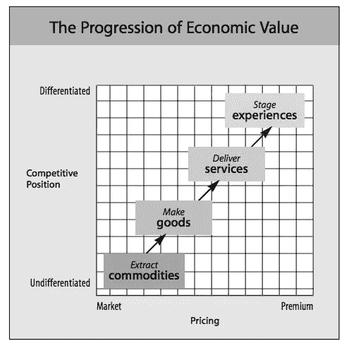
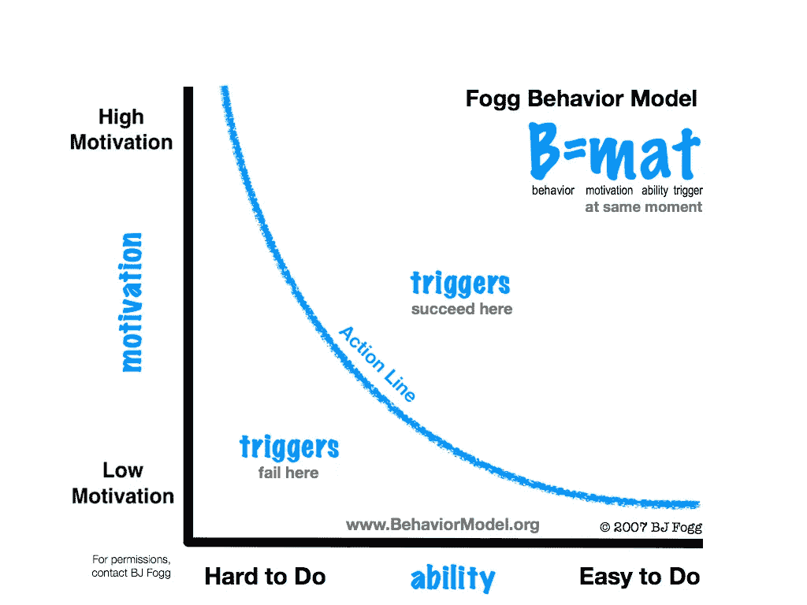

# 我们都在销售经验

> 原文：<https://medium.com/swlh/were-all-selling-experiences-58ae13a8a0bc>

## 你的产品的好坏取决于它给人的感觉

Photo by [Josh Felise](https://unsplash.com/@jfelise) / [Unsplash](https://unsplash.com/photos/yIMy3ERBc3o)

*这是一个 6 集系列* *的* [*的第 1 集，在这里我们分享了剧组制作产品的一切。隐私见鬼去吧。建筑队在公众面前不仅仅充满了荣耀。它充满了我们从零开始创造一个产品时所面临的挣扎和怀疑。*](/@mikaelcho/every-mistake-we-made-building-the-last-version-of-our-product-7b086cb8ae77#.69ascbcw8)

根据 Medium 和 Twitter 创始人 Ev Williams 的说法，设计现在比以往任何时候都更重要。

随着技术的发展，核心基础设施成为一种商品，您如何区分您的产品从提供足以完成工作的功能，转变为**提供体验*同时*完成工作**。

为了说明这个观点，下面是两位产品体验顾问 Joseph Pine II 和 James Gilmore 撰写的《哈佛商业评论》文章[中的一个图表:](https://marketingexperience.wikispaces.com/file/view/Pine+Gilmore+%281998%29+Welcome+to+the+Experience+Economy.pdf/396769328/Pine%20Gilmore%20%281998%29%20Welcome%20to%20the%20Experience%20Economy.pdf)

每天有超过 1600 万个网站加入网络。

每周有超过 1000 款手机应用被提交到应用商店**。**

**(而且这些都是 2015 年的数字！)**

**随着越来越多的软件被开发出来，设计对于你的产品脱颖而出变得越来越重要。与产品设计相结合的正确功能必须创造一种体验。这将使你与众不同。**

**迄今为止，在 Crew，我们的[外部营销项目](http://blog.pickcrew.com/how-side-projects-saved-our-startup/)一直是我们增长的核心贡献者。**

**但外部营销不可能是增长的唯一驱动力。我们的产品还必须推动增长，从而对我们的长期业务产生重大影响。**

**如果一个产品能够带来实质性的增长，那么这个产品必须比其他任何选择都要好。**

**作者 Nir Eyal 在他的书《上瘾:如何打造形成习惯的产品》中写道:**

> **"许多创新之所以失败，是因为消费者不合理地高估了旧的东西，而公司不合理地高估了新的东西。"因此，当你为消费者发布新产品时，你必须比以前的产品至少好九倍，才能有机会让用户从他们使用的旧产品转向你的产品。"**

**为了让你的产品引起顾客的注意，它不能仅仅比当前的替代品好一点点。**

**它一定要好得多。**

**好一个数量级。**

# **注意力是简单的回报**

**在他关于构建习惯形成产品的书中，Nir 还分享了如何考虑构建人们想要使用的产品的观点。它被称为[福格行为模型](http://www.behaviormodel.org/)，由斯坦福大学计算机科学家 B. J .福格创建:**

****

**福格行为模型说明了让更多人使用你的产品的最佳途径是让你的产品更容易使用。**

**如果你让你的产品更简单，你就增加了你的客户跨越“激活阈值”并执行该行为的可能性。**

**Nir 指出，**

> **“通过减少完成一项行动所需的努力来影响行为，比增加某人做这件事的欲望更有效。让你的产品简单到用户已经知道如何使用，你就有了赢家。”**

**在我们的案例中，我们知道我们需要使我们自己的产品更简单。开始更简单。住起来更简单。**

**我们经常认为做更多的事情会产生影响。但是更重要的往往是做得更少。**

# **建筑工人在公共场合**

***隐私见鬼去吧。《公众中的建筑工人》是一系列 6 篇关于产品设计哲学和我们在设计自己的产品时所面临的斗争的短文。可以在* [*剧组后台博客*](http://backstage.crew.co/building-in-public/) *上阅读正版，在路上启发版。***

## **1.你在这里**

## **2.[从问题入手。不是解决方案。](/swlh/start-with-problems-not-solutions-8521c53264b2)**

## **3.[约束，而不是障碍](/@mikaelcho/constraints-not-barriers-84629bf49ce2#.f3q9we4s7)**

## **4.[多问问题](/@mikaelcho/you-can-never-ask-too-many-questions-6d9926988f82#.ynoz2zshy)**

## **5.[剖析一个主页](/@mikaelcho/anatomy-of-a-homepage-redesign-9d911e832c4b#.lhlspqtoa)**

## **6.[旅程比目的地更重要:设计最佳入职流程](/@mikaelcho/the-journey-is-as-important-as-the-destination-ddc598989eaf#.ddxqmqyga)**

****

# **又及:新成员**

**我们最近在 Crew 为我们的产品的一个全新版本再次经历了这个过程。你可以在这里阅读全部内容[。](http://backstage.crew.co/building-crew-2/)**

****