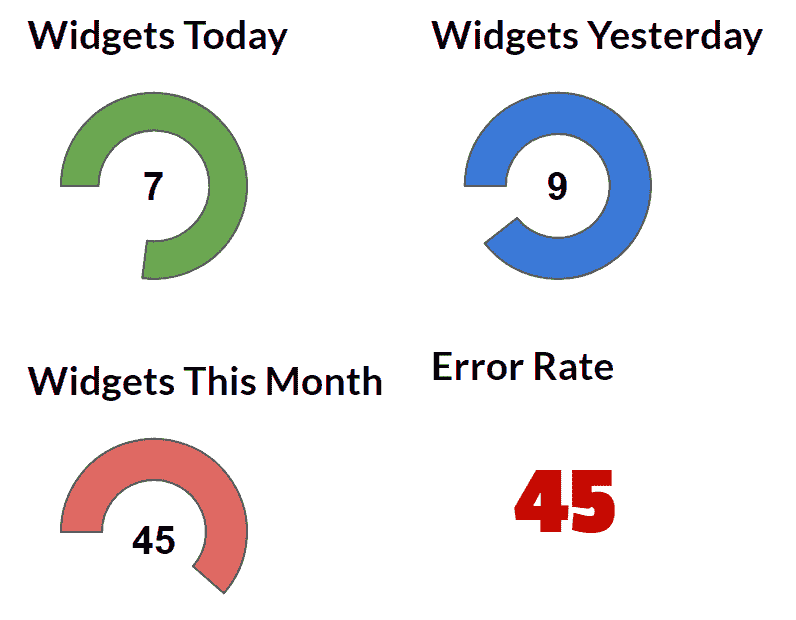
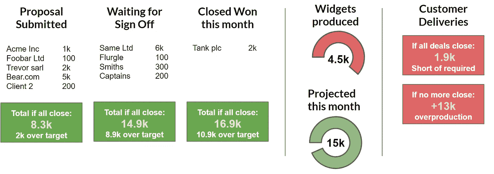

# “我们走得不够快”

> 原文：<https://medium.com/swlh/were-not-going-fast-enough-db816f36b5b>

## 愿景、战略和明确目标的重要性。

“我担心我们没有以应有的速度交付”。

在过去的几年里，在许多不同规模的企业中，这是我从首席执行官和董事会成员那里听到的担忧。“感觉我们并没有在需要交付的东西上取得进展”。

对这些领导人来说，问题往往是显而易见的。队伍太大了。队伍太小了。这项技术是“错误的”(但他们并不真正确定这项技术是什么)。我们不在云中，也应该在云中。我们在云端，不应该。特定的团队成员有问题。

在所有这些情况下，都是团队或技术出了问题。

然后你花时间和团队本身在一起——那些太大、太小或太不正常的团队——你会听到故事的另一面。尽管与商业领袖大相径庭，但还是有共同的主题。团队经常被要求提供特性，但总是忽略质量。他们提出了改进建议，但从来没有时间去实施改进。他们感觉与业务脱节，不知道该做什么，也不知道为什么要做现在这样的事情。销售团队总是在销售不存在的功能。

我已经听过太多次这种对话的双方了，这不可能是巧合。一方面，缺乏速度，沮丧是显而易见的。另一方面，缺乏方向，重功能轻质量。

当然，每个公司的解决方案都是不同的——有时候团队真的太大了，或者太小了，或者技术太陈旧了。有时，业务部门对技术团队提出的看似有效的请求进行优先排序是不公平的。但是，驱动这种紧张关系的核心问题，也是无法有效交付的原因，往往是清晰、沟通和可见性的问题。

# 软糖公司——高级压力球生产商

随着业务规模的扩大，不同的团队被创建来负责特定的活动。在最基本的模型中，销售和交付是分开的。让我们以一个虚构的小部件供应商 Fudge Inc .为例。

福吉公司为有压力的主管制作压力球，并通过电话销售团队销售给企业。销售团队给全国各地的公司打电话，每个订单销售上百甚至上千个应力球的订单。

每当软糖公司收到订单，销售团队就会按铃，将订单输入他们的 CRM。销售团队的其他人欢呼起来，庆祝他们同事的成功。

在大楼的另一边——灯光昏暗的一边，机器不停地生产压力球——压力球工程师听到了远处的钟声。他们绷紧肩膀，咬紧牙关，因为他们知道他们将通宵工作来满足新的客户订单。

所以，让我们看看这个刻意简单的业务中的第一个紧张。如果你有销售和交付职能，你几乎可以保证你会看到不同的(往往是相互冲突的)目标。销售人员的任务是达到订单数量和平均订单价值的目标。交付的任务是达到质量指标和生产目标，如每天生产的产品数量。

这里的紧张是显而易见的；如果没有一种方法来沟通两个团队之间的供求关系，以及一种方法来同时调整双方的产量，那么不可避免的鸿沟将会形成。

没有太多的恐慌，福吉公司可以单独任命两个领导人。销售主管，不断推进他的销售渠道，改进销售流程和培训，并逐步提高订购数量。另一方面，负责交付的主管，负责维护质量并逐步提高她的工程师生产的产品数量。

在业务的相对角落，会出现两个仪表盘——销售主管在看已完成交易的排行榜，而在另一边，工程师在看一系列指示交付率和生产错误的数字。

**销售团队仪表板:**

A typical sales dashboard shows a leaderboard and a weekly revenue number

**交付团队:**

A typical delivery or engineering team is watching metrics of productivity and quality

幸运的是，软糖公司是由一个明智的团队领导的。任命了两位领导，但两人的目标都是成功交付给客户的产品数量。他们的绩效没有单独的衡量标准，而是有一个统一的衡量标准，因此可以相互合作。

此外，董事会还要求提供一个仪表板，让企业中的每个人都能看到销售渠道和交付速度。它不仅可以让工程师看到有多少潜在客户正在排队，以及对他们的需求可能产生的影响，而且还可以向销售团队显示任何可能导致他们的客户不得不等待紧急压力球的能力短缺。

A joined up dashboard for Sales and Delivery

通过调整目标并使两个阶段的工作在整个公司可见，团队中的个人可以完全了解他们是如何做出贡献的。

通过让交付工程师了解销售人员在他们的管道上所做的工作，可以动态地管理生产以适应需求。此外，销售团队可以开始了解他们达成的交易是否会导致产能不足，甚至会导致生产过剩，从而导致仓库堆满未售出的压力球。

## 在下一篇文章中…

但是，当这个简单的业务变得更加复杂，福吉公司需要开始设计更多的产品时，会发生什么呢？

在下一篇文章中，我们将为 Fudge，Inc .添加另一层复杂性。我们将研究如何管理创新和改进以保持高速度，而不是仅仅“照常营业”来生产相同的压力球。

## 这篇文章发表在《初创企业》杂志上，这是 Medium 最大的创业刊物，有 328，729 人关注。

## 订阅接收[我们的头条](http://growthsupply.com/the-startup-newsletter/)。

