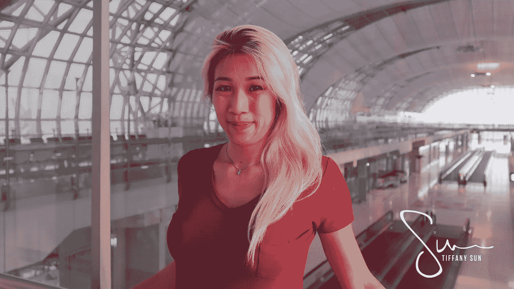

# 旅行的生活是什么感觉

> 原文：<https://medium.com/swlh/what-a-life-of-travel-feels-like-8c48f0a351c1>

当我第一次开始在东南亚旅行时，我会在每一个唐人街停下来，在我能找到的最大的商场购物，在最高等级的餐馆吃饭。这就是我所认为的旅行——看到和吃到在我之前的人已经做过的同样的东西的冒险和兴奋。

毫无疑问，这很有趣，但有时我会想，我还能做些什么。