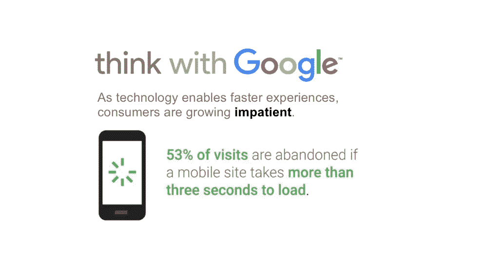
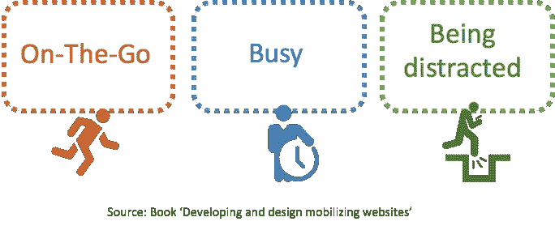
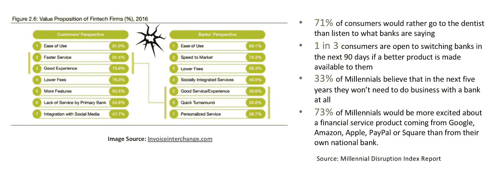
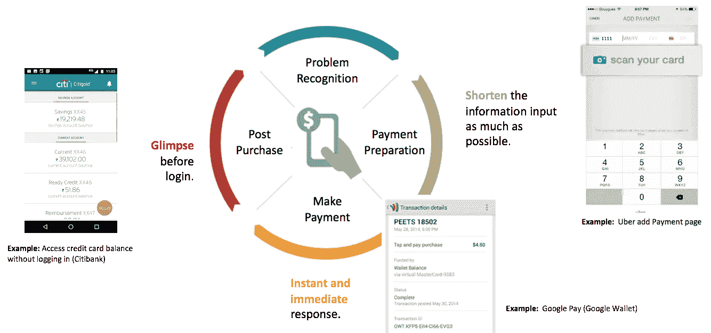

# 对于“忙”的用户，一个移动支付 App 应该考虑什么？

> 原文：<https://medium.com/swlh/what-a-mobile-payment-app-should-consider-about-the-busy-users-3eb6ee8e515d>

随着技术带来更快的体验，消费者越来越不耐烦。就像下面的谷歌报告提到的，如果一个移动网站的加载时间超过 3 秒，大约 53%的访问会被用户放弃。

因此，在这些特殊的移动场景中，客户——那些千禧一代和大众富裕阶层——真正想要的是什么？一个移动支付 App 如何把客户勾起来，吸引更多新用户？

经过我们的研究，我们发现他们想要的是升级金钱对话体验。在《移动你的网站》一书中——我几年前翻译了这本书，但它的一些要点仍然非常有效——正如作者所描述的，移动场景中的客户很忙。他们的感官很忙碌。

这里有一个例子。想象你是一位家长。有一天，你带着孩子去游泳池，你想用移动支付 app 买些汽水或者零食。你想把你的孩子一个人留在泳池里多久？一秒钟都没有，对吗？所以，当你拿出手机，打开应用程序…但与此同时，你真正想的可能仍然是在游泳池里玩耍的孩子。所以，我们需要记住，客户在移动，在忙碌，在分心。我们在这里推荐的是为移动支付用户提供更快、更安全、更有趣的体验。

不超过 40%的银行高管认为快速体验和优质服务与超过 80%的客户一样重要。每当有大的抱怨，我就看到了机会。如果您能够满足客户的期望并填补空白，这将成为企业的真正优势。因此，从这个角度来看，我们认为通过移动支付应用程序提供更快、更安全、更有趣的用户体验将使移动支付应用程序与本地竞争对手区分开来。

那么，我们现在来谈谈如何。

就更快而言。这里有一些应用程序开发者可以考虑的关于客户旅程的建议。

*   **尽可能缩短信息输入。**让我们回到之前的场景。现在，你渴望买一瓶汽水。想象一下这是你第一次使用移动支付 App。当你想添加支付卡时，令人惊讶的是，没有大的输入表单，你会看到“扫描你的卡”。嘣！十秒钟！您的卡已链接到应用程序！
*   **即时和立即的反应。**在您支付汽水后，您会立即收到交易详情。你再也不用担心报酬了。
*   **登录前一瞥。**下一次，当你打开应用程序时，你甚至可以在登录前轻松地查看帐户余额或其他信息。

所有这些技巧实际上都是在节省客户的时间，我们相信节省客户的时间就是为自己节省客户。

另一方面，我们发现并非所有的“移动”活动都是在旅途中进行的。但不是的时候，就是让客户觉得好玩的时刻！觉得开心！为了吸引顾客。所以，“游戏化”在这里是必不可少的。

上图向你展示了微信支付是如何通过“红包”应用的游戏化来增加用户群的。

*   *什么是微信支付？是国内第二大移动支付 App。*
*   *“红包”是中国新年的传统。*

在新年期间，人们把一些钱放进一个红色的信封里，送给孩子和朋友，以表达他们最美好的祝愿。但是当微信支付将这一传统数字化为移动功能时，他们设置了一个非常有趣的场景，你首先通过微信将一些钱设置到数字化的红包中，然后系统将一些钱随机分配给打开它的人。这种随机红包功能对顾客很有吸引力，因为他们对碰运气的游戏感兴趣。

此外，稀缺效应在这里起作用。作为用户，你需要成为第一批打开红包的人，否则你可能什么也得不到。顾客对这个功能变得疯狂，他们一次又一次地尝试尽可能多的钱。在短短两年内，通过红包交易的金额从 10 亿 CNY 增长到 80 亿 CNY。因此，当客户不是“忙碌”时，我们相信如果一个应用程序能让客户感到更有趣、更快乐，这将是留住客户并提高保留率的方法。

## 这篇文章发表在《T4》杂志《创业》(The Startup)上，这是 Medium 最大的创业刊物，拥有 328，729 多名读者。

## 在这里订阅接收[我们的头条新闻](http://growthsupply.com/the-startup-newsletter/)。

