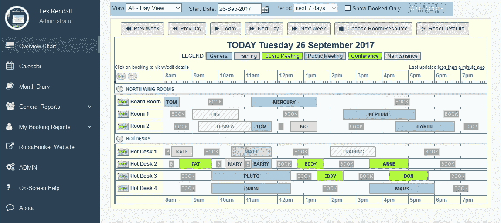

# 什么是在线预订系统，为什么你的旅游和酒店业务需要它

> 原文：<https://medium.com/swlh/what-an-online-booking-system-is-and-why-your-travel-and-hospitality-business-needs-it-e5cd8f9bc5cd>

世界已经移动到网络上。今天的顾客不仅使用互联网寻找他们想要的东西，越来越多的人也喜欢在网上预订。如果你没有在你的[旅游或酒店网站](https://stfalcon.com/en/industries/travel)上安装在线预订系统，你很可能会错过很多机会。

用户更喜欢支持在线预订的网站，因为它们更方便。他们可以看到所有的选项并进行预订，而不会被咄咄逼人的销售代表或浏览几十个网页所困扰。

然而，对于一些企业主来说，这不过是另一个软件，他们对其功能和实际用途知之甚少。在本文中，我们将回答有关在线预订系统实施的最常见问题，并尝试向您展示这种系统可以为您的旅游和酒店业务带来的优势。

# 什么是网上订票系统？

在线预订系统是一个用于预订管理的软件。它允许旅游和酒店企业接受在线预订，并以更好的方式管理移动和个人预订。在线预订系统提供所有的自助服务功能。用户预订基于开放系统建议的服务。

在线预订和预约系统可以很容易地集成到您的网站，甚至社交媒体页面。客户只需访问您的网站，选择他们想要预订的服务，并填写预订表格。之后，他们通过支付网关付款，支付网关将款项转给你。整个过程只需要几分钟，对于第一次预订，甚至更少的重复预订。

系统会更新信息和时间表中的所有变化，并实时反映出来，以便您和您的客户都能看到。所有信息都通过加密和 SSL 安全协议安全存储和保护。

网上订票系统的用途多种多样。显然，如果你的业务涉及任何形式的预订，它可以受益于在线预订软件。旅游运营商和酒店行业是在线预订平台最传统的用户。但也用于[物业出租](https://stfalcon.com/en/blog/post/how-to-create-service-like-airbnb)，节假日活动门户，各种课程培训，[交通服务](https://stfalcon.com/en/blog/post/car-rent-website-development)等等。

# 网上订票系统给你的企业带来了什么好处？

在你的网站上实施在线预订系统可以给你带来一定的商业优势。以下是其中的几个例子:

预订量的增加。在线预订系统的最大优势是可以全天候接受预订，因此您的客户可以在合适的时候方便地预订。工作负载优化。在线预订系统减少了您的工作量，优化了客户服务。当然，您应该有个性化的客户服务支持来处理各种查询。

**更便捷的支付方式。**通过在线预订平台，支付也大大简化了。此外，你可以省去中间人，避免与第三方分享你的收入。一旦顾客通过它预订，钱就直接进入你的账户，没有任何延迟。

**机动性强。今天，越来越多的人喜欢通过手机或平板电脑购物和预订。由于该平台是基于网络的，客户可以在旅途中使用任何设备进行预订。它增加了留住客户的机会，并鼓励他们不要推迟预订，直到更方便的时候(这自然会分散一定比例客户的购买注意力)。**

**更聪明地洞察业务。预订系统会跟踪每一次预订及其相关细节。客户在预订时提供的信息是在线预订软件提供的宝贵资源。您可以更好地了解您的客户，使用报告查看哪些提案带来了最多的资金，并实时了解您的现金流。**

**短信和电子邮件自动化。发送标准的电子邮件和信息需要很多时间。预订系统允许自动化这一繁琐的管理工作。当然，在你的网站上有一个在线预订系统有更多的好处，但是上面的列表可以让你知道你是否真的需要投资它。**

# 需要考虑的事情

所以，你决定在你的网站上实现一个在线预订系统。在选择现成的选项或者为开发团队准备技术规范时，您需要记住的最重要的问题是什么？

思考与[用户体验](https://stfalcon.com/en/blog/post/travel-sites-UX)相关的问题很重要。你展示的信息需要干净、准确，预订流程要尽可能简单。否则，很难留住客户，也很难阻止他们快速离开你的网站。与开发团队一起，确保在预订时有最少的点击和步骤。

确保您的预订可以从任何平台轻松获得。今天，当大多数企业都在智能手机和平板电脑上运行时，你的预订系统应该适应任何设备。

与其他在线服务的集成也是一个重要问题。每个现代企业都使用不止一种在线服务来满足他们的需求。例如，你有你的在线预订软件，你的电子邮件营销软件，你的会计软件。试图将数据从其中一个转移到另一个可能是一项痛苦而耗时的任务。

# 摘要

在线预订系统通过自动化获取客户详细信息、更新预订信息、付款、日程安排等操作，为您和您的客户简化了预订流程。这有助于留住网站上的客户，因为他们可以看到可用的选项并预订他们需要的选项，而无需在众多页面和服务之间切换，也无需打电话。所以，如果你想利用现代的旅游和酒店经营方式，就必须在你的网站上集成在线预订系统。

*最初发表于*[*【Stfalcon.com】*](https://stfalcon.com/en/blog/post/online-booking-system)*。*

## 这篇文章发表在 [The Startup](https://medium.com/swlh) 上，这是 Medium 最大的创业刊物，拥有+ 380，756 名读者。

## 在这里订阅接收[我们的头条新闻](http://growthsupply.com/the-startup-newsletter/)。

