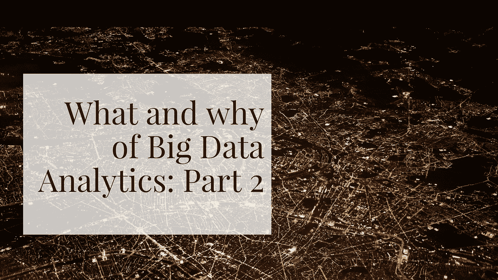

# 大数据分析的内容和原因:第二部分

> 原文：<https://medium.com/swlh/what-and-why-of-big-data-analytics-part-ii-c4f36201cc83>

大数据不仅仅是大型数据集。大数据从来就不仅仅意味着数据的大小。除了数据量之外，数据的多样性和速度对于理解为什么以及如何分析、捕获和学习信息也是必要的。大数据是关于组合这些杂乱的数据，对其进行分析以收集相关问题的答案。如果没有分析，大数据就只是一大堆杂乱且往往危险的数据，您必须存储这些数据，并远离不合适的人。

现在，由于我们经常将这个大数据和分析市场专门与大数据集联系在一起，我们最终通常会将其与大企业联系在一起。这种观念使得中型企业很难找到相关信息，了解他们如何利用大数据来提高客户满意度、改善洞察力并积极影响利润。

# 大数据分析为中端市场提供了哪些机会？

在高级分析的帮助下，您可以利用您的数据收集见解，帮助您减少被动反应，提高对变化的预测能力，从而降低风险，为更有针对性的营销铺平道路。成功利用企业数据提高了整体性能，并为许多企业带来了竞争优势。大数据和分析可以帮助大多数中型企业:

*   简化供应链，提高效率，发现运营流程中可以改进的地方，并主动发现欺诈。
*   大多数中端市场公司可以利用所提供的洞察力、可见性和对财务运营的控制来转变其财务流程。
*   通过消除相当大的风险，帮助企业管理法规和合规性变化。
*   提高 IT 对变化、灵活性和敏捷性做出更快速反应的能力，同时改善 IT 经济性。

# 大数据分析采用之旅

尽管许多企业看到了其数据存储的潜力，但他们缺乏抓住机会和启动所需的技能和基础设施，并且经常受到财务资源的限制。而其他人根本不知道从何下手。对于面临资源挑战的小型组织来说，出现的许多障碍和问题可能更难回答。下面的行动项目是一个很好的开始。

*   找出对你的公司最重要的业务成果。
*   围绕大数据展开对话。
*   考虑到业务领导和 IT 基础架构团队，确定哪些利益相关者和决策者需要参与，并确保在讨论的早期就让他们参与进来。
*   草草记下讨论点和问题的列表。
*   安排与利益相关者的会议。
*   在整个过程中，不要忽略所有大数据分析计划的主要目标，揭示转化为商业价值的洞察力。

# 定义路线图时要记住什么？

开始实施大数据看起来很像是在组装拼图。最困难的部分将是找出哪些部分将帮助您构建拼图的边缘。将最后几个部分放在适当的位置会容易得多。决定从哪些数据开始，首先处理哪些项目，以及从哪里获得技能、赞助和资金将是很难回答的问题。

路线图可以帮助您改善决策，为更好地了解您的运营方式、客户期望和市场发展方向铺平道路。[大数据分析](https://www.zibtek.com/Big-Data-development-company)很可能是对您通常处理业务的方式的巨大转变。因此，许多组织，尤其是中小型企业，将需要通过与值得信赖的合作伙伴合作或发展内部技能来填补分析技能缺口，以便更好地应对这些障碍。那么你从哪里开始呢？

*   从现有数据开始。如果您正在寻找相对快速的近期价值，也就是说从最具成本效益和最合理的地方开始，即现有的企业数据，那么您必须现实一点。从您的内部数据开始，利用现有的软件、系统和技能。可量化的业务成果和积极的体验将鼓励未来的计划，为更复杂的项目和数据种类和数量的扩展铺平道路。
*   大数据项目不会在真空中成功。协作是关键。打造大数据计划的共同目标，保持沟通渠道畅通，尤其是在 IT 和执行发起人之间。建设性的、持续的对话将增加成功的机会。
*   为了将工作从“为数据而数据”项目或“数据科学项目”转移到基于真实业务目标的战略计划，投资于良好的分析工具和经验丰富的工程师和数据科学家。
*   随着大数据分析的重要性增加，大多数组织的分析技能和机会之间的差距越来越大。从接触公司独特目标和挑战的员工开始，必须优先发展内部分析技能。您可以通过与经验丰富、值得信赖的合作伙伴进行战略外包来增强这些技能。
*   这一点值得重复，朝着可衡量的目标努力。一个与业务目标一致的可量化业务案例对于一个可靠的大[数据分析战略](https://www.zibtek.com/Data-science&analystics-service)是必要的。因此，能够与 IT 和其他关键高管合作的高层高管的支持非常重要，这将极大地影响你的成功机会。
*   每个大数据分析项目都各不相同。通过考虑基础设施能力、技能和数据量，为您的项目设定正确的时间框架，以帮助设定现实的预期。

# 结论

如果没有分析，大数据就会变成噪音。建立一种文化，将分析融入业务运营的每一步，确保数据的治理和安全性至关重要，并对一个针对大数据和分析的平台进行必要的投资，这样您的企业将能够成功利用您的数据获得转变业务方式所需的洞察力。要实现这一目标，需要一种基于事实的文化，一种将大数据分析融入决策过程中每一点的文化。如果做不到这一点，就很难从大数据和分析投资中创造价值，如果不是不可能的话。分析文化意味着决策是在数据的帮助下做出的，而不是直觉。祝你好运！

*最初发表于 CognitiveClouds 的产品洞察博客:Top* [***SaaS 发展公司***](https://www.cognitiveclouds.com/custom-software-development-services/saas-application-development-company)

## 这个故事发表在 [The Startup](https://medium.com/swlh) 上，这是 Medium 最大的企业家出版物，拥有 292，582+人。

## 在这里订阅接收[我们的头条新闻](http://growthsupply.com/the-startup-newsletter/)。

