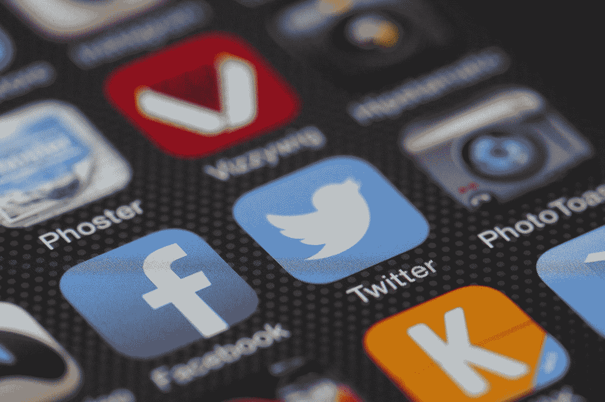

# 有哪些最好的 App 营销策略？你应该遵循的 5 个实践

> 原文：<https://medium.com/swlh/what-are-the-best-app-marketing-strategies-5-practices-you-should-be-following-3c0f90ec35a>

移动应用是有需求的，这是毋庸置疑的。随着移动设备和智能手机市场[持续逐年增长](https://www.statista.com/topics/840/smartphones/)，用户自然会需要越来越多的应用程序来进行各种日常活动。

事实上，除了不断扩大的市场之外，还有很多[理由](https://swagsoft.com.sg/blog/5-reasons-why-your-business-needs-a-mobile-app/)让你的企业需要一个移动应用。

虽然市场上有数量惊人的应用程序，但并不是所有的应用程序都能够在数百万次的下载中获胜。这听起来很悲哀，尤其是对开发者来说，营销你的应用程序可能和开发它一样重要。不过，不要相信我们的话。最近的一项研究显示，2018 年，不少于 [31%的移动应用预算](https://rioks.com/blog/app-developers-31-of-mobile-app-budgets-is-spent-on-marketing-in-2018/)用于营销。这只能突出适当营销的重要性。

但是你是怎么做到的呢？你如何让人们真正下载你的应用程序？更重要的是，你如何不在无用的活动中烧钱？

我们冒昧地提出了 5 个特别重要但更有效的策略，它们将帮助您在竞争日益激烈的情况下定位您的应用程序。

# 提前计划

如果你的应用已经准备好了，你刚刚开始想出一个营销策略，我们有一些坏消息——你有点太晚了。你有没有想过，为什么每次你去电影院，他们都会播放一大堆烦人的电影预告片？原因非常简单，却非常强大——***期待。***

预期销售。更好的是，预期炒作。那么什么时候是开始营销的最佳时机呢？

这真的取决于你能以多快的速度交付完成的、市场现成的产品，但是你应该在概念化的时候制定一个有凝聚力的营销策略。

为什么？好吧，在这一点上，你应该已经为你的应用程序准备好了愿景——因此，这是一个确定最可靠的市场渠道的好时机。这是你想开始考虑把你的应用程序放在一个银盘子里，然后直接送给你的客户的时候了。

我们目前所谈论的通常被称为“预发布”阶段。在此期间，你必须考虑以下几点:

*   确定一个发布日期(并当场与它！)
*   进行市场调查，了解你未来的客户
*   识别完美的客户
*   分析并了解你的竞争对手
*   建立独特的价值主张
*   定义定位和品牌信息
*   创造你自己的品牌风格

在最初的营销阶段，准确无误是绝对重要的。虽然期望是一个强大的驱动力，失望也是。如果你现在不能兑现你的承诺，你的工作会变得更具挑战性。

# 优化—这是关键

App store 优化。也许这是你最不愿意听到的话，但却是一个真正改变游戏规则的词。

你需要确保你的应用程序在最受欢迎的应用程序商店进行了适当的优化。不管你是为 Windows、iOS、Android 还是所有这些平台推出，你都需要润色你的每一个应用商店页面。

**提示:你的标题应该包含流量最大的关键词。如果你还没有，花时间分析它们，并确保这一切发生！*

但是为什么应用商店优化如此重要呢？那么，为什么搜索引擎优化如此重要呢？因为这就是人们发现你的方式——简单明了。你可以通过应用商店优化来优化你的应用并获得大量的搜索，而不是花费数千美元在广告上。

换句话说，你必须考虑你的页面的可读性，你在那里展示的图形内容，关键词密度，标签，以及，一般来说，几乎所有与正确表达你的内容相关的东西。

但它足智多谋！经过适当优化的 app store 页面将帮助您扩大并促进您的营销工作。这就引出了我们的下一点。

# 在那里

全渠道营销将是 2019 年最热门的趋势之一。人们现在比以往任何时候都更加活跃！让我们现实一点——你认识的几乎每个人都有一个脸书账户和至少一种其他类型的社交媒体——无论是 Twitter、Instagram、LinkedIn 还是其他什么。

这告诉你什么？

你需要无处不在。不管你的应用是什么，你的受众很有可能在社交媒体上。

我们还想在这里做一个重要的说明。在不同的社交媒体上复制粘贴相同的内容*是行不通的。*我们怎么强调这一点都不为过。LinkedIn 上人们寻找的内容类型与脸书上的不同。

这让我们想到了你应该遵循的老一套说法，不管你是在营销一款应用还是苹果产品——相关性*！*了解你的受众在哪里寻找什么内容，并采取行动！

# 影响者——你需要他们

在你开始担心这会花掉你多少钱之前，要明白不是所有类型的影响者都会被提前支付报酬。

有很多人在不同的社交媒体上有大量的追随者，他们会同意达成某种收入分成协议。你必须授予他们访问你的应用的权限，他们会检查你的应用并把他们的想法发布给他们的观众。

自然，你首先要确定你的产品是否有大众吸引力，但是除非它是一个非常专业的应用程序，否则它很有可能有大众吸引力。

在这里，我们想回到这篇文章中多次提到的一个观点——*相关性！*确保你试图接触的影响者拥有相关的追随者。换句话说，如果你想发布一个以食品为导向的应用程序，接触一个服装博主并没有太大的意义。

# 脱颖而出！

在一个数十亿美元的市场上，数百万个应用程序充斥着这个市场，在 ut 上站住脚并不是一件容易的事情。但是不要从那个角度去看。

记住——全面的营销活动都是关于个性化的。让你的潜在客户觉得他们受到了你最特别的关注。怎么做呢？你可以做很多简单(相对而言)且相当便宜的事情。

1.  一定要去！还记得我们说过你必须出现在所有社交媒体上吗？确保你真的在那里。我们的意思是——你需要互动。不要只是回答 op 的评论，多做一点——与你的观众互动，你会很快看到结果。
2.  可见！最简单的方法之一就是为你的营销活动制作一些创意图片或者更好的视频。还是那句话，你不需要在这里花一大笔钱。一个很好的主意是开始创建带有某些奖品的竞赛，以换取用户的视觉内容。
3.  放聪明点！你不需要逆流而游。换句话说——不要太努力去战胜你的竞争对手——相反，做他们做的事情，但是要做得更好！探索他们的营销策略并加以改进。

# 把它包起来

在当前的动态环境下营销一款应用并不容易。事实上，随着市场的发展，这只会变得更加困难。然而，以上将永远是最重要的。

记住，确定并坚持一个精心设计的全面营销策略将帮助你把你的应用从众多应用中的一个变成*的*一个。

## 这篇文章发表在[《创业](https://medium.com/swlh)》上，这是 Medium 最大的创业刊物，有+400，714 人关注。

## 在这里订阅接收[我们的头条新闻](http://growthsupply.com/the-startup-newsletter/)。

