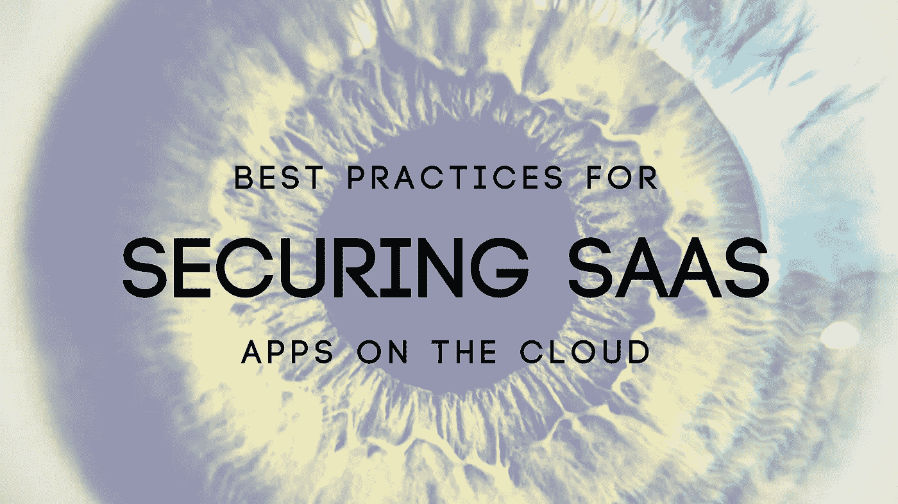
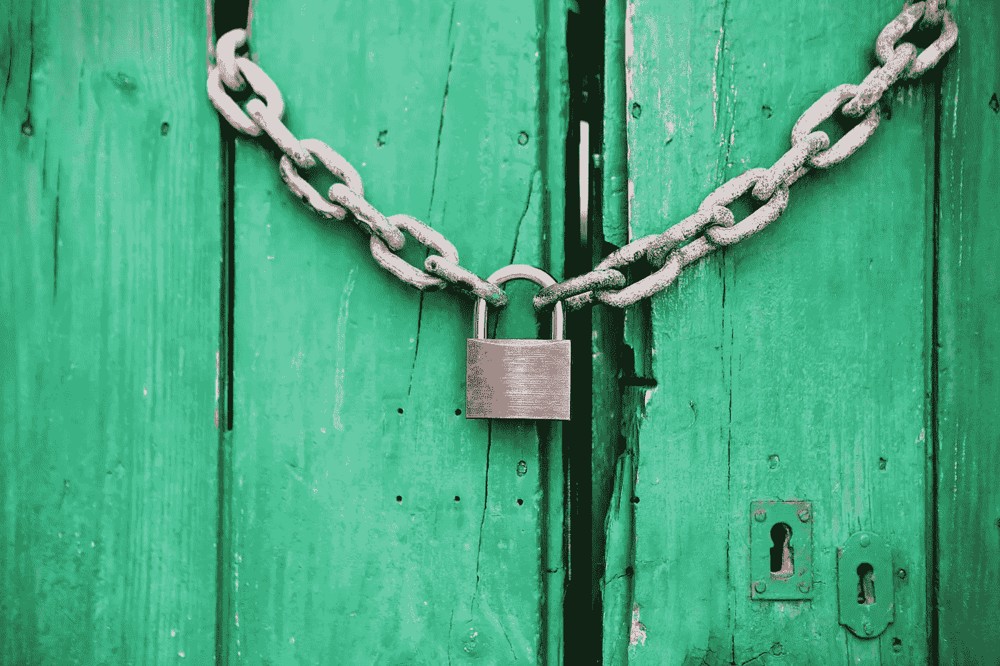

# 在云中保护您的 SaaS 应用程序的最佳实践是什么？

> 原文：<https://medium.com/swlh/what-are-the-best-practices-for-securing-your-saas-application-on-the-cloud-1e3323060291>

随着企业将其应用程序和数据迁移到云中，高管们越来越多地面临这样的任务:在提高工作效率的优势与对安全性和合规性的重大担忧之间进行平衡。云中的安全性与企业数据中心的安全性完全不同。当您无法实际控制您试图保护的基础架构时，您将不得不熟悉新的规则，并培养一种不同的看待事物的方式。

在您的开发和测试过程中，考虑应用程序安全扫描器或寻找提供应用程序扫描服务的公司。您也可以使用源代码扫描器作为每夜构建的一部分。这些工具和服务是自动化的，为您提供快速、详细的安全问题分析。此外，运行和使用这些工具不一定要成为安全专家。如果你碰巧预算不足，有足够的免费开源工具可用。现在，在我们开始讨论保护您的 SaaS 应用程序的最佳实践之前，我们先来讨论一下安全性挑战。

# SaaS 面临的安全挑战

如今，企业甚至开始关注数据和[业务流程](https://www.datadab.com)，如交易、记录、定价信息等。并通过访问控制和合规性策略来保护它们。在 SaaS 模型中，您的企业数据以及其他企业的数据都存储在 SaaS 提供商的数据中心。现在，如果您的 SaaS 提供商正在利用公共云计算服务，所有这些企业数据可能会与其他不相关的 SaaS 应用程序的数据一起存储。此外，云提供商可能会在不同的国家和地点复制数据，以保持高可用性。

大多数企业都习惯于传统的内部模型，在这种模型中，他们的数据驻留在企业边界内，受其策略的约束。当然，对于在 SaaS 模式中如何存储和保护数据，缺乏控制和了解会带来很多不便。所有这些都引起了对数据泄露和应用程序漏洞的极大关注，这可能会导致财务和法律责任。

# 保护 SaaS 应用程序

## 1.安全产品工程:

你会发现大多数[产品负责人](https://www.datadab.com)都在赶着市场发布的最后期限。因此，产品安全性经常被放在次要位置。这导致软件漏洞百出，容易出现安全漏洞。我们都知道损失的严重性，由于安全漏洞导致的敏感数据泄漏，以及 SaaS 供应商必须处理的潜在责任问题和信誉损失。开始将安全性视为产品工程生命周期的一部分。在开发的每个阶段，无论是架构、设计还是编码，都必须进行安全审查。这将帮助您更快地识别安全问题，并降低需要实现的任何安全修复的返工成本。在保持安全考虑的同时，对您的编码和测试指南进行返工。

## 2.安全部署:

SaaS 解决方案要么部署在公共云上，要么由 SaaS 供应商托管。在自托管部署中，您必须确保采取足够的安全措施来保护自己免受网络渗透和 DoS 攻击。另一方面，专门的云提供商，如亚马逊和谷歌，通过提供基础设施服务来帮助确保数据安全、数据隔离、网络安全等，承担起保护 SaaS 应用的责任。如果您选择在公共云上部署 SaaS 应用程序，请确保安全设置符合公共云供应商推荐的最佳实践。

## 3.不要在严格的合规认证上妥协。

你应该关注的两个最重要的认证之一是 PCI DSS。对于这一认证，SaaS 提供商必须接受详细的审核，以确保敏感数据以完全受保护的方式存储、处理和传输。的确是一个多方面的安全标准，包括对安全管理、程序、策略、软件设计、网络架构和其他关键保护措施的要求。现在，SOC 2 Type II 有助于监管合规性监督、内部风险管理流程和供应商管理计划。SOC 2 认证确保云服务主要是为了维护最高级别的数据安全性而设计和认真管理的。这两个认证都提供了关于你正在考虑的云服务提供商的有用的比较信息。

## 4.传输中的数据必须端到端加密。

为了确保最高级别的安全性，所有与服务器的交互都必须通过 SSL 传输进行。SSL 只能在云服务提供商网络内终止。对于静态数据，加密也是必不可少的。理想情况下，现场级加密也由您的云服务提供商提供。你应该能够指定你想加密的领域，无论是信用卡号码，SSN 或公积金。

## 5.确保您的漏洞测试是严格和持续的。

确保您的云服务供应商提供的漏洞和事件响应工具是行业领先的。这些事件响应工具提供的解决方案支持完全自动化的安全评估，可测试系统弱点，从而大大缩短关键安全审计之间的时间。根据设备和网络的不同，您将能够决定进行漏洞评估的频率。此外，您可以按需安排或执行扫描。

## 6.确保您的组织定义并实施数据删除策略。

按照客户合同中的规定，在客户的数据保留期结束后，必须以编程方式删除客户的数据。

## 7.用户级数据安全性

为了确保符合贵组织的内部和外部数据安全标准，使用 ***用户级数据安全*** ，添加保护层。您的云服务供应商将提供基于角色的访问控制(RBAC)功能，允许您为数据设置特定于用户的访问和编辑权限。该系统在组织内实现了基于访问控制的、细粒度的、强制的职责分离。

## 8.利用虚拟专用云和网络。

您的 SaaS 提供商不应该利用多租户实例，而应该能够促进专为您打造的云环境，在该环境中，您可以完全控制数据。亚马逊网络服务(AWS)称之为虚拟私有云(VPC)。客户端可以安全地连接到您的企业数据中心，进出其 VPC 中实例的所有流量都通过行业标准加密的互联网协议安全(IPsec)硬件 VPN 连接路由到其企业数据中心。

# 结论:

软件即服务(SaaS)模式提供的显著优势，如提高运营效率和降低成本，足以成为采用该模式的理由。但是，为了克服您对应用程序和数据安全性的担忧，请确保您的供应商正在正面解决这些问题。归根结底，这些担忧通常源于我们对 SaaS 供应商如何存储和保护我们的数据缺乏控制和了解。

从安全产品工程、部署、GRC 审计到定期的 SaaS 安全评估，SaaS 安全实践的采用对于保护 SaaS 解决方案和消除我们的担忧至关重要。这些措施将有助于提前发现任何安全问题，并确保我们数据的安全。上面提到的几点只是任何云服务提供商都应该构建到其云服务中的一些关键安全条款。深度防御传统上是一个严格的设计原则和安全策略的问题，跨部门和专业领域实施。

*原载于*[***【cognitive clouds】产品见解***](https://www.cognitiveclouds.com/insights/what-are-the-best-practices-for-securing-your-saas-application-on-the-cloud/)***:***[***SaaS 发展公司***](https://www.cognitiveclouds.com/custom-software-development-services/saas-application-development-company)

## 这个故事发表在 [The Startup](https://medium.com/swlh) 上，这是 Medium 最大的企业家出版物，拥有 292，582+人。

## 在这里订阅接收[我们的头条新闻](http://growthsupply.com/the-startup-newsletter/)。

