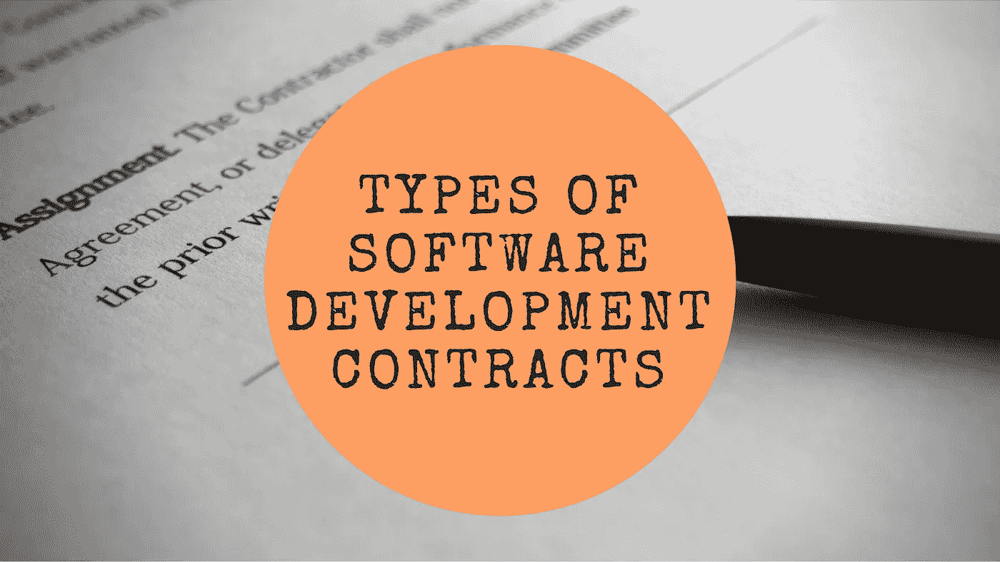

# 有哪些不同类型的软件开发合同？

> 原文：<https://medium.com/swlh/what-are-the-different-types-of-software-development-contracts-243dc188c668>

通常，人们倾向于淡化合同中的信息，将其解释为金钱是如何交易的，而实际上，它所规定的要比这多得多。合同将推动参与行为、时间表等。无论您选择哪种参与模式，确保项目符合预期并按计划进行都将成为您俩的共同目标。即便如此，也要确保你采用了正确的合同，为更顺利的接洽过程铺平道路。

在承包[定制 web 应用开发](https://www.cognitiveclouds.com/custom-software-development-services/web-application-development-company)时，主要有两种不同类型的合同可供选择。一个[有经验的开发人员](https://www.cognitiveclouds.com/custom-software-development-company)知道每个项目都有例外，并且足够灵活，可以尝试将项目的具体性质与合同相匹配。下面列出了这两份合同的利与弊，帮助你找到合适的人选。

# 1.时间和材料合同

这个是经典之作。简单地说，你为软件开发者为你的项目工作的小时数付费。

# 优点:

*   这是一个非常简单的模型，因此也是最容易开始的方法。事实上，你不必带着详细的规格走进来就开始你的项目。
*   T&M 合同给你很大的灵活性。在相同的预算内，您可以更改特定功能的优先级并添加新功能。
*   在这种模式下，你确切地知道你要支付的是什么，这推动了更多的信任和沟通。
*   因为在整个过程中有持续的沟通，所以你有更多的机会达到你预想的结果。
*   这个模型中的监督允许你定期检查你的项目完成了多少。

# 缺点:

*   你对预算的控制更少。一旦最初处理了高优先级的项目，可能会出现一些需求更难实现的情况。在这种情况下，您可能无法扩展您的预算，也无法从提供商那里购买更多的时间。
*   随着需求的更新，最后期限可能会改变，所以很难预测产品什么时候会准备好。
*   老实说，在大多数情况下，很难预测最终预算，因为最初确定的预算会根据客户在[开发过程](https://www.cognitiveclouds.com/design-driven-development-process)中不断变化的需求而发生显著变化。
*   这种方法需要客户的不断参与，需要双方投入更多的时间和精力。

*What Are The Different Types Of Software Development Contracts*

时间和材料合同模型经受住了时间的考验，因为它代表了大多数项目，尤其是初创公司开发的不确定性。你会看到最初的工作范围很少在项目过程中保持不变。在这里，改变范围不仅仅意味着增加一些额外的功能，还经常意味着删除那些看起来不再必要的功能。一天结束时的时间和材料模型为客户和供应商提供了关注最终结果所需的灵活性，这是一个[市场就绪的](https://www.datadab.com)产品。

# 2.固定投标

在这种模式中，你确切地定义了你的设想，软件开发人员就应该建造什么达成一致，他给它定了一个固定的价格，在一个简单的世界里，一切都按计划进行。这是长期合作的首选模式。

# 赞成的意见

*   你以固定的价格得到合同中规定的东西。这可以让你安心，也可以让你的预算更容易获得批准。
*   在这里，很多风险都在供应商这边，因为如果项目超出了预算，供应商就会很头疼。因此，客户可以放心地知道项目不会超出预算。
*   在这个合同中，严格的截止日期被强制执行，并且你的开发团队非常积极地去满足它们。
*   一切都已经计划好了，所以你总是知道你的项目的状态。
*   不需要你监督，因为所有的项目细节都在合同里提到了。

# 骗局

*   提供者可能以低于估计的成本完成合同中的需求。在这里，你没有从你可能喜欢的供应商那里得到所有的时间。
*   你不能轻易地改变项目的需求。事实上，您可能甚至不了解开发过程，不知道什么时候应该放弃需求。
*   如果设计过程没有清晰的规划，或者沟通过程不健康，这种合同类型不是一个好主意，尤其是当开发人员承担所有风险的时候。最坏的情况是，开发人员可能会采取捷径来控制预算，从而导致质量下降。
*   这份合同是让你的项目启动的最冗长的方式，需要大量的前期工作。

底线是，在一个固定的投标合同中，你为一个结果付费，而在 T&M 模式中，你为某人的时间付费。在这种情况下，你可能会付出过高的代价，缺乏灵活性是另一个重要的问题。

# 结论

这里没有明确的、放之四海而皆准的选择。一些客户倾向于“固定投标”,而其他客户则倾向于“时间和材料”模式。现在，如果你看看软件开发过程的现实，你会发现“时间材料”方法以最好的方式处理了过程的不确定性。软件构建碰巧是一个动态的过程，其中软件需求必然会发生变化。对于任何复杂的软件项目来说，预见所有的需求是不可能的。

固定投标估价有其自身的优势，并将在很长一段时间内成为软件行业的重要组成部分，但要了解这些类型的协议所包含的风险。在固定投标协议中，很难保持重要事情的优先顺序，因为所有事情都必须在固定预算内处理。另一方面，在*【时间和材料】*下运行的项目建立在一个模型上，该模型在每次迭代中优先考虑最重要的项目。

最后，除了支付条款之外，理解合同对行为动机的影响也很重要。把责任完全推给任何一方都不是一个好主意。团队合作是打造漂亮产品的正确方式。

*原载于* [*产品洞察博客*](https://www.cognitiveclouds.com/insights/) *来自 cognitive clouds:Top*[*SaaS 发展公司*](https://www.cognitiveclouds.com/custom-software-development-services/saas-application-development-company)

## 这个故事发表在 [The Startup](https://medium.com/swlh) 上，这是 Medium 最大的企业家出版物，拥有 292，582+人。

## 在这里订阅接收[我们的头条新闻](http://growthsupply.com/the-startup-newsletter/)。

