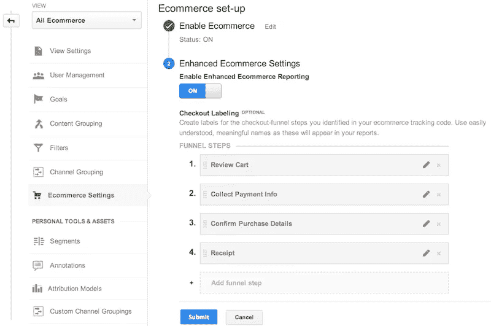

# Shopify 商家在电子商务分析中面临哪些问题，如何解决这些问题

> 原文：<https://medium.com/swlh/what-are-the-issues-that-shopify-merchants-face-in-e-commerce-analytics-and-how-to-fix-them-2337cfdb22ac>

Shopify 是最好的电子商务平台之一，它使启动、管理和发展在线商店变得非常简单。Shopify 是一个用户友好的平台，它负责运营在线商店的方方面面，从托管到定制。

你可以自己建立你的商店，不需要开发商或设计师的任何帮助。有定制选项，以满足任何类型的企业的要求。Shopify 上有大量的主题和应用程序，可以让商店变得很棒。

目前，Shopify 支持 60 万家企业，活跃用户超过 100 万。Shopify 平台上有大量的应用程序可以帮助企业蓬勃发展。平均而言，每个 Shopify 商店使用 4 个应用程序。尽管如此，还是有一些让 Shopify 应用开发者忙碌的痛点。许多新应用程序定期出现在 app store 中，以解决这些棘手问题。

# Shopify 商店的主要难点

在 Unite 2017 上，Shopify 数据分析团队的 Sarah Sui 和 Todd Coulthard 进行了一场数据驱动的演讲，他们分享了 Shopify 商业趋势、Shopify 应用商店中表现最佳的应用以及新应用创意的机会。

根据 Unite 2017 和 Shopify 开展的一项商户调查，促使商户使用 Shopify 应用商店的三大[痛点](https://www.shopify.in/partners/blog/build-apps-that-address-merchant-pain-points)

*   了解网站流量和趋势
*   更新产品和库存
*   编辑商店的外观和感觉

在本文中，我们将讨论 Shopify 商家的第一个也是最重要的痛点，即“了解网站流量和趋势”。分析是优化电子商务商店性能的最重要的方面之一。

# 商家在电子商务分析中面临的问题

大多数网店店主最担心的一个问题是缺乏面对面的客户互动。这是电子商务最好和最坏的事情之一。这些天，顾客做了大量的研究，以避免实体店和网上购物。因此，店主需要一种机制，在不与潜在客户进行面对面互动的情况下，说服他们在线购物。

这就是分析进入画面的时候。Shopify 商店有很多分析选项，但仍然有一些差距需要填补。

*以下是店主在分析中面临的几个问题:*

# 为电子商务设置谷歌分析的复杂性

世界上最常用的分析解决方案之一是谷歌分析。但是 GA 也有自己的利弊。为您的 Shopify 商店设置 Google Analytics 是一个复杂的过程。另外，设置增强的电子商务报告是另一回事。如果你访问 Shopify 论坛，你可以很容易地发现很多人在讨论如何让谷歌分析为他们的商店服务。

店主们正在努力设置 GA，它运行良好，并能让他们对自己的业务有所了解。正如我们已经讨论过的，使用 Shopify 很容易建立您的商店。然而，另一方面，人们正在努力建立谷歌分析。它只是剥夺了 Shopify 平台的用户友好性。

从简单的页面跟踪到事件处理，您需要在 GA 中设置一切。然后，你必须照顾目标，转换和增强电子商务跟踪。这对于店主来说工作量太大，占用了他/她所有的时间，他/她必须专注于他/她的生意。

# 与 Shopify 分析相关的问题

如果你是一个 Shopify 店主，那么你一定已经看到了 Shopify 正在为其商家提供分析解决方案。Shopify 的分析解决方案是一个基本的解决方案，只有有限的电子商务数据。不幸的是，对于高级电子商务分析来说，它看起来不可靠。

虽然 Shopify Analytics 有一些很棒的分析报告，如客户报告、营销报告、销售报告、收购报告等，但并非每个店主都可以获得这些报告。您必须使用 Shopify 提供的高级计划才能访问所有这些报告。对于小企业主来说，升级使用分析的 Shopify 计划是一项成本高昂的业务。

# 店主面临的其他分析问题

Shopify 应用商店上列出了几个应用程序，它们声称可以为商家提供更好的分析解决方案。然而，他们中的大多数只是简单地采用 GA 或 Shopify 分析数据并向商家显示好看的报告的报告应用程序。

**以下是店主在使用这些分析解决方案时面临的一些问题:**

*   **缓慢的数据报告** —包括谷歌分析在内的这些分析工具以缓慢的方式报告数据。首先，他们从网站上收集数据，然后在服务器上进行处理。根据收集的数据生成报告需要花费大量时间，从几个小时到几天不等。虽然 GA 在他们的免费分析工具中加入了实时部分，但在关键时刻，处理这些数据的速度慢得令人恼火。
*   **对于如何处理数据没有明确的方向** —这种分析可以在报告中提供大量信息，但真正的挑战在于处理这些数据。如果没有明确的可行见解，就很难对商店实施变革以优化绩效。
*   **缺乏对销售和流量的预测** —作为一个电子商务店主，了解销售和流量预测是很重要的。如果你知道在即将到来的假日季节你将获得的销售量，那么你可以提前做好准备。同样的规则也适用于营销活动及其对流量和销售的影响。几乎所有现有的分析解决方案都缺乏这方面的内容。他们没有为 Shopify 店主提供任何类型的预测分析。

# 如何为商家解决这些分析问题？

在线零售世界正在迅猛发展；需要捕获的信息量也是如此。随着业务的发展，分析信息的需求也在增长。它使预测分析成为电子商务的重要组成部分。

预测分析的工作原理是收集和分析顾客在商店的购买历史、浏览模式和类似活动。

**这种数据后来被用来找出——**

*   人们想买什么样的产品，什么时候买？
*   转化概率有多大？
*   供需格局如何？
*   预期有多少回报？

除了预测分析之外，店主还需要实时数据和一些可操作的见解，以便他们可以在营销、库存等方面做出一些改变，从而提高销售额。一旦商家手头有了买家的信息，他们就很容易做出改变。
Shopify 商家需要一款能够与 Shopify 无缝协作并提供[实时预测分析](https://www.iqlect.com/)的分析解决方案/应用。

**以下是 Shopify 店主希望拥有的分析应用的一些功能:**

*   实时工作—在事件发生时提供数据
*   预测事件并提供数据模式
*   为商场提供可行的见解
*   关注所有高级电子商务分析方面，如购物车、结账、优惠、折扣等
*   以经济高效的方式提供企业级高级电子商务分析
*   为面向未来的分析提供人工智能和人工智能集成
*   提供交互式和可定制的仪表板

现在出现的问题是，去哪里找 Shopify 的这种 app？我们 IQLECT 有答案。

*IQLECT 正准备推出一款新的实时预测电子商务分析应用。我们的目标是解决这里讨论的所有问题，并提供更多的功能。敬请关注，了解有关 Shopify 高级电子商务应用程序的更多信息。*

**喜欢这篇文章吗？单击左边的拍手图标，帮助其他人找到它。**

*原载于 2018 年 9 月 27 日*[*【www.iqlect.com*](https://www.iqlect.com/blog/what-are-the-issues-shopify-merchants-face-in-e-commerce-analytics-and-how-to-fix-them/)*。*

## 这篇文章发表在 [The Startup](https://medium.com/swlh) 上，这是 Medium 最大的创业刊物，拥有+383，380 名读者。

## 在此订阅接收[我们的头条新闻](http://growthsupply.com/the-startup-newsletter/)。

