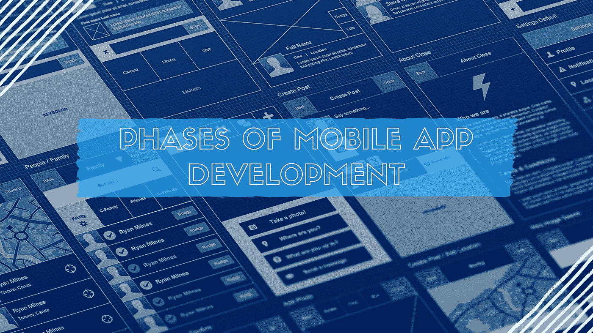
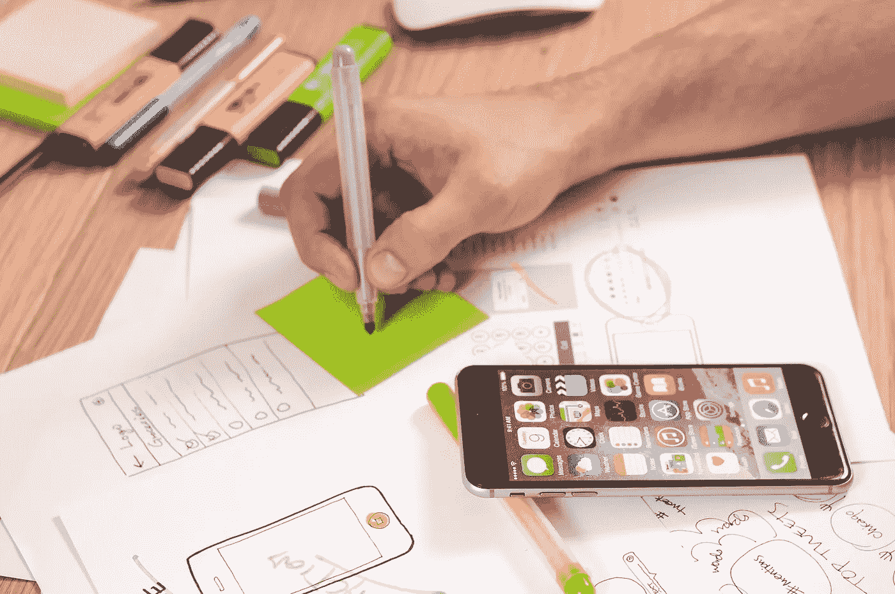

# 移动应用程序开发的各个阶段是什么？

> 原文：<https://medium.com/swlh/what-are-the-various-phases-of-mobile-app-development-4f0a1748e619>

即使所有的证据都支持构建你的应用程序，也不要轻言放弃。苹果应用程序和谷歌 Play 商店各有超过 150 万个应用程序，贯穿[移动应用程序开发流程](https://www.cognitiveclouds.com/insights/whats-the-typical-mobile-app-development-process/)以及你的应用程序如何符合你的[营销目标](https://www.datadab.com)和你的市场定位是很重要的。从移动设备的角度来看，移动应用程序开发生命周期只是传统软件开发生命周期(SDLC)的一种表示。

在当今时代，开发一个移动应用程序并不是什么难事。然而，制作一个成功的移动应用程序是一个涉及大量前期规划的过程。构建您的移动应用程序可能就像打开 IDE 一样简单，只需将一些东西放在一起，进行一轮快速测试，然后提交到应用程序商店，所有这些都在半天的工作中完成。或者你可以让它成为一个非常复杂的过程，包括严格的前期设计、对大量设备的 QA 测试、可用性测试、完整的 beta 生命周期，然后以不同的方式进行部署。你选择的道路将塑造你的愿景。也就是说，我们来看看应用程序开发的生命周期，以及这个过程中的目标和挑战。

# 1.这项研究

所有的应用都是从一个想法开始的，即使你的只是一个移动应用。将想法提炼为应用程序的坚实基础。确保你的初步分析包括买家角色的实际人口统计、动机、行为模式和目标。在流程的每个阶段，都要记住最终用户。现在，一旦他们的特征确定下来，试着想想你的[客户的生命周期](https://www.datadab.com)。在你接触到他们之后，你需要获得、改变、留住他们，并培养他们的忠诚度。最后，您应该了解客户将如何使用数字产品。一开始就这么做，会让你站稳脚跟，你的清晰会给你和你的投资者带来急需的信心。

这个阶段非常重要，因为在这个阶段，你为接下来的工作打下了必要的基础。在进入下一阶段之前，做一些实质性的研究和头脑风暴。这个阶段的另一个重要部分是分析竞争。对你的竞争对手的应用程序进行详细的研究将有助于你找出他们的应用程序中缺少的功能，这样你就可以在你的应用程序中包含这些功能，让它脱颖而出。

# 2.线框化

下一步是记录和绘制应用程序的线框，以了解未来的功能。虽然在这一点上时间不在你这边，但是实际上绘制设想产品的详细草图有助于你发现可用性问题。素描不仅仅是描绘你的脚步。它可以是一个强大的沟通和协作工具。当你完成草图，线框将有助于完善想法，并以正确的方式安排设计的所有组成部分。在这个初始阶段，您可以克服后端开发过程中发现的任何技术限制。现在，你的目标是清楚地了解你提出的功能和想法将如何融合到一个功能性的应用程序中。你还应该创建一个路线图或故事板，来展示每个屏幕之间的关系以及用户将如何浏览应用程序。寻找机会整合你的品牌，[关注用户体验](https://www.datadab.com)并记住人们使用移动应用程序和移动网站的方式的差异。

# 3.技术可行性评估

现在你可能对视觉效果有了清晰的理解，但你还需要考虑后端系统是否能够支持应用程序的功能。要知道应用程序的想法在技术上是否可行，您需要通过获取公共 API 来访问公共数据。一个应用，取决于它的格式(智能手机、平板电脑、可穿戴设备等。)以及平台(iOS，Android 等。)，会有不同的要求。在本练习结束时，团队可能对应用程序有不同的想法，或者决定某些初始功能不可行。此时，稍微头脑风暴一下，提出问题，回顾状态。

# 4.原型

建立一个快速原型。快速是这里的关键词。除非你触摸这个应用程序，看看它是如何工作和流动的，否则你无法真正理解触摸体验。因此，构建一个原型，让用户尽快了解应用程序的概念，看看它在最常见的用例中是如何工作的。在此阶段使用粗略且不详尽的线框。这将有助于你了解你是否在朝着正确的方向前进。在这个过程中包括利益相关者，允许他们接触原型会给你他们的反馈，并在你的工作中实施。此外，原型将让不同的利益相关者第一次看到你的应用程序，并帮助你验证你收集的信息。

# 5.设计

一旦你完成了这一步，你就可以开始编码了。你的[用户体验(UX)设计师](https://www.cognitiveclouds.com/custom-software-development-services/ui-ux-design-company)构建设计元素之间的交互，而用户界面(UI)设计师构建你的应用的外观和感觉。这是一个多步骤的过程，有许多审查阶段。你得到的是蓝图和视觉方向，通知你的工程师设想的最终产品，以及交互应该如何移动、感觉和流动。根据您的项目范围和应用程序预算，这个设计阶段可以在一个下午完成，也可以花费团队大量的时间。请记住，通过调整导航、按钮和其他视觉元素的布局，创建屏幕的多种变化。你的产品越多样化，你的 UX 越有可能是原创的。应用程序设计将被证明是一个多步骤的过程，你的结果应该是清晰的视觉方向，提供最终产品的抽象。

# 6.发展

开发阶段通常很早就开始了。事实上，一旦一个想法在概念阶段获得了一些成熟，一个工作原型就被开发出来，它验证功能、假设，并帮助给出对工作范围的理解。

随着开发的进展，应用程序会经历一系列阶段。在初始阶段，核心功能虽然存在，但没有经过测试。看到应用程序是非常错误的，非核心功能在这一点上不存在。在第二阶段，许多建议的功能被合并。这款应用完美地通过了光线测试和 bug 修复，尽管仍然存在一些问题。在这个阶段，应用程序被发布给特定的外部用户群进行更多的测试。在第二阶段的错误被修复后，应用程序将进入部署阶段，准备发布。

如果你的项目很复杂，用户需求经常变化，那么就使用敏捷方法。它有助于灵活规划、渐进开发、早期部署和持续改进。一个大的应用程序可以被分解成更小的模块，敏捷方法可以应用到每个小的部分。

# 7.测试

在[移动应用开发](https://www.upsilonit.com/services/mobile-development)中，尽早且经常测试是个好主意。这样做将使你的最终成本保持较低。开发周期越深入，修复缺陷的成本就越大。在构建各种测试用例时，请参考原始设计和规划文档。

应用程序测试是巨大的，所以要确保你的团队涵盖了所有必要的方面。应该对应用程序的可用性、兼容性、安全性、界面检查、压力和性能进行测试。在用户接受度测试中，你会发现你的移动应用是否适合你的目标用户。为了测试这一点，把你的应用给你的目标受众中的一些人，并问一些相关的问题。一旦您的应用程序通过了用户验收测试，您就知道您的解决方案“有效”并进一步使您的应用程序可用于测试，无论是通过注册以前确定的团体或公开征集参与者。你从测试用户那里得到的反馈将有助于你发现该应用的功能在现实世界中是否运行良好。

# 8.部署

您的应用程序已准备好提交。选择一天，并键入一个正式的启动。对于不同的应用商店，启动应用的策略是不同的。记住，这不是结束。应用开发不会在发布时就结束。当你的应用程序到达用户手中时，反馈会蜂拥而至，你需要将这些反馈整合到应用程序的未来版本中。每个应用程序都需要更新和新功能。通常，一旦第一个版本的应用程序发布，开发周期就会重新开始。确保你有资源来维护你的产品。除了投资于构建数字产品的资金，请记住这是一项长期的承诺。一路平安。

## 这篇文章发表在《创业公司》杂志上，这是 Medium 最大的创业刊物，有 300，118 人关注。

## 订阅接收[我们的头条](http://growthsupply.com/the-startup-newsletter/)。

