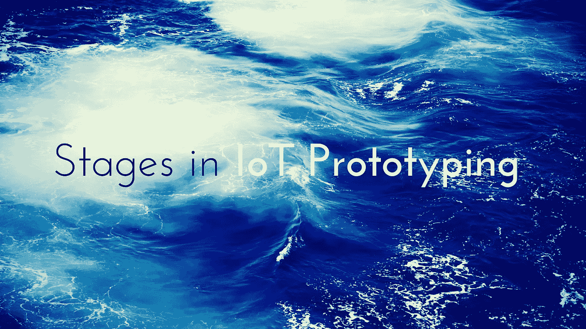

# 物联网原型制作的各个阶段是什么？

> 原文：<https://medium.com/swlh/what-are-the-various-stages-in-iot-prototyping-a5b05c37dd08>

开发人员非常清楚，从草稿纸上潦草的想法到实用的、可扩展的产品，更不用说原型了，并不完全是一个精心规划的步骤的问题。它们是旅程。复杂的。原型和部署甚至在采用直接的技术和开源社区的支持时也会失败。现在，特别是在像物联网这样的新技术生态系统中，问题比答案多，你肯定会遇到一些小问题。

现在，如果你已经完成了构思过程，并渴望开始开发你的产品，请理解这一点，无论你的构思是在一张餐巾纸上，还是通过详细的 PDS 或产品设计规范，贸然打造一个市场现成的产品是有风险的。未知数很多。你可能已经做了研究，并有一些受过良好教育的猜测，但对物联网硬件的错误猜测比在[软件开发](https://www.zibtek.com/custom-software-development-services)中的错误猜测代价更大。主要是因为重新编译电子学需要很长的时间和金钱。解决方案是战略性地制作原型，这样你就可以在投入生产的前期成本之前开始测试这些假设。但是记住，资本或时间通常不允许你在原型世界呆太久。因此，您在开始原型开发之前所做的决定将决定原型开发过程是否会轻松、快速并产生您正在寻找的信息，或者该过程是否会花费超过六个月的时间并让您感到沮丧。

# 这里的主要挑战是什么？

为硬件设备构建互联程序所需的技能与开发和维护 web 应用程序或服务器所需的技能截然不同，反之亦然。让一个熟练的软件工程师在为硬件原型开发原理图时苦苦挣扎，让一个电气工程师在开发行业标准的移动应用程序来控制设备时头疼不已。

您设定的目标将定义原型的总体范围。接下来，找出原型的主要约束是什么，然后关注次要约束，然后是非问题。这将使你更加清楚如何进行原型制作过程。一旦你为你的原型定义了目标和约束，最后的计划阶段就是将原型归结为它的功能部分。这将有助于为原型选择正确的工具和硬件。

# 物联网原型开发的不同阶段:

如果你准备好走上物联网原型开发之路，这里有一些技巧可以帮助你通过不同的阶段:

**1。**从最棘手的问题开始。当[为你的物联网产品制作原型时，专注于你产品最危险的假设是至关重要的。](https://www.cognitiveclouds.com/rapid-software-prototyping)例如，如果你最大的担忧是如何让移动设备与你的产品对话，这就是你的第一个原型应该关注的任务。这将迫使你提前做出主要的产品决定，而不是在开发周期的几个月之后。在这一点上，你可能已经花了好几万去开发一个有缺陷的产品。

**2。一旦你决定了你的原型要解决的问题，是时候开始构建了。这意味着决定你将使用哪些技术来构建产品，这是一个重大的决定。请记住，这将需要一些实验。在此过程中，您可能会研究、开发并最终丢弃代码。这看起来就像用你的头去撞墙，但是引导你内心的特斯拉。并提醒自己不要失败，你正在发现什么技术不适合你的产品。但是仔细检查一下，试着为你的原型使用基本组件。您可以随时升级。**

**3。一旦你想好了你想要解决什么问题，以及你将使用什么技术来解决它们，是时候开始构建了。这将是整个原型制作过程中最激动人心的阶段。尽早开始建设，克服困难。使用这个原型阶段来设计一个长期降低成本的方法。**

**4。现在你已经有了物联网原型并开始运行，准备解决剩下的问题。这些错误可能与软件有关，如不稳定的代码或损坏的功能，也可能与硬件有关，可能是闪烁的屏幕或薄弱的连接点。原型开发的这一阶段，通常被视为最后的 20 %,往往最终占据了产品开发中 80%的工作。**

看着一个产品组合在一起总是令人兴奋的。但是随着最后期限的临近和不可预见的失败的出现，你一定会感到沮丧。一些功能的开发时间比预期的要长，用户界面需要调整，硬件需要改进。如果你已经到了解决问题的阶段，并感到沮丧，不要和解。你已经做到了这一步，你的工作原型就在眼前。

# 结论:

今天，物联网的发展受到公共 API、传感器价格下降以及将互联解决方案用于商业目的的明显优势的推动。即便如此，构建物联网硬件和软件的过程也充满了某些挑战，如项目延迟、技术限制和成本超支。但是你看，最后都是值得的。毕竟，你正在开发的产品处于技术的最前沿，像 SAP 和微软这样的大品牌正在自己开发。立即获取原型，加入竞赛。

*原载于* [*CognitiveClouds 博客*](https://www.cognitiveclouds.com/insights/iot-prototyping-the-different-stages/) 为[***物联网 App 开发***](https://www.cognitiveclouds.com/custom-software-development-services/internet-of-things-iot-application-development-company)

## 这个故事发表在 [The Startup](https://medium.com/swlh) 上，这是 Medium 最大的企业家出版物，拥有 292，582+人。

## 在这里订阅接收[我们的头条新闻](http://growthsupply.com/the-startup-newsletter/)。

