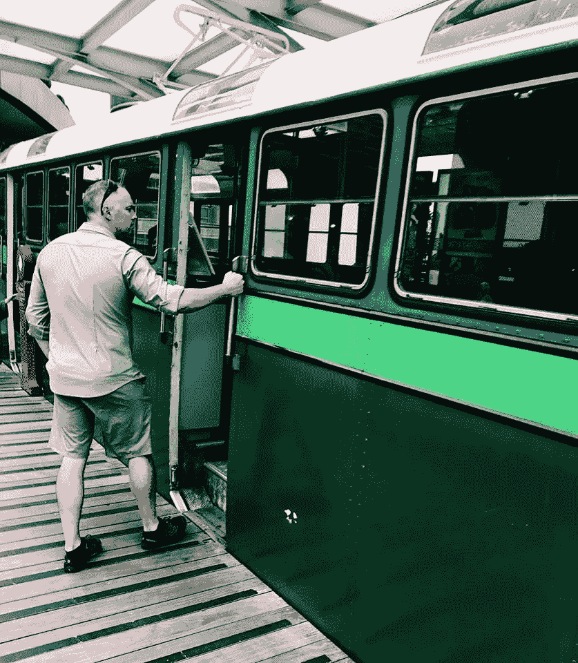

# 我们到底在买什么？当一件衬衫不仅仅是一件衬衫…

> 原文：<https://medium.com/swlh/what-are-we-really-buying-when-a-shirt-isnt-just-a-shirt-dc9eeda9041b>

We’re not just buying a product or a service. Source: [Jane Menz](https://www.johnmiles.com.au/john-miles-shirt-story/).

这是一件衬衫。我还能写什么？

我的好朋友简被难住了。

她设计了一件令人难以置信的男式衬衫。它勾掉了很多盒子。解决了这么多*诶！*男人的时刻。

它是防皱的。不用熨衣服了。

它是防汗的。不再有可怕的腋下池。

但是她不知道该怎么跟人们说这件衬衫。除了像这样的线。

此外，还有很多卖衬衫的商店。为什么有人会从一个陌生人那里买东西——即使这些衬衫很棒……

**当衬衫不仅仅是衬衫的时候**

我们把它拔出来。

谁会觉得这些衬衫有用？

医生，理疗师，医疗行业的人，因为他们经常搬家。柔韧的布料会让它更舒适。

个体经营。因为他们上班不穿西装打领带，但还是需要那种职业的样子…

我们转到他们晚上做什么。在周末。他们笑什么。他们和谁在一起。他们喝什么。他们看什么。

我们画了一幅穿这些衬衫的人的画像。他们的生活。他们的爱。

> **意义比价格更重要。**

前几天我需要花生酱。

有很多选择。让我印象深刻的那件看起来是国产的。它有个性。它有一个故事。它像朋友一样和我说话。它散发着美味、激情和魅力:

> 来拜访我们吧！承认吧…你已经答应自己去拜访纳尔逊很久了。你可以骑自行车旅行，划皮划艇，去亚伯塔斯曼国家公园徒步旅行，参观一些葡萄园。这些天来，我认为参观纳尔逊的最大亮点是参观花生酱工厂……召集家庭成员，并为自己预定房间……
> 
> 澳大利亚传奇的金加罗伊坚果，在新西兰阳光明媚的纳尔逊新鲜烘焙并被亲切地压扁

这几乎是其他花生酱品牌价格的两倍。

我买的。

# **你为什么买？**

我们许多人对我们买的东西很挑剔。如果产品或服务是好的，它会有所帮助。但我们不仅仅是购买一种产品或服务。

我们自然想要联系。要理解。去理解。与...有关系。支持本地和小型企业——因为这很容易成为我们的目标。

我们在购买意义。一次经历。

所以给我们一个依靠。

分享你的故事。

逗我们笑。

帮助我们相信。

成为我们生活的一部分。

因为衬衫不仅仅是衬衫。

*买什么，为什么买？*

## 这篇文章发表在 [The Startup](https://medium.com/swlh) 上，这是 Medium 最大的创业刊物，拥有+ 376，592 名读者。

## 在这里订阅接收[我们的头条新闻](http://growthsupply.com/the-startup-newsletter/)。

