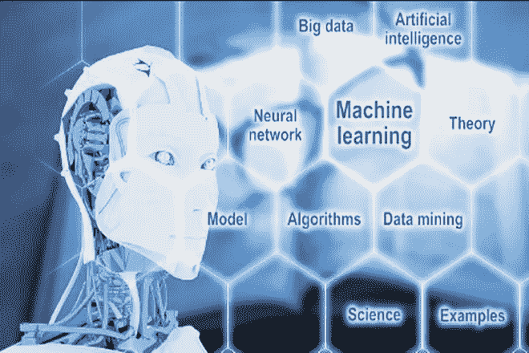

# 人工智能能真正教会我们什么

> 原文：<https://medium.com/swlh/what-artificial-intelligence-can-really-teach-us-92c8e9317b36>

Source: Financial Express

关于人工智能的兴起以及它对我们社会的影响，人们已经说了很多。

到目前为止，最近随着它的爆发，特别是在过去的 5 年里，它已经被用作一种政治武器，旨在真正吓唬同龄人，选民，甚至甚至产生敌意，恐惧和无知。