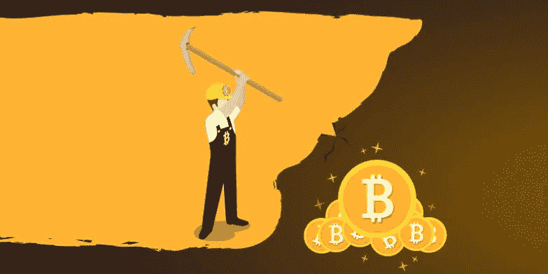

# 比特币挖掘需要什么:理解加密货币的初学者指南

> 原文：<https://medium.com/swlh/what-bitcoin-mining-entails-a-beginners-guide-to-understanding-cryptocurrency-3564929f03c6>

比特币挖矿就跟金矿一样。唯一不同的是，比特币挖矿发生在互联网，而黄金挖矿发生在实体矿山和采石场。相似的是，两者都是能源密集型和昂贵的。寻找黄金，你必须挖掘地下直到找到含有稀有矿物的矿石；矿石必须被炸开，然后运到工厂，在那里被加工成精金。

那需要大量的精力和金钱。比特币也是比特币矿工从互联网上一个有效的比特币区块中挖掘出来的。就像在金矿开采中，你必须找到含有矿物的矿石一样，开采比特币的过程不仅仅是开采比特币块。比特币区块开采通常被称为彩票，因为赢得新硬币的过程是根据矿工的猜测进行的。如果你的猜测是错误的，那么你错过了比特币。然而，他们不是简单的随机猜测，因为它发生在赌博和彩票。相反，他们是高度知情和受限制的猜测，这需要大量的精力。对于每个要测试的猜测，都需要花费一定的能量，其中大多数猜测通常都失败了，浪费了矿工口袋里的大量能量。

尽管如此，世界上每 10 分钟就有一名矿工在花费大量精力后成功猜中，并因此被允许将积木添加到区块链上，并获得作为积木奖励的彩票金额。

就像一个赌徒必须输很多次才能获得巨大的胜利一样，对有效区块做出正确猜测的矿工在达到猜测之前必须进行无数次尝试，从而消耗大量的能量。这是工作的证明，作为对燃烧能量的奖励，矿工们可以获得比特币形式的有效区块，他们可以稍后以当前市场价格出售或 HODL。

目前，在比特币网络上找到一个有效区块的奖励是 12.5 个新创建的比特币。追溯到 2009 年，在比特币网络诞生之初，每块奖励是 50 BTC。这种奖励每 4 年减半，以维持通货膨胀，并在 2120 年的某个时候达到 2100 万的总供应量。

嗯，这是理解比特币挖矿的一种非技术性方式。现在让我们从技术层面来理解它。
比特币使用 SHA-256，这是一种数学函数，接受任意大小的输入，每次都产生固定长度的输出。生成的输出被称为比特币散列。

默克尔树是一个散列树，该树的最后一个散列被称为默克尔根或根散列。这是比特币挖矿所基于的计算机科学和密码学的一个概念。
比特币网络的目标和难度是类似的东西。目标是一个 256 位的数字(非常大)，通过以所有比特币客户端共享的某种方式散列前一个块的头来获得，而难度是衡量找到低于或等于给定目标的散列的难度，以散列率来衡量。
比特币 nonce 是 SHA-256 哈希函数输入中的一个特定 32 位字段，其值需要以一种方式设置，即哈希输出包含特定数量的前导零，这些前导零应该与目标值相似或小于目标值。而这就是矿工们为了获得所需产量而玩的领域。

如果你没有理解我上面解释的词汇，不要担心。我会把一切联系起来，直到你明白采矿是如何发生的。首先，我想让你回忆一下我之前的解释，比特币挖矿就像彩票，矿工花费大量精力猜测有效区块。
现在让我们看看矿工如何赢得这个有效区块。

为了成功地挖掘块，挖掘者需要以小于或等于目标的方式散列块的头。通过散列块中的所有事务来创建该块头，从而形成具有默克尔根的默克尔树。

此外，这个根与最新块的散列和随机数相结合。现在，默克尔根+先前散列+现时+时间戳的原始数据被放入 SHA-256 函数，以产生特定类型的散列输出，这是根据目标的。

目标是块头的 SHA-256 散列必须是 256 位字母数字串，并且必须以 17 个零开始。不久前，我们的目标是获得一个包含 8 个零的块散列。每 2016 个街区，目标随着难度的变化而变化。

然后，挖掘者通过改变块头的一小部分来达到这个目标，这被称为 nonce。nonce 总是从数字 0 开始，并且每次为了获得所需的目标而递增。

因为随机数的变化是偶然的，所以得到这个以许多零开始的目标的机会非常低。因此，挖掘者必须通过改变随机数来进行许多尝试，并且以递增的方式连续改变随机数被称为数学猜测证明。

你应该知道，这需要大量的计算能力和硬件资源，这证明了在开采任何单个区块之前，需要进行大量的工作。这就是为什么这被称为工作证明。
通过这种方式，按照目标获得正确比特币哈希的矿工首先获得彩票，并获得彩票，获得 12.5 BTC 的区块奖励。该区块和该区块中出现的交易会在名为比特币区块链的比特币通用分类账中进行添加和更新。

随着越来越多的矿工加入进来，以维持新币的均衡生成，比特币开采变得越来越困难。多年来，拥有特殊 GPU 的矿工和 ASIC 矿工加入了比特币网络，从而将难度提高到如此之高，以至于使用中央处理器挖矿不再有利可图。

## 这篇文章发表在 [The Startup](https://medium.com/swlh) 上，这是 Medium 最大的创业刊物，拥有+386，607 读者。

## 在这里订阅接收[我们的头条新闻](http://growthsupply.com/the-startup-newsletter/)。

