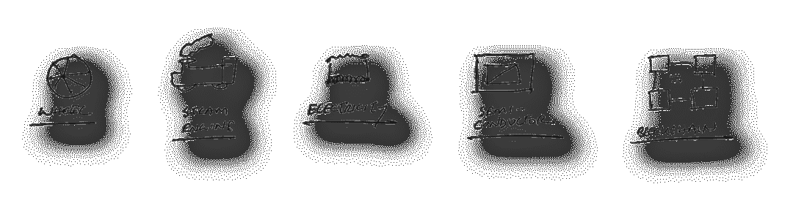
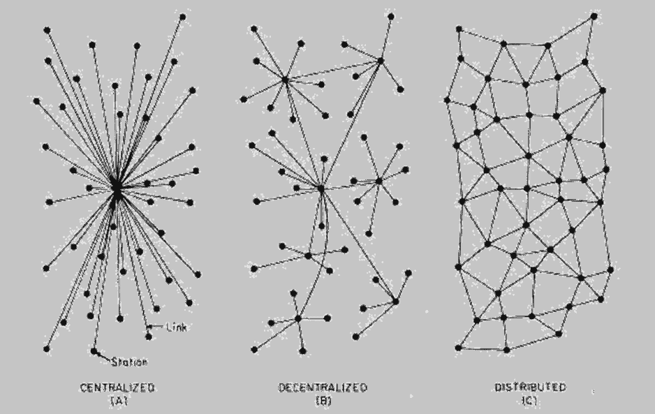
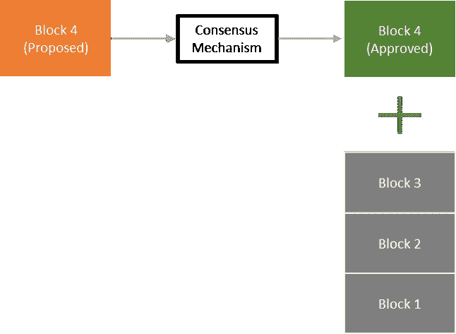
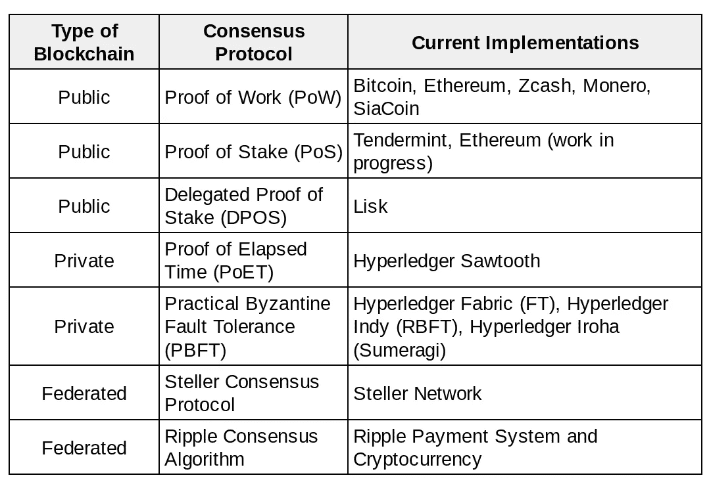
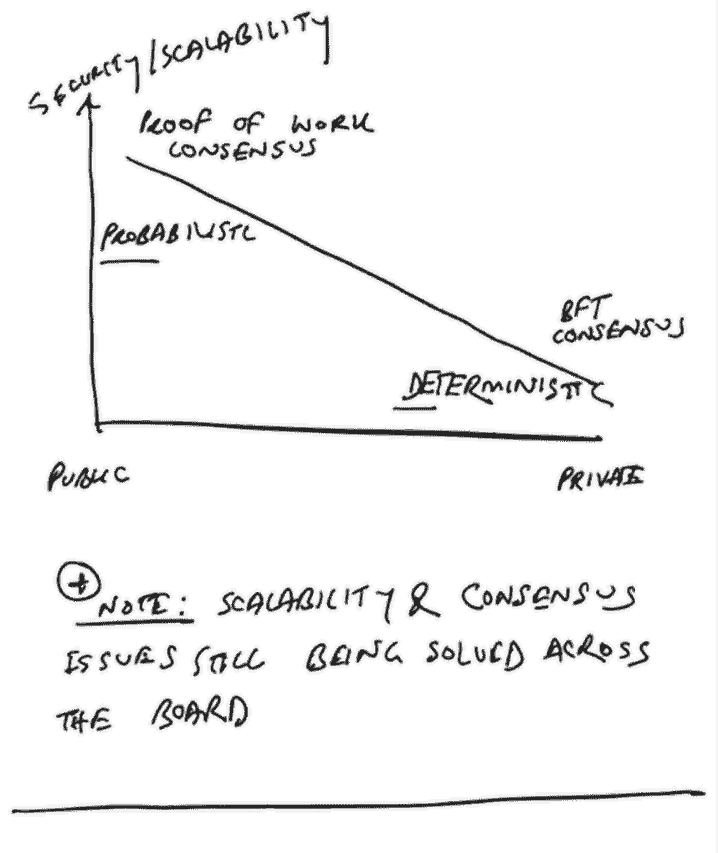
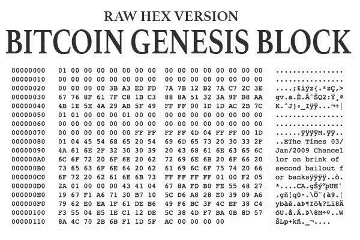
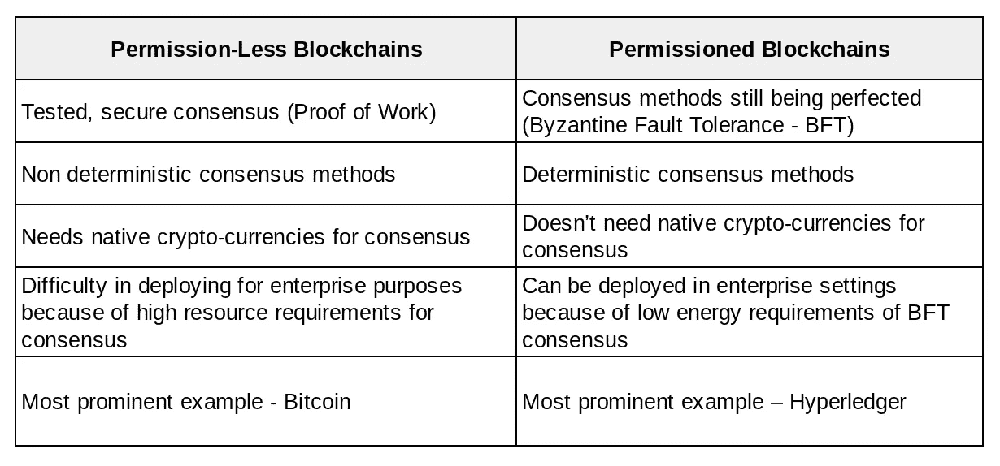
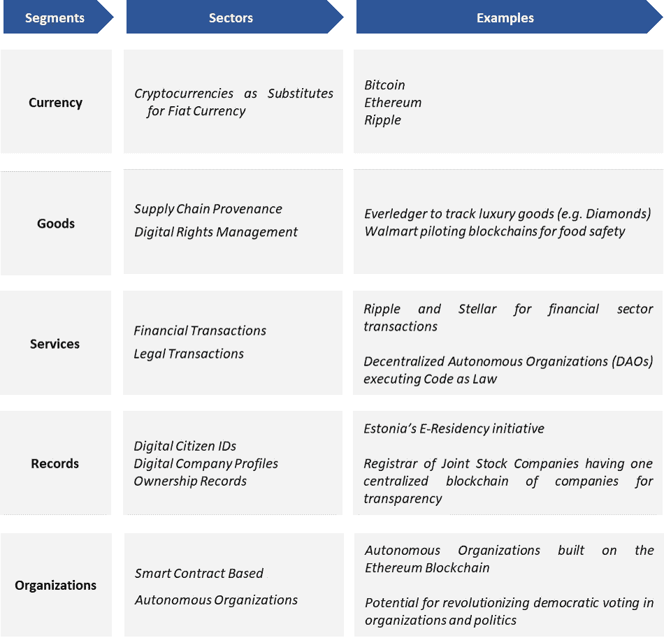
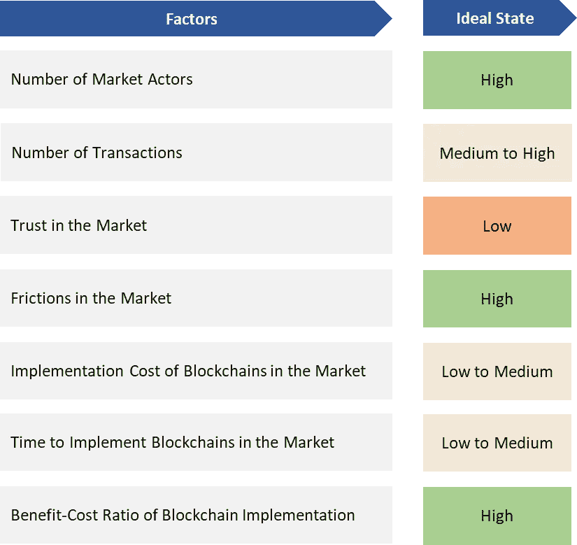

# 区块链对发展中国家意味着什么

> 原文：<https://medium.com/swlh/what-blockchain-means-for-developing-countries-1ec25a416a4b>

# 介绍

每隔一段时间就会出现一种改变一切的技术。对大多数观察家来说，最新追随这一趋势的是区块链。它有可能彻底改变从货币到供应链的一切。此外，区块链有前所未有的潜力来弥合发达国家和发展中国家之间的差距。

想象有一天，潜在的投资者可以立即获得你企业的身份和声誉；有一天，你进口到商店的珠宝会被安全地追溯到矿场；或者有一天，一个国家的所有公民都在一个集中、安全、透明的账本上，信任是绝对的。

这是区块链的承诺。它被誉为下一个[**【GPT】**](https://www.ted.com/talks/bettina_warburg_how_the_blockchain_will_radically_transform_the_economy/transcript?utm_campaign=BeepBeepBites%20-%20Nieuwsbrief&utm_source=hs_email&utm_medium=email&_hsenc=p2ANqtz-8KH43TRdp07R0CTY4kqZUsOUvLCyTOC15kHWYwgSdPCDVCt3sM39Q_ngvWhLxSsH76PdfG)通用技术就像它之前的轮子、蒸汽机、电力、半导体、互联网一样。唯一不同的是，与之前的 GPT 不同，由于全球通信基础设施，区块链将更快地传播到世界各地，像孟加拉国这样的发展中国家可能很快就会看到其在多个领域的影响。

那么它实际上是如何工作的呢？区块链做了什么以前不能做的事？我们在下面看这个。

# **什么是区块链？**

区块链是一种通用技术，迄今为止最著名的实现是 [**比特币**](https://bitcoin.org/) **。**风靡全球的加密货币。由笔名 [**中本聪**](/@wanraitelli/bitcoin-white-paper-for-normal-people-a5e95aea1aa5) 于 2009 年首次推出，这是正确实施区块链技术所能实现的第一个例子。但远非最后一次。

用专业术语来说，区块链是一种去中心化的、分布式的、共识驱动的、假名的交易分类账。有史以来第一次，它允许我们以数字形式存储价值。

换句话说，区块链是一个对比练习。他们就是这样。它是开放的，但也是安全的；私有的，但是分布式的；不可信但可信。它通过结合计算机科学领域来创建主干，并结合经济学来通过激励实现安全性——如果你愿意，可以称之为密码经济学。

这让大多数人难以理解。因此，我们通过文献筛选，得出了向广大观众描述区块链的首字母缩略词 DICT。

*此外，里奇·埃特瓦鲁给出了一个非常简单的解释:*

# 区块链有什么特点？

区块链是一个 T2 式的分类账。意思是:

*   **D** 去中心化和分散化
*   可变的
*   **C** onsensus 驱动
*   透明的

让我们详细看一下每一项。

**分散和分布式**

区块链上的每台计算机称为一个节点。这些节点具有去中心化和分布式的特点。

这意味着系统的控制取决于所有的节点，而不是几个节点。它使得区块链具有容错性、抗攻击性和抗共谋性。[关于这意味着什么的详细分析，请查看以太坊联合创始人 Vitalik Buterin 的 [**博客**](/@VitalikButerin/the-meaning-of-decentralization-a0c92b76a274) 澄清了这个话题。]

这也意味着“无信任”网络中的节点自己产生信任，因此允许中间人的非中介化。

*Source:* [*Medium Article*](/@bbc4468/centralized-vs-decentralized-vs-distributed-41d92d463868)

*还可以看看布特林在 TechCrunch disrupt 上的演讲，他将区块链定义为一个共享内存的分散式网络。*

## 不变的

区块链的第二个关键特征是记录是不可变的。一旦创建了一个块，它就链接到它后面的所有块。这意味着，如果你想改变有 100 个块的区块链中的第 3 个块，你必须改变从第 3 个到第 100 个块开始的所有块。

由于区块链的分布式和共识驱动的性质，这是难以置信的困难。也就是说，当你尝试这样做的时候，系统中的所有节点都会识别并阻止它。

## 共识驱动

区块链既分散又安全，因为它们依靠网络中的参与者自己来验证交易。这是通过参与者的“共识”来缓解所谓的拜占庭将军问题而实现的。在这种情况下，系统中的一些节点是恶意的，试图将错误的条目插入到分类帐中，必须阻止它们这样做。

不同的共识机制被用来，实际上使区块链拜占庭容错(BFT)。对于公共区块链来说，这些包括工作证明(比特币和以太坊使用)和股权证明(以太坊试图转移到的机制)。

另一方面，对于二等兵区块链来说，流行的技术是实用的拜占庭容错(PBFT)及其变体，以及其他更新的共识机制，如经过时间的证明(PoET)。

**共识协议** **区块链类型** **当前实现方式**

然而，应该注意的是，共识机制仍在不断完善，在我们找到一种安全、通用、可用于公共和私人区块链的方法之前，我们还有很长的路要走。

但就目前情况而言，在安全性方面，公共和私人区块链之间存在权衡。这种关系描述如下。

*Figure: The Privacy — Security Tradeoff of Blockchains*

## 透明的

区块链提出的最后一个特点是透明度。网络中的每个节点都可以追踪数据块链(交易分类账),一直追溯到起源数据块。这意味着，无论有多少事务被添加到区块链，记录总是可以一直追溯到起始块。

这实现了以前在传统系统中很难实现的，在分散和分布式系统中几乎不可能实现的透明性。

[*Source Link*](https://geekcatty.com/explaining-block-blockchain/)

# 区块链有哪些类型？

大体上有两种类型的区块链。允许和不允许。

## 未经许可的区块链

这些区块链就像比特币一样，任何人都可以通过挖掘来验证交易，从而加入网络。它们主要依赖工作证明机制(PoW)来验证事务。这种共识机制使得网络中的节点消耗计算机资源来向区块链添加新的块。

任何想要在分类账中输入虚假交易的参与者必须拥有系统中的大部分计算机能力来使他的交易通过。这阻止了这种行为，因为为此花费的资源远远超过回报(例如比特币)。实际上，这就是密码经济学的工作方式。

## 被许可的区块链

在这种类型的区块链中，参与者从一开始就被预先选择成为网络的一部分。这些适用于价值链中的参与者不希望外界知晓其信息的行业环境。一个突出的例子是由 IBM 和 Linux 基金会建立的名为 Hyperledger 的框架。它允许不同的行业根据自己的需求定制和实施区块链。

Hyperledger 等区块链平台将在不久的将来加快该技术在全球不同行业的应用。

下表对这两种类型的区块链进行了简要比较。

# 区块链在发展中国家的应用

由于当今世界紧密相连的性质，区块链作为一种技术有可能在相对较短的时间内产生深远的影响。这意味着像孟加拉国这样的发展中国家可能会比以前的突破性技术更快地从这项技术中获益。

由于区块链是一种去中心化、分布式、不可变和透明的账本，它们有可能扰乱整个经济中的各个行业——甚至是在新兴市场。

这种应用的一些例子如下:

## 货币

这是区块链开始使用的应用程序。像比特币和以太坊这样的加密货币已经证明了去中心化技术作为价值存储和转移的安全应用。

像孟加拉国这样的发展中国家可以在封闭的代币系统中试行这种货币，以增加海关、治理和法律等部门的透明度。

## 商品

通过供应链跟踪实物商品是区块链技术最受欢迎的应用之一。像 Everledger 这样的公司正试图通过在全球范围内跟踪像钻石这样的高价值物品的整个生命周期来实现这一点。此外，就连沃尔玛这样的传统巨头也开始行动起来。该公司正在试验区块链，以确保整个供应链的食品安全。

由于货物来源是孟加拉国等发展中国家的一个主要问题，这可能是实施区块链的一个关键重点领域。食品供应链跟踪、政府公开市场销售跟踪和海关进出口交易跟踪等部门可能是需要关注的重点领域。

此外，区块链还被用于创新应用，如向世界各地有需要的人提供发展援助**。一个突出的例子是世界粮食计划署(WFP)如何利用区块链技术向居住在约旦的叙利亚难民发放 [**援助。**](https://www.gsma.com/mobilefordevelopment/wp-content/uploads/2017/12/Blockchain-for-Development.pdf)**

**如果像 [**世界银行**](https://www.ifc.org/wps/wcm/connect/6e79f6c3-dac6-4e94-8cea-2bb21185df92/EMCompass+Note+40+Blockchain+Part+I.pdf?MOD=AJPERES) 和 [**亚洲开发银行**](https://www.adb.org/sites/default/files/publication/388861/ewp-533.pdf) 这样的国际发展组织实施基于代币的系统向孟加拉国这样的国家发放发展援助，那么这将带来该部门透明度的巨大变化，在孟加拉国，由于挪用和腐败，多达 50%的捐款可能去向不明。**

## **服务**

**区块链有潜力改变从金融机构到法律机构等服务行业的运作方式。区块链、智能合同和分散自治组织(DAO)的组合有可能使服务交易以分散、安全和快速的方式无缝发生。**

**如果实施得当，像孟加拉国这样的发展中国家可以通过自动化法律程序、海关支付、所有权转让、商业交易和允许跨行业的广泛非中介化，在制度发展方面超越对手。**

## **记录**

**迄今为止，所有权、公民身份和其他形式的身份记录都存储在中央数据库中，以确保其安全。然而，由于涉及到中介，这造成了篡改的问题。区块链开启了一种分散的、公开的、不可变的和共识驱动的记录分类账的可能性，这种分类账有一天可能会使对中介的需求失效。**

**这方面的一个早期例子是爱沙尼亚的电子公民计划，该计划将公民的信息存储在一个区块链上。该技术的应用还可以扩展到包括组织信息，有一天，一家公司可以在主区块链中存储一个身份，从供应链合作伙伴到客户到税务机关的所有利益相关者都可以访问该身份。**

**这些应用对于像孟加拉国这样的发展中国家变得更加重要，因为它提供了一个将所有人口置于一个平台之下的空间[想象一下所有公民数据的中央、全国范围的区块链]。这将使提供所有权转移、选民登记和补贴/税收转移等公民服务变得更加容易和透明。**

**这也可以扩展到公司数据，公司的身份将在区块链上集中提供，供与该实体做生意的任何利益攸关方参考。这将使从供应商付款到税务申报的商业活动和交易具有前所未有的透明度和速度。**

## **智能组织**

**智能组织是一个概念，它将通过建立在区块链基础上的智能合同而成为可能。 [**智能合约**](https://blockgeeks.com/guides/smart-contracts/) 是事件触发的自执行程序。一个例子是通过智能合同提示自动付款的商品交付。这可以扩展到在区块链上运行和管理整个组织的场景；不管是商业的还是政治的。**

**这些将是广泛采用区块链的必然结果，对于像孟加拉国这样的发展中国家来说，将有助于提高整个经济的透明度和开拓新的市场机会。**

**要更全面地了解区块链目前的使用情况及其未来前景，您可以参考以下研究论文:**

**[**开发 Asi**](https://www.adb.org/sites/default/files/publication/388861/ewp-533.pdf) **a —** ADB 的分布式账本技术**

**[**区块链促进发展:移动、身份和援助的新兴机遇**](https://www.gsma.com/mobilefordevelopment/wp-content/uploads/2017/12/Blockchain-for-Development.pdf) **—** GSMA**

**[**区块链的一些简单经济学**](https://ccl.yale.edu/sites/default/files/files/SSRN%20--%20Some%20Simple%20Economics%20About%20Blockchain.pdf) — MIT**

**[**破解发展援助的未来**](http://sustainiaworld.com/wp-content/uploads/2017/12/hack-the-future.pdf)**——**丹麦国际开发署**

**[**解开区块链:区块链系统的数据处理观点**](http://www.comp.nus.edu.sg/~ooibc/blockchainsurvey.pdf)**——**IEEE**

**[**区块链的经济和制度含义**](https://aaltodoc.aalto.fi/bitstream/handle/123456789/28718/master_Suikkanen_Henrik_2017.pdf?sequence=1&isAllowed=y)**——**阿尔托大学**

# **在工业中实现区块链的简要框架**

**由于区块链是一项新技术，实现框架是在运行中设计的，因此非常不稳定且不标准。**

**但是，以下框架可以作为跨部门实施该技术的粗略指南。**

****

***Figure: Blockchain Implementation Guideline***

***此外，以下是凯捷关于在不同行业实施区块链的潜在框架的演示。***

# **结论**

**尽管区块链目前存在某些局限性，但全球社区正在努力解决这些问题，并有可能很快得到解决。这将允许在缺乏信任和需要非中介化的系统中实现该技术。**

**最后，最令人兴奋的一个方面是，这项技术可能会在更多发达国家采用它们的同时提供给孟加拉国等发展中国家。这有可能在很大程度上使所有国家——无论大国还是小国——的发展环境变得公平。**

# **延伸阅读[关键资源]**

****文章****

**[通用技术(GPT)](https://www.ted.com/talks/bettina_warburg_how_the_blockchain_will_radically_transform_the_economy/transcript?utm_campaign=BeepBeepBites%20-%20Nieuwsbrief&utm_source=hs_email&utm_medium=email&_hsenc=p2ANqtz-8KH43TRdp07R0CTY4kqZUsOUvLCyTOC15kHWYwgSdPCDVCt3sM39Q_ngvWhLxSsH76PdfG)**

**关于[比特币](https://bitcoin.org/)**

**[中本聪的白皮书](/@wanraitelli/bitcoin-white-paper-for-normal-people-a5e95aea1aa5)**

**[维塔利克·布特林的博客](/@VitalikButerin/the-meaning-of-decentralization-a0c92b76a274)**

**[分散式与分布式区块链](/delta-exchange/centralized-vs-decentralized-vs-distributed-41d92d463868)**

**[维塔利科·布特林论区块链的公立和私立](https://blog.ethereum.org/2015/08/07/on-public-and-private-blockchains/)**

**[爱沙尼亚的电子公民计划](https://e-resident.gov.ee/)**

**[智能合同基础知识](https://blockgeeks.com/guides/smart-contracts/)**

****研究论文****

**[面向亚洲发展中国家的分布式总账技术](https://www.adb.org/sites/default/files/publication/388861/ewp-533.pdf)**

**[区块链促进发展:移动、身份和援助的新兴机遇](https://www.gsma.com/mobilefordevelopment/wp-content/uploads/2017/12/Blockchain-for-Development.pdf)**

**[区块链的一些简单经济学](https://ccl.yale.edu/sites/default/files/files/SSRN%20--%20Some%20Simple%20Economics%20About%20Blockchain.pdf)**

**[破解发展援助的未来](http://sustainiaworld.com/wp-content/uploads/2017/12/hack-the-future.pdf)**

**[解开区块链:区块链系统的数据处理视角](http://www.comp.nus.edu.sg/~ooibc/blockchainsurvey.pdf)**

**[区块链的经济和制度含义](https://aaltodoc.aalto.fi/bitstream/handle/123456789/28718/master_Suikkanen_Henrik_2017.pdf?sequence=1&isAllowed=y)**

****视频****

**[用以太坊的 Vitalik Buterin 去中心化一切| Disrupt SF 2017](https://www.youtube.com/watch?v=WSN5BaCzsbo)**

**[区块链:真实世界用例](https://www.youtube.com/watch?v=cHe_ow9v094)**

**[区块链:大规模简化](https://www.youtube.com/watch?v=k53LUZxUF50&t=0s&index=52&list=LLGExr5qXYvZetVSBMmO6MPw)**

****课程****

**[IBM 区块链精要](https://developer.ibm.com/courses/all/blockchain-essentials/) ( *注:强烈推荐你做 IBM 的* [***区块链精要***](https://developer.ibm.com/courses/all/blockchain-essentials/) *课程。我完成了免费课程，发现它极大地丰富了我对区块链的了解。你会得到一个成就徽章，所以试试吧。)***

***本文原载于*[***Techonomics***](http://techonomics.io/)*。一个关于职业和商业策略的博客。欲知更多战略利好，* ***订阅*** *我们即将发布的简讯，* ***战略药丸。*****

****

## **这篇文章发表在 [The Startup](https://medium.com/swlh) 上，这是 Medium 最大的创业刊物，拥有+405，714 名读者。**

## **在这里订阅接收[我们的头条新闻](http://growthsupply.com/the-startup-newsletter/)。**

****